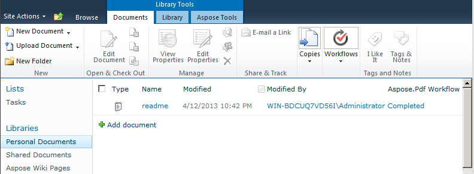

---
title: Convertir un archivo a PDF a través de una actividad de flujo de trabajo
linktitle: Convertir un archivo a PDF a través de una actividad de flujo de trabajo
type: docs
weight: 50
url: /es/sharepoint/converting-a-file-to-pdf-via-workflow-activity/
lastmod: "2020-12-16"
description: PDF SharePoint API se puede utilizar en un flujo de trabajo de SharePoint que convierte un documento a PDF.
---

{}

La compatibilidad con flujos de trabajo es una funcionalidad clave de Microsoft Office SharePoint Server. Los flujos de trabajo ayudan a automatizar el movimiento de documentos según la lógica empresarial y agilizan el coste y el tiempo de organización de los documentos. Este artículo demuestra cómo usar Aspose.PDF for SharePoint en un flujo de trabajo que convierte un documento a PDF.

{}

## Configurar un flujo de trabajo

Este ejemplo crea un flujo de trabajo que convierte cualquier elemento nuevo en una biblioteca de documentos a formato PDF y lo almacena en otra biblioteca de documentos. En el ejemplo se utiliza la biblioteca **Documentos personales** como biblioteca de origen y la subcarpeta **Pdf** de la biblioteca **Documentos compartidos** como biblioteca de destino.

Aspose.PDF for SharePoint admite la conversión de archivos HTML, de texto e imágenes.

### Diseñe el flujo de trabajo usando SharePoint Designer

1. Abra **SharePoint Designer** y conéctese al sitio donde se implementará el flujo de trabajo.
1. Seleccione **Flujos de trabajo** de **objetos del sitio** y luego abra **Listar flujo de trabajo**.
1. Seleccione la biblioteca **Documentos personales** para crear y adjuntar un nuevo flujo de trabajo de lista a la biblioteca de documentos.

   **Seleccionando Documentos Personales en el menú**

1. Cree y adjunte el flujo de trabajo de la lista a la biblioteca **Documentos personales** escribiendo un nombre y una descripción del flujo de trabajo.
1. Haga clic en **Aceptar** para completar este paso.

   **Crear un flujo de trabajo de lista**

Aparece un editor de pasos del flujo de trabajo. Esto se utiliza para definir condiciones y acciones para flujos de trabajo. Ahora agregue una acción para convertir un nuevo documento a PDF sin ninguna condición, desde **Aspose Actions**.

1. Seleccione la acción **Convertir archivo a PDF mediante Aspose.PDF** en el menú **Acción**.

   **Selección y acción**

1. Configure los parámetros de la acción:
   1. Establezca el parámetro **esta carpeta** en la carpeta de destino.
   1. Deje los demás parámetros de acción como valores predeterminados o configúrelos usando la ventana de propiedades de la acción. El valor predeterminado para el parámetro **Sobrescribir** es falso.

      **El editor de flujo de trabajo**

**Configuración de la biblioteca de destino**

**Configurando las propiedades**

1. En el menú **Flujo de trabajo**, seleccione **Configuración del flujo de trabajo**.
1. Seleccione **iniciar el flujo de trabajo automáticamente cuando se cree un nuevo elemento** y borre otras opciones de **Opciones de inicio**.

   **Configuración de las opciones de inicio**

El diseño del flujo de trabajo está terminado.

1. Guarde y publique el flujo de trabajo para implementarlo en el sitio de SharePoint.

### Pruebe el flujo de trabajo

Para probar el flujo de trabajo:

1. Abra el sitio de SharePoint y cargue un nuevo documento en la biblioteca de documentos **Documentos personales**.
   Aspose.PDF for SharePoint admite la conversión de archivos HTML, archivos de texto e imágenes (JPG, PNG, GIF, TIFF y BMP*) a PDF. El flujo de trabajo está configurado para iniciarse automáticamente cuando se crea un nuevo elemento, por lo que los archivos se procesan automáticamente.
1. Actualiza el navegador.
   El estado del flujo de trabajo aparece en la columna del flujo de trabajo, **Aspose.PDF Workflow** en este caso.

   **Agregar un documento a la biblioteca fuente**

1. Abra la biblioteca de documentos de destino para ver el documento convertido. **Documentos compartidos/Pdf** es la ruta en este ejemplo.

   **La biblioteca de destino**

