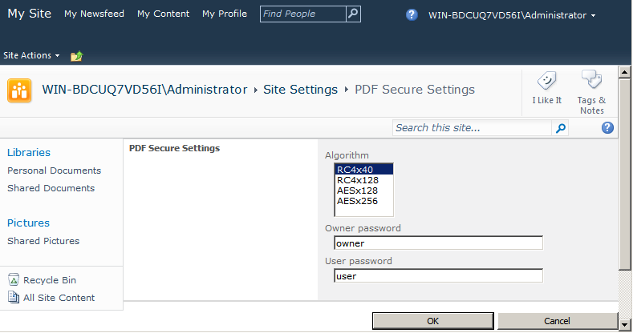
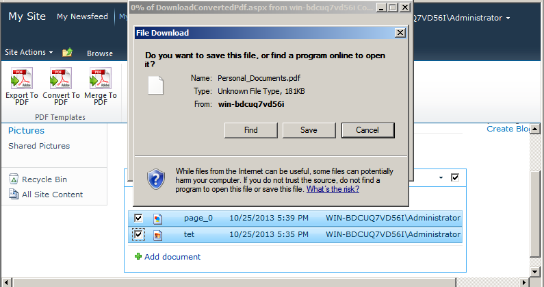
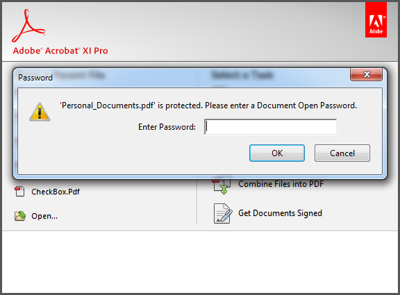

{}

Aspose.PDF for SharePoint admite la creación de PDFs seguros. Instalar Aspose.PDF for SharePoint agrega una opción **PDF Secure Settings** en Configuración del sitio. Aquí, puedes establecer la contraseña de usuario, la contraseña del propietario y cualquier valor de la lista de algoritmos para cifrar el PDF de salida. La lista de algoritmos proporciona diferentes combinaciones de algoritmos de cifrado y tamaños de clave. Usa el valor que prefieras.

Este artículo muestra cómo usar Aspose.PDF for SharePoint para generar un PDF cifrado.

{}

## **Crear un PDF seguro**

Para demostrar la función, primero configuramos la opción **PDF Secure Setting** para la contraseña del propietario y del usuario y el algoritmo de cifrado. Luego, el ejemplo combina dos documentos de una biblioteca de documentos.

### **Configuración de opciones PDF Secure Setting**

Abra la opción **PDF Secure Settings** desde Configuración del sitio y establezca el algoritmo, la contraseña del propietario y la contraseña del usuario.

Especifique contraseñas de usuario y propietario diferentes al cifrar el archivo PDF.

- La contraseña de usuario, si está configurada, es lo que debe proporcionar para abrir un PDF. Acrobat Reader solicita al usuario que ingrese la contraseña de usuario. Si es incorrecta, el documento no se abre.
- La contraseña del propietario, si está configurada, controla permisos como imprimir, editar, extraer, comentar, etc. Acrobat Reader deshabilita estas funciones según la configuración de permisos. Acrobat requiere esta contraseña si desea establecer o cambiar permisos.

### **Fusionar documentos**

Fusiona dos documentos usando la opción **Convert to PDF**. Esta función fusiona varios archivos que no son PDF (HTML, texto o imagen) en un archivo PDF.

1. Abre una biblioteca de documentos y selecciona los documentos deseados de la lista.

1. Utiliza la opción **Merge to PDF** de Herramientas de biblioteca para guardar el archivo de salida. Se te pedirá que guardes el archivo de salida en el disco.

### **Salida**

El archivo de salida está cifrado.

