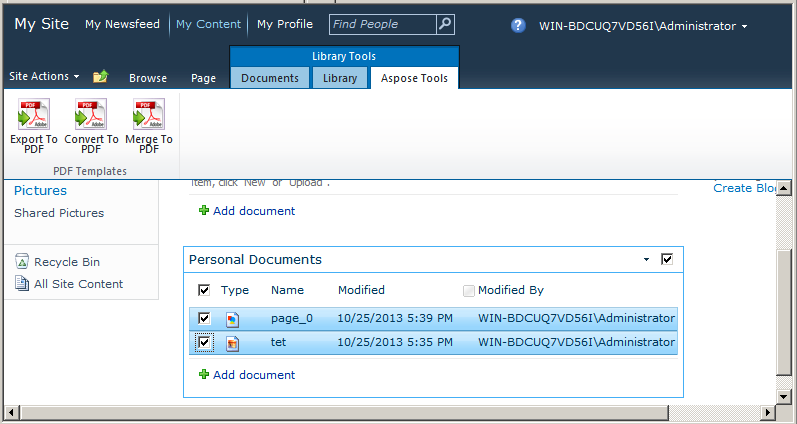
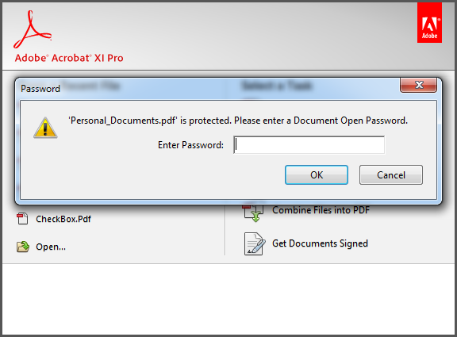

---
title: Cree un PDF seguro en SharePoint
linktitle: Crear un PDF seguro
type: docs
weight: 60
url: /es/sharepoint/creating-a-secure-pdf/
lastmod: "2020-12-16"
description: Con la API de PDF SharePoint, puede generar archivos PDF cifrados y seguros y especificar sus contraseñas en SharePoint.
---

{}

Aspose.PDF for SharePoint admite la creación de archivos PDF seguros. La instalación de Aspose.PDF for SharePoint agrega una opción **Configuración segura de PDF** en Configuración del sitio. Aquí puede configurar la contraseña de usuario, la contraseña del propietario y cualquier valor de la lista de algoritmos para cifrar el PDF de salida. La lista de algoritmos proporciona diferentes combinaciones de algoritmos de cifrado y tamaños de clave. Pase el valor de su elección.

Este artículo demuestra cómo utilizar Aspose.PDF for SharePoint para generar un PDF cifrado.

{}

## Crear un PDF seguro

Para demostrar la función, primero configuramos la opción **Configuración segura de PDF** para la contraseña de propietario y usuario y el algoritmo de cifrado. Luego, el ejemplo combina dos documentos de una biblioteca de documentos.

### Configuración de opciones de configuración segura de PDF

Abra la opción **Configuración segura de PDF** desde Configuración del sitio y establezca el algoritmo, la contraseña del propietario y la contraseña del usuario.

Especifique diferentes contraseñas de usuario y propietario mientras cifra el archivo PDF.

- La contraseña de usuario, si está configurada, es lo que debe proporcionar para abrir un PDF. Acrobat Reader solicita al usuario que ingrese la contraseña de usuario. Si es incorrecto, el documento no se abre.
- La contraseña del propietario, si está configurada, controla permisos como imprimir, editar, extraer, comentar, etc. Acrobat Reader no permite estas funciones según la configuración de permisos. Acrobat requiere esta contraseña si desea establecer/cambiar permisos.

### Fusionar documentos

Combine dos documentos usando la opción **Convertir a PDF**. Esta función combina varios archivos que no son PDF (HTML, texto o imagen) en un archivo PDF.

1. Abra una biblioteca de documentos y seleccione los documentos que desee de la lista.

1. Utilice la opción **Fusionar en PDF** de Herramientas de biblioteca para guardar el archivo de salida. Se le solicitará que guarde el archivo de salida en el disco.

### Producción

El archivo de salida está cifrado.

