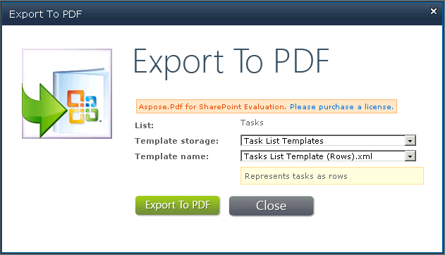

{}

Aspose.PDF for SharePoint le permite convertir varios documentos, o uno a la vez. Este artículo muestra cómo exportar un elemento de una lista.

{}

Para exportar un elemento concreto de una lista: seleccione **Export to Pdf** del bloque de control de edición (ECB) del elemento.

## **Seleccionar Export to Pdf en el ECB del elemento**

## **Exportar a PDF**

