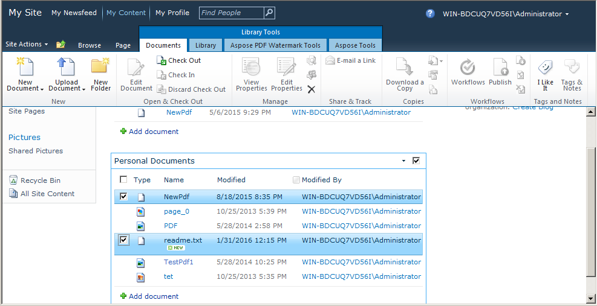
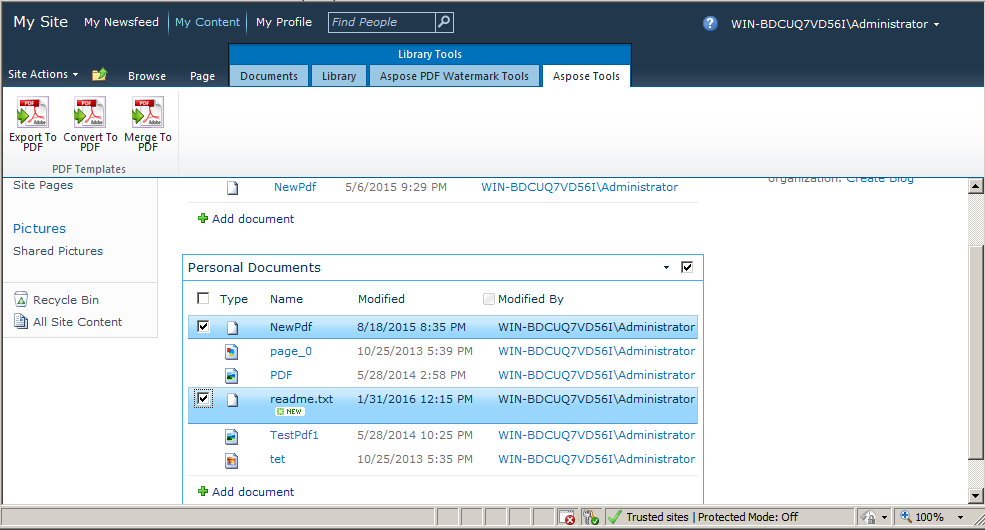
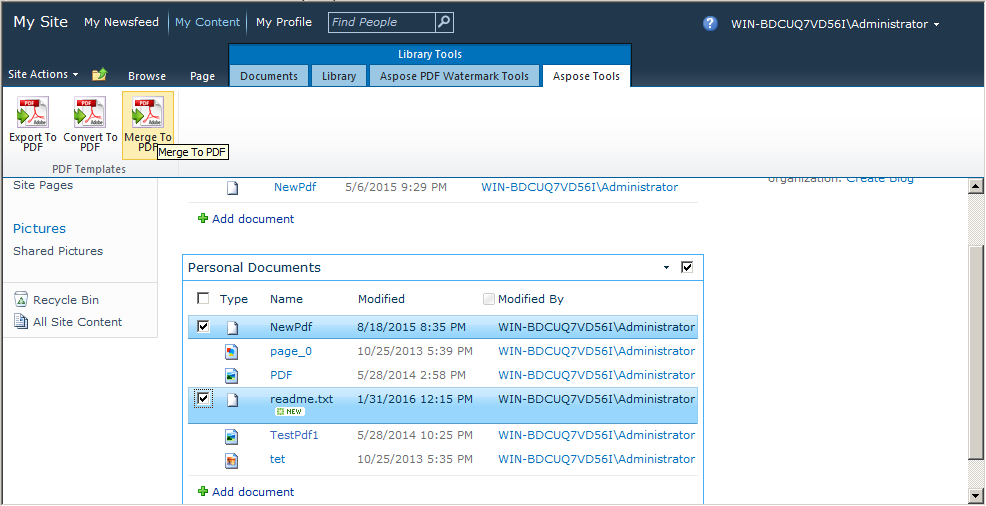
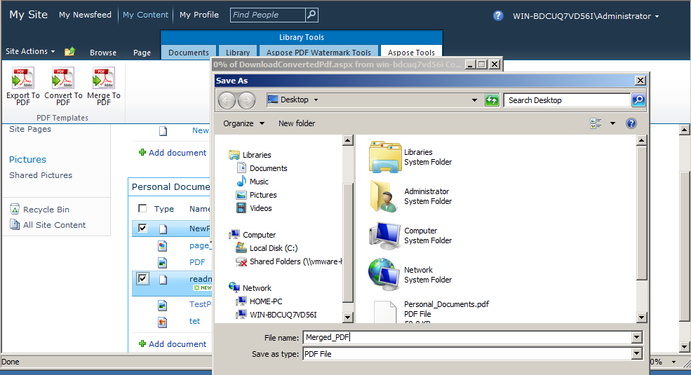

{}

La combinación/concatenación de varios archivos PDF en un solo archivo PDF es una característica muy popular y demandada en las aplicaciones de procesamiento de archivos PDF. Hemos introducido esta importante característica en [Aspose.PDF for SharePoint 2.2.0](https://releases.aspose.com/pdf/sharepoint/new-releases/aspose.pdf-for-sharepoint-2.2.0/) versión. Combinar dos archivos consiste en crear un solo archivo añadiendo el segundo archivo al final del primer archivo.

{}

## **Combinar archivos PDF**

Combine varios archivos PDF de la biblioteca de documentos de SharePoint en un único PDF de la siguiente manera:

1.  Seleccione los archivos PDF de la biblioteca de documentos de SharePoint que se van a combinar.

2.  Haga clic en la pestaña Aspose Tools en Library Tools.

3.  Haga clic en la opción Merge to PDF de Library Tools para combinar todos los archivos PDF seleccionados en el PDF resultante.

4.  Se mostrará un mensaje para descargar/guardar el archivo PDF resultante con un nombre apropiado.

