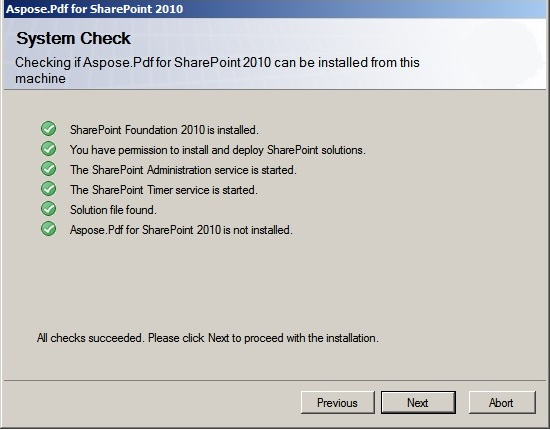

---
title: Instalación de Aspose.PDF for SharePoint
linktitle: Instalación de Aspose.PDF for SharePoint
type: docs
weight: 20
url: /es/sharepoint/installing-aspose-pdf-for-sharepoint/
lastmod: "2020-12-16"
description: PDF SharePoint API está empaquetado como una solución de SharePoint para simplificar la implementación, retirada, activación y desactivación de la granja de servidores.
---

{}

Aspose.PDF for SharePoint se puede descargar como archivo Aspose.PDF.SharePoint.zip.

{}

Este archivo contiene:

- Aspose.PDF.SharePoint.wsp
  Archivo de solución de SharePoint. Aspose.PDF for SharePoint está empaquetado como una solución de SharePoint para facilitar la implementación/retirada y la activación/desactivación de funciones en toda la granja de servidores.
- Aspose_LicenseAgreement.rtf

**Acuerdo de licencia de usuario final:**

- Aspose.PDF for SharePoint.pdf

**Documentación de usuario:**

- Aspose.PDF for SharePoint Documentación.chm

**Documentación de usuario con referencia de API pública:**

- configuración.exe

**Programa de configuración:**

- configuración.exe.config

**Archivo de configuración de instalación:**

El programa de instalación comprueba las siguientes condiciones antes de continuar:

- SharePoint 2010 está instalado.
- El usuario tiene permiso para instalar soluciones de SharePoint.
- La base de datos de SharePoint está en línea.
- Se inicia el servicio de administración de SharePoint.
- Se inicia el servicio del temporizador de SharePoint. El servicio de administración de SharePoint y el servicio de temporizador son necesarios porque algunas acciones de configuración dependen de un trabajo del temporizador para propagarse a todos los servidores de la granja de servidores.

**Para instalar Aspose.PDF for SharePoint:**

- Descomprima el zip Aspose.PDF.SharePoint en la unidad local.
- Ejecute setup.exe y siga las instrucciones en pantalla.

**El programa de instalación realiza las siguientes acciones:**

- Verifique los requisitos previos de instalación. La configuración no continuará si falla alguna verificación.

- Mostrar el acuerdo de licencia de usuario final. El usuario debe aceptar el acuerdo para poder continuar.

- Mostrar el cuadro de diálogo de selección de destino de implementación. El usuario selecciona las aplicaciones web y las colecciones de sitios donde se activará la función. Vea la figura a continuación.

- Implemente la función en la granja de servidores.

- Active la característica para las colecciones de sitios seleccionadas y configure sus aplicaciones web principales.
- Muestre una lista de aplicaciones web y colecciones de sitios donde se implementó y activó la característica.

