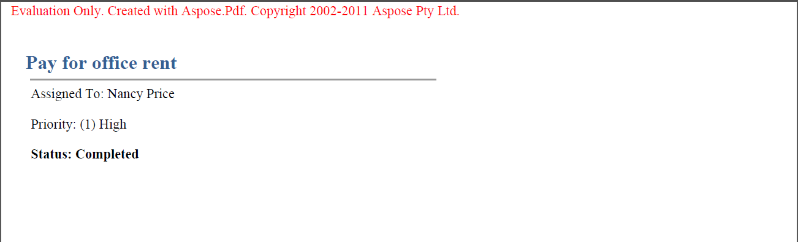

{}

Asegúrese de aprovechar la evaluación gratuita de Aspose.PDF para SharePoint ya que no tiene límite de tiempo, y también se brinda soporte técnico gratuito a los usuarios de evaluación.

{}

Es la misma descarga tanto para la versión de evaluación como para la versión de pago de Aspose.PDF para SharePoint. Simplemente descargue Aspose.PDF para SharePoint desde la página de descargas, instálelo y funcionará en modo de evaluación por defecto.

El modo de evaluación inserta una Advertencia de Evaluación en los documentos exportados. Cuando haya adquirido una licencia, simplemente instale la solución de licencia sobre la copia de evaluación instalada de Aspose.PDF para SharePoint y entonces funcionará en modo licenciado.

**Aspose.PDF for SharePoint inyecta una advertencia de evaluación cuando se trabaja en el modo de evaluación.**

