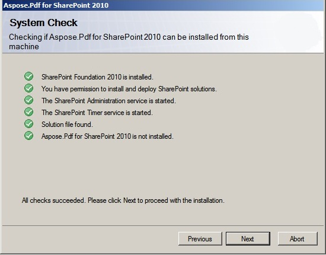

{}

Aspose.PDF para SharePoint se puede descargar como el archivo Aspose.PDF.SharePoint.zip.

{}

**Este archivo contiene:**

- Aspose.PDF.SharePoint.wsp
  Archivo de solución SharePoint. Aspose.PDF para SharePoint se empaqueta como una solución de SharePoint para facilitar la implementación/retirada y la activación/desactivación de características en toda la granja de servidores.
- Aspose_LicenseAgreement.rtf

**Acuerdo de licencia de usuario final:**

- Aspose.PDF for SharePoint.pdf

**Documentación del usuario:**

- Aspose.PDF for SharePoint Documentation.chm

**Documentación del usuario con referencia a la API pública:**

- setup.exe

**Programa de instalación:**

- setup.exe.config

**Archivo de configuración de instalación:**

El programa de instalación verifica las siguientes condiciones antes de continuar:

- SharePoint 2010 está instalado.
- El usuario tiene permiso para instalar soluciones de SharePoint.
- La base de datos de SharePoint está en línea.
- El servicio de Administración de SharePoint está iniciado.
- El servicio de temporizador de SharePoint está iniciado. El servicio de Administración de SharePoint y el servicio de temporizador son necesarios porque algunas acciones de configuración dependen de un trabajo de temporizador para propagarse a todos los servidores del granja.

**Para instalar Aspose.PDF para SharePoint:**

- Descomprima el zip Aspose.PDF.SharePoint en la unidad local.
- Ejecute setup.exe y siga las instrucciones en pantalla.

**El programa de instalación realiza las siguientes acciones:**

- Verifique los requisitos previos de la instalación. La instalación no continuará si alguna verificación falla.

- Muestre el Acuerdo de Licencia de Usuario Final. El usuario debe aceptar el acuerdo para continuar.

- Muestre el cuadro de diálogo de selección del objetivo de implementación. El usuario selecciona aplicaciones web y colecciones de sitios donde se activará la característica. Ver la figura a continuación.

- Despliegue la característica en la granja de servidores.

- Active la característica para las colecciones de sitios seleccionadas y configure sus aplicaciones web principales.
- Muestre una lista de aplicaciones web y colecciones de sitios donde la característica ha sido implementada y activada.

