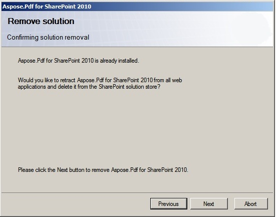

{}

Para desinstalar Aspose.PDF para SharePoint, simplemente ejecute el programa de instalación. Si Aspose.PDF para SharePoint ya está instalado, el programa de instalación sugiere eliminarlo.

Durante la desinstalación, el programa de instalación desactiva la función Aspose.PDF para SharePoint para todas las colecciones de sitios y retira la solución del farm de servidores.

{}
