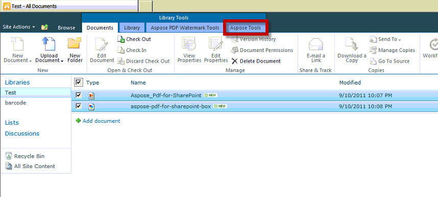
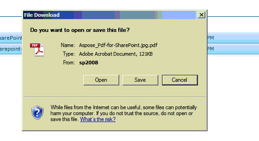

{}

Este artículo muestra cómo convertir varios archivos seleccionados a archivos PDF con una única operación de conversión utilizando Aspose.PDF for SharePoint.

{}

## Convertir varios archivos seleccionados a PDF

{}

Para convertir varios archivos seleccionados, siga los siguientes pasos:

1. Seleccione los archivos a convertir

2. Haga clic en la pestaña Aspose Tools en Library Tools.

3. Haga clic en Convert to PDF para convertir todos los archivos seleccionados en los archivos PDF resultantes.

4. Se mostrará un mensaje para descargar los archivos convertidos.

{}
