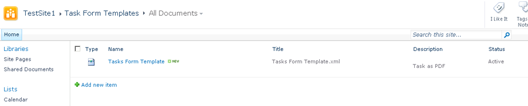
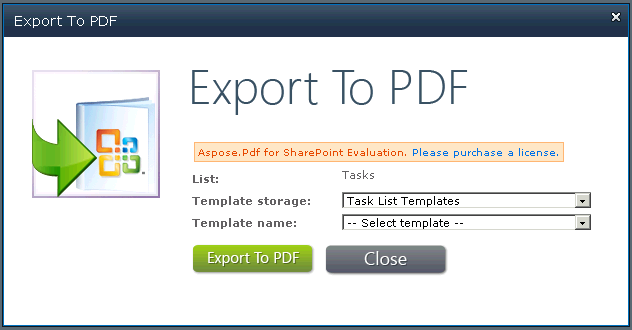

{}

Este artículo muestra cómo crear y exportar plantillas usando Aspose.PDF para SharePoint.

A partir de Aspose.PDF para SharePoint 1.9.2, la compatibilidad con plantillas PDF también cubre los subsitios de SharePoint.

{}

## **Creación y Exportación de Plantillas**
{}

Para usar la función de exportación de Aspose.PDF para SharePoint, primero cree una lista que use “PDF Templates”.

Crear una lista que use Plantillas PDF:

Se crean dos plantillas de documento, Plantillas de Formulario de Tarea y Plantillas de Lista de Tarea:

El formulario de plantilla le permite ingresar la siguiente información:

- **Name**: el nombre de archivo de la plantilla.
- **Title**: el título de la plantilla. (Por defecto, el mismo que el nombre de archivo.)
- **Description**: una descripción de la plantilla. Una buena descripción hace que la plantilla sea más fácil de usar.
- **Tipos de Lista Asignados**: IDs de lista separados por comas (relacionados con la plantilla. Este campo también puede contener el valor **AllListTypes**. Este campo solo es aplicable cuando el campo **Type** está configurado como **List**).
- **Tipos de Contenido Asignados**: IDs de tipos de contenido separados por comas (relacionados con la plantilla. Este campo puede establecerse en **AllListTypes**. Este campo solo es aplicable cuando el campo **Type** está configurado como **Item**).
- **Type**: ya sea plantilla de lista o plantilla de elemento.
- **Status**: las opciones son activo, inactivo (invisible para todos) y depuración (visible solo para administradores).

**El formulario de Plantillas de Lista de Tareas:**

**El formulario de Plantillas de Formulario de Tarea:**

Cuando se han guardado, las nuevas plantillas aparecen en la lista de plantillas, listas para ser usadas:

**Dos plantillas de lista de tareas:**

**Una plantilla de formularios de tareas:**

#### **Desarrollo de plantillas**
Una plantilla es un archivo XML basado en Aspose XML PDF. Para crear una plantilla para una lista, coloque marcadores especiales relacionados con el nombre interno del campo del tipo de contenido de destino de SharePoint en el archivo XML PDF.
##### **Marcadores**
- **SPListItemsCount** – reemplazado por el recuento de elementos de la lista.
- **SPListTitle** – reemplazado por el título de la lista.
- **SPTableIterator** – colocado en la primera celda de la tabla y marca la tabla para iteración completa.
- **SPRowIterator** – colocado en la primera celda de la tabla y marca la tabla para iteración por fila.
- **SPField** – reemplazado por el valor del campo del elemento.

Para referencia, por favor descargue [archivos XML de plantilla](attachments/8421394/8618082.zip).
#### **Exportar a PDF**
Cuando una plantilla está completamente configurada, estás listo para exportar listas o elementos a archivos PDF.

**Exportar una lista a PDF usando una plantilla de lista de tareas:**

{}
