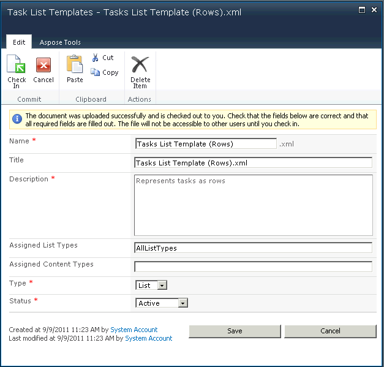

{}

Este artículo muestra cómo crear y exportar plantillas usando Aspose.PDF for SharePoint.

Desde Aspose.PDF for SharePoint 1.9.2, la compatibilidad con plantillas PDF también cubre los subsitios de SharePoint.

{}

## Crear y exportar plantillas

{}

Para utilizar la función de exportación Aspose.PDF for SharePoint, primero cree una lista que utilice "Plantillas PDF".

Crear una lista que utilice plantillas PDF:

Se crean dos plantillas de documentos, plantillas de formulario de tareas y plantillas de lista de tareas:

El formulario de plantilla le permite ingresar la siguiente información:

- **Nombre**: el nombre del archivo de la plantilla.
- **Título**: el título de la plantilla. (De forma predeterminada, el mismo que el nombre del archivo).
- **Descripción**: una descripción de la plantilla. Una buena descripción hace que la plantilla sea más fácil de usar.
- **Tipos de lista asignados**: ID de lista separados por comas (relacionados con la plantilla. Este campo también puede contener el valor
- **Todos los tipos de lista**. Este campo solo es aplicable cuando el campo **Tipo** está establecido en **Lista**).
- **Tipos de contenido asignados**: ID de tipos de contenido separados por comas relacionados con la plantilla. Este campo puede contener estar configurado en **AllListTypes**. Este campo solo es aplicable cuando el campo **Tipo** está establecido en **Artículo**.
- **Tipo**: plantilla de lista o plantilla de elemento.
- **Estado**: las opciones son activo, inactivo (invisible para todos) y depuración (visible solo para administradores).

El formulario Plantillas de lista de tareas:

El formulario Plantillas de formulario de tareas:

Cuando se han guardado, las nuevas plantillas aparecen en la lista de plantillas, listas para ser utilizadas:

Dos plantillas de lista de tareas:*

Una plantilla de formularios de tareas:

### Plantillas de desarrollo

Una plantilla es un archivo XML basado en Aspose XML PDF. Para crear una plantilla para una lista, coloque marcadores especiales relacionados con el nombre interno del campo del tipo de contenido de destino de SharePoint en el archivo PDF XML.

### Marcadores

- **SPListItemsCount**: reemplazado por el recuento de elementos de la lista.
- **SPListTitle** – reemplazado por el título de la lista.
- **SPTableIterator**: se coloca en la primera celda de la tabla y se marca la tabla para una iteración completa.
- **SPRowIterator**: se coloca en la primera celda de la tabla y marca la tabla para la iteración de filas.
- **SPField**: reemplazado por el valor del campo del artículo.

Para referencia, descargue [archivos XML de plantilla](attachments/8421394/8618082.zip).

### Exportar a PDF

Cuando una plantilla esté completamente configurada, estará listo para exportar listas o elementos a archivos PDF.

Exportar una lista a PDF usando una plantilla de lista de tareas:

{}

