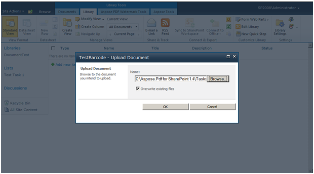
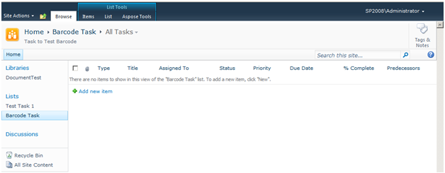
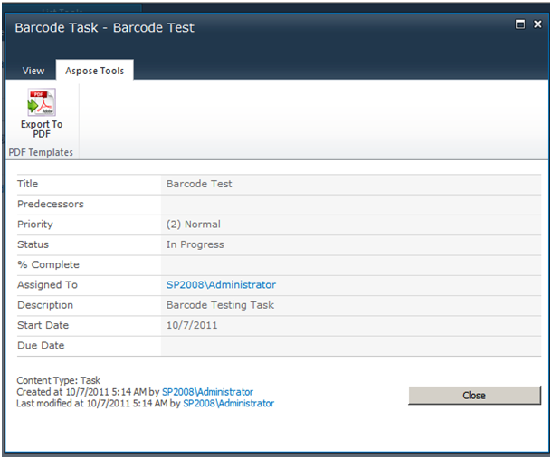
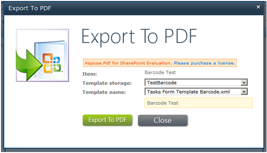
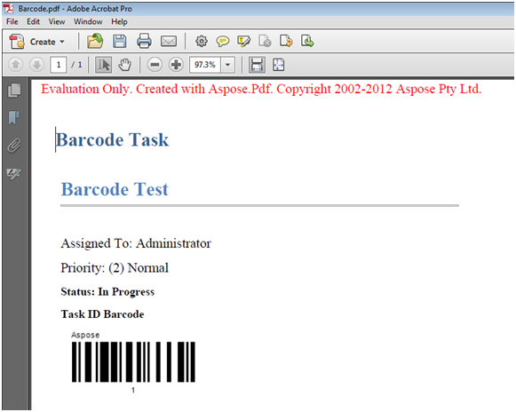

{}

Este artículo muestra cómo configurar y exportar una lista de tareas a PDF con códigos de barras usando Aspose.PDF para SharePoint.

{}

Para exportar una lista de tareas a PDF con un código de barras usando el motor de plantillas, siga los siguientes pasos:

1. Cree y cargue una plantilla.
1. Complete los campos de la plantilla y guarde la plantilla.
1. Crear y guardar una nueva tarea.
1. Exportar el documento a PDF.

El proceso se detalla a continuación.

## **Exportando la lista de tareas a PDF**

{}

1. Crear una lista de plantillas PDF.

2. Después de crear la plantilla, haz clic en **Agregar nuevo elemento** en la lista y carga el archivo XML.

3. Cuando la carga esté completa, haga clic en **OK**.
4. Rellene los campos del formulario.
5. Guarde la plantilla.

La plantilla ha sido configurada.

6. Vaya a la lista de **Tareas** y cree una nueva tarea.
7. Guarde la tarea.

8. En la pestaña **Aspose Tools**, haga clic en **Export To PDF**.

9. Seleccione la plantilla configurada y haga clic en **Export**.

El PDF exportado:

{}
