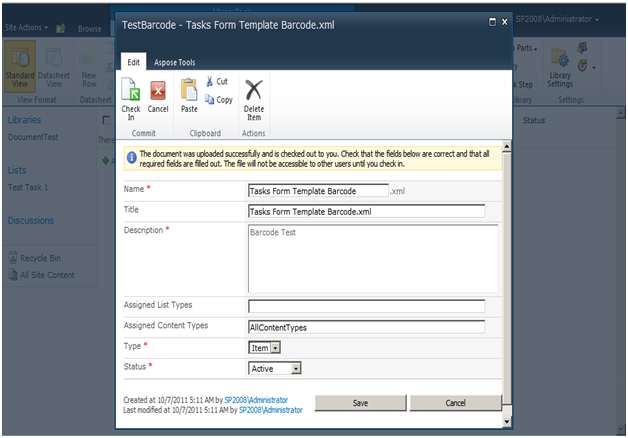
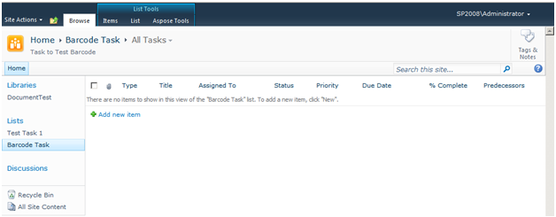

{}

This article shows how to set up and export a task list to PDF with barcodes using Aspose.PDF for SharePoint.

{}

Para exportar una lista de tareas a PDF con un código de barras usando el motor de plantillas, siga los siguientes pasos:

1. Crea y sube una plantilla.
1. Complete los campos de la plantilla y guarde la plantilla.
1. Create and save a new task.
1. Exporte el documento a PDF.

El proceso se detalla a continuación.

## Exportar lista de tareas a PDF

{}

1. Cree una lista de plantillas PDF.

2. Después de crear la plantilla, haga clic en **Agregar nuevo elemento** en la lista y cargue el archivo XML.

3. Cuando se complete la carga, haga clic en **Aceptar**.
4. Complete los campos del formulario.
5. Guarde la plantilla.

La plantilla ha sido configurada.

6. Vaya a la lista de **Tareas** y cree una nueva tarea.
7. Guarde la tarea.

8. En la pestaña **Herramientas de Aspose**, haga clic en **Exportar a PDF**.

9. Seleccione la plantilla configurada y haga clic en **Exportar**.

El PDF exportado:

{}

