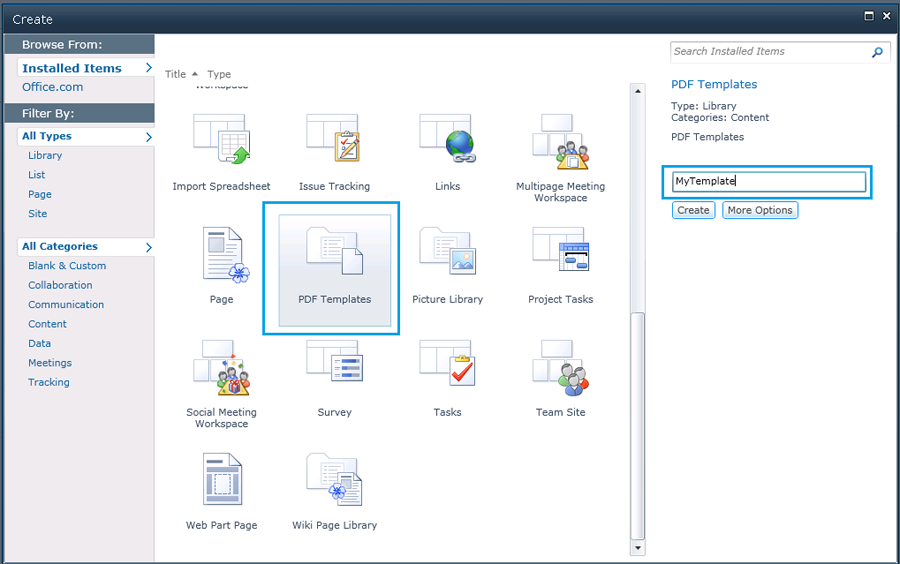
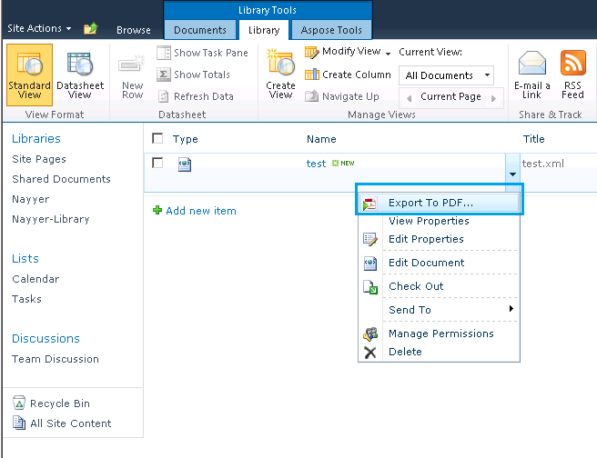
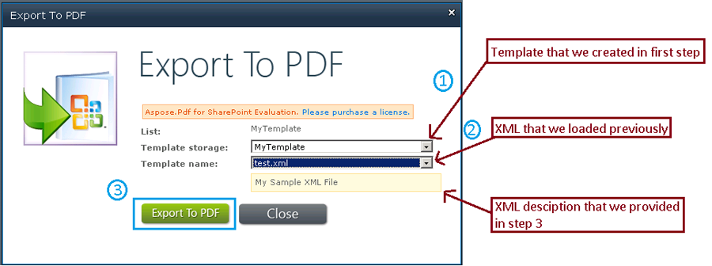
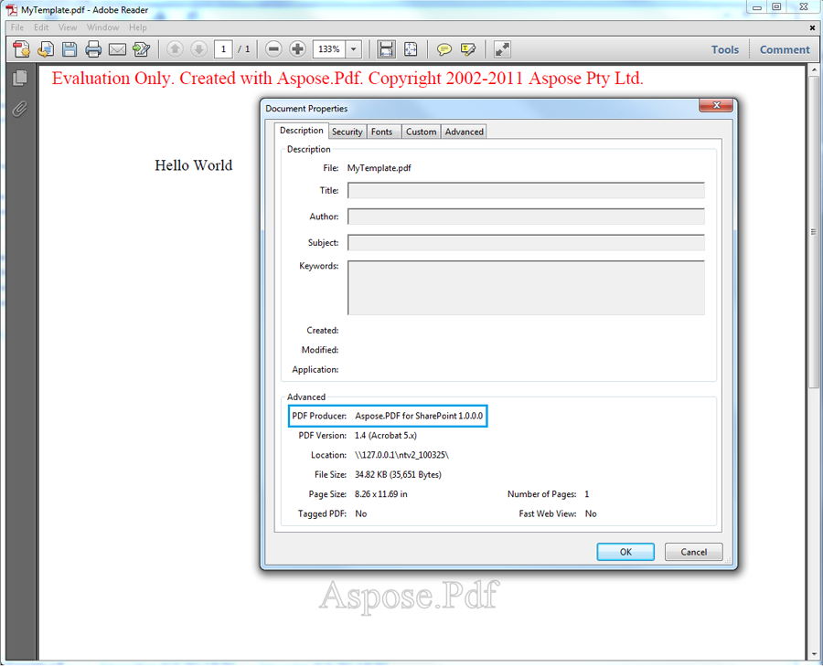

{}

Aspose.PDF for SharePoint está construido sobre nuestro galardonado componente Aspose.PDF for .NET. Aspose.PDF for .NET ofrece características notables, desde la creación de documentos PDF desde cero hasta la manipulación de archivos PDF existentes. Entre estas características, la conversión de XML a PDF es una de las grandes funcionalidades soportadas por este producto. Por lo tanto, creemos que Aspose.PDF for SharePoint también será capaz de convertir archivos XML al formato PDF.

{}

## **Crear un archivo XML y convertirlo a PDF**

{}

Paso a paso, este artículo lo guía a través del proceso de crear un archivo XML y convertirlo a PDF:

1. [Crear un archivo XML](/pdf/es/sharepoint/how-to-create-and-convert-an-xml-file-to-pdf/#step-1-create-xml-file).
2. [Crear una plantilla PDF](/pdf/es/sharepoint/how-to-create-and-convert-an-xml-file-to-pdf/#step-2-create-pdf-template).
3. [Cargar la plantilla XML](/pdf/es/sharepoint/how-to-create-and-convert-an-xml-file-to-pdf/#step-3-load-xml-template).
4. [Especificar la ruta al origen](/pdf/es/sharepoint/how-to-create-and-convert-an-xml-file-to-pdf/#step-4-specify-source-file-path).
5. [Especificar propiedades del archivo](/pdf/es/sharepoint/how-to-create-and-convert-an-xml-file-to-pdf/#step-5-specify-file-properties).
6. [Exportar el archivo a PDF](/pdf/es/sharepoint/how-to-create-and-convert-an-xml-file-to-pdf/#step-6-export-to-pdf).
7. [Guardar el archivo PDF](/pdf/es/sharepoint/how-to-create-and-convert-an-xml-file-to-pdf/#step-7-save-pdf-document).
#### **Paso 1: Crear archivo XML**
Primero crea un archivo XML basado en el modelo de objetos de documento Aspose.PDF for .NET.

Según el DOM de Aspose.PDF for .NET, un documento PDF contiene una colección de objetos Section, y una Section contiene uno o más elementos Paragraph. Text es un objeto a nivel de Paragraph y puede contener uno o más segmentos. A continuación, una cadena de texto de ejemplo se agrega a un objeto Segment y se añade a un objeto Text. Finalmente, el elemento Text se agrega a la colección de párrafos del objeto Section.

**XML**



<?xml version="1.0" encoding="utf-8" ?>

  <Pdf xmlns="Aspose.PDF">

   <Section>

    <Text>

            <Segment>Hola Mundo</Segment>

    </Text>

   </Section>

  </Pdf>


#### **Paso 2: Crear plantilla PDF**
Antes de continuar, asegúrese de que el servidor SharePoint Foundation 2010 esté instalado y configurado correctamente en el sistema donde se realizará la conversión.

1. Inicie sesión en el sitio de SharePoint.
1. Seleccione **Site Action** y **All Items**.
1. Seleccione la opción **Crear** y seleccione **Plantilla PDF** de la lista.
1. Introduzca un nombre de plantilla.
1. Haga clic en **Crear**.

#### **Paso 3: Cargar plantilla XML**
Una vez que se haya creado la plantilla, cargue [el archivo XML](/pdf/es/sharepoint/how-to-create-and-convert-an-xml-file-to-pdf/):

1. En la página de la plantilla PDF, seleccione **Agregar nuevo elemento**.

#### **Paso 4: Especificar la ruta del archivo fuente**
En el cuadro de diálogo de carga de documentos:

1. Haga clic en **Examinar** y localice el archivo XML en su sistema. Puede activar la casilla de verificación para sobrescribir la opción de archivo existente.
1. Presione el botón **OK**.

#### **Paso 5: Especificar propiedades del archivo**
Cuando se carga el archivo, agregue información en los campos obligatorios (marcados con un asterisco rojo: *).

Para este ejemplo, se había añadido una descripción de muestra y se completaron los siguientes campos:

1. Una breve descripción del documento.
1. Ingrese **AllListTypes** para el campo **Assigned List Types**.
1. Seleccione **List** del menú **Type**.
   Asegúrese de que el estado permanezca **Active**.
1. Haga clic **Guardar** para guardar las propiedades.

#### **Paso 6: Exportar a PDF**
Cuando el archivo XML se ha añadido a la plantilla PDF:
O bien:

1. Haga clic con el botón derecho en el archivo test.xml.
1. Seleccione **Exportar a PDF** del menú.

O:

1. Seleccione **Aspose Tools** de los **Library Tools**.
1. Haga clic en **Export**.

#### **Paso 7: Guardar documento PDF**
1. En el cuadro de diálogo Exportar a PDF, seleccione **Template storage** (la ubicación donde se almacena el archivo fuente).
1. Seleccione el archivo a exportar del menú **Template name**.
1. Haga clic **Export to PDF** para guardar el documento PDF final.

#### **Abrir el PDF**
El documento PDF ha sido guardado y puede abrirse. En la imagen siguiente, observe la frase "Hello World" que estaba en la etiqueta {segment] del XML. También observe que el Productor PDF es Aspose.PDF for SharePoint.

{}
