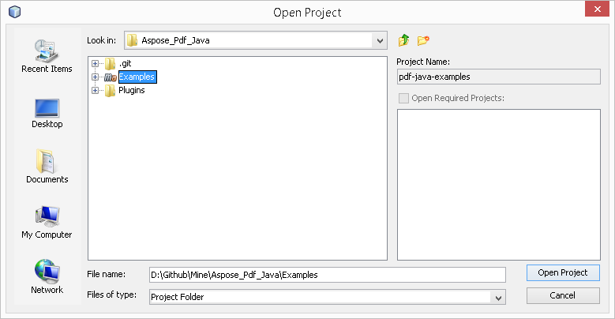

## Télécharger depuis GitHub

Tous les exemples d'Aspose.PDF pour Android via Java sont hébergés sur [Github](https://github.com/aspose-pdf/Aspose.PDF-for-Java). Vous pouvez soit cloner le référentiel en utilisant votre client Github préféré ou télécharger le fichier ZIP depuis [ici](https://github.com/aspose-pdf/Aspose.PDF-for-Java/archive/master.zip).

Extrayez le contenu du fichier ZIP dans n'importe quel dossier de votre ordinateur. Tous les exemples se trouvent dans le dossier **Examples**.

Le projet utilise le système de construction Maven. Tout IDE moderne peut facilement ouvrir ou importer le projet et ses dépendances. Ci‑dessous, nous vous montrons comment utiliser les IDE populaires pour compiler et exécuter les exemples.

### IntelliJ IDEA

Cliquez sur le menu **File** et choisissez **Open**. Parcourez le dossier du projet et sélectionnez le fichier **pom.xml**.

Il ouvrira le projet et téléchargera automatiquement les dépendances. Dans l'onglet **Project**, parcourez les exemples dans le dossier **src/main/java**. Pour exécuter un exemple, faites simplement un clic droit sur le fichier et choisissez "Run ..", l'exemple sera exécuté et la sortie sera affichée dans la fenêtre de console intégrée.

### Eclipse

Cliquez sur le menu **File** et choisissez **Import**. Sélectionnez **Maven** - Existing Maven Projects.

Parcourez le dossier que vous avez cloné ou téléchargé depuis GitHub et sélectionnez le fichier **pom.xml**.

Il ouvrira le projet et téléchargera automatiquement les dépendances. Dans l'onglet **Package Explorer**, parcourez les exemples dans le dossier **src/main/java**. Pour exécuter un exemple, faites simplement un clic droit sur le fichier et choisissez **Run As** - **Java Application**, l'exemple sera exécuté et la sortie sera affichée dans la fenêtre de console intégrée.

### NetBeans

Cliquez sur le menu **File** et choisissez **Open Project**. Parcourez le dossier que vous avez cloné ou téléchargé depuis GitHub. L’icône du dossier **Examples** indiquera qu’il s’agit d’un projet Maven. Sélectionnez Examples et ouvrez-le.

Il ouvrira le projet et téléchargera les dépendances automatiquement. Depuis l’onglet Projects, parcourez les exemples dans **source packages**. Pour exécuter un exemple, faites simplement un clic droit sur le fichier et choisissez **Run File**, l’exemple sera exécuté et la sortie sera affichée dans la fenêtre de console intégrée.

### Contribuer

Si vous souhaitez ajouter ou améliorer un exemple, nous vous encourageons à contribuer au projet. Tous les exemples et projets de démonstration dans ce dépôt sont open source et peuvent être utilisés librement dans vos propres applications.

Pour contribuer, vous pouvez forker le dépôt, modifier le code source et créer une pull request. Nous examinerons les modifications et les inclurons dans le dépôt si elles s’avèrent utiles.

