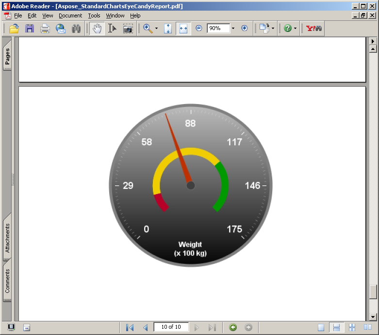

---
title: Sample Reports Gallery
linktitle: Galerie d’exemples de rapports
type: docs
weight: 40
url: /fr/jasperreports/sample-reports-gallery/
description: Consultez des exemples de rapports créés à l'aide d'Aspose.PDF for JasperReports. Découvrez comment il améliore les capacités d'exportation PDF.
lastmod: "2026-08-31"
---

{}

This gallery demonstrates PDF reports exported by Aspose.PDF for JasperReports.

{}

Les rapports présentés ci-dessous sont basés sur des exemples de données installées avec JasperServer.

## Rapport sur tous les comptes

## Rapport sur les supermarchés

## Cartes standards Rapport égéen

## Cartes standards Rapport égéen

## Rapport sur les graphiques standards

## Rapport sur les graphiques standards

## Rapport sur les graphiques standards

## Rapport sur les cartes standards

## Rapport sur les cartes standards

