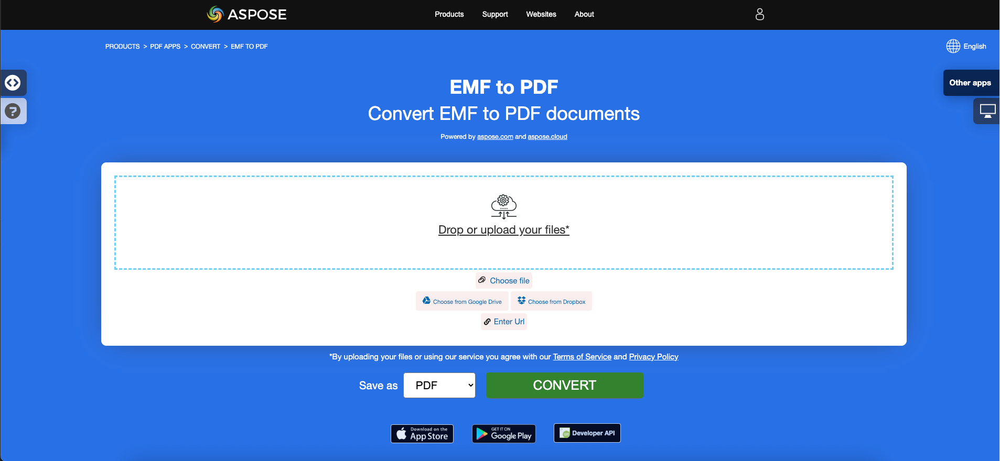
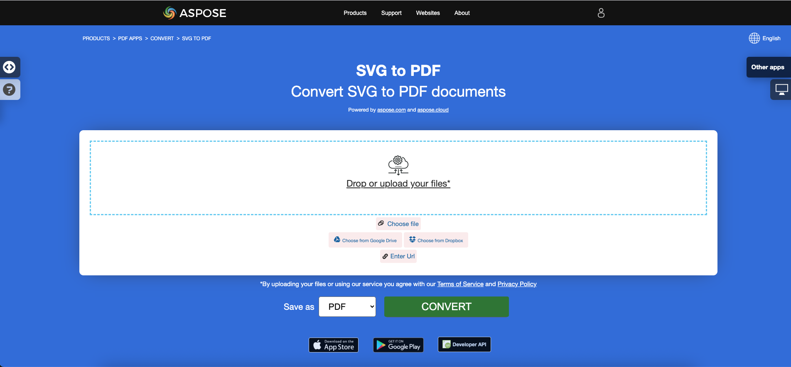

<script type="application/ld+json">
{
    "@context": "https://schema.org",
    "@type": "TechArticle",
    "headline": "Convert various Images formats to PDF in .NET",
    "alternativeHeadline": "Convert Multiple Image Formats to PDF with C#",
    "abstract": "Présentation d'une fonctionnalité puissante dans Aspose.PDF for .NET qui permet la conversion transparente de divers formats d'images, y compris BMP, CGM, DICOM, EMF, JPG, PNG, SVG, TIFF, CDR et DJVU en documents PDF de haute qualité. Cette fonctionnalité offre un moyen simple d'intégrer des conversions d'images en PDF dans vos applications .NET, garantissant un traitement efficace de divers contenus graphiques.",
    "author": {
        "@type": "Person",
        "name": "Anastasiia Holub",
        "givenName": "Anastasiia",
        "familyName": "Holub",
        "url": "https://www.linkedin.com/in/anastasiia-holub-750430225/"
    },
    "genre": "pdf document generation",
    "wordcount": "5136",
    "proficiencyLevel": "Beginner",
    "publisher": {
        "@type": "Organization",
        "name": "Aspose.PDF for .NET",
        "url": "https://products.aspose.com/pdf",
        "logo": "https://www.aspose.cloud/templates/aspose/img/products/pdf/aspose_pdf-for-net.svg",
        "alternateName": "Aspose",
        "sameAs": [
            "https://facebook.com/aspose.pdf/",
            "https://twitter.com/asposepdf",
            "https://www.youtube.com/channel/UCmV9sEg_QWYPi6BJJs7ELOg/featured",
            "https://www.linkedin.com/company/aspose",
            "https://stackoverflow.com/questions/tagged/aspose",
            "https://aspose.quora.com/",
            "https://aspose.github.io/"
        ],
        "contactPoint": [
            {
                "@type": "ContactPoint",
                "telephone": "+1 903 306 1676",
                "contactType": "sales",
                "areaServed": "US",
                "availableLanguage": "en"
            },
            {
                "@type": "ContactPoint",
                "telephone": "+44 141 628 8900",
                "contactType": "sales",
                "areaServed": "GB",
                "availableLanguage": "en"
            },
            {
                "@type": "ContactPoint",
                "telephone": "+61 2 8006 6987",
                "contactType": "sales",
                "areaServed": "AU",
                "availableLanguage": "en"
            }
        ]
    },
    "url": "/net/convert-images-format-to-pdf/",
    "mainEntityOfPage": {
        "@type": "WebPage",
        "@id": "/net/convert-images-format-to-pdf/"
    },
    "dateModified": "2025-04-04",
    "description": "Aspose.PDF peut effectuer non seulement des tâches simples et faciles, mais aussi faire face à des objectifs plus complexes. Consultez la section suivante pour les utilisateurs avancés et les développeurs."
}
</script>

## Aperçu

Cet article explique comment convertir divers formats d'images en PDF en utilisant C#. Il couvre ces sujets.

Le code suivant fonctionne également avec la bibliothèque [Aspose.PDF.Drawing](/pdf/fr/net/drawing/).

- [Convertir BMP en PDF](#csharp-bmp-to-pdf)
- [Convertir CGM en PDF](#csharp-cgm-to-pdf)
- [Convertir DICOM en PDF](#csharp-dicom-to-pdf)
- [Convertir EMF en PDF](#csharp-emf-to-pdf)
- [Convertir GIF en PDF](#csharp-gif-to-pdf)
- [Convertir JPG en PDF](#csharp-jpg-to-pdf)
- [Convertir PNG en PDF](#csharp-png-to-pdf)
- [Convertir SVG en PDF](#csharp-svg-to-pdf)
- [Convertir TIFF en PDF](#csharp-tiff-to-pdf)
- [Convertir CDR en PDF](#csharp-cdr-to-pdf)
- [Convertir DJVU en PDF](#csharp-djvu-to-pdf)
- [Convertir HEIC en PDF](#csharp-heic-to-pdf)

## Conversions d'images C# en PDF

**Aspose.PDF for .NET** vous permet de convertir différents formats d'images en fichiers PDF. Notre bibliothèque démontre des extraits de code pour convertir les formats d'images les plus populaires, tels que - BMP, CGM, DICOM, EMF, JPG, PNG, SVG, CDR, HEIC et TIFF.

## Convertir BMP en PDF

Convertir des fichiers BMP en document PDF en utilisant la bibliothèque **Aspose.PDF for .NET**.

<abbr title="Bitmap Image File">BMP</abbr> images sont des fichiers ayant une extension. BMP représente des fichiers d'images bitmap qui sont utilisés pour stocker des images numériques bitmap. Ces images sont indépendantes de l'adaptateur graphique et sont également appelées format de fichier bitmap indépendant du périphérique (DIB).
Vous pouvez convertir des BMP en fichiers PDF avec l'API Aspose.PDF for .NET. Par conséquent, vous pouvez suivre les étapes suivantes pour convertir des images BMP :

<a name="csharp-bmp-to-pdf" id="csharp-bmp-to-pdf"><strong>Convertir BMP en PDF</strong></a>

1. Initialiser un nouvel objet de classe [Document](https://reference.aspose.com/pdf/fr/net/aspose.pdf/document).
2. Charger l'image **BMP** d'entrée.
3. Enfin, enregistrer le fichier PDF de sortie.

Ainsi, l'extrait de code suivant suit ces étapes et montre comment convertir BMP en PDF en utilisant C# :

```csharp
// For complete examples and data files, visit https://github.com/aspose-pdf/Aspose.PDF-for-.NET
private static void ConvertBMPtoPDF()
{
    // The path to the documents directory
    var dataDir = RunExamples.GetDataDir_AsposePdf_WorkingDocuments();

    // Create PDF document
    using (var document = new Aspose.Pdf.Document())
    {
        // Add page
        var page = document.Pages.Add();
        var image = new Aspose.Pdf.Image();
        
        // Load BMP file
        image.File = dataDir + "BMPtoPDF.bmp";
        page.Paragraphs.Add(image);
        
        // Save PDF document
        document.Save(dataDir + "BMPtoPDF_out.pdf");
    }
}
```

{}
**Essayez de convertir BMP en PDF en ligne**

Aspose vous présente une application gratuite en ligne ["BMP to PDF"](https://products.aspose.app/pdf/conversion/bmp-to-pdf/), où vous pouvez essayer d'explorer la fonctionnalité et la qualité de son fonctionnement.

[](https://products.aspose.app/pdf/conversion/bmp-to-pdf/)
{}

## Convertir CGM en PDF

<abbr title="Computer Graphics Metafile">CGM</abbr> est une extension de fichier pour un format de mét fichier graphique utilisé couramment dans les applications de CAO (conception assistée par ordinateur) et de graphiques de présentation. CGM est un format de graphique vectoriel qui prend en charge trois méthodes d'encodage différentes : binaire (meilleur pour la vitesse de lecture du programme), basé sur des caractères (produit la plus petite taille de fichier et permet des transferts de données plus rapides) ou encodage en clair (permet aux utilisateurs de lire et de modifier le fichier avec un éditeur de texte).

Vérifiez le code suivant pour convertir des fichiers CGM en format PDF.

<a name="csharp-cgm-to-pdf" id="csharp-cgm-to-pdf"><strong>Convertir CGM en PDF</strong></a>

1. Créer une instance de la classe [CgmLoadOptions](https://reference.aspose.com/pdf/fr/net/aspose.pdf/cgmloadoptions).
2. Créer une instance de la classe [Document](https://reference.aspose.com/pdf/fr/net/aspose.pdf/document) avec le nom de fichier source mentionné et les options.
3. Enregistrer le document avec le nom de fichier souhaité.

```csharp
// For complete examples and data files, visit https://github.com/aspose-pdf/Aspose.PDF-for-.NET
private static void ConvertCGMtoPDF()
{
    // The path to the documents directory
    var dataDir = RunExamples.GetDataDir_AsposePdf_WorkingDocuments();

    var option = new Aspose.Pdf.CgmLoadOptions();

    // Open PDF document
    using (var document = new Aspose.Pdf.Document(dataDir + "CGMtoPDF.cgm", option))
    {
        // Save PDF document
        document.Save(dataDir + "CGMtoPDF_out.pdf");
    }
}
```

## Convertir DICOM en PDF

<abbr title="Digital Imaging and Communications in Medicine">DICOM</abbr> est le standard de l'industrie médicale pour la création, le stockage, la transmission et la visualisation d'images médicales numériques et de documents de patients examinés.

**Aspose.PDF pour .NET** vous permet de convertir des images DICOM et SVG, mais pour des raisons techniques, pour ajouter des images, vous devez spécifier le type de fichier à ajouter au PDF :

<a name="csharp-dicom-to-pdf" id="csharp-dicom-to-pdf"><strong>Convertir DICOM en PDF</strong></a>

1. Créer un objet de la classe Image.
2. Ajouter l'image à la collection Paragraphs d'une page.
3. Spécifier la propriété [FileType](https://reference.aspose.com/pdf/fr/net/aspose.pdf/image/properties/filetype).
4. Spécifier le chemin ou la source du fichier.
    - Si une image se trouve à un emplacement sur le disque dur, spécifiez le chemin d'emplacement en utilisant la propriété Image.File.
    - Si une image est placée dans un MemoryStream, passez l'objet contenant l'image à la propriété Image.ImageStream.

L'extrait de code suivant montre comment convertir des fichiers DICOM en format PDF avec Aspose.PDF. Vous devez charger l'image DICOM, placer l'image sur une page dans un fichier PDF et enregistrer la sortie en tant que PDF.

```csharp
// For complete examples and data files, visit https://github.com/aspose-pdf/Aspose.PDF-for-.NET
private static void ConvertDICOMtoPDF()
{
    // The path to the documents directory
    var dataDir = RunExamples.GetDataDir_AsposePdf_WorkingDocuments();

    // Create PDF document 
    using (var document = new Aspose.Pdf.Document())
    {
        // Add page
        var page = document.Pages.Add();
        
        var image = new Aspose.Pdf.Image
        {
            FileType = ImageFileType.Dicom,
            File = dataDir + "DICOMtoPDF.dcm"
        };
        page.Paragraphs.Add(image);

        // Save PDF document
        document.Save(dataDir + "DICOMtoPDF_out.pdf");
    }
}
```

{}
**Essayez de convertir DICOM en PDF en ligne**

Aspose vous présente une application gratuite en ligne ["DICOM to PDF"](https://products.aspose.app/pdf/conversion/dicom-to-pdf/), où vous pouvez essayer d'explorer la fonctionnalité et la qualité de son fonctionnement.

[](https://products.aspose.app/pdf/conversion/dicom-to-pdf/)
{}

## Convertir EMF en PDF

<abbr title="Enhanced metafile format">EMF</abbr> stocke des images graphiques de manière indépendante du périphérique. Les mét fichiers EMF se composent d'enregistrements de longueur variable dans l'ordre chronologique qui peuvent rendre l'image stockée après analyse sur n'importe quel périphérique de sortie. De plus, vous pouvez convertir EMF en image PDF en utilisant les étapes ci-dessous :

<a name="csharp-emf-to-pdf" id="csharp-emf-to-pdf"><strong>Convertir EMF en PDF</strong></a>

1. Tout d'abord, initialiser un objet de classe [Document](https://reference.aspose.com/pdf/fr/net/aspose.pdf/document).
2. Charger le fichier image **EMF**.
3. Ajouter l'image EMF chargée à une page.
4. Enregistrer le document PDF.

De plus, l'extrait de code suivant montre comment convertir un EMF en PDF avec C# dans votre extrait de code .NET :

```csharp
// For complete examples and data files, visit https://github.com/aspose-pdf/Aspose.PDF-for-.NET
private static void ConvertEMFtoPDF()
{
    // The path to the documents directory
    var dataDir = RunExamples.GetDataDir_AsposePdf_WorkingDocuments();

    // Create PDF document 
    using (var document = new Aspose.Pdf.Document())
    {
        // Add page
        var page = document.Pages.Add();
        var image = new Aspose.Pdf.Image();
        // Load EMF file
        image.File = dataDir + "EMFtoPDF.emf";

        // Specify page dimension properties
        page.PageInfo.Margin.Bottom = 0;
        page.PageInfo.Margin.Top = 0;
        page.PageInfo.Margin.Left = 0;
        page.PageInfo.Margin.Right = 0;
        page.PageInfo.Width = image.BitmapSize.Width;
        page.PageInfo.Height = image.BitmapSize.Height;

        page.Paragraphs.Add(image);

        // Save PDF document
        document.Save(dataDir + "EMFtoPDF_out.pdf");
    }
}
```

{}
**Essayez de convertir EMF en PDF en ligne**

Aspose vous présente une application gratuite en ligne ["EMF to PDF"](https://products.aspose.app/pdf/conversion/emf-to-pdf/), où vous pouvez essayer d'explorer la fonctionnalité et la qualité de son fonctionnement.

[](https://products.aspose.app/pdf/conversion/emf-to-pdf/)
{}

## Convertir GIF en PDF

Convertir des fichiers GIF en document PDF en utilisant la bibliothèque **Aspose.PDF for .NET**.

<abbr title="Graphics Interchange Format">GIF</abbr> est capable de stocker des données compressées sans perte de qualité dans un format de pas plus de 256 couleurs. Le format GIF indépendant du matériel a été développé en 1987 (GIF87a) par CompuServe pour transmettre des images bitmap sur des réseaux.
Vous pouvez convertir des GIF en fichiers PDF avec l'API Aspose.PDF for .NET. Par conséquent, vous pouvez suivre les étapes suivantes pour convertir des images GIF :

<a name="csharp-gif-to-pdf" id="csharp-gif-to-pdf"><strong>Convertir GIF en PDF</strong></a>

1. Initialiser un nouvel objet de classe [Document](https://reference.aspose.com/pdf/fr/net/aspose.pdf/document).
2. Charger l'image **GIF** d'entrée.
3. Enfin, enregistrer le fichier PDF de sortie.

Ainsi, l'extrait de code suivant suit ces étapes et montre comment convertir BMP en PDF en utilisant C# :

```csharp
// For complete examples and data files, visit https://github.com/aspose-pdf/Aspose.PDF-for-.NET
private static void ConvertGIFtoPDF()
{
    // The path to the documents directory
    var dataDir = RunExamples.GetDataDir_AsposePdf_WorkingDocuments();

    // Create PDF document
    using (var document = new Aspose.Pdf.Document())
    {
        // Add page
        var page = document.Pages.Add();
        var image = new Aspose.Pdf.Image();
        
        // Load sample GIF image file
        image.File = dataDir + "GIFtoPDF.gif";
        page.Paragraphs.Add(image);

        // Save PDF document
        document.Save(dataDir + "GIFtoPDF_out.pdf");
    }
}
```

{}
**Essayez de convertir GIF en PDF en ligne**

Aspose vous présente une application gratuite en ligne ["GIF to PDF"](https://products.aspose.app/pdf/conversion/gif-to-pdf/), où vous pouvez essayer d'explorer la fonctionnalité et la qualité de son fonctionnement.

[](https://products.aspose.app/pdf/conversion/gif-to-pdf/)
{}

## Convertir JPG en PDF

Pas besoin de se demander comment convertir JPG en PDF, car la bibliothèque **Aspose.PDF pour .NET** a la meilleure solution.

Vous pouvez très facilement convertir des images JPG en PDF avec Aspose.PDF for .NET en suivant ces étapes :

<a name="csharp-jpg-to-pdf" id="csharp-jpg-to-pdf"><strong>Convertir JPG en PDF</strong></a>

1. Initialiser un objet de la classe [Document](https://reference.aspose.com/page/net/aspose.page/document).
2. Ajouter une nouvelle page au document PDF.
3. Charger l'image **JPG** et l'ajouter au paragraphe.
4. Enregistrer le PDF de sortie.

L'extrait de code ci-dessous montre comment convertir une image JPG en PDF en utilisant C# :

```csharp
// For complete examples and data files, visit https://github.com/aspose-pdf/Aspose.PDF-for-.NET
private static void ConvertJPGtoPDF()
{
    // The path to the documents directory
    var dataDir = RunExamples.GetDataDir_AsposePdf_WorkingDocuments();

    // Create PDF document 
    using (var document = new Aspose.Pdf.Document())
    {
        // Add page
        var page = document.Pages.Add();
        var image = new Aspose.Pdf.Image();
        // Load input JPG file
        image.File = dataDir + "JPGtoPDF.jpg";
        
        // Add image on a page
        page.Paragraphs.Add(image);
        
        // Save PDF document
        document.Save(dataDir + "JPGtoPDF_out.pdf");
    }
}
```

Ensuite, vous pouvez voir comment convertir une image en PDF avec **la même hauteur et largeur de la page**. Nous allons obtenir les dimensions de l'image et définir en conséquence les dimensions de la page du document PDF avec les étapes ci-dessous :

1. Charger le fichier image d'entrée.
1. Définir la hauteur, la largeur et les marges d'une page.
1. Enregistrer le fichier PDF de sortie.

L'extrait de code suivant montre comment convertir une image en PDF avec la même hauteur et largeur de page en utilisant C# :

```csharp
// For complete examples and data files, visit https://github.com/aspose-pdf/Aspose.PDF-for-.NET
private static void ConvertJPGtoPDF()
{
    // The path to the documents directory
    var dataDir = RunExamples.GetDataDir_AsposePdf_WorkingDocuments();

    // Create PDF document
    using (var document = new Aspose.Pdf.Document())
    {
        // Add page
        var page = document.Pages.Add();
        var image = new Aspose.Pdf.Image();
        // Load JPEG file
        image.File = dataDir + "JPGtoPDF.jpg";
        
        // Read Height of input image
        page.PageInfo.Height = image.BitmapSize.Height;
        // Read Width of input image
        page.PageInfo.Width = image.BitmapSize.Width;
        page.PageInfo.Margin.Bottom = 0;
        page.PageInfo.Margin.Top = 0;
        page.PageInfo.Margin.Right = 0;
        page.PageInfo.Margin.Left = 0;
        page.Paragraphs.Add(image);
        
        // Save PDF document
        document.Save(dataDir + "JPGtoPDF_out.pdf");
    }
}
```

{}
**Essayez de convertir JPG en PDF en ligne**

Aspose vous présente une application gratuite en ligne ["JPG to PDF"](https://products.aspose.app/pdf/conversion/jpg-to-pdf/), où vous pouvez essayer d'explorer la fonctionnalité et la qualité de son fonctionnement.

[](https://products.aspose.app/pdf/conversion/jpg-to-pdf/)
{}

## Convertir PNG en PDF

**Aspose.PDF for .NET** prend en charge la fonctionnalité de conversion des images PNG en format PDF. Vérifiez l'extrait de code suivant pour réaliser votre tâche.

<abbr title="Portable Network Graphics">PNG</abbr> fait référence à un type de format de fichier image raster qui utilise une compression sans perte, ce qui le rend populaire parmi ses utilisateurs.

Vous pouvez convertir PNG en image PDF en utilisant les étapes ci-dessous :

<a name="csharp-png-to-pdf" id="csharp-png-to-pdf"><strong>Convertir PNG en PDF</strong></a>

1. Charger l'image **PNG** d'entrée.
2. Lire les valeurs de hauteur et de largeur.
3. Créer un nouvel objet [Document](https://reference.aspose.com/page/net/aspose.page/document) et ajouter une page.
4. Définir les dimensions de la page.
5. Enregistrer le fichier de sortie.

De plus, l'extrait de code ci-dessous montre comment convertir PNG en PDF avec C# dans vos applications .NET :

```csharp
// For complete examples and data files, visit https://github.com/aspose-pdf/Aspose.PDF-for-.NET
private static void ConvertPNGtoPDF()
{
    // The path to the documents directory
    var dataDir = RunExamples.GetDataDir_AsposePdf_WorkingDocuments();

    // Create PDF document
    using (var document = new Aspose.Pdf.Document())
    {
        // Add page
        var page = document.Pages.Add();
        var image = new Aspose.Pdf.Image();
        // Load PNG file
        image.File = dataDir + "PNGtoPDF.png";
        
        // Read Height of input image
        page.PageInfo.Height = image.BitmapSize.Height;
        // Read Width of input image
        page.PageInfo.Width = image.BitmapSize.Width;
        page.PageInfo.Margin.Bottom = 0;
        page.PageInfo.Margin.Top = 0;
        page.PageInfo.Margin.Right = 0;
        page.PageInfo.Margin.Left = 0;
        page.Paragraphs.Add(image);
        
        // Save PDF document
        document.Save(dataDir + "PNGtoPDF_out.pdf");
    }
}
```

{}
**Essayez de convertir PNG en PDF en ligne**

Aspose vous présente une application gratuite en ligne ["PNG to PDF"](https://products.aspose.app/pdf/conversion/png-to-pdf/), où vous pouvez essayer d'explorer la fonctionnalité et la qualité de son fonctionnement.

[](https://products.aspose.app/pdf/conversion/png-to-pdf/)
{}

## Convertir SVG en PDF

**Aspose.PDF for .NET** explique comment convertir des images SVG en format PDF et comment obtenir les dimensions du fichier source <abbr title="Scalable Vector Graphics">SVG</abbr>.

Les graphiques vectoriels évolutifs (SVG) sont une famille de spécifications d'un format de fichier basé sur XML pour des graphiques vectoriels bidimensionnels, à la fois statiques et dynamiques (interactifs ou animés). La spécification SVG est une norme ouverte qui est en développement par le World Wide Web Consortium (W3C) depuis 1999.

Les images SVG et leurs comportements sont définis dans des fichiers texte XML. Cela signifie qu'ils peuvent être recherchés, indexés, scriptés et, si nécessaire, compressés. En tant que fichiers XML, les images SVG peuvent être créées et modifiées avec n'importe quel éditeur de texte, mais il est souvent plus pratique de les créer avec des programmes de dessin tels qu'Inkscape.

{}
**Essayez de convertir le format SVG en PDF en ligne**

Aspose.PDF for .NET vous présente une application gratuite en ligne ["SVG to PDF"](https://products.aspose.app/pdf/conversion/svg-to-pdf), où vous pouvez essayer d'explorer la fonctionnalité et la qualité de son fonctionnement.

[](https://products.aspose.app/pdf/conversion/svg-to-pdf)
{}

Pour convertir des fichiers SVG en PDF, utilisez la classe nommée [SvgLoadOptions](https://reference.aspose.com/pdf/fr/net/aspose.pdf/svgloadoptions) qui est utilisée pour initialiser l'objet [`LoadOptions`](https://reference.aspose.com/pdf/fr/net/aspose.pdf/loadoptions). Plus tard, cet objet est passé comme argument lors de l'initialisation de l'objet Document et aide le moteur de rendu PDF à déterminer le format d'entrée du document source.

<a name="csharp-svg-to-pdf" id="csharp-svg-to-pdf"><strong>Convertir SVG en PDF</strong></a>

1. Créer une instance de la classe [`SvgLoadOptions`](https://reference.aspose.com/pdf/fr/net/aspose.pdf/loadoptions).
2. Créer une instance de la classe [`Document`](https://reference.aspose.com/pdf/fr/net/aspose.pdf/document) avec le nom de fichier source mentionné et les options.
3. Enregistrer le document avec le nom de fichier souhaité.

L'extrait de code suivant montre le processus de conversion d'un fichier SVG en format PDF avec Aspose.PDF for .NET.

```csharp
// For complete examples and data files, visit https://github.com/aspose-pdf/Aspose.PDF-for-.NET
private static void ConvertSVGtoPDF()
{
    // The path to the documents directory
    var dataDir = RunExamples.GetDataDir_AsposePdf_WorkingDocuments();

    var option = new Aspose.Pdf.SvgLoadOptions();
    // Open SVG file 
    using (var document = new Aspose.Pdf.Document(dataDir + "SVGtoPDF.svg", option))
    {
        // Save PDF document
        document.Save(dataDir + "SVGtoPDF_out.pdf");
    }
}
```

## Obtenir les dimensions SVG

Il est également possible d'obtenir les dimensions du fichier SVG source. Cette information peut être utile si nous voulons que le SVG couvre toute la page du PDF de sortie. La propriété AdjustPageSize de la classe SvgLoadOption répond à cette exigence. La valeur par défaut de cette propriété est false. Si la valeur est définie sur true, le PDF de sortie aura la même taille (dimensions) que le SVG source.

L'extrait de code suivant montre le processus d'obtention des dimensions du fichier SVG source et de génération d'un fichier PDF.

```csharp
// For complete examples and data files, visit https://github.com/aspose-pdf/Aspose.PDF-for-.NET
private static void ConvertSVGtoPDF()
{
    // The path to the documents directory
    var dataDir = RunExamples.GetDataDir_AsposePdf_DocumentConversion();

    var loadopt = new Aspose.Pdf.SvgLoadOptions();
    loadopt.AdjustPageSize = true;
    // Open SVG file
    using (var document = new Aspose.Pdf.Document(dataDir + "SVGtoPDF.svg", loadopt))
    {
        document.Pages[1].PageInfo.Margin.Top = 0;
        document.Pages[1].PageInfo.Margin.Left = 0;
        document.Pages[1].PageInfo.Margin.Bottom = 0;
        document.Pages[1].PageInfo.Margin.Right = 0;

        // Save PDF document
        document.Save(dataDir + "SVGtoPDF_out.pdf");
    }
    
}
```

### Fonctionnalités prises en charge par SVG

<table>
    <thead>
        <tr>
            <th>
                <p>Tag SVG</p>
            </th>
            <th>
                <p>Utilisation d'exemple</p>
            </th>
        </tr>
    </thead>
    <tbody>
        <tr>
            <td>
                <p>circle</p>
            </td>
            <td>
                <code><pre>&lt circle id="r2" cx="10" cy="10" r="10" stroke="blue" stroke-width="2"&gt </pre></code>
            </td>
        </tr>
        <tr>
            <td>
                <p>defs</p>
            </td>
            <td>
                <code>&lt;defs&gt;&nbsp; <br> &lt;rect id="r1" width="15" height="15"
                    stroke="blue" stroke-width="2" /&gt;&nbsp; <br> &lt;circle id="r2"
                    cx="10" cy="10" r="10" stroke="blue" stroke-width="2"/&gt;&nbsp; <br>
                    &lt;circle id="r3" cx="10" cy="10" r="10" stroke="blue" stroke-width="3"/&gt;&nbsp; <br> &lt;/defs&gt;&nbsp; <br> &lt;use
                    x="25" y="40" xlink:href="#r1" fill="red"/&gt;&nbsp; <br> &lt;use
                    x="35" y="15" xlink:href="#r2" fill="green"/&gt;&nbsp; <br> &lt;use
                    x="58" y="50" xlink:href="#r3" fill="blue"/&gt;</code>
            </td>
        </tr>
        <tr>
            <td>
                <p>tref</p>
            </td>
            <td>
                <p>&lt;defs&gt;&nbsp; <br> &nbsp;&nbsp;&nbsp; &lt;text
                    id="ReferencedText"&gt;&nbsp; <br> &nbsp;&nbsp;&nbsp;&nbsp;&nbsp;
                    Données de caractères référencées&nbsp; <br> &nbsp;&nbsp;&nbsp;
                    &lt;/text&gt;&nbsp; <br> &lt;/defs&gt;&nbsp; <br
                        class="atl-forced-newline"> &lt;text x="10" y="100" font-size="15" fill="red" &gt;&nbsp; <br
                        class="atl-forced-newline"> &nbsp;&nbsp;&nbsp; &lt;tref
                    xlink:href="#ReferencedText"/&gt;&nbsp; <br> &lt;/text&gt;</p>
            </td>
        </tr>
        <tr>
            <td>
                <p>use</p>
            </td>
            <td>
                <p>&lt;defs&gt;&nbsp; <br> &nbsp;&nbsp;&nbsp; &lt;text id="Text" x="400"
                    y="200"&nbsp; <br>
                    &nbsp;&nbsp;&nbsp;&nbsp;&nbsp;&nbsp;&nbsp;&nbsp;&nbsp; font-family="Verdana" font-size="100"
                    text-anchor="middle" &gt;&nbsp; <br> &nbsp;&nbsp;&nbsp;&nbsp;&nbsp;
                    Texte masqué&nbsp; <br> &nbsp;&nbsp;&nbsp; &lt;/text&gt;&nbsp; <br
                        class="atl-forced-newline"> &lt;use xlink:href="#Text" fill="blue"&nbsp; /&gt;</p>
            </td>
        </tr>
        <tr>
            <td>
                <p>ellipse&nbsp;</p>
            </td>
            <td>
                <p>&lt;ellipse cx="2.5" cy="1.5" rx="2" ry="1" fill="red" /&gt;</p>
            </td>
        </tr>
        <tr>
            <td>
                <p>g&nbsp;</p>
            </td>
            <td>
                <p>&lt;g fill="none" stroke="dimgray" stroke-width="1.5" &gt;&nbsp; <br>
                    &nbsp;&nbsp; &nbsp;&nbsp;&nbsp; &nbsp;&nbsp;&nbsp; &nbsp;&nbsp;&nbsp; &nbsp;&lt;line x1="-7"
                    y1="-7" x2="-3" y2="-3"/&gt;&nbsp; <br> &nbsp;&nbsp;
                    &nbsp;&nbsp;&nbsp; &nbsp;&nbsp;&nbsp; &nbsp;&nbsp;&nbsp; &nbsp;&lt;line x1="7" y1="7" x2="3"
                    y2="3"/&gt;&nbsp; <br> &nbsp;&nbsp; &nbsp;&nbsp;&nbsp;
                    &nbsp;&nbsp;&nbsp; &nbsp;&nbsp;&nbsp; &nbsp;&lt;line x1="-7" y1="7" x2="-3" y2="3"/&gt;&nbsp;
                    <br> &nbsp;&nbsp; &nbsp;&nbsp;&nbsp; &nbsp;&nbsp;&nbsp;
                    &nbsp;&nbsp;&nbsp; &nbsp;&lt;line x1="7" y1="-7" x2="3" y2="-3"/&gt;&nbsp; <br
                        class="atl-forced-newline"> &lt;/g&gt;&nbsp;</p>
            </td>
        </tr>
        <tr>
            <td>
                <p>image</p>
            </td>
            <td>
                <p>&lt;image id="ShadedRelief" x="24" y="4" width="64" height="82" xlink:href="relief.jpg"
                    /&gt;&nbsp;</p>
            </td>
        </tr>
        <tr>
            <td>
                <p>line</p>
            </td>
            <td>
                <p>&lt;line style="stroke:#eea;stroke-width:8" x1="10" y1="30" x2="260" y2="100"/&gt;&nbsp;</p>
            </td>
        </tr>
        <tr>
            <td>
                <p>path</p>
            </td>
            <td>
                <p>&lt;path style="fill:#daa;fill-rule:evenodd;stroke:red" d="M 230,150 C 290,30 10,255 110,140 z
                    "/&gt;&nbsp;</p>
            </td>
        </tr>
        <tr>
            <td>
                <p>style</p>
            </td>
            <td>
                <p>&lt;path style="fill:#daa;fill-rule:evenodd;stroke:red" d="M 230,150 C 290,30 10,255 110,140 z
                    "/&gt;</p>
            </td>
        </tr>
        <tr>
            <td>
                <p>polygon</p>
            </td>
            <td>
                <p>&lt;polygon style="stroke:#24a;stroke-width:1.5;fill:#eefefe" points="10,10 180,10 10,250 10,10"
                    /&gt;</p>
            </td>
        </tr>
        <tr>
            <td>
                <p>polyline</p>
            </td>
            <td>
                <p>&lt;polyline fill="none" stroke="dimgray" stroke-width="1" points="-3,-6 3,-6 3,1 5,1 0,7 -5,1
                    -3,1 -3,-5"/&gt;</p>
            </td>
        </tr>
        <tr>
            <td>
                <p>rect&nbsp;</p>
            </td>
            <td>
                <p>&lt;rect x="0" y="0" width="400" height="600" stroke="none" fill="aliceblue" /&gt;</p>
            </td>
        </tr>
        <tr>
            <td>
                <p>svg</p>
            </td>
            <td>
                <p>&lt;svg xmlns="http://www.w3.org/2000/svg" version="1.1" width="10cm" height="5cm" &gt;</p>
            </td>
        </tr>
        <tr>
            <td>
                <p>text</p>
            </td>
            <td>
                <p>&lt;text font-family="sans-serif" fill="dimgray" font-size="22px" font-weight="bold" x="58"
                    y="30" pointer-events="none"&gt;Titre de la carte&lt;/text&gt;</p>
            </td>
        </tr>
        <tr>
            <td>
                <p>font</p>
            </td>
            <td>
                <p>&lt;text x="10" y="100" font-size="15" fill="red" &gt;&nbsp; <br>
                    &nbsp;&nbsp;&nbsp; Texte d'exemple&nbsp; <br> &lt;/text&gt;</p>
            </td>
        </tr>
        <tr>
            <td>
                <p>tspan</p>
            </td>
            <td>
                <p>&lt;tspan dy="25" x="25"&gt;valeur d'entrée de couleur d'encre six. Ici, cela sera &lt;/tspan&gt;</p>
            </td>
        </tr>
    </tbody>
</table>

## Convertir TIFF en PDF

Le format de fichier **Aspose.PDF** est pris en charge, qu'il s'agisse d'une image <abbr title="Tag Image File Format">TIFF</abbr> à une seule image ou à plusieurs images. Cela signifie que vous pouvez convertir l'image TIFF en PDF dans vos applications .NET.

TIFF ou TIF, le format de fichier d'image tagué, représente des images raster qui sont destinées à être utilisées sur une variété de dispositifs conformes à cette norme de format de fichier. Une image TIFF peut contenir plusieurs images avec différents cadres. Le format de fichier Aspose.PDF est également pris en charge, qu'il s'agisse d'une image TIFF à une seule image ou à plusieurs images.

Vous pouvez convertir TIFF en PDF de la même manière que les autres formats de fichiers raster graphiques :

<a name="csharp-tiff-to-pdf" id="csharp-tiff-to-pdf"><strong>Convertir TIFF en PDF</strong></a>

1. Créer un nouvel objet de classe [Document](https://reference.aspose.com/pdf/fr/net/aspose.pdf/document) et ajouter une page.
2. Charger l'image **TIFF** d'entrée.
3. Enregistrer le document PDF.

```csharp
// For complete examples and data files, visit https://github.com/aspose-pdf/Aspose.PDF-for-.NET
private static void ConvertTIFFtoPDF()
{
    // The path to the documents directory
    var dataDir = RunExamples.GetDataDir_AsposePdf_WorkingDocuments();

    // Create PDF document
    using (var document = new Aspose.Pdf.Document())
    {
        document.Pages.Add();
        var image = new Aspose.Pdf.Image();
        
        // Load sample Tiff image file
        image.File = dataDir + "TIFFtoPDF.tiff";
        document.Pages[1].Paragraphs.Add(image);
        
        // Save PDF document
        document.Save(dataDir + "TIFFtoPDF_out.pdf");
    }
}
```

Dans le cas où vous devez convertir une image TIFF multi-pages en document PDF multi-pages et contrôler certains paramètres, par exemple, la largeur ou le rapport d'aspect, veuillez suivre ces étapes :

1. Instancier une instance de la classe Document.
1. Charger l'image TIFF d'entrée.
1. Obtenir la FrameDimension des cadres.
1. Ajouter une nouvelle page pour chaque cadre.
1. Enfin, enregistrer les images dans les pages PDF.

L'extrait de code suivant montre comment convertir une image TIFF multi-pages ou multi-cadres en PDF avec C# :

```csharp
// For complete examples and data files, visit https://github.com/aspose-pdf/Aspose.PDF-for-.NET
private static void ConvertTIFFtoPDF()
{
    // The path to the documents directory
    var dataDir = RunExamples.GetDataDir_AsposePdf_WorkingDocuments();

    // Create PDF document
    using (var document = new Aspose.Pdf.Document())
    {
        using (var bitmap = new System.Drawing.Bitmap(File.OpenRead(dataDir + "TIFFtoPDF.tif")))
        {
            // Convert multi page or multi frame TIFF to PDF
            var dimension = new FrameDimension(bitmap.FrameDimensionsList[0]);
            var frameCount = bitmap.GetFrameCount(dimension);

            // Iterate through each frame
            for (int frameIdx = 0; frameIdx <= frameCount - 1; frameIdx++)
            {
                var page = document.Pages.Add();

                bitmap.SelectActiveFrame(dimension, frameIdx);

                using (var currentImage = new MemoryStream())
                {
                    bitmap.Save(currentImage, ImageFormat.Tiff);

                    var imageht = new Aspose.Pdf.Image
                    {
                        ImageStream = currentImage,
                        //Apply some other options
                        //ImageScale = 0.5
                    };
                    page.Paragraphs.Add(imageht);
                }
            }
        }

        // Save PDF document
        document.Save(dataDir + "TIFFtoPDF_out.pdf");
    }
}
```

## Convertir CDR en PDF

<abbr title="CDR">CDR</abbr> est un format de fichier développé par la Corel Corporation et utilisé principalement pour des images graphiques vectorielles et des dessins. Le format de fichier CDR est reconnu par la majorité des programmes d'édition d'images. Le format CDR est le format par défaut pour les applications Corel Draw.

Vérifiez le code suivant pour convertir des fichiers CDR en format PDF.

<a name="csharp-cdr-to-pdf" id="csharp-cdr-to-pdf"><strong>Convertir CDR en PDF</strong></a>

1. Créer une instance de la classe [CdrLoadOptions](https://reference.aspose.com/pdf/fr/net/aspose.pdf/cdrloadoptions/).
2. Créer une instance de la classe [Document](https://reference.aspose.com/pdf/fr/net/aspose.pdf/document) avec le nom de fichier source mentionné et les options.
3. Enregistrer le document avec le nom de fichier souhaité.

```csharp
// For complete examples and data files, visit https://github.com/aspose-pdf/Aspose.PDF-for-.NET
private static void ConvertCDRtoPDF()
{
    // The path to the documents directory
    var dataDir = RunExamples.GetDataDir_AsposePdf_WorkingDocuments();

    // Open CDR file
    using (var document = new Aspose.Pdf.Document(dataDir + "CDRtoPDF.cdr", new CdrLoadOptions()))
    {
        // Save PDF document
        document.Save(dataDir + "CDRtoPDF_out.pdf");
    }
}
```

## Convertir DJVU en PDF

<abbr title="DJVU">DjVu</abbr> est un format d'image compressé développé par LizardTech. Ce format de fichier a été principalement conçu pour stocker différents types de documents numérisés ; en particulier des documents contenant une combinaison de texte, d'images, d'images couleur indexées et de dessins au trait.

Vérifiez le code suivant pour convertir des fichiers DJVU en format PDF.

<a name="csharp-djvu-to-pdf" id="csharp-djvu-to-pdf"><strong>Convertir DJVU en PDF</strong></a>

1. Créer une instance de la classe [DjvuLoadOptions](https://reference.aspose.com/pdf/fr/net/aspose.pdf/djvuloadoptions/).
2. Créer une instance de la classe [Document](https://reference.aspose.com/pdf/fr/net/aspose.pdf/document) avec le nom de fichier source mentionné et les options.
3. Enregistrer le document avec le nom de fichier souhaité.

```csharp
// For complete examples and data files, visit https://github.com/aspose-pdf/Aspose.PDF-for-.NET
private static void ConvertDJVUtoPDF()
{
    // The path to the documents directory
    var dataDir = RunExamples.GetDataDir_AsposePdf_WorkingDocuments();
    
    // Open DJVU file
    using (var document = new Aspose.Pdf.Document(dataDir + "CDRtoPDF.djvu", new DjvuLoadOptions()))
    {
        // Save PDF document
        document.Save(dataDir + "CDRtoPDF_out.pdf");
    }
}
```

## Convertir HEIC en PDF

<a name="csharp-heic-to-pdf" id="csharp-heic-to-pdf"><strong>Convertir HEIC en PDF</strong></a>

Un fichier HEIC est un format de fichier d'image à conteneur haute efficacité qui peut stocker plusieurs images en tant que collection dans un seul fichier.
Pour charger des images heic, vous devez ajouter une référence au package nuget https://www.nuget.org/packages/FileFormat.Heic/.
Convertir des images HEIC en PDF en utilisant Aspose.PDF :

```csharp
// For complete examples and data files, visit https://github.com/aspose-pdf/Aspose.PDF-for-.NET
private static void ConvertHEICtoPDF()
{
    // The path to the documents directory
    var dataDir = RunExamples.GetDataDir_AsposePdf_WorkingDocuments();

    // Open HEIC file
    using (var fs = new FileStream(dataDir + "HEICtoPDF.heic", FileMode.Open))
    {
        var image = FileFormat.Heic.Decoder.HeicImage.Load(fs);
        var pixels = image.GetByteArray(PixelFormat.Rgb24);
        var width = (int)image.Width;
        var height = (int)image.Height;

        using (var document = new Aspose.Pdf.Document())
        {
            var page = document.Pages.Add();
            var asposeImage = new Aspose.Pdf.Image();
            asposeImage.BitmapInfo = new Aspose.Pdf.BitmapInfo(pixels, width, height, Aspose.Pdf.BitmapInfo.PixelFormat.Rgb24);
            page.PageInfo.Height = height;
            page.PageInfo.Width = width;
            page.PageInfo.Margin.Bottom = 0;
            page.PageInfo.Margin.Top = 0;
            page.PageInfo.Margin.Right = 0;
            page.PageInfo.Margin.Left = 0;

            page.Paragraphs.Add(asposeImage);

            // Save PDF document
            document.Save(dataDir + "HEICtoPDF_out.pdf");
        }
    }
}
```