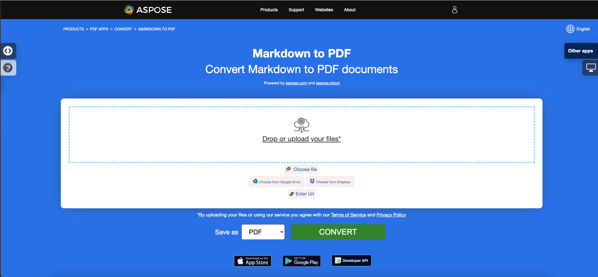
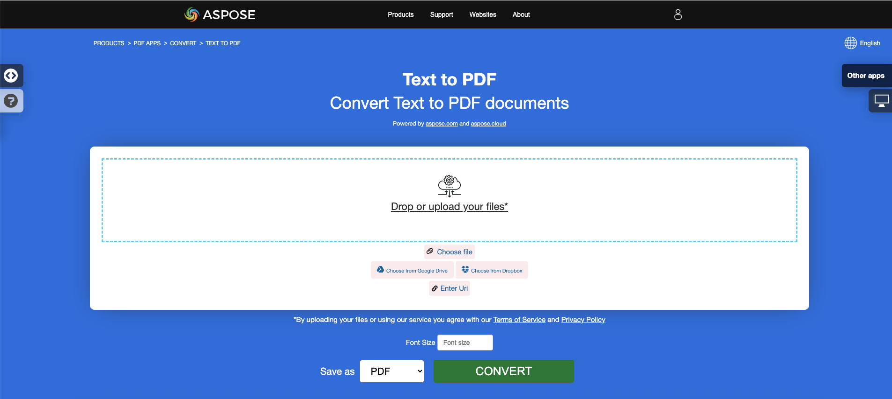
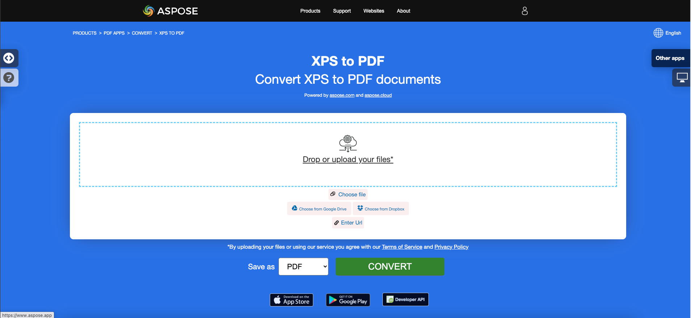

<script type="application/ld+json">
{
    "@context": "https://schema.org",
    "@type": "TechArticle",
    "headline": "Convert other file formats to PDF in .NET",
    "alternativeHeadline": "Convert Multiple File Formats to PDF in C#",
    "abstract": "Aspose.PDF for .NET introduit une fonctionnalité polyvalente permettant aux utilisateurs de convertir facilement une gamme de formats de fichiers, y compris EPUB, Markdown, PCL, XPS, PS, XML et LaTeX, en documents PDF de haute qualité. Cette fonctionnalité améliore la gestion des documents en garantissant la compatibilité et l'accessibilité sur diverses plateformes tout en maintenant l'intégrité du contenu original.",
    "author": {
        "@type": "Person",
        "name": "Anastasiia Holub",
        "givenName": "Anastasiia",
        "familyName": "Holub",
        "url": "https://www.linkedin.com/in/anastasiia-holub-750430225/"
    },
    "genre": "pdf document generation",
    "wordcount": "4627",
    "proficiencyLevel": "Beginner",
    "publisher": {
        "@type": "Organization",
        "name": "Aspose.PDF for .NET",
        "url": "https://products.aspose.com/pdf",
        "logo": "https://www.aspose.cloud/templates/aspose/img/products/pdf/aspose_pdf-for-net.svg",
        "alternateName": "Aspose",
        "sameAs": [
            "https://facebook.com/aspose.pdf/",
            "https://twitter.com/asposepdf",
            "https://www.youtube.com/channel/UCmV9sEg_QWYPi6BJJs7ELOg/featured",
            "https://www.linkedin.com/company/aspose",
            "https://stackoverflow.com/questions/tagged/aspose",
            "https://aspose.quora.com/",
            "https://aspose.github.io/"
        ],
        "contactPoint": [
            {
                "@type": "ContactPoint",
                "telephone": "+1 903 306 1676",
                "contactType": "sales",
                "areaServed": "US",
                "availableLanguage": "en"
            },
            {
                "@type": "ContactPoint",
                "telephone": "+44 141 628 8900",
                "contactType": "sales",
                "areaServed": "GB",
                "availableLanguage": "en"
            },
            {
                "@type": "ContactPoint",
                "telephone": "+61 2 8006 6987",
                "contactType": "sales",
                "areaServed": "AU",
                "availableLanguage": "en"
            }
        ]
    },
    "url": "/net/convert-other-files-to-pdf/",
    "mainEntityOfPage": {
        "@type": "WebPage",
        "@id": "/net/convert-other-files-to-pdf/"
    },
    "dateModified": "2024-11-25",
    "description": "Aspose.PDF peut effectuer non seulement des tâches simples et faciles mais aussi faire face à des objectifs plus complexes. Consultez la section suivante pour les utilisateurs avancés et les développeurs."
}
</script>

## Aperçu

Cet article explique comment **convertir divers autres types de formats de fichiers en PDF en utilisant C#**. Il couvre les sujets suivants.

Le code suivant fonctionne également avec la bibliothèque [Aspose.PDF.Drawing](/pdf/fr/net/drawing/).

_Format_: **EPUB**
- [C# EPUB en PDF](#csharp-convert-epub-to-pdf)
- [C# Convertir EPUB en PDF](#csharp-convert-epub-to-pdf)
- [C# Comment convertir un fichier EPUB en PDF](#csharp-convert-epub-to-pdf)

_Format_: **Markdown**
- [C# Markdown en PDF](#csharp-convert-markdown-to-pdf)
- [C# Convertir Markdown en PDF](#csharp-convert-markdown-to-pdf)
- [C# Comment convertir un fichier Markdown en PDF](#csharp-convert-markdown-to-pdf)

_Format_: **MD**
- [C# MD en PDF](#csharp-convert-md-to-pdf)
- [C# Convertir MD en PDF](#csharp-convert-md-to-pdf)
- [C# Comment convertir un fichier MD en PDF](#csharp-convert-md-to-pdf)

_Format_: **PCL**
- [C# PCL en PDF](#csharp-convert-pcl-to-pdf)
- [C# Convertir PCL en PDF](#csharp-convert-pcl-to-pdf)
- [C# Comment convertir un fichier PCL en PDF](#csharp-convert-pcl-to-pdf)

_Format_: **Texte**
- [C# Texte en PDF](#csharp-convert-text-to-pdf)
- [C# Convertir Texte en PDF](#csharp-convert-text-to-pdf)
- [C# Comment convertir un fichier Texte en PDF](#csharp-convert-text-to-pdf)

_Format_: **TXT**
- [C# TXT en PDF](#csharp-convert-txt-to-pdf)
- [C# Convertir TXT en PDF](#csharp-convert-txt-to-pdf)
- [C# Comment convertir un fichier TXT en PDF](#csharp-convert-txt-to-pdf)

_Format_: **Texte brut**
- [C# Texte brut en PDF](#csharp-convert-plain-text-to-pdf)
- [C# Convertir Texte brut en PDF](#csharp-convert-plain-text-to-pdf)
- [C# Comment convertir un fichier Texte brut en PDF](#csharp-convert-plain-text-to-pdf)

_Format_: **TXT préformaté**
- [C# Texte préformaté en PDF](#csharp-convert-pre-formatted-txt-to-pdf)
- [C# Convertir Texte préformaté en PDF](#csharp-convert-pre-formatted-txt-to-pdf)
- [C# Comment convertir un fichier Texte préformaté en PDF](#csharp-convert-pre-formatted-txt-to-pdf)

_Format_: **Pré Texte**
- [C# Pré Texte en PDF](#csharp-convert-pre-text-to-pdf)
- [C# Convertir Pré Texte en PDF](#csharp-convert-pre-text-to-pdf)
- [C# Comment convertir un fichier Pré Texte en PDF](#csharp-convert-pre-text-to-pdf)

_Format_: **XPS**
- [C# XPS en PDF](#csharp-convert-xps-to-pdf)
- [C# Convertir XPS en PDF](#csharp-convert-xps-to-pdf)
- [C# Comment convertir un fichier XPS en PDF](#csharp-convert-xps-to-pdf)

## Convertir EPUB en PDF

**Aspose.PDF for .NET** vous permet de convertir simplement des fichiers EPUB en format PDF.

<abbr title="publication électronique">EPUB</abbr> (abréviation de publication électronique) est une norme de livre électronique gratuite et ouverte de l'International Digital Publishing Forum (IDPF). Les fichiers ont l'extension .epub. EPUB est conçu pour un contenu reflowable, ce qui signifie qu'un lecteur EPUB peut optimiser le texte pour un appareil d'affichage particulier.

EPUB prend également en charge le contenu à mise en page fixe. Le format est destiné à être un format unique que les éditeurs et les maisons de conversion peuvent utiliser en interne, ainsi que pour la distribution et la vente. Il remplace la norme Open eBook. La version EPUB 3 est également soutenue par le Book Industry Study Group (BISG), une association commerciale de livres de premier plan pour les meilleures pratiques normalisées, la recherche, l'information et les événements, pour l'emballage de contenu.

{}
**Essayez de convertir EPUB en PDF en ligne**

Aspose.PDF for .NET vous présente une application gratuite en ligne ["EPUB en PDF"](https://products.aspose.app/pdf/conversion/epub-to-pdf), où vous pouvez essayer d'explorer la fonctionnalité et la qualité de son fonctionnement.

[](https://products.aspose.app/pdf/conversion/epub-to-pdf)
{}

<a name="csharp-convert-epub-to-pdf" id="csharp-convert-epub-to-pdf"><strong><em>Étapes :</em> Convertir EPUB en PDF en C#</strong></a>

1. Créez une instance de la classe [EpubLoadOptions](https://reference.aspose.com/pdf/fr/net/aspose.pdf/epubloadoptions).
2. Créez une instance de la classe [Document](https://reference.aspose.com/pdf/fr/net/aspose.pdf/document) en mentionnant le nom de fichier source et les options.
3. Enregistrez le document avec le nom de fichier souhaité.

Le code suivant vous montre comment convertir des fichiers EPUB en format PDF avec C#.

```csharp
// For complete examples and data files, visit https://github.com/aspose-pdf/Aspose.PDF-for-.NET
private static void ConvertEPUBtoPDF()
{
    // The path to the documents directory
    var dataDir = RunExamples.GetDataDir_AsposePdf_DocumentConversion();
    // Convert options
    var options = new Aspose.Pdf.EpubLoadOptions();

    // Open PDF document
    using (var document = new Aspose.Pdf.Document(dataDir + "EPUBToPDF.epub", options))
    {
        // Save PDF document
        document.Save(dataDir + "ConvertEPUBtoPDF_out.pdf");
    }
}
```

Vous pouvez également définir la taille de page pour la conversion. Pour définir une nouvelle taille de page, vous utilisez l'objet `SizeF` et le passez au constructeur de [EpubLoadOptions](https://reference.aspose.com/pdf/fr/net/aspose.pdf/epubloadoptions/constructors/main).

```csharp
// For complete examples and data files, visit https://github.com/aspose-pdf/Aspose.PDF-for-.NET
private static void ConvertEPUBtoPDFAdv()
{
    // The path to the documents directory
    var dataDir = RunExamples.GetDataDir_AsposePdf_DocumentConversion();
    // Convert options
    var options = new Aspose.Pdf.EpubLoadOptions(new SizeF(1190, 1684));

    // Open PDF document
    using (var document = new Aspose.Pdf.Document(dataDir + "EPUBToPDF.epub", options))
    {
        // Save PDF document
        document.Save(dataDir + "ConvertEPUBtoPDFAdv_out.pdf");
    }
}
```

## Convertir Markdown en PDF

**Cette fonctionnalité est prise en charge par la version 19.6 ou supérieure.**

{}
**Essayez de convertir Markdown en PDF en ligne**

Aspose.PDF for .NET vous présente une application gratuite en ligne ["Markdown en PDF"](https://products.aspose.app/pdf/conversion/md-to-pdf), où vous pouvez essayer d'explorer la fonctionnalité et la qualité de son fonctionnement.

[](https://products.aspose.app/pdf/conversion/md-to-pdf)
{}

Aspose.PDF for .NET fournit la fonctionnalité de créer un document PDF basé sur le fichier de données d'entrée [Markdown](https://daringfireball.net/projects/markdown/syntax). Pour convertir le Markdown en PDF, vous devez initialiser le [Document](https://reference.aspose.com/pdf/fr/net/aspose.pdf/document) en utilisant [MdLoadOptions](https://reference.aspose.com/pdf/fr/net/aspose.pdf/mdloadoptions).

Le code suivant montre comment utiliser cette fonctionnalité avec la bibliothèque Aspose.PDF :

<a name="csharp-convert-markdown-to-pdf" id="csharp-convert-markdown-to-pdf"><strong><em>Étapes :</em> Convertir Markdown en PDF en C#</strong></a> |
<a name="csharp-convert-md-to-pdf" id="csharp-convert-md-to-pdf"><strong><em>Étapes :</em> Convertir MD en PDF en C#</strong></a>

1. Créez une instance de la classe [MdLoadOptions](https://reference.aspose.com/pdf/fr/net/aspose.pdf/mdloadoptions/) .
2. Créez une instance de la classe [Document](https://reference.aspose.com/pdf/fr/net/aspose.pdf/document) en mentionnant le nom de fichier source et les options.
3. Enregistrez le document avec le nom de fichier souhaité.

```csharp
// For complete examples and data files, visit https://github.com/aspose-pdf/Aspose.PDF-for-.NET
private static void ConvertMarkdownToPDF()
{
    // The path to the documents directory
    var dataDir = RunExamples.GetDataDir_AsposePdf_DocumentConversion();
    // Convert options
    var options = new Aspose.Pdf.MdLoadOptions();

    // Open PDF document
    using (var document = new Aspose.Pdf.Document(dataDir + "sample.md", options))
    {
        // Save PDF document
        document.Save(dataDir + "ConvertMarkdownToPDF_out.pdf");
    }
}
```

## Convertir PCL en PDF

<abbr title="Printer Command Language">PCL</abbr> (Langage de commande d'imprimante) est un langage d'imprimante Hewlett-Packard développé pour accéder aux fonctionnalités d'imprimante standard. Les niveaux PCL 1 à 5e/5c sont des langages basés sur des commandes utilisant des séquences de contrôle qui sont traitées et interprétées dans l'ordre dans lequel elles sont reçues. À un niveau consommateur, les flux de données PCL sont générés par un pilote d'impression. La sortie PCL peut également être facilement générée par des applications personnalisées.

{}
**Essayez de convertir PCL en PDF en ligne**

Aspose.PDF pour .NET vous présente une application gratuite en ligne ["PCL en PDF"](https://products.aspose.app/pdf/conversion/pcl-to-pdf), où vous pouvez essayer d'explorer la fonctionnalité et la qualité de son fonctionnement.

[](https://products.aspose.app/pdf/conversion/pcl-to-pdf)
{}

**Actuellement, seuls PCL5 et les versions antérieures sont pris en charge**

<table>
    <thead>
        <tr>
            <th>
                Ensembles de commandes
            </th>
            <th>
                Support
            </th>
            <th>
                Exceptions
            </th>
            <th>
                Description
            </th>
        </tr>
    </thead>
    <tbody>
        <tr>
            <td>
                Commandes de contrôle de travail
            </td>
            <td>
                +
            </td>
            <td>
                Mode d'impression recto verso
            </td>
            <td>
                Contrôler le processus d'impression : nombre de copies, bac de sortie, impression simple/recto verso, décalages gauche et haut, etc.
            </td>
        </tr>
        <tr>
            <td>
                Commandes de contrôle de page
            </td>
            <td>
                +
            </td>
            <td>
                Commande de saut de perforation
            </td>
            <td>
                Spécifier une taille de page, des marges, l'orientation de la page, les interlignes, les distances entre caractères, etc.
            </td>
        </tr>
        <tr>
            <td>
                Commandes de positionnement du curseur
            </td>
            <td>
                +
            </td>
            <td>
                &nbsp;
            </td>
            <td>
                Spécifier la position du curseur et, par conséquent, les origines du texte, des images raster ou vectorielles et des détails.
            </td>
        </tr>
        <tr>
            <td>
                Commandes de sélection de police
            </td>
            <td>
                +
            </td>
            <td>
                <ol>
                    <li>Commande de données d'impression transparentes.</li>
                    <li>Polices douces intégrées. Dans la version actuelle, au lieu de créer une police douce, notre bibliothèque sélectionne une police appropriée parmi les "polices dures" TrueType existantes installées sur la machine cible. <br/>
                        La pertinence est définie par le rapport largeur/hauteur.<br/>
                        Cette fonctionnalité fonctionne uniquement pour les polices Bitmap et TrueType et ne garantit pas que le texte imprimé avec une police douce sera pertinent par rapport à celui du fichier source.<br/>
                        Parce que les codes de caractères dans la police douce peuvent ne pas correspondre à ceux par défaut.
                    </li>
                    <li>Ensembles de symboles définis par l'utilisateur.</li>
                </ol>
            </td>
            <td>
                Permet de charger des polices douces (intégrées) à partir d'un fichier PCL et de les gérer en mémoire.
            </td>
        </tr>
        <tr>
            <td>
                Commandes de graphiques raster
            </td>
            <td>
                +
            </td>
            <td>
                Seulement noir &amp; blanc
            </td>
            <td>
                Permet de charger des images raster à partir d'un fichier PCL en mémoire, spécifier les paramètres raster. <br
                    > tels que la largeur, la hauteur, le type de compression, la résolution, etc.
            </td>
        </tr>
        <tr>
            <td>
                Commandes de couleur
            </td>
            <td>
                +
            </td>
            <td>
                &nbsp;
            </td>
            <td>
                Permet de colorer tous les objets imprimables.
            </td>
        </tr>
        <tr>
            <td>
                Commandes de modèle d'impression
            </td>
            <td>
                +
            </td>
            <td>
                &nbsp;
            </td>
            <td>
                Permet de remplir du texte, des images raster et des zones rectangulaires avec un motif raster prédéfini et <br>
                des motifs définis par l'utilisateur, spécifier le mode de transparence pour les motifs et
                l'image raster source. <br> Les motifs prédéfinis sont des hachures, des hachures croisées
                et des ombres.
            </td>
        </tr>
        <tr>
            <td>
                Commandes de remplissage de zone rectangulaire
            </td>
            <td>
                +
            </td>
            <td>
                &nbsp;
            </td>
            <td>
                Permet de créer et de remplir des zones rectangulaires avec des motifs.
            </td>
        </tr>
        <tr>
            <td>
                Commandes de graphiques vectoriels HP-GL/2
            </td>
            <td>
                +
            </td>
            <td>
                La commande vectorielle filtrée (SV), la commande de mode de transparence (TR), la commande de données transparentes (TD), RO
                (Faire pivoter le système de coordonnées), la commande de polices évolutives ou Bitmap (SB), la commande de pente de caractère (SL) et
                l'espace supplémentaire (ES) ne sont pas mises en œuvre et les commandes DV (Définir le chemin de texte variable) sont réalisées dans
                une version bêta.
            </td>
            <td>
                Permet de charger des images vectorielles HP-GL/2 à partir d'un fichier PCL en mémoire. L'image vectorielle a une origine dans le coin inférieur
                gauche de la zone imprimable, peut être mise à l'échelle, traduite, pivotée et découpée. <br>
                L'image vectorielle peut contenir du texte, comme des étiquettes, et des figures géométriques telles
                que rectangle, cercle, ellipse, ligne, arc, courbe de Bézier et figures complexes composées de figures simples. <br> Les figures fermées, y compris les lettres des étiquettes, peuvent être remplies avec
                un remplissage solide ou un motif vectoriel. <br> Le motif peut être
                des hachures, des hachures croisées, des ombres, des motifs raster définis par l'utilisateur, des hachures PCL ou des hachures croisées et des motifs définis par l'utilisateur PCL. Les motifs PCL sont raster. Les étiquettes peuvent être individuellement pivotées, mises à l'échelle et orientées dans
                quatre directions : haut, bas, gauche et droite. Les directions gauche et droite impliquent un agencement de lettres l'une après l'autre. Les directions haut et bas impliquent un agencement de lettres l'une sous l'autre.
            </td>
        </tr>
        <tr>
            <td>
                Macros
            </td>
            <td>
                ―
            </td>
            <td>
                &nbsp;
            </td>
            <td>
                Permet de charger une séquence de commandes PCL en mémoire et d'utiliser cette séquence plusieurs fois, par exemple,
                pour imprimer l'en-tête de page ou définir un format pour un ensemble de pages.
            </td>
        </tr>
        <tr>
            <td>
                Texte Unicode
            </td>
            <td>
                ―
            </td>
            <td>
                &nbsp;
            </td>
            <td>
                Permet d'imprimer des caractères non ASCII. Non implémenté en raison du manque de fichiers d'exemple avec <br
                    > texte Unicode
            </td>
        </tr>
        <tr>
            <td>
                PCL6 (PCL-XL)
            </td>
            <td>
                &nbsp;
            </td>
            <td>
                Réalisé uniquement dans la version bêta en raison du manque de fichiers de test. Les polices intégrées ne sont également pas
                prises en charge.<br> L'extension JetReady n'est pas prise en charge car il est
                impossible d'avoir la spécification JetReady.
            </td>
            <td>
                Format de fichier binaire.
            </td>
        </tr>
    </tbody>
</table>

### Conversion d'un fichier PCL en format PDF

Pour permettre la conversion de PCL en PDF, Aspose.PDF dispose de la classe [`PclLoadOptions`](https://reference.aspose.com/pdf/fr/net/aspose.pdf/pclloadoptions) qui est utilisée pour initialiser l'objet LoadOptions. Par la suite, cet objet est passé en argument lors de l'initialisation de l'objet Document et il aide le moteur de rendu PDF à déterminer le format d'entrée du document source.

Le code suivant montre le processus de conversion d'un fichier PCL en format PDF.

<a name="csharp-convert-pcl-to-pdf" id="csharp-convert-pcl-to-pdf"><strong><em>Étapes :</em> Convertir PCL en PDF en C#</strong></a>

1. Créez une instance de la classe [PclLoadOptions](https://reference.aspose.com/pdf/fr/net/aspose.pdf/pclloadoptions/) .
2. Créez une instance de la classe [Document](https://reference.aspose.com/pdf/fr/net/aspose.pdf/document/) en mentionnant le nom de fichier source et les options.
3. Enregistrez le document avec le nom de fichier souhaité.

```csharp
// For complete examples and data files, visit https://github.com/aspose-pdf/Aspose.PDF-for-.NET
private static void ConvertPCLtoPDF()
{
    // The path to the documents directory
    var dataDir = RunExamples.GetDataDir_AsposePdf_DocumentConversion();
    // Convert options
    var options = new Aspose.Pdf.PclLoadOptions();

    // Open PDF document
    using (var document = new Aspose.Pdf.Document(dataDir + "ConvertPCLtoPDF.pcl", options))
    {
        // Save PDF document
        document.Save(dataDir + "ConvertPCLtoPDF_out.pdf");
    }
}
```

Vous pouvez également surveiller la détection des erreurs pendant le processus de conversion. Pour ce faire, vous devez configurer l'objet PclLoadOptions : définir ou désactiver SupressErrors.

```csharp
// For complete examples and data files, visit https://github.com/aspose-pdf/Aspose.PDF-for-.NET
private static void ConvertPCLtoPDFAdvanced()
{
    // The path to the documents directory
    var dataDir = RunExamples.GetDataDir_AsposePdf_DocumentConversion();
    // Convert options
    var options = new Aspose.Pdf.PclLoadOptions { SupressErrors = true };

    // Open PDF document
    using (var document = new Aspose.Pdf.Document(dataDir + "ConvertPCLtoPDFAdvanced.pcl", options))
    {
        if (options.Exceptions != null)
        {
            foreach (var ex in options.Exceptions)
            {
                Console.WriteLine(ex.Message);
            }
        }
        // Save PDF document
        document.Save(dataDir + "ConvertPCLtoPDFAdvanced_out.pdf");
    }
}
```

### Problèmes connus

1. L'origine des chaînes de texte et des images peut légèrement différer de celles du fichier PCL source si la direction d'impression n'est pas de 0°. Il en va de même pour les images vectorielles si le système de coordonnées du tracé vectoriel est tourné (commande RO précédée).
2. L'origine des étiquettes dans les images vectorielles peut différer de celles du fichier PCL source si les étiquettes sont influencées par une séquence de commandes : Origine de l'étiquette (LO), Définir le chemin de texte variable (DV), Direction absolue (DI) ou Direction relative (DR).
3. Un texte peut être mal lu s'il doit être rendu avec une police douce (intégrée) Bitmap ou TrueType, car actuellement ces polices ne sont que partiellement prises en charge (voir les exceptions dans le tableau "Fonctionnalités prises en charge"). Dans cette situation, le texte peut être correctement lu uniquement si les codes de caractères dans une police douce correspondent à ceux par défaut. Un style du texte lu peut également différer de celui du fichier PCL source car il n'est pas nécessaire de définir le style dans l'en-tête de la police douce.
4. Si le fichier PCL analysé contient des polices douces Intellifont ou Universelles, une exception sera levée, car les polices Intellifont et Universelles ne sont pas prises en charge du tout.
5. Si le fichier PCL analysé contient des commandes de macros, le résultat de l'analyse différera fortement du fichier source, car les commandes de macros ne sont pas prises en charge.

## Convertir Texte en PDF

**Aspose.PDF for .NET** prend en charge la fonctionnalité de conversion de texte brut et de fichiers de texte préformaté en format PDF.

Convertir du texte en PDF signifie ajouter des fragments de texte à la page PDF. En ce qui concerne les fichiers texte, nous traitons 2 types de texte : pré-formaté (par exemple, 25 lignes avec 80 caractères par ligne) et texte non formaté (texte brut). Selon nos besoins, nous pouvons contrôler cette addition nous-mêmes ou la confier aux algorithmes de la bibliothèque.

{}
**Essayez de convertir du TEXTE en PDF en ligne**

Aspose.PDF for .NET vous présente une application gratuite en ligne ["Texte en PDF"](https://products.aspose.app/pdf/conversion/txt-to-pdf), où vous pouvez essayer d'explorer la fonctionnalité et la qualité de son fonctionnement.

[](https://products.aspose.app/pdf/conversion/txt-to-pdf)
{}

### Convertir un fichier texte brut en PDF

Dans le cas d'un fichier texte brut, nous pouvons utiliser la technique suivante :

<a name="csharp-convert-text-to-pdf" id="csharp-convert-text-to-pdf"><strong><em>Étapes :</em> Convertir Texte en PDF en C#</strong></a> |
<a name="csharp-convert-txt-to-pdf" id="csharp-convert-txt-to-pdf"><strong><em>Étapes :</em> Convertir TXT en PDF en C#</strong></a> |
<a name="csharp-convert-plain-text-to-pdf" id="csharp-convert-plain-text-to-pdf"><strong><em>Étapes :</em> Convertir Texte brut en PDF en C#</strong></a>

1. Utilisez un _TextReader_ pour lire tout le texte.
2. Instanciez un objet [Document](https://reference.aspose.com/pdf/fr/net/aspose.pdf/document/) et ajoutez une nouvelle page dans la collection Pages.
3. Créez un nouvel objet de [TextFragment](https://reference.aspose.com/pdf/fr/net/aspose.pdf.text/textfragment/) et passez l'objet _TextReader_ à son constructeur.
4. Ajoutez l'objet _TextFragment_ comme paragraphe dans la collection _Paragraphs_. Si la quantité de texte est supérieure à la page, l'algorithme de la bibliothèque ajoute automatiquement des pages supplémentaires.
5. Utilisez la méthode **Save** de la classe [Document](https://reference.aspose.com/pdf/fr/net/aspose.pdf/document/).

```csharp
// For complete examples and data files, visit https://github.com/aspose-pdf/Aspose.PDF-for-.NET
private static void ConvertPlainTextFileToPDF()
{
    // The path to the documents directory
    var dataDir = RunExamples.GetDataDir_AsposePdf_DocumentConversion();

    // Read the source text file
    using (var streamReader = new StreamReader(dataDir + "TextToPDFInput.txt"))
    {
        // // Create PDF document
        using (var document = new Aspose.Pdf.Document())
        {
            // Add page
            var page = document.Pages.Add();
            // Create an instance of TextFragment and pass the text from reader object to its constructor as argument
            var text = new Aspose.Pdf.Text.TextFragment(streamReader.ReadToEnd());
            // Add a new text paragraph in paragraphs collection and pass the TextFragment object
            page.Paragraphs.Add(text);
            // Save PDF document
            document.Save(dataDir + "TextToPDF_out.pdf");
        }
    }
}
```

### Convertir un fichier texte préformaté en PDF

La conversion de texte préformaté est similaire au texte brut, mais vous devez effectuer quelques actions supplémentaires telles que définir les marges, le type et la taille de la police. Évidemment, la police doit être à espacement fixe (par exemple Courier New).

Suivez ces étapes pour convertir du texte préformaté en PDF avec C# :

<a name="csharp-convert-pre-text-to-pdf" id="csharp-convert-pre-text-to-pdf"><strong><em>Étapes :</em> Convertir Pré Texte en PDF en C#</strong></a> |
<a name="csharp-convert-pre-formatted-txt-to-pdf" id="csharp-convert-pre-formatted-txt-to-pdf"><strong><em>Étapes :</em> Convertir TXT préformaté en PDF en C#</strong></a>

1. Lisez tout le texte sous forme de tableau de chaînes.
2. Instanciez un objet [Document](https://reference.aspose.com/pdf/fr/net/aspose.pdf/document/) et ajoutez une nouvelle page dans la collection [Pages](https://reference.aspose.com/pdf/fr/net/aspose.pdf/document/pages/).
3. Exécutez une boucle à travers un tableau de chaînes et ajoutez chaque chaîne comme un paragraphe dans la collection [Paragraphs](https://reference.aspose.com/pdf/fr/net/aspose.pdf/paragraphs/).

Dans ce cas, l'algorithme de la bibliothèque ajoute également des pages supplémentaires, mais nous pouvons contrôler ce processus nous-mêmes. L'exemple suivant montre comment convertir un fichier texte préformaté en document PDF avec une taille de page A4.

```csharp
// For complete examples and data files, visit https://github.com/aspose-pdf/Aspose.PDF-for-.NET
private static void ConvertPreFormattedTextToPdf()
{
    // The path to the documents directory
    var dataDir = RunExamples.GetDataDir_AsposePdf_DocumentConversion();
    // Read the text file as array of string
    var lines = File.ReadAllLines(dataDir + "ConvertPreFormattedTextToPdf.txt");

    // Create PDF document
    using (var document = new Aspose.Pdf.Document())
    {
        // Add page
        var page = document.Pages.Add();
        // Set left and right margins for better presentation
        page.PageInfo.Margin.Left = 20;
        page.PageInfo.Margin.Right = 10;
        page.PageInfo.DefaultTextState.Font = Aspose.Pdf.Text.FontRepository.FindFont("Courier New");
        page.PageInfo.DefaultTextState.FontSize = 12;

        foreach (var line in lines)
        {
            // check if line contains "form feed" character
            // see https://en.wikipedia.org/wiki/Page_break
            if (line.StartsWith("\x0c"))
            {
                page = document.Pages.Add();
                page.PageInfo.Margin.Left = 20;
                page.PageInfo.Margin.Right = 10;
                page.PageInfo.DefaultTextState.Font = Aspose.Pdf.Text.FontRepository.FindFont("Courier New");
                page.PageInfo.DefaultTextState.FontSize = 12;
            }
            else
            {
                // Create an instance of TextFragment and pass the line to its constructor as argument
                var text = new Aspose.Pdf.Text.TextFragment(line);
                // Add a new text paragraph in paragraphs collection and pass the TextFragment object
                page.Paragraphs.Add(text);
            }
        }
        // Save PDF document
        document.Save(dataDir + "PreFormattedTextToPDF_out.pdf");
    }
}
```

## Convertir XPS en PDF

**Aspose.PDF for .NET** prend en charge la fonctionnalité de conversion de fichiers <abbr title="XML Paper Specification">XPS</abbr> en format PDF. Consultez cet article pour résoudre vos tâches.

Le type de fichier XPS est principalement associé à la spécification XML Paper de Microsoft Corporation. La spécification XML Paper (XPS), anciennement connue sous le nom de code Metro et englobant le concept marketing Next Generation Print Path (NGPP), est l'initiative de Microsoft d'intégrer la création et la visualisation de documents dans son système d'exploitation Windows.

{}

Le format de fichier est essentiellement un fichier XML compressé qui est principalement utilisé pour la distribution et le stockage. Il est très difficile à modifier et est principalement mis en œuvre par Microsoft.

{}

Pour convertir XPS en PDF avec Aspose.PDF for .NET, nous avons introduit une classe nommée [XpsLoadOption](https://reference.aspose.com/pdf/fr/net/aspose.pdf/xpsloadoptions) qui est utilisée pour initialiser un objet [LoadOptions](https://reference.aspose.com/pdf/fr/net/aspose.pdf/loadoptions) . Par la suite, cet objet est passé en argument lors de l'initialisation de l'objet Document et il aide le moteur de rendu PDF à déterminer le format d'entrée du document source.

{}

Dans les systèmes XP et Windows 7, vous devriez trouver une imprimante XPS préinstallée si vous regardez dans le Panneau de configuration, puis dans Imprimantes. Pour créer ces fichiers, vous pouvez utiliser cette imprimante comme périphérique de sortie. Dans Windows 7, vous devriez pouvoir simplement double-cliquer sur le fichier pour l'ouvrir dans un visualiseur XPS. Vous pouvez également télécharger le visualiseur XPS depuis le site Web de Microsoft.

{}

Le code suivant montre le processus de conversion d'un fichier XPS en format PDF avec C#.

<a name="csharp-convert-xps-to-pdf" id="csharp-convert-xps-to-pdf"><strong><em>Étapes :</em> Convertir XPS en PDF en C#</strong></a>

1. Créez une instance de la classe [XpsLoadOptions](https://reference.aspose.com/pdf/fr/net/aspose.pdf/xpsloadoptions/) .
2. Créez une instance de la classe [Document](https://reference.aspose.com/pdf/fr/net/aspose.pdf/document/) en mentionnant le nom de fichier source et les options.
3. Enregistrez le document au format PDF avec le nom de fichier souhaité.

```csharp
// For complete examples and data files, visit https://github.com/aspose-pdf/Aspose.PDF-for-.NET
private static void ConvertXPSToPDF()
{
    // The path to the documents directory
    var dataDir = RunExamples.GetDataDir_AsposePdf_DocumentConversion();
    // Instantiate Options object
    var options = new Aspose.Pdf.XpsLoadOptions();

    // Open PDF document
    using (var document = new Aspose.Pdf.Document(dataDir + "XPSToPDF.xps", options))
    {
        // Save PDF document
        document.Save(dataDir + "ConvertXPSToPDF_out.pdf");
    }
}
```

{}
**Essayez de convertir le format XPS en PDF en ligne**

Aspose.PDF for .NET vous présente une application gratuite en ligne ["XPS en PDF"](https://products.aspose.app/pdf/conversion/xps-to-pdf/), où vous pouvez essayer d'explorer la fonctionnalité et la qualité de son fonctionnement.

[](https://products.aspose.app/pdf/conversion/xps-to-pdf/)
{}

## Convertir PostScript en PDF

**Aspose.PDF for .NET** prend en charge les fonctionnalités de conversion de fichiers PostScript en format PDF. L'une des fonctionnalités d'Aspose.PDF est que vous pouvez définir un ensemble de dossiers de polices à utiliser lors de la conversion.

Pour convertir un fichier PostScript en format PDF, Aspose.PDF for .NET propose la classe [PsLoadOptions](https://reference.aspose.com/pdf/fr/net/aspose.pdf/psloadoptions) qui est utilisée pour initialiser l'objet LoadOptions. Par la suite, cet objet peut être passé en argument au constructeur de l'objet Document, ce qui aidera le moteur de rendu PDF à déterminer le format du document source.

Le code suivant peut être utilisé pour convertir un fichier PostScript en format PDF avec Aspose.PDF for .NET :

```csharp
// For complete examples and data files, visit https://github.com/aspose-pdf/Aspose.PDF-for-.NET
private static void ConvertPostScriptToPDF()
{
    // The path to the documents directory
    var dataDir = RunExamples.GetDataDir_AsposePdf_DocumentConversion();
    // Convert options
    var options = new PsLoadOptions();

    // Open PDF document
    using (var document = new Aspose.Pdf.Document(dataDir + "ConvertPostscriptInput.ps", options))
    {
        // Save PDF document
        document.Save(dataDir + "PSToPDF_out.pdf");
    }
}
```

De plus, vous pouvez définir un ensemble de dossiers de polices qui seront utilisés lors de la conversion :

```csharp
// For complete examples and data files, visit https://github.com/aspose-pdf/Aspose.PDF-for-.NET
private static void ConvertPostscriptToPDFAdvanced()
{
    // The path to the documents directory
    var dataDir = RunExamples.GetDataDir_AsposePdf_DocumentConversion();
    // Convert options with custom font folders
    var options = new Aspose.Pdf.PsLoadOptions
    {
        FontsFolders = new[] { dataDir + @"\fonts1", dataDir + @"\fonts2" }
    };

    // Open PDF document
    using (var document = new Aspose.Pdf.Document(dataDir + "ConvertPostscriptInput.ps", options))
    {
        // Save PDF document
        document.Save(dataDir + "ConvertPostscriptToPDFAdvanced_out.pdf");
    }
}
```

## Convertir XML en PDF

Le format XML est utilisé pour stocker des données structurées. Il existe plusieurs façons de convertir <abbr title="Extensible Markup Language">XML</abbr> en PDF dans Aspose.PDF :

1. Transformer n'importe quelles données XML en HTML en utilisant XSLT et convertir HTML en PDF comme décrit ci-dessous.
2. Générer un document XML en utilisant le schéma XSD d'Aspose.PDF.
3. Utiliser un document XML basé sur la norme XSL-FO.

{}
**Essayez de convertir XML en PDF en ligne**

Aspose.PDF for .NET vous présente une application gratuite en ligne ["XML en PDF"](https://products.aspose.app/pdf/conversion/xml-to-pdf), où vous pouvez essayer d'explorer la fonctionnalité et la qualité de son fonctionnement.

[](https://products.aspose.app/pdf/conversion/xml-to-pdf)
{}


## Convertir XSL-FO en PDF

La conversion de fichiers XSL-FO en PDF peut être mise en œuvre en utilisant la technique traditionnelle d'Aspose.PDF - instancier un objet [Document](https://reference.aspose.com/page/net/aspose.page/document) avec [XslFoLoadOptions](https://reference.aspose.com/pdf/fr/net/aspose.pdf/xslfoloadoptions). Mais parfois, vous pouvez rencontrer une structure de fichier incorrecte. Dans ce cas, le convertisseur XSL-FO permet de définir la stratégie de gestion des erreurs. Vous pouvez choisir `ThrowExceptionImmediately`, `TryIgnore` ou `InvokeCustomHandler`.

```csharp
// For complete examples and data files, visit https://github.com/aspose-pdf/Aspose.PDF-for-.NET
private static void Convert_XSLFO_to_PDF()
{
    // The path to the documents directory
    var dataDir = RunExamples.GetDataDir_AsposePdf_DocumentConversion();
    // Convert options
    var options = new Aspose.Pdf.XslFoLoadOptions(dataDir + "XSLFOToPdfInput.xslt");
    // Set error handling strategy
    options.ParsingErrorsHandlingType = Aspose.Pdf.XslFoLoadOptions.ParsingErrorsHandlingTypes.ThrowExceptionImmediately;

    // Open PDF document
    using (var document = new Aspose.Pdf.Document(dataDir + "XSLFOToPdfInput.xml", options))
    {
        // Save PDF document
        document.Save(dataDir + "XSLFOToPdf_out.pdf");
    }
}
```

## Convertir LaTeX/TeX en PDF

Le format de fichier LaTeX est un format de fichier texte avec balisage dans le dérivé LaTeX de la famille de langages TeX et LaTeX est un format dérivé du système TeX. LaTeX (ˈleɪtɛk/lay-tek ou lah-tek) est un système de préparation de documents et un langage de balisage de documents. Il est largement utilisé pour la communication et la publication de documents scientifiques dans de nombreux domaines, y compris les mathématiques, la physique et l'informatique. Il joue également un rôle important dans la préparation et la publication de livres et d'articles contenant des matériaux multilingues complexes, tels que le sanskrit et l'arabe, y compris des éditions critiques. LaTeX utilise le programme de composition TeX pour formater sa sortie et est lui-même écrit dans le langage de macro TeX.

{}
**Essayez de convertir LaTeX/TeX en PDF en ligne**

Aspose.PDF for .NET vous présente une application gratuite en ligne ["LaTex en PDF"](https://products.aspose.app/pdf/conversion/tex-to-pdf), où vous pouvez essayer d'explorer la fonctionnalité et la qualité de son fonctionnement.

[](https://products.aspose.app/pdf/conversion/tex-to-pdf)
{}

Aspose.PDF for .NET prend en charge la fonctionnalité de conversion de fichiers TeX en format PDF et pour répondre à cette exigence, l'espace de noms Aspose.Pdf dispose d'une classe nommée [LatexLoadOptions](https://reference.aspose.com/pdf/fr/net/aspose.pdf/latexloadoptions) qui fournit les capacités de charger des fichiers LaTex et de rendre la sortie au format PDF en utilisant la [classe Document](https://reference.aspose.com/pdf/fr/net/aspose.pdf/document).
Le code suivant montre le processus de conversion d'un fichier LaTex en format PDF avec C#.

```csharp
// For complete examples and data files, visit https://github.com/aspose-pdf/Aspose.PDF-for-.NET
private static void ConvertTeXtoPDF()
{
    // The path to the documents directory
    var dataDir = RunExamples.GetDataDir_AsposePdf_DocumentConversion();
    // Convert options
    var options = new Aspose.Pdf.TeXLoadOptions();
    // Open PDF document
    using (var document = new Aspose.Pdf.Document(dataDir + "samplefile.tex", options))
    {
        // Save PDF document
        document.Save(dataDir + "TeXToPDF_out.pdf");
    }
}
```

## Convertir OFD en PDF

Le format OFD fait référence à "Open Fixed-layout Document", établi comme norme nationale de la Chine pour le stockage de fichiers électroniques, utilisé comme alternative au format PDF populaire. Il prend en charge les documents à mise en page fixe, garantissant un affichage cohérent sur différentes plateformes. Les fichiers OFD sont utilisés à diverses fins, y compris les documents numériques et les applications commerciales.

Aspose.PDF for .NET prend en charge la fonctionnalité de conversion de fichiers OFD en format PDF et pour répondre à cette exigence, l'espace de noms Aspose.Pdf dispose d'une classe nommée [OfdLoadOptions](https://reference.aspose.com/pdf/fr/net/aspose.pdf/ofdloadoptions/) qui fournit les capacités de charger des fichiers OFD et de rendre la sortie au format PDF en utilisant la [classe Document](https://reference.aspose.com/pdf/fr/net/aspose.pdf/document).

Le code suivant montre le processus de conversion d'un fichier OFD en format PDF avec C#. 

```csharp
// For complete examples and data files, visit https://github.com/aspose-pdf/Aspose.PDF-for-.NET
private static void ConvertOFDToPDF()
{
    // The path to the documents directory
    var dataDir = RunExamples.GetDataDir_AsposePdf_DocumentConversion();
    // Convert options
    var options = new Aspose.Pdf.OfdLoadOptions();

    // Open PDF document
    using (var document = new Aspose.Pdf.Document(dataDir + "ConvertOFDToPDF.ofd", options))
    {
        // Save PDF document
        document.Save(dataDir + "ConvertOFDToPDF_out.pdf");
    }
}
```