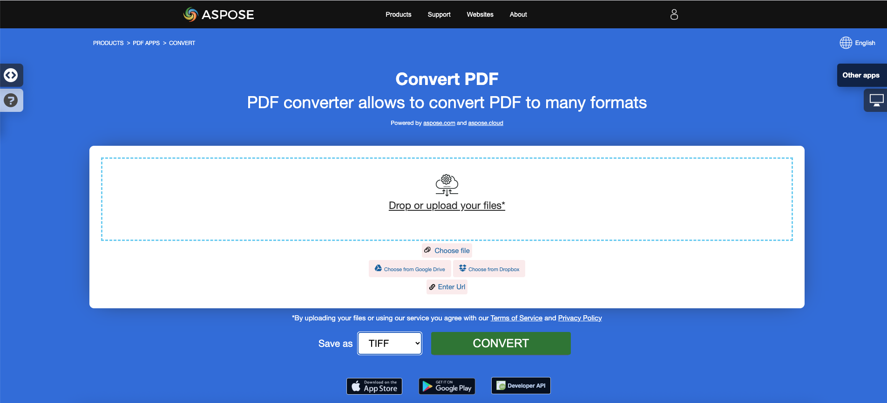

<script type="application/ld+json">
{
    "@context": "https://schema.org",
    "@type": "TechArticle",
    "headline": "Convert PDF to Different Image Formats in C#",
    "alternativeHeadline": "Convert PDF Files to Multiple Image Formats in C#",
    "abstract": "La fonctionnalité dans Aspose.PDF for .NET permet aux utilisateurs de convertir sans effort des fichiers PDF en plusieurs formats d'image tels que TIFF, BMP, EMF, JPEG, PNG, GIF et SVG. Cette fonctionnalité simplifie la gestion des documents en permettant la conversion avec seulement quelques lignes de code C#, ce qui en fait un outil essentiel pour les développeurs cherchant à améliorer leurs applications avec des capacités de traitement PDF polyvalentes.",
    "author": {
        "@type": "Person",
        "name": "Anastasiia Holub",
        "givenName": "Anastasiia",
        "familyName": "Holub",
        "url": "https://www.linkedin.com/in/anastasiia-holub-750430225/"
    },
    "genre": "pdf document generation",
    "wordcount": "2012",
    "proficiencyLevel": "Beginner",
    "publisher": {
        "@type": "Organization",
        "name": "Aspose.PDF for .NET",
        "url": "https://products.aspose.com/pdf",
        "logo": "https://www.aspose.cloud/templates/aspose/img/products/pdf/aspose_pdf-for-net.svg",
        "alternateName": "Aspose",
        "sameAs": [
            "https://facebook.com/aspose.pdf/",
            "https://twitter.com/asposepdf",
            "https://www.youtube.com/channel/UCmV9sEg_QWYPi6BJJs7ELOg/featured",
            "https://www.linkedin.com/company/aspose",
            "https://stackoverflow.com/questions/tagged/aspose",
            "https://aspose.quora.com/",
            "https://aspose.github.io/"
        ],
        "contactPoint": [
            {
                "@type": "ContactPoint",
                "telephone": "+1 903 306 1676",
                "contactType": "sales",
                "areaServed": "US",
                "availableLanguage": "en"
            },
            {
                "@type": "ContactPoint",
                "telephone": "+44 141 628 8900",
                "contactType": "sales",
                "areaServed": "GB",
                "availableLanguage": "en"
            },
            {
                "@type": "ContactPoint",
                "telephone": "+61 2 8006 6987",
                "contactType": "sales",
                "areaServed": "AU",
                "availableLanguage": "en"
            }
        ]
    },
    "url": "/net/convert-pdf-to-images-format/",
    "mainEntityOfPage": {
        "@type": "WebPage",
        "@id": "/net/convert-pdf-to-images-format/"
    },
    "dateModified": "2024-11-25",
    "description": "Aspose.PDF peut effectuer non seulement des tâches simples et faciles, mais aussi faire face à des objectifs plus complexes. Consultez la section suivante pour les utilisateurs avancés et les développeurs."
}
</script>

## Aperçu

Cet article explique comment convertir un PDF en différents formats d'image en utilisant C#. Il couvre les sujets suivants.

_Format d'image_: **TIFF**
- [C# PDF en TIFF](#csharp-pdf-to-tiff)
- [C# Convertir PDF en TIFF](#csharp-pdf-to-tiff)
- [C# Convertir des pages uniques ou particulières de PDF en TIFF](#csharp-pdf-to-tiff-pages)

_Format d'image_: **BMP**
- [C# PDF en BMP](#csharp-pdf-to-bmp)
- [C# Convertir PDF en BMP](#csharp-pdf-to-bmp)
- [C# Convertisseur PDF en BMP](#csharp-pdf-to-bmp)

_Format d'image_: **EMF**
- [C# PDF en EMF](#csharp-pdf-to-emf)
- [C# Convertir PDF en EMF](#csharp-pdf-to-emf)
- [C# Convertisseur PDF en EMF](#csharp-pdf-to-emf)

_Format d'image_: **JPG**
- [C# PDF en JPG](#csharp-pdf-to-jpg)
- [C# Convertir PDF en JPG](#csharp-pdf-to-jpg)
- [C# Convertisseur PDF en JPG](#csharp-pdf-to-jpg)

_Format d'image_: **PNG**
- [C# PDF en PNG](#csharp-pdf-to-png)
- [C# Convertir PDF en PNG](#csharp-pdf-to-png)
- [C# Convertisseur PDF en PNG](#csharp-pdf-to-png)

_Format d'image_: **GIF**
- [C# PDF en GIF](#csharp-pdf-to-gif)
- [C# Convertir PDF en GIF](#csharp-pdf-to-gif)
- [C# Convertisseur PDF en GIF](#csharp-pdf-to-gif)

_Format d'image_: **SVG**
- [C# PDF en SVG](#csharp-pdf-to-svg)
- [C# Convertir PDF en SVG](#csharp-pdf-to-svg)
- [C# Convertisseur PDF en SVG](#csharp-pdf-to-svg)

## C# Convertir PDF en image

Le code suivant fonctionne également avec la bibliothèque [Aspose.PDF.Drawing](/pdf/fr/net/drawing/).

**Aspose.PDF for .NET** utilise plusieurs approches pour convertir un PDF en image. En général, nous utilisons deux approches : la conversion utilisant l'approche Device et la conversion utilisant SaveOption. Cette section vous montrera comment convertir des documents PDF en formats d'image tels que BMP, JPEG, GIF, PNG, EMF, TIFF et SVG en utilisant l'une de ces approches.

Il existe plusieurs classes dans la bibliothèque qui vous permettent d'utiliser un appareil virtuel pour transformer des images. DocumentDevice est orienté vers la conversion de l'ensemble du document, mais ImageDevice - pour une page particulière.

## Convertir un PDF en utilisant la classe DocumentDevice

**Aspose.PDF for .NET** permet de convertir des pages PDF en images TIFF.

La classe TiffDevice (basée sur DocumentDevice) vous permet de convertir des pages PDF en images TIFF. Cette classe fournit une méthode nommée `Process` qui vous permet de convertir toutes les pages d'un fichier PDF en une seule image TIFF.

{}
**Essayez de convertir un PDF en TIFF en ligne**

Aspose.PDF for .NET vous présente une application en ligne gratuite ["PDF en TIFF"](https://products.aspose.app/pdf/conversion/pdf-to-tiff), où vous pouvez essayer d'explorer la fonctionnalité et la qualité de son fonctionnement.

[](https://products.aspose.app/pdf/conversion/pdf-to-tiff)
{}

### Convertir les pages PDF en une seule image TIFF

Aspose.PDF for .NET explique comment convertir toutes les pages d'un fichier PDF en une seule image TIFF :

<a name="csharp-pdf-to-tiff"><strong>Étapes : Convertir PDF en TIFF en C#</strong></a>

1. Créez un objet de la classe **Document**.
2. Créez des objets **TiffSettings** et **TiffDevice**.
3. Appelez la méthode **TiffDevice.Process()** pour convertir le document PDF en TIFF.
4. Pour définir les propriétés du fichier de sortie, utilisez la classe **TiffSettings**.

Le code suivant montre comment convertir toutes les pages PDF en une seule image TIFF.

```csharp
// For complete examples and data files, visit https://github.com/aspose-pdf/Aspose.PDF-for-.NET
private static void ConvertPDFtoTIFF()
{
    // The path to the documents directory
    var dataDir = RunExamples.GetDataDir_AsposePdf_WorkingDocuments();

    // Open PDF document
    using (var document = new Aspose.Pdf.Document(dataDir + "PDFtoTIFF.pdf"))
    {
        // Create Resolution object
        var resolution = new Aspose.Pdf.Devices.Resolution(300);

        // Create TiffSettings object
        var tiffSettings = new Aspose.Pdf.Devices.TiffSettings
        {
            Compression = Aspose.Pdf.Devices.CompressionType.None,
            Depth = Aspose.Pdf.Devices.ColorDepth.Default,
            Shape = Aspose.Pdf.Devices.ShapeType.Landscape,
            SkipBlankPages = false
        };

        // Create TIFF device
        var tiffDevice = new Aspose.Pdf.Devices.TiffDevice(resolution, tiffSettings);

        // Convert a particular page and save the image to stream
        tiffDevice.Process(document, dataDir + "PDFtoTIFF_out.tif");
    }
}
```

### Convertir une page en image TIFF

Aspose.PDF for .NET permet de convertir une page particulière d'un fichier PDF en une image TIFF, utilisez une version surchargée de la méthode Process(..) qui prend un numéro de page comme argument pour la conversion. Le code suivant montre comment convertir la première page d'un PDF en format TIFF.

<a name="csharp-pdf-to-tiff-pages"><strong>Étapes : Convertir des pages uniques ou particulières de PDF en TIFF en C#</strong></a>

1. Créez un objet de la classe **Document**.
2. Créez des objets **TiffSettings** et **TiffDevice**.
3. Appelez la méthode surchargée **TiffDevice.Process()** avec les paramètres **fromPage** et **toPage** pour convertir les pages du document PDF en TIFF.

```csharp
// For complete examples and data files, visit https://github.com/aspose-pdf/Aspose.PDF-for-.NET
private static void ConvertPDFtoTiffSinglePage()
{
    // The path to the documents directory
    var dataDir = RunExamples.GetDataDir_AsposePdf_WorkingDocuments();

    // Open PDF document
    using (var document = new Aspose.Pdf.Document(dataDir + "PDFtoTiffSinglePage.pdf"))
    {
        // Create Resolution object
        var resolution = new Aspose.Pdf.Devices.Resolution(300);

        // Create TiffSettings object
        var tiffSettings = new Aspose.Pdf.Devices.TiffSettings
        {
            Compression = Aspose.Pdf.Devices.CompressionType.None,
            Depth = Aspose.Pdf.Devices.ColorDepth.Default,
            Shape = Aspose.Pdf.Devices.ShapeType.Landscape,
        };

        // Create TIFF device
        var tiffDevice = new Aspose.Pdf.Devices.TiffDevice(resolution, tiffSettings);

        // Convert a particular page and save the image to stream
        tiffDevice.Process(document, 1, 1, dataDir + "PDFtoTiffSinglePage_out.tif");
    }
}
```

### Utiliser l'algorithme de Bradley lors de la conversion

Aspose.PDF for .NET prend en charge la fonctionnalité de conversion de PDF en TIF en utilisant la compression LZW et ensuite avec l'utilisation d'AForge, la binarisation peut être appliquée. Cependant, l'un des clients a demandé que pour certaines images, ils aient besoin d'obtenir le seuil en utilisant Otsu, donc ils souhaiteraient également utiliser Bradley.

```csharp
// For complete examples and data files, visit https://github.com/aspose-pdf/Aspose.PDF-for-.NET
private static void ConvertPDFtoTiffBradleyBinarization()
{
    // The path to the documents directory
    var dataDir = RunExamples.GetDataDir_AsposePdf_WorkingDocuments();

    // Open PDF document
    using (var document = new Aspose.Pdf.Document(dataDir + "PDFtoTiffBradleyBinarization.pdf"))
    {
        string outputImageFile = dataDir + "PDFtoTiffBradleyBinarization_out.tif";
        string outputBinImageFile = dataDir + "PDFtoTiffBradleyBinarization-bin_out.tif";

        // Create Resolution object
        var resolution = new Aspose.Pdf.Devices.Resolution(300);

        // Create TiffSettings object
        var tiffSettings = new Aspose.Pdf.Devices.TiffSettings
        {
            Compression = Aspose.Pdf.Devices.CompressionType.LZW,
            Depth = Aspose.Pdf.Devices.ColorDepth.Format1bpp
        };

        // Create TIFF device
        var tiffDevice = new Aspose.Pdf.Devices.TiffDevice(resolution, tiffSettings);

        // Convert a particular page and save the image to stream
        tiffDevice.Process(document, outputImageFile);

        // Binarize the image using Bradley method
        using (var inStream = new FileStream(outputImageFile, FileMode.Open))
        {
            using (var outStream = new FileStream(outputBinImageFile, FileMode.Create))
            {
                tiffDevice.BinarizeBradley(inStream, outStream, 0.1);
            }
        }
    }
}
```

## Convertir un PDF en utilisant la classe ImageDevice

`ImageDevice` est l'ancêtre de `BmpDevice`, `JpegDevice`, `GifDevice`, `PngDevice` et `EmfDevice`.

- La classe [BmpDevice](https://reference.aspose.com/pdf/net/aspose.pdf.devices/bmpdevice) vous permet de convertir des pages PDF en images <abbr title="Bitmap Image File">BMP</abbr>.
- La classe [EmfDevice](https://reference.aspose.com/pdf/net/aspose.pdf.devices/emfdevice) vous permet de convertir des pages PDF en images <abbr title="Enhanced Meta File">EMF</abbr>.
- La classe [JpegDevice](https://reference.aspose.com/pdf/net/aspose.pdf.devices/jpegdevice) vous permet de convertir des pages PDF en images JPEG.
- La classe [PngDevice](https://reference.aspose.com/pdf/net/aspose.pdf.devices/pngdevice) vous permet de convertir des pages PDF en images <abbr title="Portable Network Graphics">PNG</abbr>.
- La classe [GifDevice](https://reference.aspose.com/pdf/net/aspose.pdf.devices/gifdevice) vous permet de convertir des pages PDF en images <abbr title="Graphics Interchange Format">GIF</abbr>.

Voyons comment convertir une page PDF en image.

La classe `BmpDevice` fournit une méthode nommée [Process](https://reference.aspose.com/pdf/net/aspose.pdf.devices/bmpdevice/methods/process) qui vous permet de convertir une page particulière du fichier PDF en format d'image BMP. Les autres classes ont la même méthode. Donc, si nous devons convertir une page PDF en image, nous instancions simplement la classe requise.

<a name="csharp-pdf-to-bmp"></a>
<a name="csharp-pdf-to-emf"></a>
<a name="csharp-pdf-to-jpg"></a>
<a name="csharp-pdf-to-png"></a>
<a name="csharp-pdf-to-gif"></a>
    
Les étapes suivantes et le code en C# montrent cette possibilité
 
 - [Convertir PDF en BMP en C#](#csharp-pdf-to-image)
 - [Convertir PDF en EMF en C#](#csharp-pdf-to-image)
 - [Convertir PDF en JPG en C#](#csharp-pdf-to-image)
 - [Convertir PDF en PNG en C#](#csharp-pdf-to-image)
 - [Convertir PDF en GIF en C#](#csharp-pdf-to-image)

<a name="csharp-pdf-to-image"><strong>Étapes : PDF en image (BMP, EMF, JPG, PNG, GIF) en C#</strong></a>

1. Chargez le fichier PDF en utilisant la classe **Document**.
2. Créez une instance d'une sous-classe de **ImageDevice**, c'est-à-dire :
   * **BmpDevice** (pour convertir PDF en BMP).
   * **EmfDevice** (pour convertir PDF en Emf).
   * **JpegDevice** (pour convertir PDF en JPG).
   * **PngDevice** (pour convertir PDF en PNG).
   * **GifDevice** (pour convertir PDF en GIF).
3. Appelez la méthode **ImageDevice.Process()** pour effectuer la conversion de PDF en image.

```csharp
// For complete examples and data files, visit https://github.com/aspose-pdf/Aspose.PDF-for-.NET
private static void ConvertPDFusingImageDevice()
{
    // The path to the documents directory
    var dataDir = RunExamples.GetDataDir_AsposePdf_WorkingDocuments();

    // Create Resolution object            
    var resolution = new Aspose.Pdf.Devices.Resolution(300);
    var bmpDevice = new Aspose.Pdf.Devices.BmpDevice(resolution);
    var jpegDevice = new Aspose.Pdf.Devices.JpegDevice(resolution);
    var gifDevice = new Aspose.Pdf.Devices.GifDevice(resolution);
    var pngDevice = new Aspose.Pdf.Devices.PngDevice(resolution);
    var emfDevice = new Aspose.Pdf.Devices.EmfDevice(resolution);

    // Open PDF document
    using (var document = new Aspose.Pdf.Document(dataDir + "ConvertAllPagesToBmp.pdf"))
    {
        ConvertPDFtoImage(bmpDevice, "bmp", document, dataDir);
        ConvertPDFtoImage(jpegDevice, "jpeg", document, dataDir);
        ConvertPDFtoImage(gifDevice, "gif", document, dataDir);
        ConvertPDFtoImage(pngDevice, "png", document, dataDir);
        ConvertPDFtoImage(emfDevice, "emf", document, dataDir);
    }
}

private static void ConvertPDFtoImage(ImageDevice imageDevice,
        string ext, Document document, var dataDir)
{
    for (int pageCount = 1; pageCount <= document.Pages.Count; pageCount++)
    {
        using (FileStream imageStream =
            new FileStream($"{dataDir}image{pageCount}_out.{ext}",
            FileMode.Create))
        {
            // Convert a particular page and save the image to stream
            imageDevice.Process(document.Pages[pageCount], imageStream);
        }
    }
}
```

{}
**Essayez de convertir un PDF en PNG en ligne**

En tant qu'exemple de la façon dont nos applications gratuites fonctionnent, veuillez vérifier la fonctionnalité suivante.

Aspose.PDF for .NET vous présente une application en ligne gratuite ["PDF en PNG"](https://products.aspose.app/pdf/conversion/pdf-to-png), où vous pouvez essayer d'explorer la fonctionnalité et la qualité de son fonctionnement.

[](https://products.aspose.app/pdf/conversion/pdf-to-png)
{}

## Convertir un PDF en utilisant la classe SaveOptions

Cette partie de l'article vous montre comment convertir un PDF en <abbr title="Scalable Vector Graphics">SVG</abbr> en utilisant C# et la classe SaveOptions.

{}
**Essayez de convertir un PDF en SVG en ligne**

Aspose.PDF for .NET vous présente une application en ligne gratuite ["PDF en SVG"](https://products.aspose.app/pdf/conversion/pdf-to-svg), où vous pouvez essayer d'explorer la fonctionnalité et la qualité de son fonctionnement.

[](https://products.aspose.app/pdf/conversion/pdf-to-svg)
{}

**Scalable Vector Graphics (SVG)** est une famille de spécifications d'un format de fichier basé sur XML pour des graphiques vectoriels bidimensionnels, à la fois statiques et dynamiques (interactifs ou animés). La spécification SVG est une norme ouverte qui est en développement par le World Wide Web Consortium (W3C) depuis 1999.

Les images SVG et leurs comportements sont définis dans des fichiers texte XML. Cela signifie qu'ils peuvent être recherchés, indexés, scriptés et, si nécessaire, compressés. En tant que fichiers XML, les images SVG peuvent être créées et modifiées avec n'importe quel éditeur de texte, mais il est souvent plus pratique de les créer avec des programmes de dessin tels qu'Inkscape.

Aspose.PDF for .NET prend en charge la fonctionnalité de conversion d'images SVG en format PDF et offre également la capacité de convertir des fichiers PDF en format SVG. Pour accomplir cette exigence, la classe [`SvgSaveOptions`](https://reference.aspose.com/pdf/net/aspose.pdf/svgsaveoptions/methods/index) a été introduite dans l'espace de noms Aspose.PDF. Instanciez un objet de SvgSaveOptions et passez-le comme deuxième argument à la méthode [`Document.Save(..)`](https://reference.aspose.com/pdf/net/aspose.pdf/document/methods/save/index).

Le code suivant montre les étapes pour convertir un fichier PDF en format SVG avec .NET.

<a name="csharp-pdf-to-svg"><strong>Étapes : Convertir un PDF en SVG en C#</strong></a>

1. Créez un objet de la classe **Document**.
2. Créez un objet **SvgSaveOptions** avec les paramètres nécessaires.
3. Appelez la méthode **Document.Save()** et passez-lui l'objet **SvgSaveOptions** pour convertir le document PDF en SVG.

```csharp
// For complete examples and data files, visit https://github.com/aspose-pdf/Aspose.PDF-for-.NET
private static void ConvertPDFtoSVG()
{
    // The path to the documents directory
    var dataDir = RunExamples.GetDataDir_AsposePdf_WorkingDocuments();

    // Open PDF document
    using (var document = new Aspose.Pdf.Document(dataDir + "PDFtoSVG.pdf"))
    {
        // Instantiate an object of SvgSaveOptions
        var saveOptions = new Aspose.Pdf.SvgSaveOptions
        {
            // Do not compress SVG image to Zip archive
            CompressOutputToZipArchive = false,
            TreatTargetFileNameAsDirectory = true                
        };

        // Save SVG file
        document.Save(dataDir + "PDFToSVG_out.svg", saveOptions);
    }
}
```