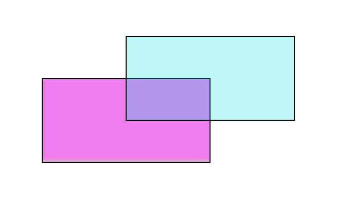

## Ajouter un objet Rectangle

Aspose.PDF pour Python via .NET prend en charge la fonctionnalité d'ajout d'objets graphiques (par exemple graphe, ligne, rectangle, etc.) aux documents PDF. Vous bénéficiez également de la possibilité d'ajouter l'objet [Rectangle](https://reference.aspose.com/pdf/python-net/aspose.pdf.drawing/rectangle/) où vous avez également la fonctionnalité de remplir l'objet rectangle.

Tout d'abord, examinons la possibilité de créer un objet Rectangle.

Suivez les étapes ci-dessous :

1. Créez un nouveau [Document](https://reference.aspose.com/pdf/python-net/aspose.pdf/document/) PDF.
1. Ajoutez une [Page](https://reference.aspose.com/pdf/python-net/aspose.pdf/page/) à la collection de pages du fichier PDF.
1. Ajoutez un [Fragment de texte](https://reference.aspose.com/pdf/python-net/aspose.pdf/texfragment/) à la collection de paragraphes de l'instance de page.
1. Créez une instance de [Graph](https://reference.aspose.com/pdf/python-net/aspose.pdf.drawing/graph/).
1. Définissez la bordure pour l'[objet de dessin](https://reference.aspose.com/pdf/python-net/aspose.pdf.drawing/).
1. Ajoutez l'objet [Rectangle](https://reference.aspose.com/pdf/python-net/aspose.pdf.drawing/rectangle/) à la collection de formes de l'objet Graph.
1. Ajoutez l'objet graphique à la collection de paragraphes de l'instance de page.
1. Ajoutez un [Fragment de texte](https://reference.aspose.com/pdf/python-net/aspose.pdf/texfragment/) à la collection de paragraphes de l'instance de page.
1. Et enregistrez votre fichier PDF

```python

    import aspose.pdf as ap
    import aspose.pdf.drawing as drawing
    import datetime

    # Create Document instance
    document = ap.Document()

    # Add page to pages collection of PDF file
    page = document.pages.add()
    text_fragment = ap.text.TextFragment("Rectangle")

    # Add Text fragment to paragraphs collection of page instance
    page.paragraphs.add(text_fragment)

    # Create Graph instance
    graph = drawing.Graph(400, 300)

    # Add graph object to paragraphs collection of page instance
    page.paragraphs.add(graph)

    # Set border for Drawing object
    border_info = ap.BorderInfo(ap.BorderSide.ALL, ap.Color.red)
    graph.border = border_info

    # Create Rectangle instance
    rect = drawing.Rectangle(20, 20, 350, 250)

    # Add rectangle object to shape collection of Graph object
    graph.shapes.append(rect)

    # Add Text fragment to paragraphs collection of page instance
    page.paragraphs.add(text_fragment)

    # Save PDF file
    document.save(path_outfile)
```


## Créer un objet Rectangle rempli

Aspose.PDF pour Python via .NET offre également la fonctionnalité de remplir l'objet rectangle avec une couleur spécifique.

Le fragment de code suivant montre comment ajouter un objet [Rectangle](https://reference.aspose.com/pdf/python-net/aspose.pdf.drawing/rectangle/) rempli de couleur.

```python

    import aspose.pdf as ap
    import aspose.pdf.drawing as drawing
    import datetime

    # Create PDF document
    document = ap.Document()

    # Add a page
    page = document.pages.add()

    # Create Graph instance
    graph = drawing.Graph(100, 400)

    # Add graph object to the paragraphs collection of the page instance
    page.paragraphs.add(graph)

    # Create Rectangle instance with specified dimensions
    rect = drawing.Rectangle(100, 100, 200, 120)

    # Specify fill color for the Rectangle object
    rect.graph_info.fill_color = ap.Color.red

    # Add rectangle object to the shapes collection of the Graph object
    graph.shapes.add(rect)

    # Save PDF document
    document.save(path_outfile)
```

Regardez le résultat du rectangle rempli d'une couleur unie :


## Ajouter un dessin avec remplissage en dégradé

Aspose.PDF pour Python via .NET prend en charge la fonctionnalité d'ajout d'objets graphiques aux documents PDF et il est parfois nécessaire de remplir les objets graphiques avec une couleur dégradée.

Le fragment de code suivant montre comment ajouter un objet [Rectangle](https://reference.aspose.com/pdf/python-net/aspose.pdf.drawing/rectangle/) rempli d'une couleur dégradée.

```python

    import aspose.pdf as ap
    import aspose.pdf.drawing as drawing
    import datetime

    # Create Document instance
    document = ap.Document()

    # Add page to pages collection of PDF file
    page = document.pages.add()

    # Create Graph instance
    graph = drawing.Graph(400, 400)

    # Add graph object to paragraphs collection of page instance
    page.paragraphs.add(graph)

    # Create Rectangle instance
    rect = drawing.Rectangle(0, 0, 300, 300)

    # Specify fill color for Graph object
    gradient_color = ap.Color()
    gradient_settings = drawing.GradientAxialShading(ap.Color.red, ap.Color.blue)
    gradient_settings.start = ap.Point(0, 0)
    gradient_settings.end = ap.Point(350, 350)
    gradient_color.pattern_color_space = gradient_settings
    rect.graph_info.fill_color = gradient_color

    # Add rectangle object to shape collection of Graph object
    graph.shapes.append(rect)

    # Save PDF file
    document.save(output_file)
```


## Créer un rectangle avec canal de couleur Alpha

Aspose.PDF pour Python .NET permet de remplir l'objet rectangle avec une certaine couleur. Un objet rectangle peut également disposer d'un canal de couleur Alpha pour donner une apparence transparente. Le fragment de code suivant montre comment ajouter un objet [Rectangle](https://reference.aspose.com/pdf/python-net/aspose.pdf.drawing/rectangle/) avec un canal de couleur Alpha.

```python

    import aspose.pdf as ap
    import aspose.pdf.drawing as drawing
    import datetime

    # Create Document instance
    document = ap.Document()

    # Add page to pages collection of PDF file
    page = document.pages.add()

    # Create Graph instance
    graph = drawing.Graph(100, 400)

    # Add graph object to paragraphs collection of page instance
    page.paragraphs.add(graph)

    # Create Rectangle instance
    rect = drawing.Rectangle(100, 100, 200, 120)

    # Specify fill color for Graph object
    rect.graph_info.fill_color = ap.Color.from_argb(128, 244, 180, 0)

    # Add rectangle object to shape collection of Graph object
    graph.shapes.append(rect)

    # Create second rectangle object
    rect1 = drawing.Rectangle(200, 150, 200, 100)
    rect1.graph_info.fill_color = ap.Color.from_argb(160, 120, 0, 120)
    graph.shapes.append(rect1)

    # Save PDF file
    document.save(output_file)
```



## Contrôler l'ordre Z des formes

Aspose.PDF pour .NET prend en charge la fonctionnalité d'ajout d'objets graphiques (par exemple graphe, ligne, rectangle, etc.) aux documents PDF. Lors de l'ajout de plusieurs instances du même objet dans un fichier PDF, nous pouvons contrôler leur rendu en spécifiant l'ordre Z. L'ordre Z est également utilisé lorsque nous devons superposer les objets les uns sur les autres.

Le fragment de code suivant montre les étapes pour rendre les objets [Rectangle](https://reference.aspose.com/pdf/python-net/aspose.pdf.drawing/rectangle/) les uns sur les autres.

```python

    import aspose.pdf as ap
    import aspose.pdf.drawing as drawing
    import datetime

    # Create Document instance
    document = ap.Document()

    # Add page to pages collection of PDF file
    page = document.pages.add()

    # Set size of PDF page
    page.set_page_size(375, 300)

    # Set left margin for page object as 0
    page.page_info.margin.left = 0

    # Set top margin of page object as 0
    page.page_info.margin.top = 0

    # Create a new rectangle with Color as Red, Z-Order as 0 and certain dimensions
    add_rectangle(page, 50, 40, 60, 40, ap.Color.red, 2)

    # Create a new rectangle with Color as Blue, Z-Order as 0 and certain dimensions
    add_rectangle_to_page(page, 20, 20, 30, 30, ap.Color.blue, 1)

    # Create a new rectangle with Color as Green, Z-Order as 0 and certain dimensions
    add_rectangle_to_page(page, 40, 40, 60, 30, ap.Color.green, 0)

    # Save resultant PDF file
    document.save(output_file)
```


