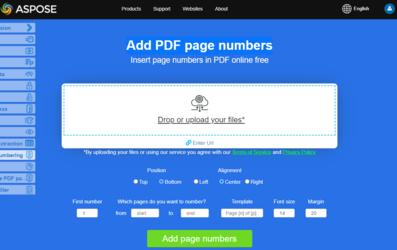

Tous les documents doivent comporter des numéros de page. Le numéro de page facilite la localisation des différentes parties du document par le lecteur.

**Aspose.PDF for Python via .NET** vous permet d'ajouter des numéros de page avec [PageNumberStamp](https://reference.aspose.com/pdf/python-net/aspose.pdf/pagenumberstamp/).

## Ajout d'un tampon de numéro de page à un PDF

Ajoutez des tampons de numéros de page dynamiques à un PDF [`Document`](https://reference.aspose.com/pdf/python-net/aspose.pdf/document/) en utilisant Aspose.PDF for Python. L'objet [`PageNumberStamp`](https://reference.aspose.com/pdf/python-net/aspose.pdf/pagenumberstamp/) vous permet d'afficher automatiquement le numéro de page actuel ainsi que le nombre total de pages. L'exemple montre comment créer un tampon de numéro de page, personnaliser son apparence (police, taille, style, couleur, alignement et marges) à l'aide de [`TextState`](https://reference.aspose.com/pdf/python-net/aspose.pdf/textstate/), et l'appliquer à une [`Page`](https://reference.aspose.com/pdf/python-net/aspose.pdf/page/) spécifique du PDF via la méthode [`Page.add_stamp()`](https://reference.aspose.com/pdf/python-net/aspose.pdf/page/#methods). Les valeurs d'alignement proviennent de l'énumération [`HorizontalAlignment`](https://reference.aspose.com/pdf/python-net/aspose.pdf/horizontalalignment/), et la couleur/la police/le style sont disponibles via [`Color`](https://reference.aspose.com/pdf/python-net/aspose.pdf/color/) et [`FontStyles`](https://reference.aspose.com/pdf/python-net/aspose.pdf.text/fontstyles/) (polices découvertes via [`FontRepository.find_font()`](https://reference.aspose.com/pdf/python-net/aspose.pdf.text/fontrepository/#methods)). Cette fonctionnalité est utile pour générer des documents professionnels numérotés et automatiser la pagination dans les flux de travail PDF.

1. Ouvrez le document PDF.
1. Créez un tampon de numéro de page.
1. Définissez les propriétés du tampon.
1. Personnalisez le style du texte.
1. Appliquez le tampon à une page.
1. Enregistrez le PDF modifié.

```python

import os
import aspose.pdf as ap

# Global configuration
DATA_DIR = "your path here"

def add_page_num_stamp(input_file_name, output_file_name):
    # Open document
    document = ap.Document(input_file_name)

    # Create page number stamp
    page_number_stamp = ap.PageNumberStamp()
    # Whether the stamp is background
    page_number_stamp.background = False
    page_number_stamp.format = "Page # of " + str(len(document.pages))
    page_number_stamp.bottom_margin = 10
    page_number_stamp.horizontal_alignment = ap.HorizontalAlignment.CENTER
    page_number_stamp.starting_number = 1
    # Set text properties
    page_number_stamp.text_state.font = ap.text.FontRepository.find_font("Arial")
    page_number_stamp.text_state.font_size = 14.0
    page_number_stamp.text_state.font_style = ap.text.FontStyles.BOLD
    page_number_stamp.text_state.font_style = ap.text.FontStyles.ITALIC
    page_number_stamp.text_state.foreground_color = ap.Color.blue_violet

    # Add stamp to particular page
    document.pages[1].add_stamp(page_number_stamp)

    # Save output document
    document.save(output_file_name)
```

## Ajout de numéros de page en chiffres romains à un PDF

Ajoutez des numéros de page au format chiffre romain à toutes les pages d'un document PDF. Les numéros de page sont ajoutés sous forme de tampons à l'aide de [`PageNumberStamp`](https://reference.aspose.com/pdf/python-net/aspose.pdf/pagenumberstamp/), avec une police, une taille, un style, une couleur et un alignement personnalisables. Utilisez l'énumération [`NumberingStyle`](https://reference.aspose.com/pdf/python-net/aspose.pdf/numberingstyle/) pour choisir les chiffres romains ou d'autres schémas de numérotation. La numérotation peut également commencer à partir de toute valeur spécifiée.

1. Ouvrez le document PDF.
1. Créez un tampon de numéro de page.
1. Configurez les propriétés du tampon.
1. Définissez l'apparence du texte.
1. Appliquez le tampon à toutes les pages.
1. Enregistrez le PDF modifié.

```python

import os
import aspose.pdf as ap

# Global configuration
DATA_DIR = "your path here"

def add_page_num_stamp_roman(input_file_name, output_file_name):
    # Open document
    document = ap.Document(input_file_name)

    # Create page number stamp
    page_number_stamp = ap.PageNumberStamp()
    # Whether the stamp is background
    page_number_stamp.background = False
    page_number_stamp.bottom_margin = 10
    page_number_stamp.horizontal_alignment = ap.HorizontalAlignment.CENTER
    page_number_stamp.starting_number = 42
    page_number_stamp.numbering_style = ap.NumberingStyle.NUMERALS_ROMAN_UPPERCASE

    # Set text properties
    page_number_stamp.text_state.font = ap.text.FontRepository.find_font("Arial")
    page_number_stamp.text_state.font_size = 14.0
    page_number_stamp.text_state.font_style = ap.text.FontStyles.BOLD
    page_number_stamp.text_state.foreground_color = ap.Color.blue_violet

    # Add stamp to particular page
    for page in document.pages:
        page.add_stamp(page_number_stamp)

    # Save output document
    document.save(output_file_name)
```

## Exemple en direct

[Ajouter des numéros de page PDF](https://products.aspose.app/pdf/page-number) est une application web gratuite en ligne qui vous permet d'examiner le fonctionnement de la fonctionnalité d'ajout de numéros de page.

[](https://products.aspose.app/pdf/page-number)


