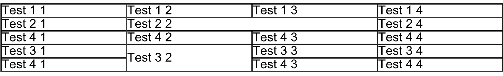

L'ajout de tableaux à des documents PDF existants est une nécessité courante pour améliorer la présentation des données, structurer l'information ou générer des rapports. **Aspose.PDF for Python via .NET** offre une solution complète pour cette tâche, permettant aux développeurs d'insérer des tableaux dans des PDF existants sans effort.

Ce guide propose une approche pas à pas pour ajouter des tableaux à des documents PDF existants en utilisant Aspose.PDF for Python via .NET. Il couvre l'initialisation d'un tableau, la définition des largeurs de colonnes, la création des bordures, le remplissage des lignes et des cellules, ainsi que l'enregistrement du document modifié. De plus, le guide explore des fonctionnalités avancées, telles que la gestion des bordures des cellules, l'application de marges et de remplissage, et l'utilisation des paramètres AutoFit pour ajuster dynamiquement les dimensions du tableau.

Que vous cherchiez à améliorer l'aspect visuel de vos PDF ou à organiser les données de façon plus efficace, ce guide constitue une ressource précieuse pour exploiter les puissantes capacités de manipulation de tableaux d'Aspose.PDF for Python.

## Création de tableaux de base

## Création de tableau

Cet exemple montre comment créer un tableau dans un document PDF avec des bordures et plusieurs lignes.

1. Créez un nouveau document PDF.
1. Ajoute une page blanche au document.
1. Initialisez le tableau.
1. Définissez la bordure globale du tableau.
1. Définissez la bordure pour chaque cellule.
1. Ajoutez des lignes et des cellules.
1. Insérez le tableau dans la page.
1. Enregistrez le PDF à l'emplacement spécifié.

```python

    import aspose.pdf as ap
    from os import path

    path_outfile = path.join(self.data_dir, outfile)

    # Load source PDF document
    document = ap.Document()
    page = document.pages.add()
    # Initializes a new instance of the Table
    table = ap.Table()
    # Set the table border color as LightGray
    table.border = ap.BorderInfo(ap.BorderSide.ALL, 5, ap.Color.light_gray)
    # Set the border for table cells
    table.default_cell_border = ap.BorderInfo(
        ap.BorderSide.ALL, 5, ap.Color.light_gray
    )
    # Create a loop to add 10 rows
    for row_count in range(0, 10):
        # Add row to table
        row = table.rows.add()
        # Add table cells
        row.cells.add("Column (" + str(row_count) + ", 1)")
        row.cells.add("Column (" + str(row_count) + ", 2)")
        row.cells.add("Column (" + str(row_count) + ", 3)")
    # Add table object to first page of input document
    page.paragraphs.add(table)

    # Save updated document containing table object
    document.save(path_outfile)
```

### Ajout d'images aux cellules du tableau

Cet extrait de code montre comment insérer des images dans les cellules d'un tableau dans un document PDF.

1. Créez un nouveau document PDF.
1. Initialisez le tableau.
1. Définissez les largeurs des colonnes en points.
1. Un fragment de texte est ajouté à la première cellule.
1. Une instance 'ap.Image()' est ajoutée à la deuxième cellule.
1. Définissez le chemin du fichier image avec 'img.file'.
1. Les 'img.fix_width' et 'img.fix_height' contrôlent la taille de l'image à l'intérieur de la cellule.
1. Insérez le tableau dans la page PDF.
1. Enregistrez le PDF.

```python

    import aspose.pdf as ap
    from os import path

    # Instantiate Document object
    document = ap.Document()
    page = document.pages.add()
    # Instantiate a table object
    table = ap.Table()
    # Set width for table cells
    table.column_widths = "200 100"

    # Create row object and add it to table instance
    row = table.rows.add()
    # Create cell object and add it to row instance
    cell = row.cells.add()
    # Add textfragment to paragraphs collection of cell object
    cell.paragraphs.add(ap.text.TextFragment(image))
    # Create an image instance
    img = ap.Image()
    # Set image type as SVG
    # Path for source file
    img.file = path.join(self.data_dir, image)
    # Set width for image instance
    img.fix_width = 50
    # Set height for image instance
    img.fix_height = 50
    # Add another cell to row object
    cell = row.cells.add()
    # Add SVG image to paragraphs collection of recently added cell instance
    cell.paragraphs.add(img)

    # Add table to paragraphs collection of page object
    page.paragraphs.add(table)
    # Save PDF file
    document.save(path_outfile)
```

Vous pouvez ajouter des images SVG dans les cellules d'un tableau dans un document PDF :

```python

    import aspose.pdf as ap
    from os import path

    path_outfile = path.join(self.data_dir, outfile)

    # Instantiate Document object
    document = ap.Document()
    page = document.pages.add()
    # Instantiate a table object
    table = ap.Table()
    # Set width for table cells
    table.column_widths = "200 100"
    for image in images:
        # Create row object and add it to table instance
        row = table.rows.add()
        # Create cell object and add it to row instance
        cell = row.cells.add()
        # Add textfragment to paragraphs collection of cell object
        cell.paragraphs.add(ap.text.TextFragment(image))
        # Create an image instance
        img = ap.Image()
        # Set image type as SVG
        img.file_type = ap.ImageFileType.SVG
        # Path for source file
        img.file = path.join(self.data_dir, image)
        # Set width for image instance
        img.fix_width = 50
        # Set height for image instance
        img.fix_height = 50
        # Add another cell to row object
        cell = row.cells.add()
        # Add SVG image to paragraphs collection of recently added cell instance
        cell.paragraphs.add(img)

    # Add table to paragraphs collection of page object
    page.paragraphs.add(table)
    # Save PDF file
    document.save(path_outfile)
```

### ColSpan et RowSpan dans les tableaux

Cet exemple montre comment fusionner les cellules d'un tableau verticalement et horizontalement pour créer des mises en page de tableau complexes.

1. Définissez la bordure globale du tableau.
1. Définissez les bordures par défaut des cellules.
1. Fusionnez deux cellules horizontalement en une.
1. Fusionnez la cellule verticalement sur deux lignes.
1. La ligne 5 tient compte du rowspan en sautant la colonne fusionnée.
1. Insérez le tableau dans la page.
1. Enregistrez le PDF.

```python

    import aspose.pdf as ap
    from os import path

    path_outfile = path.join(self.data_dir, outfile)

    # Load source PDF document
    document = ap.Document()
    page = document.pages.add()

    # Initializes a new instance of the Table
    table = ap.Table()
    # Set the table border color as LightGray
    table.border = ap.BorderInfo(ap.BorderSide.ALL, 0.5, ap.Color.black)
    # Set the border for table cells
    table.default_cell_border = ap.BorderInfo(
        ap.BorderSide.ALL, 0.5, ap.Color.black
    )
    # Add 1st row to table
    row1 = table.rows.add()
    for cellCount in range(1, 5):
        # Add table cells
        row1.cells.add("Test 1" + str(cellCount))

    # Add 2nd row to table
    row2 = table.rows.add()
    row2.cells.add("Test 2 1")
    cell = row2.cells.add("Test 2 2")
    cell.col_span = 2
    row2.cells.add("Test 2 4")

    # Add 3rd row to table
    row3 = table.rows.add()
    row3.cells.add("Test 3 1")
    row3.cells.add("Test 3 2")
    row3.cells.add("Test 3 3")
    row3.cells.add("Test 3 4")

    # Add 4th row to table
    row4 = table.rows.add()
    row4.cells.add("Test 4 1")
    cell = row4.cells.add("Test 4 2")
    cell.row_span = 2
    row4.cells.add("Test 4 3")
    row4.cells.add("Test 4 4")

    # Add 5th row to table
    row5 = table.rows.add()
    row5.cells.add("Test 5 1")
    row5.cells.add("Test 5 3")
    row5.cells.add("Test 5 4")

    # Add table object to first page of input document
    page.paragraphs.add(table)
    # Save updated document containing table object
    document.save(path_outfile)
```



### Application de bordures aux tableaux et aux cellules

Cet exemple montre comment définir le remplissage des cellules, les marges du tableau et contrôler le retour à la ligne du texte dans les cellules du tableau.

1. Définir la largeur des colonnes.
1. Définir les bordures du tableau et des cellules.
1. Définir le remplissage à l'intérieur des cellules pour un espacement cohérent.
1. Appliquer le remplissage à toutes les cellules par défaut.
1. Ajouter du texte et contrôler le retour à la ligne.
1. Ajouter des lignes et des cellules.
1. Enregistrer le PDF.

```python

    import aspose.pdf as ap
    from os import path

    path_outfile = path.join(self.data_dir, outfile)
    # Load source PDF document
    document = ap.Document()
    page = document.pages.add()
    # Instantiate a table object
    tab1 = ap.Table()
    # Add the table in paragraphs collection of the desired section
    page.paragraphs.add(tab1)
    # Set with column widths of the table
    tab1.column_widths = "50 50 50"
    # Set default cell border using BorderInfo object
    tab1.default_cell_border = ap.BorderInfo(ap.BorderSide.ALL, 0.1)
    # Set table border using another customized BorderInfo object
    tab1.border = ap.BorderInfo(ap.BorderSide.ALL, 1)
    # Create MarginInfo object and set its left, bottom, right and top margins
    margin = ap.MarginInfo()
    margin.top = 5
    margin.left = 5
    margin.right = 5
    margin.bottom = 5
    # Set the default cell padding to the MarginInfo object
    tab1.default_cell_padding = margin
    # Create rows in the table and then cells in the rows
    row1 = tab1.rows.add()
    row1.cells.add("col1")
    row1.cells.add("col2")
    row1.cells.add()
    text = ap.text.TextFragment("col3 with large text string")
    # Row1.Cells.Add("col3 with large text string to be placed inside cell")
    row1.cells[2].paragraphs.add(text)
    row1.cells[2].is_word_wrapped = False
    row2 = tab1.rows.add()
    row2.cells.add("item1")
    row2.cells.add("item2")
    row2.cells.add("item3")
    # Save updated document containing table object
    document.save(path_outfile)
```


## Mise en page et dimensionnement du tableau

### Ajustement automatique des colonnes et des lignes

Cet extrait de code montre comment ajuster automatiquement la largeur des colonnes du tableau pour l'adapter à la page.
Veuillez noter que dans le paramètre table.column_widths = "50 50 50" - ce sont des points. Mais vous pouvez également spécifier des centimètres (cm), des pouces ou %.

1. Définir les largeurs initiales des colonnes.
1. Ajuste automatiquement les colonnes pour s'adapter à la largeur de la page.
1. Définir les bordures des cellules et du tableau.
1. Le 'table.default_cell_padding' utilise 'MarginInfo()' pour un espacement cohérent à l'intérieur des cellules.
1. Ajouter des lignes avec 'table.rows.add()', et ajouter des cellules avec 'row.cells.add()'.
1. Enregistrer le PDF.

```python

    import aspose.pdf as ap
    from os import path

    path_outfile = path.join(self.data_dir, outfile)

    # Load source PDF document
    document = ap.Document()
    page = document.pages.add()
    # Instantiate a table object
    table = ap.Table()

    page.paragraphs.add(table)

    table.column_widths = "50 50 50"
    table.column_adjustment = ap.ColumnAdjustment.AUTO_FIT_TO_WINDOW

    table.default_cell_border = ap.BorderInfo(ap.BorderSide.ALL, 0.1)

    table.border = ap.BorderInfo(ap.BorderSide.ALL, 1)

    margin = ap.MarginInfo()
    margin.top = 5
    margin.left = 5
    margin.right = 5
    margin.bottom = 5

    table.default_cell_padding = margin

    row1 = table.rows.add()
    row1.cells.add("col1")
    row1.cells.add("col2")
    row1.cells.add("col3")
    row2 = table.rows.add()
    row2.cells.add("item1")
    row2.cells.add("item2")
    row2.cells.add("item3")

    document.save(path_outfile)
```

### Ajustement de l'espacement autour du contenu

Cet exemple montre comment créer des tableaux s'étendant sur plusieurs pages, gérer le texte long dans les cellules et appliquer le remplissage et les bordures.

1. Ajouter un nouveau tableau à la page en utilisant 'page.paragraphs.add(table)'.
1. Définir les largeurs des colonnes avec 'table.column_widths'.
1. Définir les bordures individuelles des cellules avec 'table.default_cell_border'.
1. Définir la bordure globale du tableau avec 'table.border'.
1. Définir le remplissage par défaut des cellules en utilisant 'MarginInfo()'.
1. Ajouter du texte en utilisant 'TextFragment'.
1. Ajouter une autre ligne.
1. Enregistrer le PDF.

```python

    import aspose.pdf as ap
    from os import path

    path_outfile = path.join(self.data_dir, outfile)

    # Create PDF document
    document = ap.Document()
    page = document.pages.add()

    # Instantiate a table object that will be nested inside outerTable that will break inside the same page
    table = ap.Table()
    # Add page
    page = document.pages.add()

    # Instantiate a table object
    table = ap.Table()

    # Add the table in paragraphs collection of the desired section
    page.paragraphs.add(table)

    # Set column widths of the table
    table.column_widths = "50 50 50"

    # Set default cell border using BorderInfo object
    table.default_cell_border = ap.BorderInfo(ap.BorderSide.ALL, 0.1)

    # Set table border using another customized BorderInfo object
    table.border = ap.BorderInfo(ap.BorderSide.ALL, 1)

    # Create MarginInfo object and set its left, bottom, right and top margins
    margin = ap.MarginInfo()
    margin.top = 5
    margin.left = 5
    margin.right = 5
    margin.bottom = 5

    # Set the default cell padding to the MarginInfo object
    table.default_cell_padding = margin

    # Create rows and cells
    row1 = table.rows.add()
    row1.cells.add("col1")
    row1.cells.add("col2")
    row1.cells.add()

    # Add a long text fragment into the third cell
    text = ap.text.TextFragment("col3 with large text string")
    row1.cells[2].paragraphs.add(text)
    row1.cells[2].is_word_wrapped = False

    # Add another row
    row2 = table.rows.add()
    row2.cells.add("item1")
    row2.cells.add("item2")
    row2.cells.add("item3")

    # Save PDF document
    document.save(path_outfile)
```


### Style des coins du tableau

Aspose.PDF for Python via .NET montre comment appliquer des coins arrondis à un tableau et personnaliser le rayon de la bordure.

1. Créer une nouvelle instance de tableau.
1. Initialiser une bordure pour tous les côtés.
1. Définir le rayon des coins.
1. Appliquer le style de coins arrondis.
1. Ajouter des lignes et des cellules.
1. Insérer le tableau dans la page PDF avec 'page.paragraphs.add(table)'.
1. Enregistrer le document PDF.

```python

    import aspose.pdf as ap
    from os import path

    path_outfile = path.join(self.data_dir, outfile)

    # Load source PDF document
    document = ap.Document()
    page = document.pages.add()
    # Initializes a new instance of the Table
    table = ap.Table()

    # Create a table
    table = ap.Table()

    # Create a blank BorderInfo object
    b_info = ap.BorderInfo(ap.BorderSide.ALL)

    # Set the border a rounded border where radius of round is 15
    b_info.rounded_border_radius = 15

    # Set the table corner style as Round
    table.corner_style = ap.BorderCornerStyle.ROUND

    # Set the table border information
    table.border = b_info

    # Create a loop to add 10 rows
    for row_count in range(0, 10):
        # Add row to table
        row = table.rows.add()
        # Add table cells
        row.cells.add("Column (" + str(row_count) + ", 1)")
        row.cells.add("Column (" + str(row_count) + ", 2)")
        row.cells.add("Column (" + str(row_count) + ", 3)")

    # Add table object to first page of input document
    page.paragraphs.add(table)
    # Save updated document containing table object
    document.save(path_outfile)
```

## Ajouter du contenu aux tableaux

### Utiliser des fragments HTML dans les cellules

Cet exemple montre comment insérer du contenu formaté en HTML dans les cellules du tableau.

1. Définir les bordures du tableau et des cellules.
1. Ajouter du contenu HTML.
1. Ajouter des lignes. Une boucle ajoute plusieurs lignes avec du contenu formaté en HTML dans chaque cellule.
1. Insérer le tableau dans la page PDF avec 'page.paragraphs.add(table)'.
1. Enregistrer le document PDF.

```python

    import aspose.pdf as ap
    from os import path

    path_outfile = path.join(self.data_dir, outfile)

    # Instantiate Document object
    document = ap.Document()
    page = document.pages.add()
    # Instantiate a table object
    table = ap.Table()

    # Set the table border color as LightGray
    table.border = ap.BorderInfo(ap.BorderSide.ALL, 0.5, ap.Color.light_gray)
    # Set the border for table cells
    table.default_cell_border = ap.BorderInfo(
        ap.BorderSide.ALL, 0.5, ap.Color.light_gray
    )
    # Create a loop to add 10 rows
    row_count = 1
    while row_count < 10:
        # Add row to table
        row = table.rows.add()
        # Add table cells
        cell = row.cells.add()
        cell.paragraphs.add(
            ap.HtmlFragment(f"Column <strong>({row_count}, 1)</strong>")
        )

        cell = row.cells.add()
        cell.paragraphs.add(
            ap.HtmlFragment(
                f"Column <span style='color:red'>({row_count}, 2)</span>"
            )
        )

        cell = row.cells.add()
        cell.paragraphs.add(
            ap.HtmlFragment(
                f"Column <span style='text-decoration: underline'>({row_count}, 3)</span>"
            )
        )
        row_count += 1

    # Add table object to first page of input document
    page.paragraphs.add(table)
    # Save updated document containing table object
    document.save(path_outfile)
```

### Utiliser des fragments LaTeX dans les cellules

Cet exemple montre comment insérer du contenu formaté en LaTeX dans les cellules du tableau pour des expressions mathématiques ou stylisées.

1. Définir les bordures du tableau et des cellules.
1. Ajouter du contenu LaTeX.
1. Ajouter des lignes. Une boucle ajoute plusieurs lignes avec du contenu formaté en LaTeX dans chaque cellule.
1. Insérer le tableau dans la page PDF avec 'page.paragraphs.add(table)'.
1. Enregistrer le document PDF.

```python

    import aspose.pdf as ap
    from os import path

    path_outfile = path.join(self.data_dir, outfile)

    # Instantiate Document object
    document = ap.Document()
    page = document.pages.add()
    # Instantiate a table object
    table = ap.Table()

    # Set the table border color as LightGray
    table.border = ap.BorderInfo(ap.BorderSide.ALL, 0.5, ap.Color.light_gray)
    # Set the border for table cells
    table.default_cell_border = ap.BorderInfo(
        ap.BorderSide.ALL, 0.5, ap.Color.light_gray
    )
    # Create a loop to add 10 rows
    row_count = 1
    while row_count < 10:
        # Add row to table
        row = table.rows.add()
        # Add table cells
        cell = row.cells.add()
        cell.paragraphs.add(
            ap.LatexFragment(f"Column $\\mathbf{{({row_count}, 1)}}$")
        )

        cell = row.cells.add()
        cell.paragraphs.add(
            ap.LatexFragment(
                f"Column $\\textcolor{{red}}{{({row_count}, 2)}}$"
            )
        )

        cell = row.cells.add()
        cell.paragraphs.add(
            ap.LatexFragment(
                f"Column $\\underline{{({row_count}, 3)}}$"
            )
        )
        row_count += 1

    # Add table object to first page of input document
    page.paragraphs.add(table)
    # Save updated document containing table object
    document.save(path_outfile)
```

## Fonctions avancées du tableau

### Insertion de tableaux sur plusieurs pages

Cet exemple montre comment créer plusieurs tableaux dans un PDF, définir les marges de page et forcer un tableau à commencer sur une nouvelle page.

1. Définir les marges de la page en utilisant 'page_info.margin'.
1. Définir l'orientation de la page en paysage avec 'page_info.is_landscape'.
1. Premier tableau :
- définir deux colonnes avec des largeurs spécifiées.
- ajouter les lignes dans une boucle avec 'row.fixed_row_height'.
- remplir les cellules avec des fragments de texte.
1. Deuxième tableau :
- créer un nouveau tableau avec 'table1.column_widths'.
- forcer le tableau à commencer sur une nouvelle page.
1. Ajouter le premier tableau.
1. Ajouter le deuxième tableau sur une nouvelle page.
1. Enregistrer le document

```python

    import aspose.pdf as ap
    from os import path

    # The path to the documents directory
    path_outfile = path.join(self.data_dir, outfile)

    # Create PDF document
    document = ap.Document()

    # Set page and margin information
    page_info = document.page_info
    margin_info = page_info.margin

    margin_info.left = 37
    margin_info.right = 37
    margin_info.top = 37
    margin_info.bottom = 37
    page_info.is_landscape = True

    # First table with 120 rows
    table = ap.Table()
    table.column_widths = "50 100"

    cur_page = document.pages.add()

    for i in range(1, 121):
        row = table.rows.add()
        row.fixed_row_height = 15
        cell1 = row.cells.add()
        cell1.paragraphs.add(ap.text.TextFragment("Content 1"))
        cell2 = row.cells.add()
        cell2.paragraphs.add(ap.text.TextFragment("Content 2"))

    cur_page.paragraphs.add(table)

    # Second table with 10 rows
    table1 = ap.Table()
    table1.column_widths = "100 100"

    for i in range(1, 11):
        row = table1.rows.add()
        cell1 = row.cells.add()
        cell1.paragraphs.add(ap.text.TextFragment("Content 3"))
        cell2 = row.cells.add()
        cell2.paragraphs.add(ap.text.TextFragment("Content 4"))

    table1.is_in_new_page = True  # Force table to new page
    cur_page.paragraphs.add(table1)

    # Save updated document containing table object
    document.save(path_outfile)
```

### Création de tableaux sans bordure

Cet exemple montre comment créer un grand tableau pouvant se scinder verticalement sur plusieurs pages, répéter les colonnes et appliquer différentes couleurs d'arrière-plan aux cellules d'en-tête.

1. Initialiser le tableau.
1. Définir une bordure par défaut pour toutes les cellules.
1. Les cellules d'en-tête utilisent 'col_span' pour fusionner plusieurs colonnes.
1. Définir l'arrière-plan de la cellule pour une meilleure distinction visuelle avec 'background_color set'
1. Ajouter des lignes.
1. Insérer le tableau dans la page PDF avec 'page.paragraphs.add(table)'.
1. Enregistrer le document PDF.

```python

    import aspose.pdf as ap
    from os import path

    # The path to the documents directory
    path_outfile = path.join(self.data_dir, outfile)

    # Create PDF document
    document = ap.Document()
    page = document.pages.add()

    table = ap.Table()
    table.broken = ap.TableBroken.VERTICAL
    table.default_cell_border = ap.BorderInfo(ap.BorderSide.ALL)
    table.repeating_columns_count = 2
    page.paragraphs.add(table)

    # Add header Row
    row = table.rows.add()
    cell = row.cells.add("header 1")
    cell.col_span = 2
    cell.background_color = ap.Color.light_gray
    row.cells.add("header 3")

    cell2 = row.cells.add("header 4")
    cell2.col_span = 2
    cell2.background_color = ap.Color.light_blue
    row.cells.add("header 6")

    cell3 = row.cells.add("header 7")
    cell3.col_span = 2
    cell3.background_color = ap.Color.light_green
    cell4 = row.cells.add("header 9")

    cell4.col_span = 3
    cell4.background_color = ap.Color.light_coral
    row.cells.add("header 12")
    row.cells.add("header 13")
    row.cells.add("header 14")
    row.cells.add("header 15")
    row.cells.add("header 16")
    row.cells.add("header 17")

    row_counter = 0
    while row_counter < 3:
        # Create rows in the table and then cells in the rows
        row1 = table.rows.add()
        row1.cells.add("col " + str(row_counter) + ", 1")
        row1.cells.add("col " + str(row_counter) + ", 2")
        row1.cells.add("col " + str(row_counter) + ", 3")
        row1.cells.add("col " + str(row_counter) + ", 4")
        row1.cells.add("col " + str(row_counter) + ", 5")
        row1.cells.add("col " + str(row_counter) + ", 6")
        row1.cells.add("col " + str(row_counter) + ", 7")
        row1.cells.add("col " + str(row_counter) + ", 8")
        row1.cells.add("col " + str(row_counter) + ", 9")
        row1.cells.add("col " + str(row_counter) + ", 10")
        row1.cells.add("col " + str(row_counter) + ", 11")
        row1.cells.add("col " + str(row_counter) + ", 12")
        row1.cells.add("col " + str(row_counter) + ", 13")
        row1.cells.add("col " + str(row_counter) + ", 14")
        row1.cells.add("col " + str(row_counter) + ", 15")
        row1.cells.add("col " + str(row_counter) + ", 16")
        row1.cells.add("col " + str(row_counter) + ", 17")
        row_counter += 1

    document.save(path_outfile)
```

### Répéter les lignes d'en-tête sur plusieurs pages

Cet exemple montre comment créer un tableau qui s'étend sur plusieurs pages tout en gardant les lignes d'en-tête visibles sur chaque page.

1. Initialiser le tableau.
1. Répéter les lignes d'en-tête en incluant la police, la taille et la couleur.
1. Définir les largeurs des colonnes et appliquer des bordures au tableau.
1. Ajouter des lignes d'en-tête.
1. Ajouter de nombreuses lignes de données pour forcer le tableau à s'étendre sur plusieurs pages.
1. Insérer le tableau dans la page PDF avec 'page.paragraphs.add(table)'.
1. Enregistrer le document PDF.

```python

    import aspose.pdf as ap
    from os import path

    path_outfile = path.join(self.data_dir, outfile)

    # Create PDF document
    document = ap.Document()
    page = document.pages.add()

    # Instantiate a table object
    table = ap.Table()

    # Set the table to break across pages
    table.broken = ap.TableBroken.VERTICAL

    # Set number of repeating header rows
    table.repeating_rows_count = 2

    text_state = ap.text.TextState()
    text_state.font_size = 12
    text_state.font = ap.text.FontRepository.find_font("TimesNewRoman")
    text_state.foreground_color = ap.Color.red
    table.repeating_rows_style =  text_state

    # Set column widths
    table.column_widths = "100 100 100"

    # Set borders
    table.default_cell_border = ap.BorderInfo(ap.BorderSide.ALL, 0.5, ap.Color.black)
    table.border = ap.BorderInfo(ap.BorderSide.ALL, 1, ap.Color.black)

    # Add header rows that will repeat on each page
    header_row1 = table.rows.add()
    header_row1.cells.add("Header 1-1")
    header_row1.cells.add("Header 1-2")
    header_row1.cells.add("Header 1-3")

    # Set background color for header rows
    for cell in header_row1.cells:
        cell.background_color = ap.Color.light_gray

    header_row2 = table.rows.add()
    header_row2.cells.add("Header 2-1")
    header_row2.cells.add("Header 2-2")
    header_row2.cells.add("Header 2-3")

    for cell in header_row2.cells:
        cell.background_color = ap.Color.light_blue

    # Add many data rows to force table across multiple pages
    for i in range(1, 101):
        row = table.rows.add()
        row.cells.add(f"Data {i}-1")
        row.cells.add(f"Data {i}-2")
        row.cells.add(f"Data {i}-3")

    # Add table to page
    page.paragraphs.add(table)

    # Save document
    document.save(path_outfile)
```

### Répéter les colonnes

La fonction 'add_repeating_columns' crée un document PDF avec un tableau comportant des colonnes répétées. Elle configure un tableau avec bordure, ajoute des en-têtes, remplit les lignes de données et enregistre le fichier PDF généré à l'emplacement spécifié. Activer cette propriété fera en sorte que le tableau se scinde à la page suivante colonne par colonne et répète le nombre de colonnes donné au début de la page suivante.

1. Initialise un nouveau document PDF.
1. Ajoute une page avec des dimensions personnalisées.
1. Définir le style de bordure du tableau.
1. Initialiser le tableau.
1. Ajouter le tableau à la page PDF.
1. Ajouter la ligne d'en-tête.
1. Ajouter des lignes de données.
1. Enregistrer le document PDF.

```python

    import aspose.pdf as ap
    from os import path

    path_outfile = path.join(self.data_dir, outfile)

    # Create PDF document
    document = ap.Document()

    # Add page
    page = document.pages.add()
    page.set_page_size(ap.PageSize.A5.height, ap.PageSize.A5.width)

    # Define border
    border = ap.BorderInfo(ap.BorderSide.ALL, 0.5, ap.Color.light_gray)

    # Create table
    table = ap.Table()
    table.broken = ap.TableBroken.VERTICAL
    table.column_adjustment = ap.ColumnAdjustment.AUTO_FIT_TO_CONTENT
    table.repeating_columns_count = 5
    table.border = border
    table.default_cell_border = border

    # Add table to page
    page.paragraphs.add(table)

    # Add header row
    row = table.rows.add()
    for i in range(1, 6):
        cell = row.cells.add(f"header {i}")
        cell.background_color = ap.Color.light_gray

    for i in range(6, 18):
        row.cells.add(f"header {i}")

    # Add data rows
    for row_counter in range(1, 6):
        row = table.rows.add()
        for i in range(1, 6):
            cell = row.cells.add(f"cell {row_counter},{i}")
            cell.background_color = ap.Color.light_gray
        for i in range(6, 18):
            row.cells.add(f"cell {row_counter},{i}")

    # Save PDF document
    document.save(path_outfile)
    print(f"File saved at: {path_outfile}")
```
