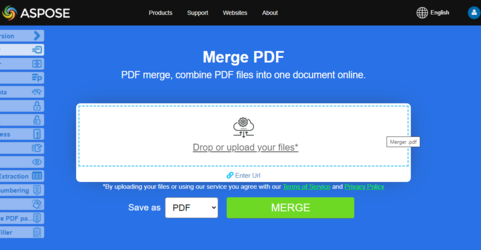

## Fusionner des fichiers PDF en utilisant Python et DOM

Concaténer deux fichiers PDF :

1. Créer un Nouveau Document.
1. Fusionner les fichiers PDF
1. Enregistrer le Document fusionné

Combiner plusieurs documents PDF en un seul fichier :

```python
import sys
import aspose.pdf as ap
from os import path

def merge_two_documents(infile1, infile2, outfile):
    document1 = ap.Document(infile1)
    document2 = ap.Document(infile2)
    document1.pages.add(document2.pages)
    document1.save(outfile)
```

## Exemple en direct

[Aspose.PDF Merger](https://products.aspose.app/pdf/merger) est une application web gratuite en ligne qui vous permet d'examiner comment fonctionne la fonctionnalité de fusion de présentations.

[](https://products.aspose.app/pdf/merger)

