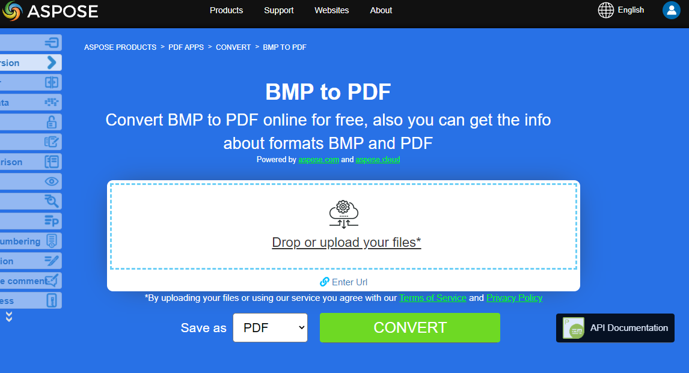
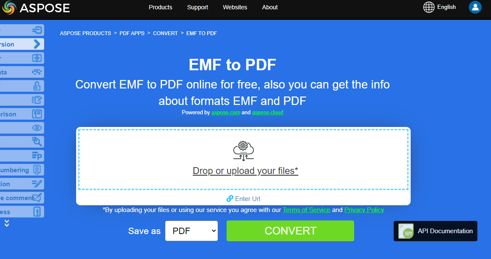

## Conversions d'images Python en PDF

**Aspose.PDF pour Python via .NET** vous permet de convertir différents formats d'images en fichiers PDF. Notre bibliothèque présente des extraits de code pour convertir les formats d'image les plus populaires, tels que - BMP, CGM, DICOM, EMF, JPG, PNG, SVG et TIFF.

## Convertir BMP en PDF

Convertir des fichiers BMP en document PDF en utilisant la bibliothèque **Aspose.PDF pour Python via .NET**.

<abbr title="Fichier d'image bitmap">BMP</abbr> les images sont des fichiers ayant cette extension. BMP représente les fichiers d'image bitmap utilisés pour stocker des images numériques bitmap. Ces images sont indépendantes de l'adaptateur graphique et sont également appelées format de bitmap indépendant du dispositif (DIB).

Vous pouvez convertir des BMP en fichiers PDF avec l'API Aspose.PDF pour Python via .NET. Par conséquent, vous pouvez suivre les étapes suivantes pour convertir les images BMP :

Étapes pour convertir BMP en PDF avec Python :

1. Créez un document PDF vide.
1. Créez la page dont vous avez besoin, par exemple, nous avons créé du A4, mais vous pouvez spécifier votre propre format.
1. Placez l'image (à partir du fichier d'entrée) dans la page en utilisant le rectangle défini.
1. Enregistrez le document au format PDF.

Ainsi, l'extrait de code suivant suit ces étapes et montre comment convertir BMP en PDF avec Python :

```python

    from io import FileIO
    from os import path
    import os
    import shutil
    import aspose.pdf as apdf
    import inspect

    path_infile = path.join(self.data_dir, infile)
    path_outfile = path.join(self.data_dir, "python", outfile)

    document = apdf.Document()
    rectangle = apdf.Rectangle(0, 0, 595, 842, True)  # A4 size in points
    page.add_image(path_infile, rectangle)
    document.save(path_outfile)

    print(infile + " converted into " + outfile)
```

{}
**Essayez de convertir BMP en PDF en ligne**

Aspose vous présente une application en ligne gratuite ["BMP en PDF"](https://products.aspose.app/pdf/conversion/bmp-to-pdf/), où vous pouvez essayer d'examiner la fonctionnalité et la qualité du service.

[](https://products.aspose.app/pdf/conversion/bmp-to-pdf/)
{}

## Convertir CGM en PDF

Convertissez un CGM (Computer Graphics Metafile) en PDF (ou un autre format pris en charge) en utilisant Aspose.PDF pour Python via .NET.

<abbr title="Fichier Metafile Graphique d'Ordinateur">CGM</abbr> est une extension de fichier pour un format Computer Graphics Metafile couramment utilisé dans les applications de CAO (conception assistée par ordinateur) et de présentation graphique. CGM est un format de graphiques vectoriels qui prend en charge trois méthodes d'encodage différentes : binaire (le meilleur pour la vitesse de lecture du programme), basé sur les caractères (produit la plus petite taille de fichier et permet des transferts de données plus rapides) ou encodage en texte clair (permet aux utilisateurs de lire et modifier le fichier avec un éditeur de texte).

Vérifiez le prochain extrait de code pour convertir les fichiers CGM au format PDF.

Étapes pour convertir CGM en PDF avec Python :

1. Définissez les chemins de fichiers
1. Définissez les options de chargement pour le CGM.
1. Convertissez le CGM en PDF
1. Affichez le message de conversion

```python

    from io import FileIO
    from os import path
    import os
    import shutil
    import aspose.pdf as apdf
    import inspect

    path_infile = path.join(self.data_dir, infile)
    path_outfile = path.join(self.data_dir, "python", outfile)

    options = apdf.CgmLoadOptions()

    # Open PDF document
    document = apdf.Document(path_infile, options)
    document.save(path_outfile)
    print(infile + " converted into " + outfile)
```

## Convertir DICOM en PDF

<abbr title="Imagerie Numérique et Communications en Médecine">DICOM</abbr> est le standard de l'industrie médicale pour la création, le stockage, la transmission et la visualisation d'images médicales numériques et de documents des patients examinés.

**Aspose.PDF pour Python** vous permet de convertir des images DICOM et SVG, mais pour des raisons techniques lors de l'ajout d'images, vous devez spécifier le type de fichier à ajouter au PDF.

L'extrait de code suivant montre comment convertir des fichiers DICOM au format PDF avec Aspose.PDF. Vous devez charger l'image DICOM, placer l'image sur une page d'un fichier PDF et enregistrer la sortie au format PDF. Nous utilisons la bibliothèque supplémentaire pydicom pour définir les dimensions de cette image. Si vous souhaitez positionner l'image sur la page, vous pouvez ignorer cet extrait de code.

1. Initialise un nouveau 'ap.Document()' et ajoutez une page
1. Insérez l'image DICOM. Créez un apdf.Image(), définissez son type sur DICOM et attribuez le chemin du fichier.
1. Ajustez la taille de la page. Faites correspondre les dimensions de la page PDF à la taille de l'image DICOM, supprimez les marges.
1. Ajoutez l'image à la page, enregistrez le document dans le fichier de sortie.

1. Chargez le fichier DICOM.
1. Extrayez les dimensions de l'image.
1. Affichez la taille de l'image.
1. Créez un nouveau document PDF.
1. Préparez l'image DICOM pour le PDF.
1. Définissez la taille de la page PDF et les marges.
1. Ajoutez l'image à la page.
1. Enregistrez le PDF.
1. Affichez le message de conversion.

```python

    from io import FileIO
    from os import path
    import os
    import shutil
    import aspose.pdf as apdf
    import inspect
    import pydicom


    path_infile = path.join(self.data_dir, infile)
    path_outfile = path.join(self.data_dir, "python", outfile)

    # Load the DICOM file
    dicom_file = pydicom.dcmread(path_infile)

    # Get the dimensions of the image
    rows = dicom_file.Rows
    columns = dicom_file.Columns

    # Print the dimensions
    print(f"DICOM image size: {rows} x {columns} pixels")

    # Initialize new Document
    document = apdf.Document()
    page = document.pages.add()
    image = apdf.Image()
    image.file_type = apdf.ImageFileType.DICOM
    image.file = path_infile

    # Set page dimensions

    page.page_info.height = rows
    page.page_info.width = columns
    page.page_info.margin.bottom = 0
    page.page_info.margin.top = 0
    page.page_info.margin.right = 0
    page.page_info.margin.left = 0
    page.paragraphs.add(image)

    document.save(path_outfile)
    print(infile + " converted into " + outfile)
```

{}
**Essayez de convertir DICOM en PDF en ligne**

Aspose vous présente une application en ligne gratuite ["DICOM to PDF"](https://products.aspose.app/pdf/conversion/dicom-to-pdf/), où vous pouvez essayer d'examiner les fonctionnalités et la qualité de son fonctionnement.

[](https://products.aspose.app/pdf/conversion/dicom-to-pdf/)
{}

## Convertir EMF en PDF

<abbr title="Enhanced metafile format">EMF</abbr> stocke des images graphiques de manière indépendante du dispositif. Les métafichiers EMF comprennent des enregistrements de longueur variable dans l'ordre chronologique qui peuvent rendre l'image stockée après analyse sur n'importe quel dispositif de sortie.

Le extrait de code suivant montre comment convertir un EMF en PDF avec Python :

```python

    from io import FileIO
    from os import path
    import os
    import shutil
    import aspose.pdf as apdf
    import inspect
    import pydicom
    
    path_infile = path.join(self.data_dir, infile)
    path_outfile = path.join(self.data_dir, "python", outfile)

    document = apdf.Document()
    page = document.pages.add()
    rectangle = apdf.Rectangle(0, 0, 595, 842, True)  # A4 size in points
    # add image to new pdf page
    page.add_image(path_infile, rectangle)

    # Save the file into PDF format
    document.save(path_outfile)
    print(infile + " converted into " + outfile)
```

{}
**Essayez de convertir EMF en PDF en ligne**

Aspose vous présente une application en ligne gratuite ["EMF to PDF"](https://products.aspose.app/pdf/conversion/emf-to-pdf/), où vous pouvez essayer d'examiner les fonctionnalités et la qualité de son fonctionnement.

[](https://products.aspose.app/pdf/conversion/emf-to-pdf/)
{}

## Convertir GIF en PDF

Convertissez des fichiers GIF en document PDF en utilisant la bibliothèque **Aspose.PDF for Python via .NET**.

<abbr title="Graphics Interchange Format">GIF</abbr> est capable de stocker des données compressées sans perte de qualité dans un format de maximum 256 couleurs. Le format GIF, indépendant du matériel, a été développé en 1987 (GIF87a) par CompuServe pour la transmission d'images bitmap sur les réseaux.

Ainsi, l'extrait de code suivant suit ces étapes et montre comment convertir BMP en PDF en utilisant Python :

```python

    from io import FileIO
    from os import path
    import os
    import shutil
    import aspose.pdf as apdf
    import inspect
    import pydicom

    path_infile = path.join(self.data_dir, infile)
    path_outfile = path.join(self.data_dir, "python", outfile)

    document = apdf.Document()
    page = document.pages.add()
    rectangle = apdf.Rectangle(0, 0, 595, 842, True)  # A4 size in points
    page.add_image(path_infile, rectangle)

    document.save(path_outfile)
    print(infile + " converted into " + outfile)
```

{}
**Essayez de convertir GIF en PDF en ligne**

Aspose vous présente une application en ligne gratuite ["GIF to PDF"](https://products.aspose.app/pdf/conversion/gif-to-pdf/), où vous pouvez essayer d'examiner les fonctionnalités et la qualité de son fonctionnement.

[](https://products.aspose.app/pdf/conversion/gif-to-pdf/)
{}

## Convertir PNG en PDF

**Aspose.PDF for Python via .NET** prend en charge la fonction de conversion des images PNG au format PDF. Consultez l'extrait de code suivant pour réaliser votre tâche.

<abbr title="Portable Network Graphics">PNG</abbr> désigne un type de format de fichier image raster qui utilise une compression sans perte, ce qui le rend populaire parmi ses utilisateurs.

Vous pouvez convertir une image PNG en PDF en suivant les étapes ci-dessous :

1. Créez un nouveau document PDF.
1. Définissez le placement de l'image.
1. Enregistrez le PDF.
1. Affichez le message de conversion.

De plus, l'extrait de code ci-dessous montre comment convertir PNG en PDF avec Python :

```python

    from io import FileIO
    from os import path
    import os
    import shutil
    import aspose.pdf as apdf
    import inspect
    import pydicom

    path_infile = path.join(self.data_dir, infile)
    path_outfile = path.join(self.data_dir, "python", outfile)

    document = apdf.Document()
    page = document.pages.add()
    rectangle = apdf.Rectangle(0, 0, 595, 842, True)  # A4 size in points
    page.add_image(path_infile, rectangle)
    document.save(path_outfile)

    print(infile + " converted into " + outfile)
```

{}
**Essayez de convertir PNG en PDF en ligne**

Aspose vous présente une application en ligne gratuite ["PNG to PDF"](https://products.aspose.app/pdf/conversion/png-to-pdf/), où vous pouvez essayer d'examiner les fonctionnalités et la qualité de son fonctionnement.

[](https://products.aspose.app/pdf/conversion/png-to-pdf/)
{}

## Convertir SVG en PDF

**Aspose.PDF for Python via .NET** explique comment convertir des images SVG au format PDF et comment obtenir les dimensions du fichier SVG source.

Scalable Vector Graphics (SVG) est une famille de spécifications d'un format de fichier basé sur XML pour les graphiques vectoriels bidimensionnels, à la fois statiques et dynamiques (interactifs ou animés). La spécification SVG est une norme ouverte qui est développée par le World Wide Web Consortium (W3C) depuis 1999.

<abbr title="Scalable Vector Graphics">SVG</abbr> les images et leurs comportements sont définis dans des fichiers texte XML. Cela signifie qu'ils peuvent être recherchés, indexés, scriptés et, si nécessaire, compressés. En tant que fichiers XML, les images SVG peuvent être créées et éditées avec n'importe quel éditeur de texte, mais il est souvent plus pratique de les créer avec des programmes de dessin tels qu'Inkscape.

{}
**Essayez de convertir le format SVG en PDF en ligne**

Aspose.PDF for Python via .NET vous présente une application en ligne gratuite ["SVG to PDF"](https://products.aspose.app/pdf/conversion/svg-to-pdf), où vous pouvez essayer d'examiner les fonctionnalités et la qualité de son fonctionnement.

[](https://products.aspose.app/pdf/conversion/svg-to-pdf)
{}

L'extrait de code suivant montre le processus de conversion d'un fichier SVG en format PDF avec Aspose.PDF pour Python.

```python

    from io import FileIO
    from os import path
    import os
    import shutil
    import aspose.pdf as apdf
    import inspect
    import pydicom

    path_infile = path.join(self.data_dir, infile)
    path_outfile = path.join(self.data_dir, "python", outfile)

    load_options = apdf.SvgLoadOptions()
    document = apdf.Document(path_infile, load_options)
    document.save(path_outfile)

    print(infile + " converted into " + outfile)
```

## Convertir TIFF en PDF

**Aspose.PDF** format de fichier pris en charge, qu'il s'agisse d'une image TIFF à une seule trame ou à plusieurs trames. Cela signifie que vous pouvez convertir l'image TIFF en PDF.

TIFF ou TIF, Tagged Image File Format, représente des images matricielles destinées à être utilisées sur une variété d'appareils compatibles avec cette norme de format de fichier. Une image TIFF peut contenir plusieurs trames avec différentes images. Le format de fichier Aspose.PDF est également pris en charge, qu'il s'agisse d'une trame unique ou d'une image TIFF multi-trames.

Vous pouvez convertir TIFF en PDF de la même façon que pour les autres formats de fichiers graphiques matriciels :

```python

    from io import FileIO
    from os import path
    import os
    import shutil
    import aspose.pdf as apdf
    import inspect
    import pydicom

    path_infile = path.join(self.data_dir, infile)
    path_outfile = path.join(self.data_dir, "python", outfile)

    document = apdf.Document()
    page = document.pages.add()
    rectangle = apdf.Rectangle(0, 0, 595, 842, True)  # A4 size in points
    page.add_image(path_infile, rectangle)
    document.save(path_outfile)

    print(infile + " converted into " + outfile)
```

## Convertir CDR en PDF

L'extrait de code suivant montre comment charger un fichier CorelDRAW (CDR) et l'enregistrer en PDF en utilisant 'CdrLoadOptions' dans Aspose.PDF pour Python via .NET.

1. Créez 'CdrLoadOptions()' pour configurer la façon dont le fichier CDR doit être chargé.
1. Initialisez un objet Document avec le fichier CDR et les options de chargement.
1. Enregistrez le document au format PDF.

```python

    from io import FileIO
    from os import path
    import os
    import shutil
    import aspose.pdf as apdf
    import inspect
    import pydicom

    path_infile = path.join(self.data_dir, infile)
    path_outfile = path.join(self.data_dir, "python", outfile)

    load_options = apdf.CdrLoadOptions()
    document = apdf.Document(path_infile, load_options)
    document.save(path_outfile)

    print(infile + " converted into " + outfile)
```

## Convertir JPEG en PDF

Cet exemple montre comment convertir un fichier JPEG en PDF en utilisant Aspose.PDF pour Python via .NET.

1. Créez un nouveau document PDF.
1. Ajoutez une nouvelle page.
1. Définissez le rectangle de placement (taille A4 : 595x842 points).
1. Insérez l'image dans la page.
1. Enregistrez le PDF.

```python

    from io import FileIO
    from os import path
    import os
    import shutil
    import aspose.pdf as apdf
    import inspect
    import pydicom

    path_infile = path.join(self.data_dir, infile)
    path_outfile = path.join(self.data_dir, "python", outfile)

    document = apdf.Document()
    page = document.pages.add()
    rectangle = apdf.Rectangle(0, 0, 595, 842, True)  # A4 size in points
    page.add_image(path_infile, rectangle)

    document.save(path_outfile)
    print(infile + " converted into " + outfile)
```

