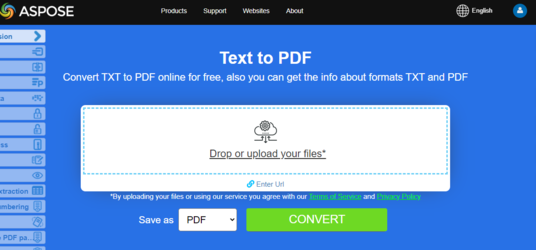

Cet article explique comment **convertir divers autres types de formats de fichiers en PDF avec Python**. Il couvre les sujets suivants.

## Convertir OFD en PDF

OFD signifie Open Fixed-layout Document (aussi appelé format Open Fixed Document). C'est une norme nationale chinoise (GB/T 33190-2016) pour les documents électroniques, présentée comme une alternative au PDF.

Étapes pour convertir OFD en PDF avec Python :

1. Configurer les options de chargement OFD en utilisant OfdLoadOptions().
1. Charger le document OFD.
1. Enregistrer en PDF.

```python

    from os import path
    import aspose.pdf as ap

    path_infile = path.join(self.data_dir, infile)
    path_outfile = path.join(self.data_dir, "python", outfile)

    load_options = ap.OfdLoadOptions()
    document = ap.Document(path_infile, load_options)
    document.save(path_outfile)

    print(infile + " converted into " + outfile)
```

## Convertir LaTeX/TeX en PDF

Le format de fichier LaTeX est un format texte avec balisage dérivé du LaTeX de la famille des langages TeX, et LaTeX est un format dérivé du système TeX. LaTeX (ˈleɪtɛk/lay‑tek ou lah‑tek) est un système de préparation de documents et un langage de balisage de documents. Il est largement utilisé pour la communication et la publication de documents scientifiques dans de nombreux domaines, notamment les mathématiques, la physique et l’informatique. Il joue également un rôle clé dans la préparation et la publication de livres et d'articles contenant des contenus multilingues complexes, tels que le coréen, le japonais, les caractères chinois et l'arabe, y compris les éditions spéciales.

LaTeX utilise le programme de composition TeX pour formater sa sortie, et est lui-même écrit dans le langage macro TeX.

{}
**Essayez de convertir LaTeX/TeX en PDF en ligne**

Aspose.PDF pour Python via .NET vous propose une application en ligne gratuite ["LaTex to PDF"](https://products.aspose.app/pdf/conversion/tex-to-pdf), où vous pouvez essayer d'examiner la fonctionnalité et la qualité de son fonctionnement.

[](https://products.aspose.app/pdf/conversion/tex-to-pdf)
{}

Étapes pour convertir TEX en PDF avec Python :

1. Configurer les options de chargement LaTeX en utilisant LatexLoadOptions().
1. Charger le document LaTeX.
1. Enregistrer en PDF.

```python

    from os import path
    import aspose.pdf as ap

    path_infile = path.join(self.data_dir, infile)
    path_outfile = path.join(self.data_dir, "python", outfile)

    load_options = ap.LatexLoadOptions()
    document = ap.Document(path_infile, load_options)
    document.save(path_outfile)

    print(infile + " converted into " + outfile)
```
## Convertir OFD en PDF

OFD signifie Open Fixed-layout Document (parfois appelé format Open Fixed Document). C'est une norme nationale chinoise (GB/T 33190-2016) pour les documents électroniques, présentée comme une alternative au PDF.

Étapes pour convertir OFD en PDF avec Python :

1. Configurer les options de chargement OFD en utilisant OfdLoadOptions().
1. Charger le document OFD.
1. Enregistrer en PDF.

```python

    from os import path
    import aspose.pdf as ap

    path_infile = path.join(self.data_dir, infile)
    path_outfile = path.join(self.data_dir, "python", outfile)

    load_options = ap.OfdLoadOptions()
    document = ap.Document(path_infile, load_options)
    document.save(path_outfile)

    print(infile + " converted into " + outfile)
```

## Convertir LaTeX/TeX en PDF

Le format de fichier LaTeX est un format texte avec balisage dérivé du LaTeX de la famille des langages TeX, et LaTeX est un format dérivé du système TeX. LaTeX (ˈleɪtɛk/lay‑tek ou lah‑tek) est un système de préparation de documents et un langage de balisage de documents. Il est largement utilisé pour la communication et la publication de documents scientifiques dans de nombreux domaines, notamment les mathématiques, la physique et l’informatique. Il occupe également une place importante dans la préparation et la publication de livres et d’articles contenant des matériaux multilingues complexes, tels que le sanskrit et l’arabe, y compris les éditions critiques. LaTeX utilise le programme de composition TeX pour formater sa sortie, et est lui‑même écrit dans le langage macro TeX.

{}
**Essayez de convertir LaTeX/TeX en PDF en ligne**

Aspose.PDF pour Python via .NET vous propose une application en ligne gratuite ["LaTex to PDF"](https://products.aspose.app/pdf/conversion/tex-to-pdf), où vous pouvez essayer d'examiner la fonctionnalité et la qualité de son fonctionnement.

[](https://products.aspose.app/pdf/conversion/tex-to-pdf)
{}

Étapes pour convertir TEX en PDF avec Python :

1. Configurer les options de chargement LaTeX en utilisant LatexLoadOptions().
1. Charger le document LaTeX.
1. Enregistrer en PDF.

```python

    from os import path
    import aspose.pdf as ap

    path_infile = path.join(self.data_dir, infile)
    path_outfile = path.join(self.data_dir, "python", outfile)

    load_options = ap.LatexLoadOptions()
    document = ap.Document(path_infile, load_options)
    document.save(path_outfile)

    print(infile + " converted into " + outfile)
```

## Convertir EPUB en PDF

**Aspose.PDF for Python via .NET** vous permet de simplement convertir des fichiers EPUB au format PDF.

EPUB (abrégé de electronic publication) est une norme de livre électronique libre et ouverte du International Digital Publishing Forum (IDPF). Les fichiers ont l'extension .epub. EPUB est conçu pour du contenu réenveloppable, ce qui signifie qu'un lecteur EPUB peut optimiser le texte pour un dispositif d'affichage particulier.

<abbr title="electronic publication">EPUB</abbr> prend également en charge le contenu à mise en page fixe. Le format est destiné à être un format unique que les éditeurs et les sociétés de conversion peuvent utiliser en interne, ainsi que pour la distribution et la vente. Il remplace la norme Open eBook. La version EPUB 3 est également approuvée par le Book Industry Study Group (BISG), une association majeure du commerce du livre pour les meilleures pratiques standardisées, la recherche, l'information et les événements concernant l'emballage du contenu.

{}
**Essayez de convertir EPUB en PDF en ligne**

Aspose.PDF for Python via .NET vous propose une application en ligne gratuite ["EPUB en PDF"](https://products.aspose.app/pdf/conversion/epub-to-pdf), où vous pouvez essayer d'examiner la fonctionnalité et la qualité de son fonctionnement.

[](https://products.aspose.app/pdf/conversion/epub-to-pdf)
{}

Étapes pour convertir EPUB en PDF avec Python :

1. Charger le document EPUB avec EpubLoadOptions().
1. Convertir EPUB en PDF.
1. Imprimer la confirmation.

Le fragment de code suivant vous montre comment convertir des fichiers EPUB au format PDF avec Python.

```python

    from os import path
    import aspose.pdf as ap

    path_infile = path.join(self.data_dir, infile)
    path_outfile = path.join(self.data_dir, "python", outfile)

    load_options = ap.EpubLoadOptions()
    document = ap.Document(path_infile, load_options)

    document.save(path_outfile)
    print(infile + " converted into " + outfile)
```

## Convertir Markdown en PDF

**Cette fonctionnalité est prise en charge à partir de la version 19.6 ou supérieure.**

{}
**Essayez de convertir Markdown en PDF en ligne**

Aspose.PDF for Python via .NET vous propose une application en ligne gratuite ["Markdown en PDF"](https://products.aspose.app/pdf/conversion/md-to-pdf), où vous pouvez essayer d'examiner la fonctionnalité et la qualité de son fonctionnement.

[](https://products.aspose.app/pdf/conversion/md-to-pdf)
{}

Ce fragment de code d'Aspose.PDF for Python via .NET aide à convertir des fichiers Markdown en PDF, permettant un meilleur partage de documents, la préservation du formatage et la compatibilité d'impression.

Le fragment de code suivant montre comment utiliser cette fonctionnalité avec la bibliothèque Aspose.PDF :

```python

    from os import path
    import aspose.pdf as ap

    path_infile = path.join(self.data_dir, infile)
    path_outfile = path.join(self.data_dir, "python", outfile)

    load_options = ap.MdLoadOptions()
    document = ap.Document(path_infile, load_options)
    document.save(path_outfile)
    print(infile + " converted into " + outfile)
```

## Convertir PCL en PDF

<abbr title="Printer Command Language">PCL</abbr> (Printer Command Language) est un langage d'imprimante Hewlett-Packard développé pour accéder aux fonctions standard de l'imprimante. Les niveaux PCL 1 à 5e/5c sont des langages basés sur des commandes utilisant des séquences de contrôle qui sont traitées et interprétées dans l'ordre où elles sont reçues. Au niveau consommateur, les flux de données PCL sont générés par un pilote d'impression. La sortie PCL peut également être facilement générée par des applications personnalisées.

{}
**Essayez de convertir PCL en PDF en ligne**

Aspose.PDF pour .NET vous propose une application en ligne gratuite ["PCL en PDF"](https://products.aspose.app/pdf/conversion/pcl-to-pdf), où vous pouvez essayer d'examiner la fonctionnalité et la qualité de son fonctionnement.

[](https://products.aspose.app/pdf/conversion/pcl-to-pdf)
{}

Pour permettre la conversion de PCL en PDF, Aspose.PDF dispose de la classe [`PclLoadOptions`](https://reference.aspose.com/pdf/net/aspose.pdf/pclloadoptions) qui est utilisée pour initialiser l'objet LoadOptions. Par la suite, cet objet est passé en argument lors de l'initialisation de l'objet Document et il aide le moteur de rendu PDF à déterminer le format d'entrée du document source.

Le fragment de code suivant montre le processus de conversion d'un fichier PCL au format PDF.

Étapes pour convertir PCL en PDF avec Python :

1. Charger les options pour PCL en utilisant PclLoadOptions().
1. Charger le document.
1. Enregistrer en PDF.

```python

    from os import path
    import aspose.pdf as ap

    path_infile = path.join(self.data_dir, infile)
    path_outfile = path.join(self.data_dir, "python", outfile)

    load_options = ap.PclLoadOptions()
    load_options.supress_errors = True

    document = ap.Document(path_infile, load_options)
    document.save(path_outfile)

    print(infile + " converted into " + outfile)
```

## Convertir du texte préformaté en PDF

**Aspose.PDF for Python via .NET** prend en charge la fonctionnalité de conversion de texte brut et de fichier texte préformaté au format PDF.

La conversion de texte en PDF consiste à ajouter des fragments de texte à la page PDF. En ce qui concerne les fichiers texte, nous traitons de deux types de texte : le pré-formatage (par exemple, 25 lignes avec 80 caractères par ligne) et le texte non formaté (texte brut). En fonction de nos besoins, nous pouvons contrôler cette addition nous-mêmes ou la confier aux algorithmes de la bibliothèque.

{}
**Essayez de convertir du TEXTE en PDF en ligne**

Aspose.PDF for Python via .NET vous propose une application en ligne gratuite ["Texte en PDF"](https://products.aspose.app/pdf/conversion/txt-to-pdf), où vous pouvez essayer d'examiner la fonctionnalité et la qualité de son fonctionnement.

[](https://products.aspose.app/pdf/conversion/txt-to-pdf)
{}

Étapes pour convertir du TEXTE en PDF avec Python :

1. Lire le fichier texte d'entrée ligne par ligne.
1. Configurer une police à chasse fixe (Courier New) pour un alignement cohérent du texte.
1. Créer un nouveau document PDF et ajouter la première page avec des marges personnalisées et les paramètres de police.
1. Parcourir les lignes du fichier texte. Pour simuler une machine à écrire, nous utilisons la police 'monospace_font' de taille 12.
1. Limiter la création de pages à 4 pages.
1. Enregistrer le PDF final à l'emplacement spécifié.

```python

    from os import path
    import aspose.pdf as ap

    path_infile = path.join(self.data_dir, infile)
    path_outfile = path.join(self.data_dir, "python", outfile)

    with open(path_infile, "r") as file:
        lines = file.readlines()

    monospace_font = ap.text.FontRepository.find_font("Courier New")

    document = ap.Document()
    page = document.pages.add()

    page.page_info.margin.left = 20
    page.page_info.margin.right = 10
    page.page_info.default_text_state.font = monospace_font
    page.page_info.default_text_state.font_size = 12
    count = 1
    for line in lines:
        if line != "" and line[0] == "\x0c":
            page = document.pages.add()
            page.page_info.margin.left = 20
            page.page_info.margin.right = 10
            page.page_info.default_text_state.font = monospace_font
            page.page_info.default_text_state.font_size = 12
            count = count + 1
        else:
            text = ap.text.TextFragment(line)
            page.paragraphs.add(text)

        if count == 4:
            break

    document.save(path_outfile)

    print(infile + " converted into " + outfile)
```

## Convertir PostScript en PDF

Cet exemple montre comment convertir un fichier PostScript en document PDF en utilisant Aspose.PDF pour Python via .NET.

1. Créez une instance de 'PsLoadOptions' pour interpréter correctement le fichier PS.
1. Chargez le fichier 'PostScript' dans un objet Document en utilisant les options de chargement.
1. Enregistrez le document au format PDF vers le chemin de sortie souhaité.

```python

    from os import path
    import aspose.pdf as ap

    path_infile = path.join(self.data_dir, infile)
    path_outfile = path.join(self.data_dir, "python", outfile)

    load_options = ap.PsLoadOptions()

    document = ap.Document(path_infile, load_options)
    document.save(path_outfile)

    print(infile + " converted into " + outfile)
```

## Convertir XPS en PDF

**Aspose.PDF for Python via .NET** prend en charge la fonctionnalité de conversion des fichiers <abbr title="XML Paper Specification">XPS</abbr> au format PDF. Consultez cet article pour résoudre vos tâches.

Le type de fichier XPS est principalement associé à la Spécification Papier XML de Microsoft Corporation. La Spécification Papier XML (XPS), anciennement nom de code Metro et englobant le concept marketing Next Generation Print Path (NGPP), est l'initiative de Microsoft visant à intégrer la création et la visualisation de documents dans son système d'exploitation Windows.

Le fragment de code suivant montre le processus de conversion d'un fichier XPS en format PDF avec Python.

```python

    from os import path
    import aspose.pdf as ap

    path_infile = path.join(self.data_dir, infile)
    path_outfile = path.join(self.data_dir, "python", outfile)

    load_options = ap.XpsLoadOptions()
    document = ap.Document(path_infile, load_options)
    document.save(path_outfile)

    print(infile + " converted into " + outfile)
```

{}
**Essayez de convertir le format XPS en PDF en ligne**

Aspose.PDF for Python via .NET vous propose une application en ligne gratuite ["XPS en PDF"](https://products.aspose.app/pdf/conversion/xps-to-pdf/), où vous pouvez essayer d'examiner la fonctionnalité et la qualité du service.

[](https://products.aspose.app/pdf/conversion/xps-to-pdf/)
{}

## Convertir XSL-FO en PDF

Le fragment de code suivant peut être utilisé pour convertir un XSLFO en format PDF avec Aspose.PDF pour Python via .NET :

```python

    from os import path
    import aspose.pdf as ap

    path_xsltfile = path.join(self.data_dir, xsltfile)
    path_xmlfile = path.join(self.data_dir, xmlfile)
    path_outfile = path.join(self.data_dir, "python", outfile)

    load_options = ap.XslFoLoadOptions(path_xsltfile)
    load_options.parsing_errors_handling_type = (
        ap.XslFoLoadOptions.ParsingErrorsHandlingTypes.ThrowExceptionImmediately
    )
    document = ap.Document(path_xmlfile, load_options)
    document.save(path_outfile)

    print(xmlfile + " converted into " + outfile)
```

## Convertir XML avec XSLT en PDF

Cet exemple montre comment convertir un fichier XML en PDF en le transformant d'abord en HTML à l'aide d'un modèle XSLT, puis en chargeant le HTML dans Aspose.PDF.

1. Créez une instance de 'HtmlLoadOptions' pour configurer la conversion HTML vers PDF.
1. Chargez le fichier HTML transformé dans un objet Document Aspose.PDF.
1. Enregistrez le document en PDF au chemin de sortie spécifié.
1. Supprimez le fichier HTML temporaire après une conversion réussie.

```python

    from os import path
    import aspose.pdf as ap

    def transform_xml_to_html(xml_file, xslt_file, html_file):
        from lxml import etree
        """
        Transform XML to HTML using XSLT and return as a stream
        """
        # Parse XML document
        xml_doc = etree.parse(xml_file)

        # Parse XSLT stylesheet
        xslt_doc = etree.parse(xslt_file)
        transform = etree.XSLT(xslt_doc)

        # Apply transformation
        result = transform(xml_doc)

        # Save result to HTML file
        with open(html_file, 'w', encoding='utf-8') as f:
            f.write(str(result))


    def convert_XML_to_PDF(template, infile, outfile):
        path_infile = path.join(data_dir, infile)
        path_outfile = path.join(data_dir, "python", outfile)
        path_template = path.join(data_dir, template)
        path_temp_file = path.join(data_dir, "temp.html")

        load_options = ap.HtmlLoadOptions()
        transform_xml_to_html(path_infile, path_template, path_temp_file)

        document = ap.Document(path_temp_file, load_options)
        document.save(path_outfile)

        if path.exists(path_temp_file):
            os.remove(path_temp_file)

        print(infile + " converted into " + outfile)
```

