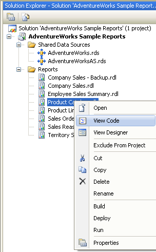

{}

Vous pouvez ajouter des propriétés personnalisées à certains éléments de rapport pour étendre leur utilisation, comme la ToC, les flèches de ligne, etc. Cette section décrit ce processus.

{}

{}

Vous pouvez ajouter des propriétés personnalisées à certains éléments de rapport pour étendre leur utilisation, comme la Table des matières, les flèches de ligne, etc. Cette section décrit ce processus.

Pour ajouter des propriétés personnalisées, vous devez modifier le fichier de code du document RDL selon les étapes suivantes :

1. Comme le montre la figure suivante, ouvrez votre projet, naviguez jusqu’à l’explorateur de solution, cliquez avec le bouton droit sur le fichier de rapport sélectionné, puis choisissez l’option \u0027View Code\u0027 du menu.

2. Modifiez le fichier de code XML. Par exemple, si vous souhaitez ajouter une propriété personnalisée pour un élément de rapport de type graphique, vous devez ajouter le code similaire au texte rouge dans l’exemple suivant.

**Exemple**



<chart Name="chart1">
    <Left>5.5cm</Left>
    <Top>0.5cm</Top>
      ......
         
    <CustomProperties>
      <CustomProperty>
        <Name>IsInList</Name>
        <Value>True</Value>
      </CustomProperty>
    </CustomProperties>
</chart> 



Dans cet exemple de fragment de code, le nom de la propriété personnalisée est IsInList, et la valeur est 'True'.

{}

