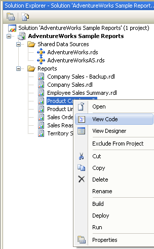

{}

Vous pouvez ajouter des propriétés personnalisées pour certains éléments de rapport afin d'étendre leur utilisation, telles que la table des matières, les flèches linéaires, etc. Cette section décrit ce processus.

{}

Vous pouvez ajouter des propriétés personnalisées pour certains éléments de rapport afin d'étendre leur utilisation, telles que la table des matières, les flèches de ligne, etc. Cette section décrit ce processus.

Pour ajouter des propriétés personnalisées, vous devez modifier le fichier de code du document RDL en procédant comme suit :

1. Comme dans la figure suivante, ouvrez votre projet, accédez à l'explorateur de solutions, cliquez avec le bouton droit sur le fichier de rapport sélectionné, puis sélectionnez l'élément de menu « Afficher le code ».



2. Modifiez le fichier de code XML. Par exemple, si vous souhaitez ajouter une propriété personnalisée pour l'élément de rapport graphique, vous devez ajouter le code similaire au texte rouge dans l'exemple suivant.

## Exemple

```xml
<chart Name="chart1">
    <Left>5.5cm</Left>
    <Top>0.5cm</Top>
      ......
    <Style>
      ......
    </style>     
    <CustomProperties>
      <CustomProperty>
        <Name>IsInList</Name>
        <Value>True</Value>
      </CustomProperty>
    </CustomProperties>
</chart> 
```

Dans cet exemple de fragment de code, le nom de la propriété personnalisée est IsInList et la valeur est `True`.

