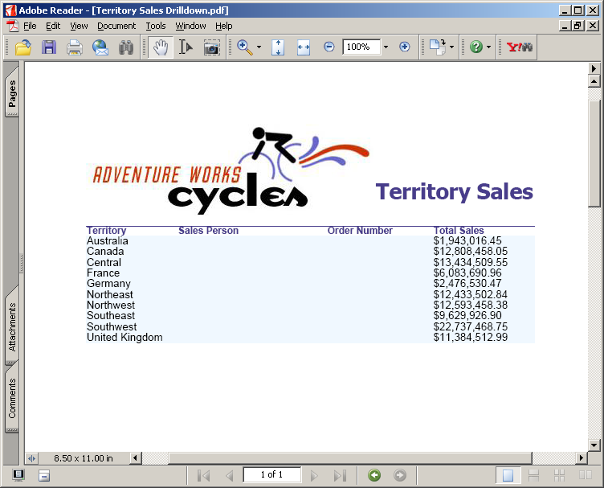

**Aspose.Pdf for Reporting Services** version d'évaluation fournit le même ensemble de fonctionnalités que la version sous licence, à l'exception du filigrane d'évaluation dans le PDF résultant lors de l'utilisation de la version d'évaluation. Veuillez visiter notre site Web et télécharger la version du produit et commencer à explorer notre produit avec l'ensemble complet de fonctionnalités en mode d'évaluation.

Lorsque vous êtes satisfait de votre évaluation, [achetez une licence](https://purchase.aspose.com/buy). Avant d'acheter, assurez‑vous de bien comprendre et d'accepter les conditions d'abonnement à la licence.

La licence sera disponible au téléchargement depuis la page de commande après le paiement de la commande. La licence est un fichier XML en texte clair, signé numériquement. La licence contient des informations telles que le nom du client, le produit acheté et le type de licence. Ne modifiez pas le contenu du fichier de licence car cela rendra la licence invalide.

## Mise en licence d'un serveur

Téléchargez le fichier de licence et copiez‑le dans le C:\Program Files\Microsoft SQL Server\```<Instance>``\Reporting Services\ReportServer\bin, or C:\Program Files\Microsoft SQL Server\SSRS\ReportServer\bin, or C:\Program Files\Microsoft Power BI Report Server\PBIRS\ReportServer\bin folder on the server (the same folder where the Aspose.Pdf.ReportingServices.dll is placed).

```<Instance>``` is the subdirectory name that corresponds to the Microsoft SQL Server 2016 instance you want to license.

The default instance directory for Microsoft SQL Server 2016 is MSRS13.MSSQLSERVER.
For the Microsoft SQL Server 2017 and later the default instance path is C:\Program Files\Microsoft SQL Server\SSRS.
For the Power BI Report Server the default instance path is C:\Program Files\Microsoft Power BI Report Server\PBIRS.

**PDF generated using “Territory sales drilldown” report**




**PDF generated using “Sales Order details” report**


If there is a problem while initializing the license, an evaluation watermark is displayed in the resultant PDF document as specified below.

**PDF document generated using “Territory Sales Drilldown” with watermark**


Please note that that supported license file names are Aspose.PDF.ReportingServices.lic, Aspose.Total.ReportingServices.lic and Aspose.Total.Product.Family.lic. If the file has any other name, please rename it.


## Temporary License

{}

You may also request a 30 days temporary license to test the product. Please visit the following link for more information on how to get Temporary license. [Get a Temporary License](https://purchase.aspose.com/temporary-license).

{}

