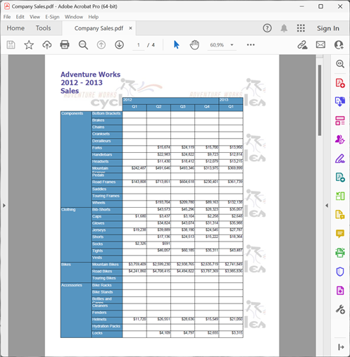

{}

Cette galerie présente les rapports PDF exportés par Aspose.Pdf for Reporting Services.

{}

La plupart des rapports présentés ici proviennent de la base de données Adventure Works. Adventure Works est une base de données d'exemple pour Microsoft SQL Server, disponible en téléchargement sur le site de Microsoft [ici](http://www.microsoft.com/downloads/details.aspx?familyid=E719ECF7-9F46-4312-AF89-6AD8702E4E6E&displaylang=en).

## Ventes de l'entreprise

## Résumé des ventes des employés

## Catalogue de produits

## Ventes de la ligne de produits

## Détail de la commande de vente

