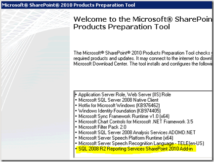

{}

Aspose.PDF pour Reporting Services est très remarquable pour la génération de PDF via SQL Reporting Services depuis de nombreuses années et fournit diverses options de configuration et de paramétrage qui ne sont pas prises en charge par défaut dans SQL Reporting Services. Récemment, nous avons reçu des demandes concernant Aspose.PDF pour l'intégration de Reporting Services avec SharePoint. Pour cet article, nous allons nous concentrer sur MS SharePoint 2010. Avant d'aller plus loin, nous supposons que vous disposez déjà d'une configuration de batterie SharePoint. Dans cet exemple, nous allons utiliser SharePoint Cloud complet. Toutefois, les étapes sont similaires pour SharePoint Foundation Server.

{}

{}

Avant d’aller plus loin, revenons sur les sujets de référence que nous avons consultés lors de la préparation de cet article.

- [Présentation de Reporting Services et de l'intégration de la technologie SharePoint] (http://msdn.microsoft.com/en-us/library/bb326358.aspx)
- [Topologies de déploiement pour Reporting Services en mode intégré SharePoint] (http://msdn.microsoft.com/en-us/library/bb510781.aspx)
- [Configuration de Reporting Services pour l'intégration de SharePoint 2010] (http://msdn.microsoft.com/en-us/library/bb326356.aspx)

{}

## Configuration de l'environnement

Notre configuration se compose de 4 serveurs. Il comprend un contrôleur de domaine, un serveur SQL, un serveur SharePoint et un serveur pour Reporting Services. Vous pouvez choisir d'avoir SharePoint et Reporting Services sur la même boîte, ce qui simplifiera un peu les choses et je soulignerai certaines des différences.

## Conditions préalables à l'installation

{}

Le complément Reporting Services pour SharePoint est l’un des composants clés pour que l’intégration fonctionne correctement. Le complément doit être installé sur l’un des Web Front Ends (WFE) présents dans votre batterie SharePoint avec le serveur d’administration central. L'un des nouveaux changements apportés à SQL 2008 R2 et SharePoint 2010 est que le complément 2008 R2 est désormais un prérequis pour l'installation de SharePoint. Cela signifie que le complément RS sera installé lorsque vous installerez SharePoint. Il a été montré et mis en évidence dans la figure ci-dessous. Cela évite en fait de nombreux problèmes rencontrés avec SP 2007 et RS 2008 lors de l'installation du complément.

**Image1 : - Complément Reporting Services pour Share Point**
{}

## Authentification SharePoint

**Avant de passer aux éléments d'intégration RS, une chose que je souhaite souligner à propos de la ferme SharePoint est la façon dont vous configurez le site. Plus précisément, comment configurer l'authentification pour le site. Que ce soit Classic ou Claims. Ce choix est important au début. Je ne pense pas que vous puissiez modifier cette option une fois que cela est fait. Si vous pouviez le changer, ce ne serait pas un processus simple.

REMARQUE : ***Reporting Services 2008 R2 n'est PAS compatible avec les réclamations***

Même si vous choisissez votre site SharePoint pour utiliser les revendications, Reporting Services lui-même ne prend pas en compte les revendications. Cela dit, cela affecte le fonctionnement de l’authentification avec Reporting Services. Alors, quelle est la différence du point de vue de Reporting Services ? Il s’agit de savoir si vous souhaitez transmettre les informations d’identification de l’utilisateur à la source de données. Classique : - Peut utiliser Kerberos et transmettre les informations d'identification de l'utilisateur à votre source de données principale (il faudra utiliser Kerberos pour cela). Réclamations : - Un jeton Claims est utilisé et non un jeton Windows. RS utilisera toujours l’authentification sécurisée dans ce scénario et n’aura accès qu’au jeton SPUser. Vous devrez stocker vos informations d'identification dans votre source de données.

Classique : - Peut utiliser Kerberos et transmettre les informations d'identification de l'utilisateur à votre source de données principale (il faudra utiliser Kerberos pour cela.

Réclamations : - Un jeton Claims est utilisé et non un jeton Windows. RS utilisera toujours l’authentification sécurisée dans ce scénario et n’aura accès qu’au jeton SPUser. Vous devrez stocker vos informations d'identification dans votre source de données.

Pour l'instant, nous voulons juste nous concentrer sur la configuration de RS. À ce stade, SharePoint est installé sur ma SharePoint Box et configuré avec un site d'authentification classique sur le port 80. Sur le serveur RS, je viens d'installer Reporting Services et c'est tout.
