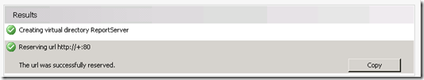

{}

Notre premier arrêt sur le serveur Reporting Services est le Gestionnaire de configuration de Reporting Services.

{}

## Compte de service:

**Assurez‑vous de bien comprendre quel compte de service vous utilisez pour Reporting Services. Si nous rencontrons des problèmes, cela peut être lié au compte de service que vous utilisez. Le compte par défaut est Network Service. Lorsque nous déployons de nouvelles versions, nous utilisons toujours des comptes de domaine, car c’est là que nous risquons le plus de rencontrer des problèmes. Pour cette instance du serveur, nous avons utilisé un compte de domaine appelé RSService.**

**Image1:- Configuration du compte de service**

## URL du service Web :

{}

**Nous devrons configurer l'URL du service Web. Il s'agit du répertoire virtuel ReportServer (vdir) qui héberge les services Web que Reporting Services utilise, et avec lequel SharePoint communiquera. À moins que vous ne souhaitiez personnaliser les propriétés du vdir (c’est‑à‑dire SSL, ports, en‑têtes d’hôte, etc… ), vous devriez simplement pouvoir cliquer sur Appliquer ici et tout fonctionnera.**

**Image2:- Configuration de l'URL du service Web Une fois l'URL du service Web configurée, vous devriez pouvoir voir les résultats suivants**

**Image3:- Configuration réussie de l'URL du service Web**
{}

## Base de données:

**Nous devons créer la base de données du catalogue Reporting Services. Elle peut être placée sur n'importe quel moteur de base de données SQL 2008 ou SQL 2008 R2. SQL11 fonctionnerait également, mais il est encore en BÊTA. Cette action créera deux bases de données, ReportServer et ReportServerTempDB, par défaut.**

{}
**L'autre étape importante ici consiste à s'assurer que vous choisissez « SharePoint Integrated » pour le type de base de données. Une fois ce choix effectué, il ne peut plus être modifié.**

**Image4:- Création de la base de données du serveur de rapports**

**Image5:- Configuration du serveur de base de données et du type d'authentification**

**Image6:- Configuration du nom de la base de données et du mode**
{}

**Pour les informations d’identification, c’est ainsi que le serveur de rapports communiquera avec le serveur SQL. Quel que soit le compte que vous choisissez, il se verra attribuer certains droits dans la base de données Catalog ainsi que dans quelques bases de données système via le rôle RSExecRole. MSDB est l’une de ces bases de données utilisée pour les abonnements, car nous utilisons SQL Agent.**

**Image7:- Configuration des informations d’identification de la base de données du serveur de rapports**

{}

**Une fois les informations d'identification de la base de données spécifiées, nous devrions pouvoir obtenir les résultats comme indiqué ci-dessous.**

**Image8:- Progression de la création de la base de données du serveur de rapports**

**Image9:- Résumé de l'achèvement de la base de données du serveur de rapports**
{}

## URL du gestionnaire de rapports:

**Nous pouvons ignorer l'URL du Report Manager car elle n'est pas utilisée lorsque nous sommes en mode intégré à SharePoint. SharePoint est notre interface frontale. Report Manager ne fonctionne pas.**

## Clés de chiffrement :

{}
**Sauvegardez vos clés de chiffrement et assurez‑vous de savoir où vous les conservez. Si vous vous retrouvez dans une situation où vous devez migrer la base de données ou la restaurer, vous en aurez besoin.**

**Image10:- Sauvegarde de la clé de chiffrement du serveur de rapports**
{}

{}
**Félicitations ! Nous avons configuré avec succès Reporting Services à l'aide de Configuration Manager. Si vous naviguez vers l’URL dans l’onglet URL du service Web, vous devriez voir quelque chose de similaire à ce qui suit.**

**Image11 :- Accès au serveur de rapports après l’installation**

**Raison de l’erreur : SharePoint est installé sur notre WFE et nous avons terminé la configuration de Reporting Services. Dans cet exemple, Reporting Services et SharePoint sont sur des machines différentes. S’ils étaient sur la même machine, vous n’auriez pas vu cette erreur. Nous devons techniquement installer SharePoint sur la boîte RS. Cela signifie que IIS sera également activé.**
{}

