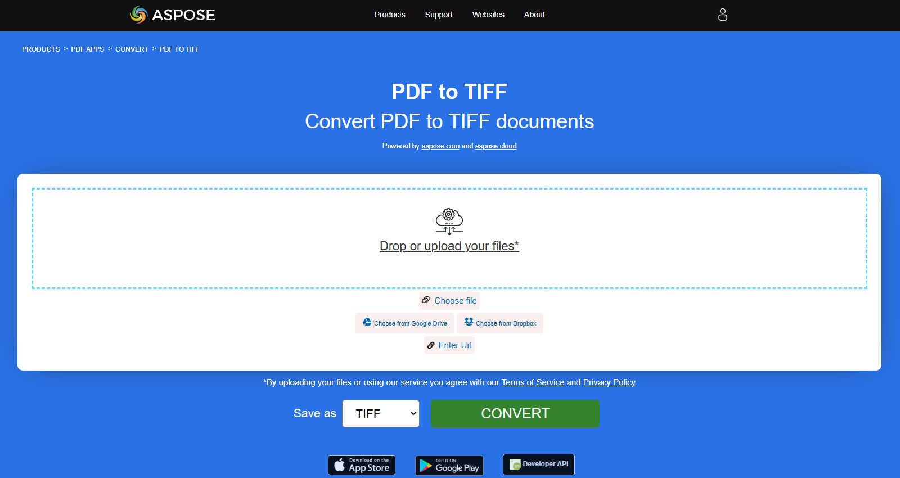

## Convertir le PDF en image

Dans cet article, nous vous montrerons les options de conversion de PDF en formats d'image.

Les documents numérisés précédemment sont souvent enregistrés au format PDF. Cependant, avez-vous besoin de le modifier dans un éditeur graphique ou de l'envoyer ensuite au format image ? Nous avons un outil universel pour convertir les PDF en images en utilisant **Aspose.PDF for Rust via C\u002B\u002B**.
La tâche la plus courante est lorsqu'il faut sauvegarder un document PDF entier ou certaines pages spécifiques d'un document sous forme d'images. **Aspose.PDF for Rust via C++** vous permet de convertir le PDF aux formats JPG et PNG afin de simplifier les étapes nécessaires pour obtenir vos images à partir d'un fichier PDF spécifique.

**Aspose.PDF for Rust via C++** prend en charge la conversion de divers formats PDF en image. Veuillez vérifier la section. [Formats de fichiers pris en charge par Aspose.PDF](https://docs.aspose.com/pdf/rust-cpp/supported-file-formats/).

### Convertir le PDF en JPEG

L'extrait de code Rust fourni montre comment convertir la première page d'un document PDF en image JPEG à l'aide de la bibliothèque Aspose.PDF :

1. Ouvrez un document PDF.
1. Convertir une Page en JPEG en utilisant [page_to_jpg](https://reference.aspose.com/pdf/rust-cpp/convert/page_to_jpg/) fonction.

```rs

  use asposepdf::Document;

  fn main() -> Result<(), Box<dyn std::error::Error>> {
      // Open a PDF-document with filename
      let pdf = Document::open("sample.pdf")?;

      // Convert and save the specified page as Jpg-image
      pdf.page_to_jpg(1, 100, "sample_page1.jpg")?;

      Ok(())
  }
```

{}
**Essayez de convertir PDF en JPEG en ligne**

Aspose.PDF for Rust vous présente une application en ligne gratuite ["PDF en JPEG"](https://products.aspose.app/pdf/conversion/pdf-to-jpg), où vous pouvez essayer d'examiner la fonctionnalité et la qualité avec laquelle il fonctionne.

[](https://products.aspose.app/pdf/conversion/pdf-to-jpg)
{}

### Convertir le PDF en TIFF

L'extrait de code Rust fourni montre comment convertir la première page d'un document PDF en image TIFF en utilisant la bibliothèque Aspose.PDF :

1. Ouvrez un document PDF.
1. Convertir une Page en TIFF en utilisant [page_to_tiff](https://reference.aspose.com/pdf/rust-cpp/convert/page_to_tiff/) fonction.

```rs

  use asposepdf::Document;

  fn main() -> Result<(), Box<dyn std::error::Error>> {
      // Open a PDF-document with filename
      let pdf = Document::open("sample.pdf")?;

      // Convert and save the specified page as Tiff-image
      pdf.page_to_tiff(1, 100, "sample_page1.tiff")?;

      Ok(())
  }
```

{}
**Essayer de convertir le PDF en TIFF en ligne**

Aspose.PDF for Rust vous présente une application en ligne gratuite [PDF en TIFF](https://products.aspose.app/pdf/conversion/pdf-to-tiff), où vous pouvez essayer d'examiner la fonctionnalité et la qualité avec laquelle il fonctionne.

[](https://products.aspose.app/pdf/conversion/pdf-to-tiff)
{}

### Convertir le PDF en PNG

L'extrait de code Rust fourni démontre comment convertir la première page d'un document PDF en image PNG en utilisant la bibliothèque Aspose.PDF :

1. Ouvrez un document PDF.
1. Convertir une Page en PNG en utilisant [page_vers_png](https://reference.aspose.com/pdf/rust-cpp/convert/page_to_png/) fonction.

```rs

  use asposepdf::Document;

  fn main() -> Result<(), Box<dyn std::error::Error>> {
      // Open a PDF-document with filename
      let pdf = Document::open("sample.pdf")?;

      // Convert and save the specified page as Png-image
      pdf.page_to_png(1, 100, "sample_page1.png")?;

      Ok(())
  }
```

{}
**Essayez de convertir le PDF en PNG en ligne**

À titre d'exemple du fonctionnement de nos applications gratuites, veuillez consulter la fonctionnalité suivante.

Aspose.PDF for Rust vous présente une application en ligne gratuite ["PDF en PNG"](https://products.aspose.app/pdf/conversion/pdf-to-png), où vous pouvez essayer d'examiner la fonctionnalité et la qualité avec laquelle il fonctionne.

[](https://products.aspose.app/pdf/conversion/pdf-to-png)
{}

**Scalable Vector Graphics (SVG)** est une famille de spécifications d'un format de fichier basé sur XML pour les graphiques vectoriels bidimensionnels, à la fois statiques et dynamiques (interactifs ou animés). La spécification SVG est une norme ouverte qui est en cours de développement par le World Wide Web Consortium (W3C) depuis 1999.

### Convertir le PDF en SVG

L'extrait de code Rust fourni montre comment convertir la première page d'un document PDF en image SVG à l'aide de la bibliothèque Aspose.PDF :

1. Ouvrez un document PDF.
1. Convertir une page en SVG en utilisant [page_vers_svg](https://reference.aspose.com/pdf/rust-cpp/convert/page_to_svg/) fonction.

```rs

  use asposepdf::Document;

  fn main() -> Result<(), Box<dyn std::error::Error>> {
      // Open a PDF-document with filename
      let pdf = Document::open("sample.pdf")?;

      // Convert and save the specified page as Svg-image
      pdf.page_to_svg(1, "sample_page1.svg")?;

      Ok(())
  }
```

{}
**Essayez de convertir le PDF en SVG en ligne**

Aspose.PDF for Rust vous présente une application en ligne gratuite ["PDF en SVG"](https://products.aspose.app/pdf/conversion/pdf-to-svg), où vous pouvez essayer d'examiner la fonctionnalité et la qualité avec laquelle il fonctionne.

[](https://products.aspose.app/pdf/conversion/pdf-to-svg)
{}

### Convertir le PDF en archive ZIP SVG

L'exemple suivant convertit un document PDF en archive SVG, où chaque page est enregistrée en tant que fichier SVG distinct à l'intérieur d'un conteneur ZIP.

1. Ouvrez le document PDF source.
1. Enregistrez le document sous forme d'archive ZIP contenant des fichiers SVG.

```rs

  use asposepdf::Document;

  fn main() -> Result<(), Box<dyn std::error::Error>> {
      // Open a PDF-document with filename
      let pdf = Document::open("sample.pdf")?;

      // Convert and save the previously opened PDF-document as SVG-archive
      pdf.save_svg_zip("sample_svg.zip")?;

      Ok(())
  }
```

### Convertir PDF en DICOM

L'extrait de code Rust fourni montre comment convertir la première page d'un document PDF en image DICOM à l'aide de la bibliothèque Aspose.PDF :

1. Ouvrez un document PDF.
1. Convertir une Page en DICOM à l'aide de [page_vers_dicom](https://reference.aspose.com/pdf/rust-cpp/convert/page_to_dicom/) fonction.

```rs

  use asposepdf::Document;

  fn main() -> Result<(), Box<dyn std::error::Error>> {
      // Open a PDF-document with filename
      let pdf = Document::open("sample.pdf")?;

      // Convert and save the specified page as DICOM-image
      pdf.page_to_dicom(1, 100, "sample_page1.dcm")?;

      Ok(())
  }
```

### Convertir le PDF en BMP

L'extrait de code Rust fourni montre comment convertir la première page d'un document PDF en image BMP en utilisant la bibliothèque Aspose.PDF :

1. Ouvrez un document PDF.
1. Convertir une Page en BMP en utilisant [page_to_bmp](https://reference.aspose.com/pdf/rust-cpp/convert/page_to_bmp/) fonction.

```rs

  use asposepdf::Document;

  fn main() -> Result<(), Box<dyn std::error::Error>> {
      // Open a PDF-document with filename
      let pdf = Document::open("sample.pdf")?;

      // Convert and save the specified page as Bmp-image
      pdf.page_to_bmp(1, 100, "sample_page1.bmp")?;

      Ok(())
  }
```