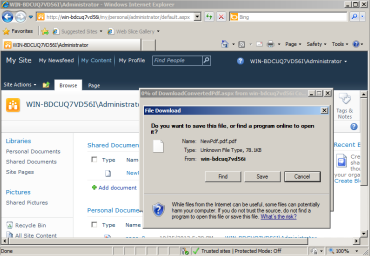

---
title: Convert PDF to PDFA in SharePoint
linktitle: Convertir un PDF en PDFA
type: docs
weight: 70
url: /fr/sharepoint/convert-pdf-to-pdfa/
lastmod: "2020-12-16"
description: Using the PDF SharePoint API, you may convert PDF to PDFA format. Currently it supports only PDF/A-1b standard.
---

{}

In [Aspose.PDF for SharePoint 2.0](https://releases.aspose.com/pdf/sharepoint/new-releases/aspose.pdf-for-sharepoint-2.0.0/) release we have added support to create PDFA compliant PDF.

Currently Aspose.PDF for SharePoint supports only PDFA1b standard.

{}

## Création d'un document conforme PDFA

Convert PDF from SharePoint Document library to PDFA as following:

1. Cliquez sur **Convertir en PDF** dans le menu de la BCE.

2. Téléchargez et enregistrez le fichier PDF obtenu.

