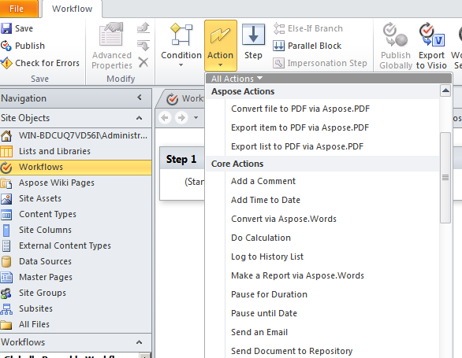

---
title: Conversion d'un fichier en PDF via une activité de workflow
linktitle: Conversion d'un fichier en PDF via une activité de workflow
type: docs
weight: 50
url: /fr/sharepoint/converting-a-file-to-pdf-via-workflow-activity/
lastmod: "2020-12-16"
description: L'API PDF SharePoint peut être utilisée dans un flux de travail SharePoint qui convertit un document au format PDF.
---

{}

La prise en charge des flux de travail est une fonctionnalité clé de Microsoft Office SharePoint Server. Les flux de travail aident à automatiser le mouvement des documents selon la logique métier et à rationaliser le coût et le temps d'organisation des documents. Cet article montre comment utiliser Aspose.PDF for SharePoint dans un flux de travail qui convertit un document au format PDF.

{}

## Configuration d'un flux de travail

Cet exemple crée un flux de travail qui convertit tout nouvel élément d'une bibliothèque de documents au format PDF et l'enregistre dans une autre bibliothèque de documents. L'exemple utilise la bibliothèque **Documents personnels** comme bibliothèque source et le sous-dossier **PDF** de la bibliothèque **Documents partagés** comme bibliothèque de destination.

Aspose.PDF for SharePoint prend en charge la conversion de fichiers HTML, texte et image.

### Concevoir le flux de travail à l'aide de SharePoint Designer

1. Ouvrez **SharePoint Designer** et connectez-vous au site sur lequel le flux de travail sera implémenté.
1. Sélectionnez **Workflows** à partir des **objets de site**, puis ouvrez **List Workflow**.
1. Sélectionnez la bibliothèque **Documents personnels** pour créer et joindre un nouveau flux de travail de liste à la bibliothèque de documents.

   **Selecting Personal Documents from the menu**

1. Créez et attachez le flux de travail de liste à la bibliothèque **Documents personnels** en saisissant un nom et une description du flux de travail.
1. Cliquez sur **OK** pour terminer cette étape.

   **Création d'un workflow de liste**

Un éditeur d'étape de workflow apparaît. Ceci est utilisé pour définir les conditions et les actions pour les flux de travail. Ajoutez maintenant une action pour convertir un nouveau document en PDF sans aucune condition, à partir de **Aspose Actions**.

1. Sélectionnez l'action **Convertir le fichier en PDF via Aspose.PDF** dans le menu **Action**.

   **Sélection et action**

1. Configurez les paramètres de l'action :
   1. Définissez le paramètre **ce dossier** sur le dossier de destination.
   1. Laissez les autres paramètres d'action comme valeurs par défaut ou définissez-les à l'aide de la fenêtre des propriétés de l'action. La valeur par défaut du paramètre **Overwrite** est false.

      **L'éditeur de flux de travail**

**Définition de la bibliothèque de destination**

**Définition des propriétés**

1. Dans le menu **Workflow**, sélectionnez **Paramètres du workflow**.
1. Sélectionnez **démarrer automatiquement le flux de travail lors de la création d'un nouvel élément** et désactivez les autres options dans **Options de démarrage**.

   **Définition des options de démarrage**

La conception du workflow est terminée.

1. Enregistrez et publiez le workflow pour l'implémenter sur le site SharePoint.

### Testez le flux de travail

Pour tester le flux de travail :

1. Ouvrez le site SharePoint et téléchargez un nouveau document dans la bibliothèque de documents **Documents personnels**.
   Aspose.PDF for SharePoint prend en charge la conversion de fichiers HTML, de fichiers texte et d'images (JPG, PNG, GIF, TIFF et BMP*) en PDF. Le flux de travail est configuré pour démarrer automatiquement lorsqu'un nouvel élément est créé, de sorte que les fichiers sont traités automatiquement.
1. Actualisez le navigateur.
   L'état du flux de travail apparaît dans la colonne du flux de travail, **Aspose.PDF Workflow** dans ce cas.

   **Ajout d'un document à la bibliothèque source**

1. Ouvrez la bibliothèque de documents de destination pour afficher le document converti. **Documents partagés/Pdf** est le chemin dans cet exemple.

   **La bibliothèque de destination**

