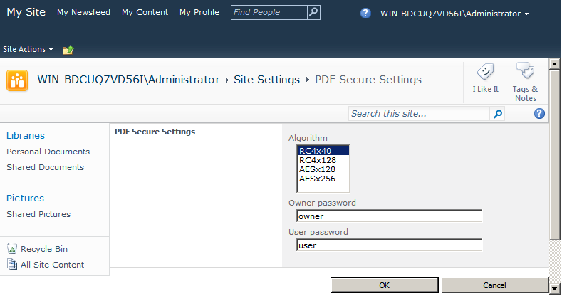

---
title: Créer un PDF sécurisé dans SharePoint
linktitle: Créer un PDF sécurisé
type: docs
weight: 60
url: /fr/sharepoint/creating-a-secure-pdf/
lastmod: "2020-12-16"
description: À l'aide de l'API PDF SharePoint, vous pouvez produire des PDF sécurisés et cryptés et spécifier leurs mots de passe dans SharePoint.
---

{}

Aspose.PDF pour SharePoint prend en charge la création de PDF sécurisés. L'installation d'Aspose.PDF pour SharePoint ajoute une option **Paramètres sécurisés PDF** dans les paramètres du site. Ici, vous pouvez définir le mot de passe utilisateur, le mot de passe propriétaire et toute valeur de la liste d'algorithmes pour crypter le PDF de sortie. La liste des algorithmes propose différentes combinaisons d'algorithmes de chiffrement et de tailles de clés. Passez la valeur de votre choix.

Cet article montre comment utiliser Aspose.PDF pour SharePoint pour générer un PDF chiffré.

{}

## Créer un PDF sécurisé

Pour illustrer cette fonctionnalité, nous configurons d'abord l'option **PDF Secure Setting** pour le mot de passe du propriétaire et de l'utilisateur et l'algorithme de cryptage. L'exemple fusionne ensuite deux documents d'une bibliothèque de documents.

### Définition des options de configuration sécurisée PDF

Ouvrez l'option **Paramètres sécurisés PDF** dans les paramètres du site et définissez l'algorithme, le mot de passe du propriétaire et le mot de passe de l'utilisateur.

Spécifiez différents mots de passe utilisateur et propriétaire lors du cryptage du fichier PDF.

- Le mot de passe utilisateur, s'il est défini, est ce que vous devez fournir pour ouvrir un PDF. Acrobat Reader invite un utilisateur à saisir le mot de passe utilisateur. Si c'est faux, le document ne s'ouvre pas.
- Le mot de passe du propriétaire, s'il est défini, contrôle les autorisations telles que l'impression, la modification, l'extraction, les commentaires, etc. Acrobat Reader interdit ces fonctionnalités en fonction des paramètres d'autorisation. Acrobat nécessite ce mot de passe si vous souhaitez définir/modifier les autorisations.

### Fusionner des documents

Fusionnez deux documents à l'aide de l'option **Convertir en PDF**. Cette fonctionnalité fusionne plusieurs fichiers non PDF (HTML, texte ou image) en un fichier PDF.

1. Ouvrez une bibliothèque de documents et sélectionnez les documents souhaités dans la liste.

1. Utilisez l'option **Fusionner au format PDF** des Outils de bibliothèque pour enregistrer le fichier de sortie. Vous êtes invité à enregistrer le fichier de sortie sur le disque.

### Sortir

Le fichier de sortie est crypté.

