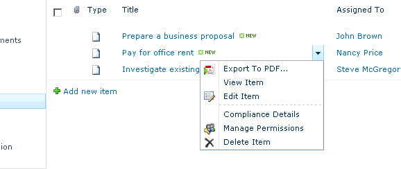

---
title: Exporter un élément particulier d'une liste au format PDF dans SharePoint
linktitle: Exporter un élément particulier à partir d'une liste
type: docs
weight: 10
url: /fr/sharepoint/export-a-particular-item-from-a-list/
lastmod: "2020-12-16"
description: L'API PDF SharePoint vous permet de convertir plusieurs documents, ou un à la fois, en PDF, comme indiqué dans cet article.
---

{}

Aspose.PDF for SharePoint vous permet de convertir plusieurs documents, ou un à la fois. Cet article montre comment exporter un élément d'une liste.

{}

Pour exporter un élément particulier à partir d'une liste : sélectionnez **Exporter vers Pdf** dans le bloc de contrôle d'édition (ECB) de l'élément.

## Sélection de Exporter vers Pdf dans l'ECB de l'article

## Exporter au format PDF

