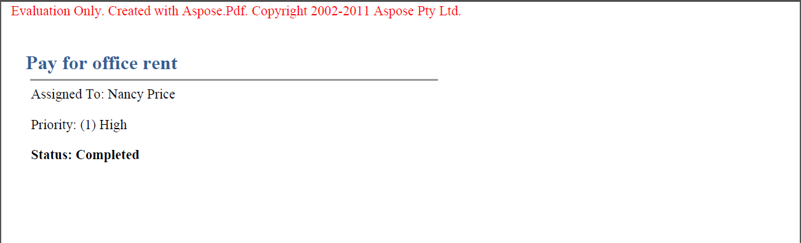

---
title: Évaluer Aspose.PDF for SharePoint
linktitle: Évaluer
type: docs
weight: 50
url: /fr/sharepoint/evaluate-aspose-pdf/
lastmod: "2020-12-16"
description: Profitez de l'évaluation gratuite de l'API PDF SharePoint car elle n'a pas de limite de temps et une assistance technique gratuite est également fournie aux utilisateurs d'évaluation.
---

{}

Assurez-vous de profiter de l'évaluation gratuite d'Aspose.PDF for SharePoint, car elle n'a pas de limite de durée et une assistance technique gratuite est également fournie aux utilisateurs de l'évaluation.

{}

Il s'agit du même téléchargement pour la version d'évaluation et la version payante d'Aspose.PDF for SharePoint. Téléchargez simplement Aspose.PDF for SharePoint à partir de la page de téléchargement, installez-le et il fonctionnera en mode d'évaluation par défaut.

Le mode évaluation injecte un avertissement d’évaluation dans les documents exportés. Lorsque vous avez acheté une licence, installez simplement la solution de licence sur la copie d'évaluation installée d'Aspose.PDF for SharePoint et elle fonctionnera alors en mode licence.

**Aspose.PDF for SharePoint injecte un avertissement d'évaluation lorsque vous travaillez en mode évaluation.**

