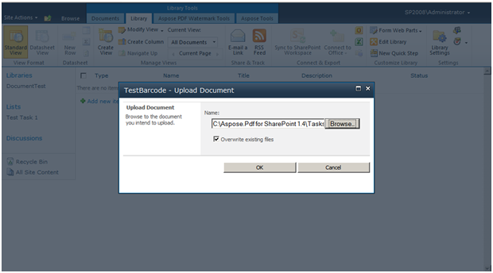
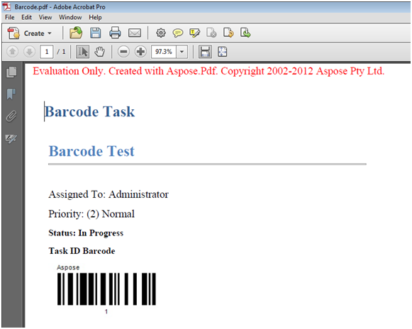

---
title: Exporter la liste des tâches au format PDF avec code-barres à l'aide du moteur de modèles PDF
linktitle: Exporter la liste des tâches au format PDF avec code-barres à l'aide du moteur de modèles PDF
type: docs
weight: 40
url: /fr/sharepoint/export-task-list-to-pdf-with-barcode-using-pdf-template-engine/
lastmod: "2020-12-16"
description: L'API PDF SharePoint peut exporter la liste des tâches au format PDF avec code-barres à l'aide du moteur de modèles PDF.
---

{}

Cet article montre comment configurer et exporter une liste de tâches au format PDF avec des codes-barres à l'aide d'Aspose.PDF pour SharePoint.

{}

Pour exporter une liste de tâches au format PDF avec un code-barres à l'aide du moteur de modèles, procédez comme suit :

1. Créez et téléchargez un modèle.
1. Remplissez les champs du modèle et enregistrez le modèle.
1. Créez et enregistrez une nouvelle tâche.
1. Exportez le document au format PDF.

Le processus est détaillé ci-dessous.

## Exportation de la liste des tâches au format PDF

{}

1. Créez une liste de modèles PDF.

2. Après avoir créé le modèle, cliquez sur **Ajouter un nouvel élément** dans la liste et téléchargez le fichier XML.

3. Une fois le téléchargement terminé, cliquez sur **OK**.
4. Remplissez les champs du formulaire.
5. Enregistrez le modèle.

Le modèle a été configuré.

6. Accédez à la liste **Tâches** et créez une nouvelle tâche.
7. Enregistrez la tâche.

8. Dans l'onglet **Aspose Tools**, cliquez sur **Exporter vers PDF**.

9. Sélectionnez le modèle configuré et cliquez sur **Exporter**.

Le PDF exporté :

{}

