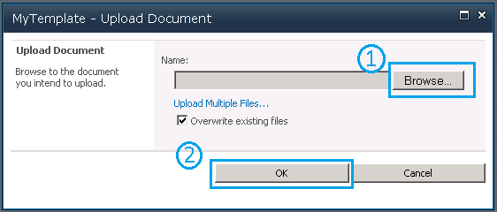
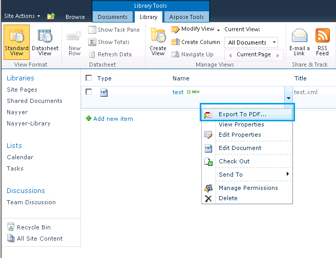

{}

Aspose.PDF for SharePoint est construit sur notre composant primé Aspose.PDF pour .NET. Aspose.PDF pour .NET offre des fonctionnalités remarquables depuis la création d'un document PDF à partir de zéro jusqu'à la manipulation de fichiers PDF existants. Parmi ces fonctionnalités, la conversion XML en PDF est l'une des fonctionnalités intéressantes prises en charge par ce produit. Nous pensons donc qu'Aspose.PDF for SharePoint sera également capable de convertir des fichiers XML au format PDF.

{}

## Création d'un fichier XML et conversion en PDF

{}

Étape par étape, cet article vous guide tout au long du processus de création d'un fichier XML et de sa conversion en PDF :

1. [Créer un fichier XML](/pdf/fr/sharepoint/how-to-create-and-convert-an-xml-file-to-pdf/#step-1-create-xml-file).
2. [Créer un modèle PDF](/pdf/fr/sharepoint/how-to-create-and-convert-an-xml-file-to-pdf/#step-2-create-pdf-template).
3. [Charger le modèle XML](/pdf/fr/sharepoint/how-to-create-and-convert-an-xml-file-to-pdf/#step-3-load-xml-template).
4. [Spécifiez le chemin d'accès au chemin source](/pdf/fr/sharepoint/how-to-create-and-convert-an-xml-file-to-pdf/#step-4-specify-source-file-path).
5. [Spécifier les propriétés du fichier](/pdf/fr/sharepoint/how-to-create-and-convert-an-xml-file-to-pdf/#step-5-specify-file-properties).
6. [Exporter le fichier au format PDF](/pdf/fr/sharepoint/how-to-create-and-convert-an-xml-file-to-pdf/#step-6-export-to-pdf).
7. [Enregistrez le fichier PDF](/pdf/fr/sharepoint/how-to-create-and-convert-an-xml-file-to-pdf/#step-7-save-pdf-document)

### Étape 1 Créer un fichier XML

Créez d’abord un fichier XML basé sur le modèle d’objet de document Aspose.PDF pour .NET.

Selon Aspose.PDF pour .NET DOM, un document PDF contient une collection d'objets Section et une Section contient un ou plusieurs éléments Paragraph. Le texte est un objet de niveau paragraphe et peut contenir un ou plusieurs segments. Ci-dessous, un exemple de chaîne de texte est ajouté à un objet Segment et ajouté à un objet Text. Enfin, l'élément Text est ajouté à la collection de paragraphes de l'objet Section.

```xml

<?xml version="1.0" encoding="utf-8" ?>

  <Pdf xmlns="Aspose.PDF">

   <Section>

    <Text>

            <Segment>Hello World</Segment>

    </Text>

   </Section>

  </Pdf>

```

### Étape 2 Créer un modèle PDF

Avant de continuer, assurez-vous que le serveur SharePoint Foundation 2010 est correctement installé et configuré sur le système sur lequel la conversion aura lieu.

1. Connectez-vous au site SharePoint.
1. Sélectionnez **Action du site** et **Tous les éléments**.
1. Sélectionnez l'option **Créer** et sélectionnez **Modèle PDF** dans la liste.
1. Entrez un nom de modèle.
1. Cliquez sur **Créer**.


### Étape 3 Charger le modèle XML

Une fois le modèle créé, chargez [le fichier XML](/pdf/fr/sharepoint/how-to-create-and-convert-an-xml-file-to-pdf/)

1. Sur la page du modèle PDF, sélectionnez **Ajouter un nouvel élément**.


### Étape 4 Spécifiez le chemin du fichier source

Dans la boîte de dialogue de téléchargement de document :

1. Cliquez sur **Parcourir** et localisez le fichier XML sur votre système. Vous pouvez activer la case à cocher pour écraser l'option de fichier existant.
1. Appuyez sur le bouton **OK**.



### Étape 5 Spécifier les propriétés du fichier

Une fois le fichier chargé, ajoutez des informations dans les champs obligatoires (marqués d'un astérisque rouge : *).

Pour cet exemple, une description d'échantillon a été ajoutée et les champs suivants ont été complétés :

1. Une brève description du document.
1. Saisissez **AllListTypes** pour le champ **Assigned List Types**.
1. Sélectionnez **Liste** dans le menu **Type**.
   Assurez-vous que le statut reste **Actif**.
1. Cliquez sur **Enregistrer** pour enregistrer les propriétés.


### Étape 6 Exporter au format PDF

Lorsque le fichier XML a été ajouté au modèle PDF :
Soit:

1. Cliquez avec le bouton droit sur le fichier test.xml.
1. Sélectionnez **Exporter au format PDF** dans le menu.

Ou:

1. Sélectionnez **Aspose Tools** dans **Outils de bibliothèque**.
1. Cliquez sur **Exporter**.



### Étape 7 Enregistrer le document PDF

1. Dans la boîte de dialogue Exporter au format PDF, sélectionnez **Stockage du modèle** (l'emplacement où le fichier source est stocké).
1. Sélectionnez le fichier à exporter dans le menu **Nom du modèle**.
1. Cliquez sur **Exporter au format PDF** pour enregistrer le document PDF final.


## Ouvrez le PDF

Le document PDF a été enregistré et peut être ouvert. Dans l'image ci-dessous, notez l'expression « Hello World » qui se trouvait dans la balise de segment du XML. Notez également que PDF Producer est Aspose.PDF for SharePoint.


{}

