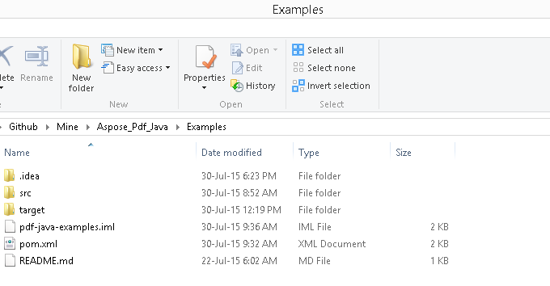

## Unduh dari GitHub

Semua contoh Aspose.PDF untuk Android via Java dihosting di [GitHub](https://github.com/aspose-pdf/Aspose.PDF-for-Java). Anda dapat menyalin repositori menggunakan klien Github favorit Anda atau mengunduh file ZIP dari [di sini](https://github.com/aspose-pdf/Aspose.PDF-for-Java/archive/master.zip).

Ekstrak isi file ZIP ke folder mana saja di komputer Anda. Semua contoh berada di folder **Examples**.

Proyek ini menggunakan sistem build Maven. IDE modern apa pun dapat dengan mudah membuka atau mengimpor proyek dan dependensinya. Di bawah ini kami menunjukkan cara menggunakan IDE populer untuk membangun dan menjalankan contoh.

### IntelliJ IDEA

Klik pada menu **File** dan pilih **Open**. Telusuri ke folder proyek dan pilih file **pom.xml**.

Ini akan membuka proyek dan mengunduh dependensi secara otomatis. Dari tab Project, telusuri contoh-contoh di folder **src/main/java**. Untuk menjalankan contoh, cukup klik kanan pada file dan pilih "Run ..", contoh akan dijalankan dan output akan ditampilkan di jendela konsol bawaan.

### Eclipse

Klik pada menu **File** dan pilih **Import**. Pilih **Maven** - Existing Maven Projects.

Telusuri ke folder yang Anda kloning atau unduh dari GitHub dan pilih file **pom.xml**.

Ini akan membuka proyek dan mengunduh dependensi secara otomatis. Dari tab Package Explorer, telusuri contoh-contoh di folder **src/main/java**. Untuk menjalankan contoh, cukup klik kanan pada file dan pilih **Run As** - **Java Application**, contoh akan dijalankan dan output akan ditampilkan di jendela konsol bawaan.

### NetBeans

Klik pada menu **File** dan pilih **Open Project**. Telusuri ke folder yang Anda kloning atau unduh dari GitHub. Ikon folder **Examples** akan menunjukkan bahwa itu adalah proyek Maven. Pilih Examples dan buka itu.

Ini akan membuka proyek dan mengunduh dependensi secara otomatis. Dari tab Projects, telusuri contoh di **source packages**. Untuk menjalankan contoh, cukup klik kanan pada file dan pilih **Run File**, contoh akan dijalankan dan output akan ditampilkan di jendela konsol bawaan.

### Berkontribusi

Jika Anda ingin menambahkan atau meningkatkan sebuah contoh, kami mendorong Anda untuk berkontribusi pada proyek ini. Semua contoh dan proyek showcase di repositori ini bersifat sumber terbuka dan dapat digunakan secara bebas dalam aplikasi Anda sendiri.

Untuk berkontribusi, Anda dapat melakukan fork pada repositori, mengedit kode sumber, dan membuat pull request. Kami akan meninjau perubahan tersebut dan memasukkannya ke dalam repositori jika dianggap bermanfaat.

