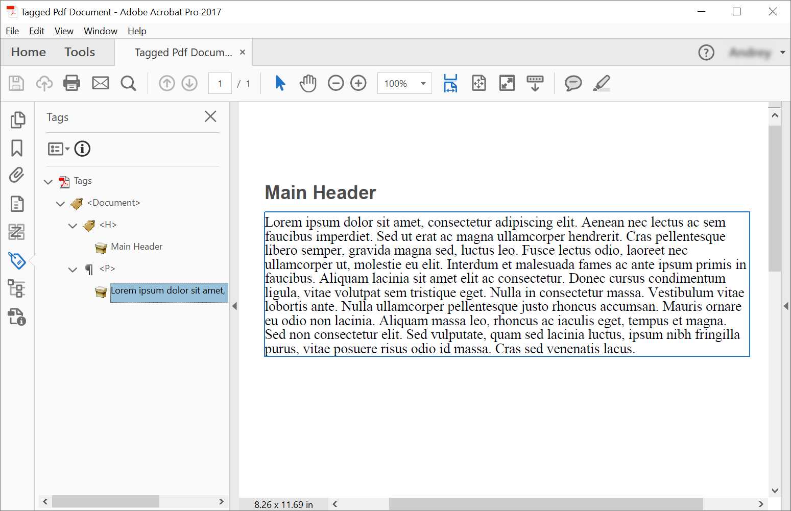

<script type="application/ld+json">
{
    "@context": "https://schema.org",
    "@type": "TechArticle",
    "headline": "Create Tagged PDF using C#",
    "alternativeHeadline": "Programmatically create tagged PDFs using C#",
    "abstract": "Buat dokumen PDF berlabel secara programatis menggunakan C# dan Aspose.PDF, memastikan kepatuhan terhadap PDF/UA. Fitur ini memungkinkan pembuatan dokumen PDF terstruktur dengan elemen seperti header dan paragraf, mendukung struktur bersarang dan penataan teks untuk aksesibilitas. Perpustakaan ini juga mencakup validasi untuk memastikan standar PDF/UA terpenuhi",
    "author": {
        "@type": "Person",
        "name": "Anastasiia Holub",
        "givenName": "Anastasiia",
        "familyName": "Holub",
        "url": "https://www.linkedin.com/in/anastasiia-holub-750430225/"
    },
    "genre": "pdf document generation",
    "keywords": "Tagged PDF, C#, Aspose.PDF, PDF/UA, Structure Elements, ITaggedContent, AppendChild,  StructureTextState",
    "wordcount": "1163",
    "proficiencyLevel": "Beginner",
    "publisher": {
        "@type": "Organization",
        "name": "Aspose.PDF for .NET",
        "url": "https://products.aspose.com/pdf",
        "logo": "https://www.aspose.cloud/templates/aspose/img/products/pdf/aspose_pdf-for-net.svg",
        "alternateName": "Aspose",
        "sameAs": [
            "https://facebook.com/aspose.pdf/",
            "https://twitter.com/asposepdf",
            "https://www.youtube.com/channel/UCmV9sEg_QWYPi6BJJs7ELOg/featured",
            "https://www.linkedin.com/company/aspose",
            "https://stackoverflow.com/questions/tagged/aspose",
            "https://aspose.quora.com/",
            "https://aspose.github.io/"
        ],
        "contactPoint": [
            {
                "@type": "ContactPoint",
                "telephone": "+1 903 306 1676",
                "contactType": "sales",
                "areaServed": "US",
                "availableLanguage": "en"
            },
            {
                "@type": "ContactPoint",
                "telephone": "+44 141 628 8900",
                "contactType": "sales",
                "areaServed": "GB",
                "availableLanguage": "en"
            },
            {
                "@type": "ContactPoint",
                "telephone": "+61 2 8006 6987",
                "contactType": "sales",
                "areaServed": "AU",
                "availableLanguage": "en"
            }
        ]
    },
    "url": "/net/create-tagged-pdf/",
    "mainEntityOfPage": {
        "@type": "WebPage",
        "@id": "/net/create-tagged-pdf/"
    },
    "dateModified": "2022-11-25",
    "description": "Artikel ini menjelaskan cara membuat elemen struktur untuk dokumen PDF berlabel secara programatis menggunakan Aspose.PDF for .NET."
}
</script>

Membuat PDF berlabel berarti menambahkan (atau membuat) elemen tertentu ke dokumen yang akan memungkinkan dokumen tersebut divalidasi sesuai dengan persyaratan PDF/UA. Elemen-elemen ini sering disebut Elemen Struktur.

Potongan kode berikut juga bekerja dengan perpustakaan [Aspose.PDF.Drawing](/pdf/net/drawing/).

## Membuat PDF Berlabel (Skenario Sederhana)

Untuk membuat elemen struktur dalam Dokumen PDF Berlabel, Aspose.PDF menawarkan metode untuk membuat elemen struktur menggunakan antarmuka [ITaggedContent](https://reference.aspose.com/pdf/net/aspose.pdf.tagged/itaggedcontent). Potongan kode berikut menunjukkan cara membuat PDF berlabel yang berisi 2 elemen: header dan paragraf.



```csharp
// For complete examples and data files, visit https://github.com/aspose-pdf/Aspose.PDF-for-.NET
private static void CreateTaggedPdfDocument01()
{
    // The path to the documents directory
    var dataDir = RunExamples.GetDataDir_AsposePdf_WorkingDocuments();

    // Create PDF document
    using (var document = new Aspose.Pdf.Document())
    {
        // Get Content for work with TaggedPdf
        Aspose.Pdf.Tagged.ITaggedContent taggedContent = document.TaggedContent;
        var rootElement = taggedContent.RootElement;

        // Set Title and Language for Document
        taggedContent.SetTitle("Tagged Pdf Document");
        taggedContent.SetLanguage("en-US");

        Aspose.Pdf.LogicalStructure.HeaderElement mainHeader = taggedContent.CreateHeaderElement();
        mainHeader.SetText("Main Header");

        Aspose.Pdf.LogicalStructure.ParagraphElement paragraphElement = taggedContent.CreateParagraphElement();
        paragraphElement.SetText("Lorem ipsum dolor sit amet, consectetur adipiscing elit. " +
            "Aenean nec lectus ac sem faucibus imperdiet. Sed ut erat ac magna ullamcorper hendrerit. " +
            "Cras pellentesque libero semper, gravida magna sed, luctus leo. Fusce lectus odio, laoreet" +
            "nec ullamcorper ut, molestie eu elit. Interdum et malesuada fames ac ante ipsum primis in faucibus." +
            "Aliquam lacinia sit amet elit ac consectetur. Donec cursus condimentum ligula, vitae volutpat" +
            "sem tristique eget. Nulla in consectetur massa. Vestibulum vitae lobortis ante. Nulla ullamcorper" +
            "pellentesque justo rhoncus accumsan. Mauris ornare eu odio non lacinia. Aliquam massa leo, rhoncus" +
            "ac iaculis eget, tempus et magna. Sed non consectetur elit. Sed vulputate, quam sed lacinia luctus," +
            "ipsum nibh fringilla purus, vitae posuere risus odio id massa. Cras sed venenatis lacus.");

        rootElement.AppendChild(mainHeader);
        rootElement.AppendChild(paragraphElement);

        // Save Tagged PDF document
        document.Save(dataDir + "TaggedPdfDocument_out.pdf");
    }
}
```



```csharp
// For complete examples and data files, visit https://github.com/aspose-pdf/Aspose.PDF-for-.NET
private static void CreateTaggedPdfDocument01()
{
    // The path to the documents directory
    var dataDir = RunExamples.GetDataDir_AsposePdf_WorkingDocuments();

    // Create PDF Document
    using var document = new Aspose.Pdf.Document();

    // Get Content for work with TaggedPdf
    Aspose.Pdf.Tagged.ITaggedContent taggedContent = document.TaggedContent;
    var rootElement = taggedContent.RootElement;

    // Set Title and Language for Document
    taggedContent.SetTitle("Tagged Pdf Document");
    taggedContent.SetLanguage("en-US");

    Aspose.Pdf.LogicalStructure.HeaderElement mainHeader = taggedContent.CreateHeaderElement();
    mainHeader.SetText("Main Header");

    Aspose.Pdf.LogicalStructure.ParagraphElement paragraphElement = taggedContent.CreateParagraphElement();
    paragraphElement.SetText("Lorem ipsum dolor sit amet, consectetur adipiscing elit. " +
        "Aenean nec lectus ac sem faucibus imperdiet. Sed ut erat ac magna ullamcorper hendrerit. " +
        "Cras pellentesque libero semper, gravida magna sed, luctus leo. Fusce lectus odio, laoreet" +
        "nec ullamcorper ut, molestie eu elit. Interdum et malesuada fames ac ante ipsum primis in faucibus." +
        "Aliquam lacinia sit amet elit ac consectetur. Donec cursus condimentum ligula, vitae volutpat" +
        "sem tristique eget. Nulla in consectetur massa. Vestibulum vitae lobortis ante. Nulla ullamcorper" +
        "pellentesque justo rhoncus accumsan. Mauris ornare eu odio non lacinia. Aliquam massa leo, rhoncus" +
        "ac iaculis eget, tempus et magna. Sed non consectetur elit. Sed vulputate, quam sed lacinia luctus," +
        "ipsum nibh fringilla purus, vitae posuere risus odio id massa. Cras sed venenatis lacus.");

    rootElement.AppendChild(mainHeader);
    rootElement.AppendChild(paragraphElement);

    // Save Tagged PDF Document
    document.Save(dataDir + "TaggedPdfDocument_out.pdf");
}
```



Kami akan mendapatkan dokumen berikut setelah pembuatan:



## Membuat PDF Berlabel dengan elemen bersarang (Membuat Pohon Elemen Struktur)

Dalam beberapa kasus, kita perlu membuat struktur yang lebih kompleks, misalnya menempatkan kutipan dalam paragraf. 
Untuk membuat pohon elemen struktur, kita harus menggunakan metode [AppendChild](https://reference.aspose.com/pdf/net/aspose.pdf.logicalstructure/element/methods/appendchild).
Potongan kode berikut menunjukkan cara membuat pohon elemen struktur dari Dokumen PDF Berlabel:



```csharp
// For complete examples and data files, visit https://github.com/aspose-pdf/Aspose.PDF-for-.NET
private static void CreateTaggedPdfDocument02()
{
    // The path to the documents directory
    var dataDir = RunExamples.GetDataDir_AsposePdf_WorkingDocuments();

    // Create PDF Document
    using (var document = new Aspose.Pdf.Document())
    {
        // Get Content for work with TaggedPdf
        Aspose.Pdf.Tagged.ITaggedContent taggedContent = document.TaggedContent;
        var rootElement = taggedContent.RootElement;

        // Set Title and Language for Document
        taggedContent.SetTitle("Tagged Pdf Document");
        taggedContent.SetLanguage("en-US");

        Aspose.Pdf.LogicalStructure.HeaderElement header1 = taggedContent.CreateHeaderElement(1);
        header1.SetText("Header Level 1");

        Aspose.Pdf.LogicalStructure.ParagraphElement paragraphWithQuotes = taggedContent.CreateParagraphElement();
        paragraphWithQuotes.StructureTextState.Font = Aspose.Pdf.Text.FontRepository.FindFont("Calibri");
        paragraphWithQuotes.StructureTextState.MarginInfo = new Aspose.Pdf.MarginInfo(10, 5, 10, 5);

        Aspose.Pdf.LogicalStructure.SpanElement spanElement1 = taggedContent.CreateSpanElement();
        spanElement1.SetText("Lorem ipsum dolor sit amet, consectetur adipiscing elit. Aenean nec lectus ac sem faucibus imperdiet. Sed ut erat ac magna ullamcorper hendrerit. Cras pellentesque libero semper, gravida magna sed, luctus leo. Fusce lectus odio, laoreet nec ullamcorper ut, molestie eu elit. Interdum et malesuada fames ac ante ipsum primis in faucibus. Aliquam lacinia sit amet elit ac consectetur. Donec cursus condimentum ligula, vitae volutpat sem tristique eget. Nulla in consectetur massa. Vestibulum vitae lobortis ante. Nulla ullamcorper pellentesque justo rhoncus accumsan. Mauris ornare eu odio non lacinia. Aliquam massa leo, rhoncus ac iaculis eget, tempus et magna. Sed non consectetur elit. ");

        Aspose.Pdf.LogicalStructure.QuoteElement quoteElement = taggedContent.CreateQuoteElement();
        quoteElement.SetText("Sed vulputate, quam sed lacinia luctus, ipsum nibh fringilla purus, vitae posuere risus odio id massa.");
        quoteElement.StructureTextState.FontStyle = Aspose.Pdf.Text.FontStyles.Bold | Aspose.Pdf.Text.FontStyles.Italic;
        Aspose.Pdf.LogicalStructure.SpanElement spanElement2 = taggedContent.CreateSpanElement();
        spanElement2.SetText(" Sed non consectetur elit.");

        paragraphWithQuotes.AppendChild(spanElement1);
        paragraphWithQuotes.AppendChild(quoteElement);
        paragraphWithQuotes.AppendChild(spanElement2);

        rootElement.AppendChild(header1);
        rootElement.AppendChild(paragraphWithQuotes);

        // Save Tagged PDF Document
        document.Save(dataDir + "TaggedPdfDocument_out.pdf");
    }
}
```



```csharp
// For complete examples and data files, visit https://github.com/aspose-pdf/Aspose.PDF-for-.NET
private static void CreateTaggedPdfDocument02()
{
    // The path to the documents directory
    var dataDir = RunExamples.GetDataDir_AsposePdf_WorkingDocuments();

    // Create PDF Document
    using var document = new Aspose.Pdf.Document();

    // Get Content for work with TaggedPdf
    Aspose.Pdf.Tagged.ITaggedContent taggedContent = document.TaggedContent;
    var rootElement = taggedContent.RootElement;

    // Set Title and Language for Document
    taggedContent.SetTitle("Tagged Pdf Document");
    taggedContent.SetLanguage("en-US");

    Aspose.Pdf.LogicalStructure.HeaderElement header1 = taggedContent.CreateHeaderElement(1);
    header1.SetText("Header Level 1");

    Aspose.Pdf.LogicalStructure.ParagraphElement paragraphWithQuotes = taggedContent.CreateParagraphElement();
    paragraphWithQuotes.StructureTextState.Font = Aspose.Pdf.Text.FontRepository.FindFont("Calibri");
    paragraphWithQuotes.StructureTextState.MarginInfo = new Aspose.Pdf.MarginInfo(10, 5, 10, 5);

    Aspose.Pdf.LogicalStructure.SpanElement spanElement1 = taggedContent.CreateSpanElement();
    spanElement1.SetText("Lorem ipsum dolor sit amet, consectetur adipiscing elit. Aenean nec lectus ac sem faucibus imperdiet. Sed ut erat ac magna ullamcorper hendrerit. Cras pellentesque libero semper, gravida magna sed, luctus leo. Fusce lectus odio, laoreet nec ullamcorper ut, molestie eu elit. Interdum et malesuada fames ac ante ipsum primis in faucibus. Aliquam lacinia sit amet elit ac consectetur. Donec cursus condimentum ligula, vitae volutpat sem tristique eget. Nulla in consectetur massa. Vestibulum vitae lobortis ante. Nulla ullamcorper pellentesque justo rhoncus accumsan. Mauris ornare eu odio non lacinia. Aliquam massa leo, rhoncus ac iaculis eget, tempus et magna. Sed non consectetur elit. ");

    Aspose.Pdf.LogicalStructure.QuoteElement quoteElement = taggedContent.CreateQuoteElement();
    quoteElement.SetText("Sed vulputate, quam sed lacinia luctus, ipsum nibh fringilla purus, vitae posuere risus odio id massa.");
    quoteElement.StructureTextState.FontStyle = Aspose.Pdf.Text.FontStyles.Bold | Aspose.Pdf.Text.FontStyles.Italic;
    Aspose.Pdf.LogicalStructure.SpanElement spanElement2 = taggedContent.CreateSpanElement();
    spanElement2.SetText(" Sed non consectetur elit.");

    paragraphWithQuotes.AppendChild(spanElement1);
    paragraphWithQuotes.AppendChild(quoteElement);
    paragraphWithQuotes.AppendChild(spanElement2);

    rootElement.AppendChild(header1);
    rootElement.AppendChild(paragraphWithQuotes);

    // Save Tagged PDF Document
    document.Save(dataDir + "TaggedPdfDocument_out.pdf");
}
```



Kami akan mendapatkan dokumen berikut setelah pembuatan:


## Menata Struktur Teks

Untuk menata struktur teks dalam Dokumen PDF Berlabel, Aspose.PDF menawarkan properti [Font](https://reference.aspose.com/pdf/net/aspose.pdf.logicalstructure/structuretextstate/properties/font), [FontSize](https://reference.aspose.com/pdf/net/aspose.pdf.logicalstructure/structuretextstate/properties/fontsize), [FontStyle](https://reference.aspose.com/pdf/net/aspose.pdf.logicalstructure/structuretextstate/properties/fontstyle) dan [ForegroundColor](https://reference.aspose.com/pdf/net/aspose.pdf.logicalstructure/structuretextstate/properties/foregroundcolor) dari Kelas [StructureTextState](https://reference.aspose.com/pdf/net/aspose.pdf.logicalstructure/structuretextstate). Potongan kode berikut menunjukkan cara menata struktur teks dalam Dokumen PDF Berlabel:



```csharp
// For complete examples and data files, visit https://github.com/aspose-pdf/Aspose.PDF-for-.NET
private static void AddStyle()
{
    // The path to the documents directory
    var dataDir = RunExamples.GetDataDir_AsposePdf_WorkingDocuments();

    // Create PDF Document
    using (var document = new Aspose.Pdf.Document())
    {
        // Get Content for work with TaggedPdf
        Aspose.Pdf.Tagged.ITaggedContent taggedContent = document.TaggedContent;

        // Set Title and Language for Document
        taggedContent.SetTitle("Tagged Pdf Document");
        taggedContent.SetLanguage("en-US");

        Aspose.Pdf.LogicalStructure.ParagraphElement p = taggedContent.CreateParagraphElement();
        taggedContent.RootElement.AppendChild(p);

        p.StructureTextState.FontSize = 18F;
        p.StructureTextState.ForegroundColor = Aspose.Pdf.Color.Red;
        p.StructureTextState.FontStyle = Aspose.Pdf.Text.FontStyles.Italic;

        p.SetText("Red italic text.");

        // Save Tagged Pdf Document
        document.Save(dataDir + "StyleTextStructure_out.pdf");
    }
}
```



```csharp
// For complete examples and data files, visit https://github.com/aspose-pdf/Aspose.PDF-for-.NET
private static void AddStyle()
{
    // The path to the documents directory
    var dataDir = RunExamples.GetDataDir_AsposePdf_WorkingDocuments();

    // Create PDF Document
    using var document = new Aspose.Pdf.Document();

    // Get Content for work with TaggedPdf
    Aspose.Pdf.Tagged.ITaggedContent taggedContent = document.TaggedContent;

    // Set Title and Language for Document
    taggedContent.SetTitle("Tagged Pdf Document");
    taggedContent.SetLanguage("en-US");

    Aspose.Pdf.LogicalStructure.ParagraphElement p = taggedContent.CreateParagraphElement();
    taggedContent.RootElement.AppendChild(p);

    p.StructureTextState.FontSize = 18F;
    p.StructureTextState.ForegroundColor = Aspose.Pdf.Color.Red;
    p.StructureTextState.FontStyle = Aspose.Pdf.Text.FontStyles.Italic;

    p.SetText("Red italic text.");

    // Save Tagged Pdf Document
    document.Save(dataDir + "StyleTextStructure_out.pdf");
}
```



## Mengilustrasikan Elemen Struktur

Untuk mengilustrasikan elemen struktur dalam Dokumen PDF Berlabel, Aspose.PDF menawarkan kelas [IllustrationElement](https://reference.aspose.com/pdf/net/aspose.pdf.logicalstructure/illustrationelement). Potongan kode berikut menunjukkan cara mengilustrasikan elemen struktur dalam Dokumen PDF Berlabel:



```csharp
// For complete examples and data files, visit https://github.com/aspose-pdf/Aspose.PDF-for-.NET
private static void IllustrateStructureElements()
{
    // The path to the documents directory
    var dataDir = RunExamples.GetDataDir_AsposePdf_WorkingDocuments();

    // Create PDF Document
    using (var document = new Aspose.Pdf.Document())
    {
        // Get Content for work with TaggedPdf
        Aspose.Pdf.Tagged.ITaggedContent taggedContent = document.TaggedContent;

        // Set Title and Language for Document
        taggedContent.SetTitle("Tagged Pdf Document");
        taggedContent.SetLanguage("en-US");

        Aspose.Pdf.LogicalStructure.IllustrationElement figure1 = taggedContent.CreateFigureElement();
        taggedContent.RootElement.AppendChild(figure1);
        figure1.AlternativeText = "Figure One";
        figure1.Title = "Image 1";
        figure1.SetTag("Fig1");
        figure1.SetImage(dataDir + "image.png");

        // Save Tagged Pdf Document
        document.Save(dataDir + "IllustrationStructureElements_out.pdf");
    }
}
```



```csharp
// For complete examples and data files, visit https://github.com/aspose-pdf/Aspose.PDF-for-.NET
private static void IllustrateStructureElements()
{
    // The path to the documents directory
    var dataDir = RunExamples.GetDataDir_AsposePdf_WorkingDocuments();

    // Create PDF Document
    using var document = new Aspose.Pdf.Document();

    // Get Content for work with TaggedPdf
    Aspose.Pdf.Tagged.ITaggedContent taggedContent = document.TaggedContent;

    // Set Title and Language for Document
    taggedContent.SetTitle("Tagged Pdf Document");
    taggedContent.SetLanguage("en-US");

    Aspose.Pdf.LogicalStructure.IllustrationElement figure1 = taggedContent.CreateFigureElement();
    taggedContent.RootElement.AppendChild(figure1);
    figure1.AlternativeText = "Figure One";
    figure1.Title = "Image 1";
    figure1.SetTag("Fig1");
    figure1.SetImage(dataDir + "image.png");

    // Save Tagged Pdf Document
    document.Save(dataDir + "IllustrationStructureElements_out.pdf");
}
```



## Memvalidasi PDF Berlabel

Aspose.PDF for .NET menyediakan kemampuan untuk memvalidasi Dokumen PDF Berlabel PDF/UA. Validasi standar PDF/UA mendukung:

- Memeriksa XObjects.
- Memeriksa Tindakan.
- Memeriksa Konten Opsional.
- Memeriksa File Tersemat.
- Memeriksa Bidang Acroform (Memvalidasi Bahasa Alami dan Nama Alternatif serta Tanda Tangan Digital).
- Memeriksa Bidang Formulir XFA.
- Memeriksa pengaturan Keamanan.
- Memeriksa Navigasi.
- Memeriksa Anotasi.

Potongan kode di bawah ini menunjukkan cara memvalidasi Dokumen PDF Berlabel. Masalah yang sesuai akan ditampilkan dalam laporan log XML.



```csharp
// For complete examples and data files, visit https://github.com/aspose-pdf/Aspose.PDF-for-.NET
private static void ValidateTaggedPdf()
{
    // The path to the documents directory
    var dataDir = RunExamples.GetDataDir_AsposePdf_WorkingDocuments();

    // Open PDF document
    using (var document = new Aspose.Pdf.Document(dataDir + "StructureElements.pdf"))
    {
        bool isValid = document.Validate(dataDir + "StructureElements_log.xml", Aspose.Pdf.PdfFormat.PDF_UA_1);
    }
}
```



```csharp
// For complete examples and data files, visit https://github.com/aspose-pdf/Aspose.PDF-for-.NET
private static void ValidateTaggedPdf()
{
    // The path to the documents directory
    var dataDir = RunExamples.GetDataDir_AsposePdf_WorkingDocuments();

    // Open PDF document
    using var document = new Aspose.Pdf.Document(dataDir + "StructureElements.pdf");

    bool isValid = document.Validate(dataDir + "StructureElements_log.xml", Aspose.Pdf.PdfFormat.PDF_UA_1);
}
```



<script type="application/ld+json">
{
    "@context": "http://schema.org",
    "@type": "SoftwareApplication",
    "name": "Aspose.PDF for .NET Library",
    "image": "https://www.aspose.cloud/templates/aspose/img/products/pdf/aspose_pdf-for-net.svg",
    "url": "https://www.aspose.com/",
    "publisher": {
        "@type": "Organization",
        "name": "Aspose.PDF",
        "url": "https://products.aspose.com/pdf",
        "logo": "https://www.aspose.cloud/templates/aspose/img/products/pdf/aspose_pdf-for-net.svg",
        "alternateName": "Aspose",
        "sameAs": [
            "https://facebook.com/aspose.pdf/",
            "https://twitter.com/asposepdf",
            "https://www.youtube.com/channel/UCmV9sEg_QWYPi6BJJs7ELOg/featured",
            "https://www.linkedin.com/company/aspose",
            "https://stackoverflow.com/questions/tagged/aspose",
            "https://aspose.quora.com/",
            "https://aspose.github.io/"
        ],
        "contactPoint": [
            {
                "@type": "ContactPoint",
                "telephone": "+1 903 306 1676",
                "contactType": "sales",
                "areaServed": "US",
                "availableLanguage": "en"
            },
            {
                "@type": "ContactPoint",
                "telephone": "+44 141 628 8900",
                "contactType": "sales",
                "areaServed": "GB",
                "availableLanguage": "en"
            },
            {
                "@type": "ContactPoint",
                "telephone": "+61 2 8006 6987",
                "contactType": "sales",
                "areaServed": "AU",
                "availableLanguage": "en"
            }
        ]
    },
    "offers": {
        "@type": "Offer",
        "price": "1199",
        "priceCurrency": "USD"
    },
    "applicationCategory": "PDF Manipulation Library for .NET",
    "downloadUrl": "https://www.nuget.org/packages/Aspose.PDF/",
    "operatingSystem": "Windows, MacOS, Linux",
    "screenshot": "https://docs.aspose.com/pdf/net/create-pdf-document/screenshot.png",
    "softwareVersion": "2022.1",
    "aggregateRating": {
        "@type": "AggregateRating",
        "ratingValue": "5",
        "ratingCount": "16"
    }
}
</script>