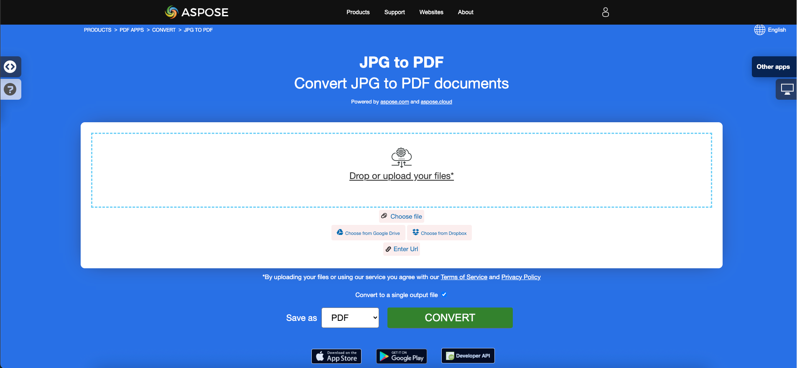

<script type="application/ld+json">
{
    "@context": "https://schema.org",
    "@type": "TechArticle",
    "headline": "Convert various Images formats to PDF in .NET",
    "alternativeHeadline": "Convert Multiple Image Formats to PDF with C#",
    "abstract": "Memperkenalkan fitur yang kuat di Aspose.PDF for .NET yang memungkinkan konversi tanpa hambatan dari berbagai format gambar termasuk BMP, CGM, DICOM, EMF, JPG, PNG, SVG, TIFF, CDR, dan DJVU menjadi dokumen PDF berkualitas tinggi. Fungsionalitas ini menyediakan cara yang sederhana untuk mengintegrasikan konversi gambar ke PDF dalam aplikasi .NET Anda, memastikan penanganan konten grafis yang beragam secara efisien.",
    "author": {
        "@type": "Person",
        "name": "Anastasiia Holub",
        "givenName": "Anastasiia",
        "familyName": "Holub",
        "url": "https://www.linkedin.com/in/anastasiia-holub-750430225/"
    },
    "genre": "pdf document generation",
    "wordcount": "5228",
    "proficiencyLevel": "Beginner",
    "publisher": {
        "@type": "Organization",
        "name": "Aspose.PDF for .NET",
        "url": "https://products.aspose.com/pdf",
        "logo": "https://www.aspose.cloud/templates/aspose/img/products/pdf/aspose_pdf-for-net.svg",
        "alternateName": "Aspose",
        "sameAs": [
            "https://facebook.com/aspose.pdf/",
            "https://twitter.com/asposepdf",
            "https://www.youtube.com/channel/UCmV9sEg_QWYPi6BJJs7ELOg/featured",
            "https://www.linkedin.com/company/aspose",
            "https://stackoverflow.com/questions/tagged/aspose",
            "https://aspose.quora.com/",
            "https://aspose.github.io/"
        ],
        "contactPoint": [
            {
                "@type": "ContactPoint",
                "telephone": "+1 903 306 1676",
                "contactType": "sales",
                "areaServed": "US",
                "availableLanguage": "en"
            },
            {
                "@type": "ContactPoint",
                "telephone": "+44 141 628 8900",
                "contactType": "sales",
                "areaServed": "GB",
                "availableLanguage": "en"
            },
            {
                "@type": "ContactPoint",
                "telephone": "+61 2 8006 6987",
                "contactType": "sales",
                "areaServed": "AU",
                "availableLanguage": "en"
            }
        ]
    },
    "url": "/net/convert-images-format-to-pdf/",
    "mainEntityOfPage": {
        "@type": "WebPage",
        "@id": "/net/convert-images-format-to-pdf/"
    },
    "dateModified": "2024-11-25",
    "description": "Aspose.PDF dapat melakukan tidak hanya tugas sederhana dan mudah tetapi juga dapat menangani tujuan yang lebih kompleks. Periksa bagian berikut untuk pengguna dan pengembang tingkat lanjut."
}
</script>

## Ikhtisar

Artikel ini menjelaskan cara mengonversi berbagai format Gambar ke PDF menggunakan C#. Ini mencakup topik-topik berikut.

Potongan kode berikut juga bekerja dengan [Aspose.PDF.Drawing](/pdf/id/net/drawing/) pustaka.

_Format_: **BMP**
- [C# BMP ke PDF](#csharp-bmp-to-pdf)
- [C# Mengonversi BMP ke PDF](#csharp-bmp-to-pdf)
- [C# Cara mengonversi gambar BMP ke PDF](#csharp-bmp-to-pdf)

_Format_: **CGM**
- [C# CGM ke PDF](#csharp-cgm-to-pdf)
- [C# Mengonversi CGM ke PDF](#csharp-cgm-to-pdf)
- [C# Cara mengonversi gambar CGM ke PDF](#csharp-cgm-to-pdf)

_Format_: **DICOM**
- [C# DICOM ke PDF](#csharp-dicom-to-pdf)
- [C# Mengonversi DICOM ke PDF](#csharp-dicom-to-pdf)
- [C# Cara mengonversi gambar DICOM ke PDF](#csharp-dicom-to-pdf)

_Format_: **EMF**
- [C# EMF ke PDF](#csharp-emf-to-pdf)
- [C# Mengonversi EMF ke PDF](#csharp-emf-to-pdf)
- [C# Cara mengonversi gambar EMF ke PDF](#csharp-emf-to-pdf)

_Format_: **GIF**
- [C# GIF ke PDF](#csharp-gif-to-pdf)
- [C# Mengonversi GIF ke PDF](#csharp-gif-to-pdf)
- [C# Cara mengonversi gambar GIF ke PDF](#csharp-gif-to-pdf)

_Format_: **JPG**
- [C# JPG ke PDF](#csharp-jpg-to-pdf)
- [C# Mengonversi JPG ke PDF](#csharp-jpg-to-pdf)
- [C# Cara mengonversi gambar JPG ke PDF](#csharp-jpg-to-pdf)

_Format_: **PNG**
- [C# PNG ke PDF](#csharp-png-to-pdf)
- [C# Mengonversi PNG ke PDF](#csharp-png-to-pdf)
- [C# Cara mengonversi gambar PNG ke PDF](#csharp-png-to-pdf)

_Format_: **SVG**
- [C# SVG ke PDF](#csharp-svg-to-pdf)
- [C# Mengonversi SVG ke PDF](#csharp-svg-to-pdf)
- [C# Cara mengonversi gambar SVG ke PDF](#csharp-svg-to-pdf)

_Format_: **TIFF**
- [C# TIFF ke PDF](#csharp-tiff-to-pdf)
- [C# Mengonversi TIFF ke PDF](#csharp-tiff-to-pdf)
- [C# Cara mengonversi gambar TIFF ke PDF](#csharp-tiff-to-pdf)

_Format_: **CDR**
- [C# CDR ke PDF](#csharp-cdr-to-pdf)
- [C# Mengonversi CDR ke PDF](#csharp-cdr-to-pdf)
- [C# Cara mengonversi gambar CDR ke PDF](#csharp-cdr-to-pdf)

_Format_: **DJVU**
- [C# DJVU ke PDF](#csharp-djvu-to-pdf)
- [C# Mengonversi DJVU ke PDF](#csharp-djvu-to-pdf)
- [C# Cara mengonversi gambar DJVU ke PDF](#csharp-djvu-to-pdf)

Topik lain yang dibahas dalam artikel ini
- [Lihat Juga](#see-also)


## Konversi Gambar C# ke PDF

**Aspose.PDF for .NET** memungkinkan Anda untuk mengonversi berbagai format gambar ke file PDF. Pustaka kami menunjukkan potongan kode untuk mengonversi format gambar paling populer, seperti - BMP, CGM, DICOM, EMF, JPG, PNG, SVG, dan TIFF.

## Mengonversi BMP ke PDF

Mengonversi file BMP ke dokumen PDF menggunakan pustaka **Aspose.PDF for .NET**.

<abbr title="Bitmap Image File">BMP</abbr> adalah file dengan ekstensi. BMP mewakili file Gambar Bitmap yang digunakan untuk menyimpan gambar digital bitmap. Gambar ini tidak tergantung pada adaptor grafis dan juga disebut format file bitmap independen perangkat (DIB).
Anda dapat mengonversi BMP ke file PDF dengan API Aspose.PDF for .NET. Oleh karena itu, Anda dapat mengikuti langkah-langkah berikut untuk mengonversi gambar BMP:

<a name="csharp-bmp-to-pdf" id="csharp-bmp-to-pdf"><strong>Langkah: Mengonversi BMP ke PDF di C#</strong></a>

1. Inisialisasi objek kelas [Document](https://reference.aspose.com/pdf/net/aspose.pdf/document) baru.
2. Muat gambar **BMP** input.
3. Terakhir, simpan file PDF output.

Jadi potongan kode berikut mengikuti langkah-langkah ini dan menunjukkan cara mengonversi BMP ke PDF menggunakan C#:

```csharp
// For complete examples and data files, visit https://github.com/aspose-pdf/Aspose.PDF-for-.NET
private static void ConvertBMPtoPDF()
{
    // The path to the documents directory
    var dataDir = RunExamples.GetDataDir_AsposePdf_WorkingDocuments();

    // Create PDF document
    using (var document = new Aspose.Pdf.Document())
    {
        // Add page
        var page = document.Pages.Add();
        var image = new Aspose.Pdf.Image();
        
        // Load BMP file
        image.File = dataDir + "BMPtoPDF.bmp";
        page.Paragraphs.Add(image);
        
        // Save PDF document
        document.Save(dataDir + "BMPtoPDF_out.pdf");
    }
}
```

{}
**Cobalah untuk mengonversi BMP ke PDF secara online**

Aspose mempersembahkan aplikasi gratis online ["BMP ke PDF"](https://products.aspose.app/pdf/conversion/bmp-to-pdf/), di mana Anda dapat mencoba menyelidiki fungsionalitas dan kualitasnya.

[](https://products.aspose.app/pdf/conversion/bmp-to-pdf/)
{}

## Mengonversi CGM ke PDF

<abbr title="Computer Graphics Metafile">CGM</abbr> adalah ekstensi file untuk format Computer Graphics Metafile yang umum digunakan dalam aplikasi CAD (computer-aided design) dan grafik presentasi. CGM adalah format grafik vektor yang mendukung tiga metode pengkodean berbeda: biner (terbaik untuk kecepatan baca program), berbasis karakter (menghasilkan ukuran file terkecil dan memungkinkan transfer data lebih cepat) atau pengkodean teks jelas (memungkinkan pengguna untuk membaca dan memodifikasi file dengan editor teks).

Periksa potongan kode berikut untuk mengonversi file CGM ke format PDF.

<a name="csharp-cgm-to-pdf" id="csharp-cgm-to-pdf"><strong>Langkah: Mengonversi CGM ke PDF di C#</strong></a>

1. Buat instance kelas [CgmLoadOptions](https://reference.aspose.com/pdf/net/aspose.pdf/cgmloadoptions).
2. Buat instance kelas [Document](https://reference.aspose.com/pdf/net/aspose.pdf/document) dengan menyebutkan nama file sumber dan opsi.
3. Simpan dokumen dengan nama file yang diinginkan.

```csharp
// For complete examples and data files, visit https://github.com/aspose-pdf/Aspose.PDF-for-.NET
private static void ConvertCGMtoPDF()
{
    // The path to the documents directory
    var dataDir = RunExamples.GetDataDir_AsposePdf_WorkingDocuments();

    var option = new Aspose.Pdf.CgmLoadOptions();

    // Open PDF document
    using (var document = new Aspose.Pdf.Document(dataDir + "CGMtoPDF.cgm", option))
    {
        // Save PDF document
        document.Save(dataDir + "CGMtoPDF_out.pdf");
    }
}
```

## Mengonversi DICOM ke PDF

<abbr title="Digital Imaging and Communications in Medicine">DICOM</abbr> format adalah standar industri medis untuk pembuatan, penyimpanan, transmisi, dan visualisasi gambar dan dokumen medis digital pasien yang diperiksa.

**Aspose.PDF untuk .NET** memungkinkan Anda untuk mengonversi gambar DICOM dan SVG, tetapi untuk alasan teknis untuk menambahkan gambar Anda perlu menentukan jenis file yang akan ditambahkan ke PDF:

<a name="csharp-dicom-to-pdf" id="csharp-dicom-to-pdf"><strong>Langkah: Mengonversi DICOM ke PDF di C#</strong></a>

1. Buat objek kelas Gambar.
2. Tambahkan gambar ke koleksi Paragraf halaman.
3. Tentukan properti [FileType](https://reference.aspose.com/pdf/net/aspose.pdf/image/properties/filetype).
4. Tentukan jalur atau sumber file.
    - Jika gambar berada di lokasi di hard drive, tentukan lokasi jalur menggunakan properti Image.File.
    - Jika gambar ditempatkan dalam MemoryStream, kirim objek yang menyimpan gambar ke properti Image.ImageStream.

Potongan kode berikut menunjukkan cara mengonversi file DICOM ke format PDF dengan Aspose.PDF. Anda harus memuat gambar DICOM, menempatkan gambar di halaman dalam file PDF, dan menyimpan output sebagai PDF.

```csharp
// For complete examples and data files, visit https://github.com/aspose-pdf/Aspose.PDF-for-.NET
private static void ConvertDICOMtoPDF()
{
    // The path to the documents directory
    var dataDir = RunExamples.GetDataDir_AsposePdf_WorkingDocuments();

    // Create PDF document 
    using (var document = new Aspose.Pdf.Document())
    {
        // Add page
        var page = document.Pages.Add();
        
        var image = new Aspose.Pdf.Image
        {
            FileType = ImageFileType.Dicom,
            File = dataDir + "DICOMtoPDF.dcm"
        };
        page.Paragraphs.Add(image);

        // Save PDF document
        document.Save(dataDir + "DICOMtoPDF_out.pdf");
    }
}
```

{}
**Cobalah untuk mengonversi DICOM ke PDF secara online**

Aspose mempersembahkan aplikasi gratis online ["DICOM ke PDF"](https://products.aspose.app/pdf/conversion/dicom-to-pdf/), di mana Anda dapat mencoba menyelidiki fungsionalitas dan kualitasnya.

[](https://products.aspose.app/pdf/conversion/dicom-to-pdf/)
{}

## Mengonversi EMF ke PDF

<abbr title="Enhanced metafile format">EMF</abbr> menyimpan gambar grafis secara independen dari perangkat. Metafile EMF terdiri dari catatan panjang variabel dalam urutan kronologis yang dapat merender gambar yang disimpan setelah parsing pada perangkat output mana pun. Selain itu, Anda dapat mengonversi EMF ke gambar PDF menggunakan langkah-langkah berikut:

<a name="csharp-emf-to-pdf" id="csharp-emf-to-pdf"><strong>Langkah: Mengonversi EMF ke PDF di C#</strong></a>

1. Pertama, inisialisasi objek kelas [Document](https://reference.aspose.com/pdf/net/aspose.pdf/document).
2. Muat file gambar **EMF**.
3. Tambahkan gambar EMF yang dimuat ke sebuah Halaman.
4. Simpan dokumen PDF.

Selain itu, potongan kode berikut menunjukkan cara mengonversi EMF ke PDF dengan C# dalam potongan kode .NET Anda:

```csharp
// For complete examples and data files, visit https://github.com/aspose-pdf/Aspose.PDF-for-.NET
private static void ConvertEMFtoPDF()
{
    // The path to the documents directory
    var dataDir = RunExamples.GetDataDir_AsposePdf_WorkingDocuments();

    // Create PDF document 
    using (var document = new Aspose.Pdf.Document())
    {
        // Add page
        var page = document.Pages.Add();
        var image = new Aspose.Pdf.Image();
        // Load EMF file
        image.File = dataDir + "EMFtoPDF.emf";

        // Specify page dimension properties
        page.PageInfo.Margin.Bottom = 0;
        page.PageInfo.Margin.Top = 0;
        page.PageInfo.Margin.Left = 0;
        page.PageInfo.Margin.Right = 0;
        page.PageInfo.Width = image.BitmapSize.Width;
        page.PageInfo.Height = image.BitmapSize.Height;

        page.Paragraphs.Add(image);

        // Save PDF document
        document.Save(dataDir + "EMFtoPDF_out.pdf");
    }
}
```

{}
**Cobalah untuk mengonversi EMF ke PDF secara online**

Aspose mempersembahkan aplikasi gratis online ["EMF ke PDF"](https://products.aspose.app/pdf/conversion/emf-to-pdf/), di mana Anda dapat mencoba menyelidiki fungsionalitas dan kualitasnya.

[](https://products.aspose.app/pdf/conversion/emf-to-pdf/)
{}

## Mengonversi GIF ke PDF

Mengonversi file GIF ke dokumen PDF menggunakan pustaka **Aspose.PDF for .NET**.

<abbr title="Graphics Interchange Format">GIF</abbr> mampu menyimpan data terkompresi tanpa kehilangan kualitas dalam format tidak lebih dari 256 warna. Format GIF yang tidak tergantung perangkat dikembangkan pada tahun 1987 (GIF87a) oleh CompuServe untuk mentransmisikan gambar bitmap melalui jaringan.
Anda dapat mengonversi GIF ke file PDF dengan API Aspose.PDF for .NET. Oleh karena itu, Anda dapat mengikuti langkah-langkah berikut untuk mengonversi gambar GIF:

<a name="csharp-gif-to-pdf" id="csharp-gif-to-pdf"><strong>Langkah: Mengonversi GIF ke PDF di C#</strong></a>

1. Inisialisasi objek kelas [Document](https://reference.aspose.com/pdf/net/aspose.pdf/document) baru.
2. Muat gambar **GIF** input.
3. Terakhir, simpan file PDF output.

Jadi potongan kode berikut mengikuti langkah-langkah ini dan menunjukkan cara mengonversi BMP ke PDF menggunakan C#:

```csharp
// For complete examples and data files, visit https://github.com/aspose-pdf/Aspose.PDF-for-.NET
private static void ConvertGIFtoPDF()
{
    // The path to the documents directory
    var dataDir = RunExamples.GetDataDir_AsposePdf_WorkingDocuments();

    // Create PDF document
    using (var document = new Aspose.Pdf.Document())
    {
        // Add page
        var page = document.Pages.Add();
        var image = new Aspose.Pdf.Image();
        
        // Load sample GIF image file
        image.File = dataDir + "GIFtoPDF.gif";
        page.Paragraphs.Add(image);

        // Save PDF document
        document.Save(dataDir + "GIFtoPDF_out.pdf");
    }
}
```

{}
**Cobalah untuk mengonversi GIF ke PDF secara online**

Aspose mempersembahkan aplikasi gratis online ["GIF ke PDF"](https://products.aspose.app/pdf/conversion/gif-to-pdf/), di mana Anda dapat mencoba menyelidiki fungsionalitas dan kualitasnya.

[](https://products.aspose.app/pdf/conversion/gif-to-pdf/)
{}

## Mengonversi JPG ke PDF

Tidak perlu bingung bagaimana cara mengonversi JPG ke PDF, karena pustaka **Apose.PDF untuk .NET** memiliki solusi terbaik.

Anda dapat dengan mudah mengonversi gambar JPG ke PDF dengan Aspose.PDF for .NET dengan mengikuti langkah-langkah berikut:

<a name="csharp-jpg-to-pdf" id="csharp-jpg-to-pdf"><strong>Langkah: Mengonversi JPG ke PDF di C#</strong></a>

1. Inisialisasi objek kelas [Document](https://reference.aspose.com/page/net/aspose.page/document).
2. Tambahkan Halaman baru ke dokumen PDF.
3. Muat gambar **JPG** dan tambahkan ke paragraf.
4. Simpan output PDF.

Potongan kode di bawah ini menunjukkan cara mengonversi Gambar JPG ke PDF menggunakan C#:

```csharp
// For complete examples and data files, visit https://github.com/aspose-pdf/Aspose.PDF-for-.NET
private static void ConvertJPGtoPDF()
{
    // The path to the documents directory
    var dataDir = RunExamples.GetDataDir_AsposePdf_WorkingDocuments();

    // Create PDF document 
    using (var document = new Aspose.Pdf.Document())
    {
        // Add page
        var page = document.Pages.Add();
        var image = new Aspose.Pdf.Image();
        // Load input JPG file
        image.File = dataDir + "JPGtoPDF.jpg";
        
        // Add image on a page
        page.Paragraphs.Add(image);
        
        // Save PDF document
        document.Save(dataDir + "JPGtoPDF_out.pdf");
    }
}
```

Kemudian Anda dapat melihat bagaimana cara mengonversi gambar ke PDF dengan **tinggi dan lebar halaman yang sama**. Kami akan mendapatkan dimensi gambar dan sesuai dengan itu mengatur dimensi halaman dokumen PDF dengan langkah-langkah berikut:

1. Muat file gambar input.
1. Atur tinggi, lebar, dan margin halaman.
1. Simpan file PDF output.

Potongan kode berikut menunjukkan cara mengonversi Gambar ke PDF dengan tinggi dan lebar halaman yang sama menggunakan C#:

```csharp
// For complete examples and data files, visit https://github.com/aspose-pdf/Aspose.PDF-for-.NET
private static void ConvertJPGtoPDF()
{
    // The path to the documents directory
    var dataDir = RunExamples.GetDataDir_AsposePdf_WorkingDocuments();

    // Create PDF document
    using (var document = new Aspose.Pdf.Document())
    {
        // Add page
        var page = document.Pages.Add();
        var image = new Aspose.Pdf.Image();
        // Load JPEG file
        image.File = dataDir + "JPGtoPDF.jpg";
        
        // Read Height of input image
        page.PageInfo.Height = image.BitmapSize.Height;
        // Read Width of input image
        page.PageInfo.Width = image.BitmapSize.Width;
        page.PageInfo.Margin.Bottom = 0;
        page.PageInfo.Margin.Top = 0;
        page.PageInfo.Margin.Right = 0;
        page.PageInfo.Margin.Left = 0;
        page.Paragraphs.Add(image);
        
        // Save PDF document
        document.Save(dataDir + "JPGtoPDF_out.pdf");
    }
}
```

{}
**Cobalah untuk mengonversi JPG ke PDF secara online**

Aspose mempersembahkan aplikasi gratis online ["JPG ke PDF"](https://products.aspose.app/pdf/conversion/jpg-to-pdf/), di mana Anda dapat mencoba menyelidiki fungsionalitas dan kualitasnya.

[](https://products.aspose.app/pdf/conversion/jpg-to-pdf/)
{}

## Mengonversi PNG ke PDF

**Aspose.PDF for .NET** mendukung fitur untuk mengonversi gambar PNG ke format PDF. Periksa potongan kode berikut untuk mewujudkan tugas Anda.

<abbr title="Portable Network Graphics">PNG</abbr> mengacu pada jenis format file gambar raster yang menggunakan kompresi tanpa kehilangan, yang membuatnya populer di kalangan penggunanya.

Anda dapat mengonversi gambar PNG ke PDF menggunakan langkah-langkah berikut:

<a name="csharp-png-to-pdf" id="csharp-png-to-pdf"><strong>Langkah: Mengonversi PNG ke PDF di C#</strong></a>

1. Muat gambar **PNG** input.
2. Baca nilai tinggi dan lebar.
3. Buat objek [Document](https://reference.aspose.com/page/net/aspose.page/document) baru dan tambahkan Halaman.
4. Atur dimensi halaman.
5. Simpan file output.

Selain itu, potongan kode di bawah ini menunjukkan cara mengonversi PNG ke PDF dengan C# dalam aplikasi .NET Anda:

```csharp
// For complete examples and data files, visit https://github.com/aspose-pdf/Aspose.PDF-for-.NET
private static void ConvertPNGtoPDF()
{
    // The path to the documents directory
    var dataDir = RunExamples.GetDataDir_AsposePdf_WorkingDocuments();

    // Create PDF document
    using (var document = new Aspose.Pdf.Document())
    {
        // Add page
        var page = document.Pages.Add();
        var image = new Aspose.Pdf.Image();
        // Load PNG file
        image.File = dataDir + "PNGtoPDF.png";
        
        // Read Height of input image
        page.PageInfo.Height = image.BitmapSize.Height;
        // Read Width of input image
        page.PageInfo.Width = image.BitmapSize.Width;
        page.PageInfo.Margin.Bottom = 0;
        page.PageInfo.Margin.Top = 0;
        page.PageInfo.Margin.Right = 0;
        page.PageInfo.Margin.Left = 0;
        page.Paragraphs.Add(image);
        
        // Save PDF document
        document.Save(dataDir + "PNGtoPDF_out.pdf");
    }
}
```

{}
**Cobalah untuk mengonversi PNG ke PDF secara online**

Aspose mempersembahkan aplikasi gratis online ["PNG ke PDF"](https://products.aspose.app/pdf/conversion/png-to-pdf/), di mana Anda dapat mencoba menyelidiki fungsionalitas dan kualitasnya.

[](https://products.aspose.app/pdf/conversion/png-to-pdf/)
{}

## Mengonversi SVG ke PDF

**Aspose.PDF for .NET** menjelaskan cara mengonversi gambar SVG ke format PDF dan cara mendapatkan dimensi file <abbr title="Scalable Vector Graphics">SVG</abbr> sumber.

Scalable Vector Graphics (SVG) adalah keluarga spesifikasi format file berbasis XML untuk grafik vektor dua dimensi, baik statis maupun dinamis (interaktif atau animasi). Spesifikasi SVG adalah standar terbuka yang telah dikembangkan oleh World Wide Web Consortium (W3C) sejak 1999.

Gambar SVG dan perilakunya didefinisikan dalam file teks XML. Ini berarti bahwa mereka dapat dicari, diindeks, diskrip, dan jika diperlukan, dikompresi. Sebagai file XML, gambar SVG dapat dibuat dan diedit dengan editor teks apa pun, tetapi seringkali lebih nyaman untuk membuatnya dengan program menggambar seperti Inkscape.

{}
**Cobalah untuk mengonversi format SVG ke PDF secara online**

Aspose.PDF for .NET mempersembahkan aplikasi gratis online ["SVG ke PDF"](https://products.aspose.app/pdf/conversion/svg-to-pdf), di mana Anda dapat mencoba menyelidiki fungsionalitas dan kualitasnya.

[](https://products.aspose.app/pdf/conversion/svg-to-pdf)
{}

Untuk mengonversi file SVG ke PDF, gunakan kelas bernama [SvgLoadOptions](https://reference.aspose.com/net/pdf/aspose.pdf/svgloadoptions) yang digunakan untuk menginisialisasi objek [`LoadOptions`](https://reference.aspose.com/pdf/net/aspose.pdf/loadoptions). Kemudian, objek ini diteruskan sebagai argumen selama inisialisasi objek Document dan membantu mesin rendering PDF untuk menentukan format input dari dokumen sumber.

<a name="csharp-svg-to-pdf" id="csharp-svg-to-pdf"><strong>Langkah: Mengonversi SVG ke PDF di C#</strong></a>

1. Buat instance kelas [`SvgLoadOptions`](https://reference.aspose.com/pdf/net/aspose.pdf/loadoptions).
2. Buat instance kelas [`Document`](https://reference.aspose.com/pdf/net/aspose.pdf/document) dengan menyebutkan nama file sumber dan opsi.
3. Simpan dokumen dengan nama file yang diinginkan.

Potongan kode berikut menunjukkan proses mengonversi file SVG menjadi format PDF dengan Aspose.PDF for .NET.

```csharp
// For complete examples and data files, visit https://github.com/aspose-pdf/Aspose.PDF-for-.NET
private static void ConvertSVGtoPDF()
{
    // The path to the documents directory
    var dataDir = RunExamples.GetDataDir_AsposePdf_WorkingDocuments();

    var option = new Aspose.Pdf.SvgLoadOptions();
    // Open SVG file 
    using (var document = new Aspose.Pdf.Document(dataDir + "SVGtoPDF.svg", option))
    {
        // Save PDF document
        document.Save(dataDir + "SVGtoPDF_out.pdf");
    }
}
```

## Mendapatkan dimensi SVG

Juga dimungkinkan untuk mendapatkan dimensi file SVG sumber. Informasi ini dapat berguna jika kita ingin SVG menutupi seluruh halaman PDF output. Properti AdjustPageSize dari kelas SvgLoadOption memenuhi persyaratan ini. Nilai default dari properti ini adalah false. Jika nilai diatur ke true, PDF output akan memiliki ukuran (dimensi) yang sama dengan SVG sumber.

Potongan kode berikut menunjukkan proses mendapatkan dimensi file SVG sumber dan menghasilkan file PDF.

```csharp
// For complete examples and data files, visit https://github.com/aspose-pdf/Aspose.PDF-for-.NET
private static void ConvertSVGtoPDF()
{
    // The path to the documents directory
    var dataDir = RunExamples.GetDataDir_AsposePdf_DocumentConversion();

    var loadopt = new Aspose.Pdf.SvgLoadOptions();
    loadopt.AdjustPageSize = true;
    // Open SVG file
    using (var document = new Aspose.Pdf.Document(dataDir + "SVGtoPDF.svg", loadopt))
    {
        document.Pages[1].PageInfo.Margin.Top = 0;
        document.Pages[1].PageInfo.Margin.Left = 0;
        document.Pages[1].PageInfo.Margin.Bottom = 0;
        document.Pages[1].PageInfo.Margin.Right = 0;

        // Save PDF document
        document.Save(dataDir + "SVGtoPDF_out.pdf");
    }
    
}
```

### Fitur yang Didukung SVG

<table>
    <thead>
        <tr>
            <th>
                <p>Tag SVG</p>
            </th>
            <th>
                <p>Contoh Penggunaan</p>
            </th>
        </tr>
    </thead>
    <tbody>
        <tr>
            <td>
                <p>circle</p>
            </td>
            <td>
                <code><pre>&lt circle id="r2" cx="10" cy="10" r="10" stroke="blue" stroke-width="2"&gt </pre></code>
            </td>
        </tr>
        <tr>
            <td>
                <p>defs</p>
            </td>
            <td>
                <code>&lt;defs&gt;&nbsp; <br> &lt;rect id="r1" width="15" height="15"
                    stroke="blue" stroke-width="2" /&gt;&nbsp; <br> &lt;circle id="r2"
                    cx="10" cy="10" r="10" stroke="blue" stroke-width="2"/&gt;&nbsp; <br>
                    &lt;circle id="r3" cx="10" cy="10" r="10" stroke="blue" stroke-width="3"/&gt;&nbsp; <br> &lt;/defs&gt;&nbsp; <br> &lt;use
                    x="25" y="40" xlink:href="#r1" fill="red"/&gt;&nbsp; <br> &lt;use
                    x="35" y="15" xlink:href="#r2" fill="green"/&gt;&nbsp; <br> &lt;use
                    x="58" y="50" xlink:href="#r3" fill="blue"/&gt;</code>
            </td>
        </tr>
        <tr>
            <td>
                <p>tref</p>
            </td>
            <td>
                <p>&lt;defs&gt;&nbsp; <br> &nbsp;&nbsp;&nbsp; &lt;text
                    id="ReferencedText"&gt;&nbsp; <br> &nbsp;&nbsp;&nbsp;&nbsp;&nbsp;
                    Data karakter yang direferensikan&nbsp; <br> &nbsp;&nbsp;&nbsp;
                    &lt;/text&gt;&nbsp; <br> &lt;/defs&gt;&nbsp; <br
                        class="atl-forced-newline"> &lt;text x="10" y="100" font-size="15" fill="red" &gt;&nbsp; <br
                        class="atl-forced-newline"> &nbsp;&nbsp;&nbsp; &lt;tref
                    xlink:href="#ReferencedText"/&gt;&nbsp; <br> &lt;/text&gt;</p>
            </td>
        </tr>
        <tr>
            <td>
                <p>use</p>
            </td>
            <td>
                <p>&lt;defs&gt;&nbsp; <br> &nbsp;&nbsp;&nbsp; &lt;text id="Text" x="400"
                    y="200"&nbsp; <br>
                    &nbsp;&nbsp;&nbsp;&nbsp;&nbsp;&nbsp;&nbsp;&nbsp;&nbsp; font-family="Verdana" font-size="100"
                    text-anchor="middle" &gt;&nbsp; <br> &nbsp;&nbsp;&nbsp;&nbsp;&nbsp;
                    Teks yang dimasker&nbsp; <br> &nbsp;&nbsp;&nbsp; &lt;/text&gt;&nbsp; <br
                        class="atl-forced-newline"> &lt;use xlink:href="#Text" fill="blue"&nbsp; /&gt;</p>
            </td>
        </tr>
        <tr>
            <td>
                <p>ellipse&nbsp;</p>
            </td>
            <td>
                <p>&lt;ellipse cx="2.5" cy="1.5" rx="2" ry="1" fill="red" /&gt;</p>
            </td>
        </tr>
        <tr>
            <td>
                <p>g&nbsp;</p>
            </td>
            <td>
                <p>&lt;g fill="none" stroke="dimgray" stroke-width="1.5" &gt;&nbsp; <br>
                    &nbsp;&nbsp; &nbsp;&nbsp;&nbsp; &nbsp;&nbsp;&nbsp; &nbsp;&nbsp;&nbsp; &nbsp;&lt;line x1="-7"
                    y1="-7" x2="-3" y2="-3"/&gt;&nbsp; <br> &nbsp;&nbsp;
                    &nbsp;&nbsp;&nbsp; &nbsp;&nbsp;&nbsp; &nbsp;&nbsp;&nbsp; &nbsp;&lt;line x1="7" y1="7" x2="3"
                    y2="3"/&gt;&nbsp; <br> &nbsp;&nbsp; &nbsp;&nbsp;&nbsp;
                    &nbsp;&nbsp;&nbsp; &nbsp;&nbsp;&nbsp; &nbsp;&lt;line x1="-7" y1="7" x2="-3" y2="3"/&gt;&nbsp;
                    <br> &nbsp;&nbsp; &nbsp;&nbsp;&nbsp; &nbsp;&nbsp;&nbsp;
                    &nbsp;&nbsp;&nbsp; &nbsp;&lt;line x1="7" y1="-7" x2="3" y2="-3"/&gt;&nbsp; <br
                        class="atl-forced-newline"> &lt;/g&gt;&nbsp;</p>
            </td>
        </tr>
        <tr>
            <td>
                <p>image</p>
            </td>
            <td>
                <p>&lt;image id="ShadedRelief" x="24" y="4" width="64" height="82" xlink:href="relief.jpg"
                    /&gt;&nbsp;</p>
            </td>
        </tr>
        <tr>
            <td>
                <p>line</p>
            </td>
            <td>
                <p>&lt;line style="stroke:#eea;stroke-width:8" x1="10" y1="30" x2="260" y2="100"/&gt;&nbsp;</p>
            </td>
        </tr>
        <tr>
            <td>
                <p>path</p>
            </td>
            <td>
                <p>&lt;path style="fill:#daa;fill-rule:evenodd;stroke:red" d="M 230,150 C 290,30 10,255 110,140 z
                    "/&gt;&nbsp;</p>
            </td>
        </tr>
        <tr>
            <td>
                <p>style</p>
            </td>
            <td>
                <p>&lt;path style="fill:#daa;fill-rule:evenodd;stroke:red" d="M 230,150 C 290,30 10,255 110,140 z
                    "/&gt;</p>
            </td>
        </tr>
        <tr>
            <td>
                <p>polygon</p>
            </td>
            <td>
                <p>&lt;polygon style="stroke:#24a;stroke-width:1.5;fill:#eefefe" points="10,10 180,10 10,250 10,10"
                    /&gt;</p>
            </td>
        </tr>
        <tr>
            <td>
                <p>polyline</p>
            </td>
            <td>
                <p>&lt;polyline fill="none" stroke="dimgray" stroke-width="1" points="-3,-6 3,-6 3,1 5,1 0,7 -5,1
                    -3,1 -3,-5"/&gt;</p>
            </td>
        </tr>
        <tr>
            <td>
                <p>rect&nbsp;</p>
            </td>
            <td>
                <p>&lt;rect x="0" y="0" width="400" height="600" stroke="none" fill="aliceblue" /&gt;</p>
            </td>
        </tr>
        <tr>
            <td>
                <p>svg</p>
            </td>
            <td>
                <p>&lt;svg xmlns="http://www.w3.org/2000/svg" version="1.1" width="10cm" height="5cm" &gt;</p>
            </td>
        </tr>
        <tr>
            <td>
                <p>text</p>
            </td>
            <td>
                <p>&lt;text font-family="sans-serif" fill="dimgray" font-size="22px" font-weight="bold" x="58"
                    y="30" pointer-events="none"&gt;Judul Peta&lt;/text&gt;</p>
            </td>
        </tr>
        <tr>
            <td>
                <p>font</p>
            </td>
            <td>
                <p>&lt;text x="10" y="100" font-size="15" fill="red" &gt;&nbsp; <br>
                    &nbsp;&nbsp;&nbsp; Teks contoh&nbsp; <br> &lt;/text&gt;</p>
            </td>
        </tr>
        <tr>
            <td>
                <p>tspan</p>
            </td>
            <td>
                <p>&lt;tspan dy="25" x="25"&gt;enam nilai input warna tinta. Di sini akan &lt;/tspan&gt;</p>
            </td>
        </tr>
    </tbody>
</table>

## Mengonversi TIFF ke PDF

Format file **Aspose.PDF** didukung, baik itu gambar <abbr title="Tag Image File Format">TIFF</abbr> satu bingkai atau multi-bingkai. Ini berarti bahwa Anda dapat mengonversi gambar TIFF ke PDF dalam aplikasi .NET Anda.

TIFF atau TIF, Tagged Image File Format, mewakili gambar raster yang dimaksudkan untuk digunakan pada berbagai perangkat yang mematuhi standar format file ini. Gambar TIFF dapat berisi beberapa bingkai dengan gambar yang berbeda. Format file Aspose.PDF juga didukung, baik itu gambar TIFF satu bingkai atau multi-bingkai.

Anda dapat mengonversi TIFF ke PDF dengan cara yang sama seperti format file raster grafik lainnya:

<a name="csharp-tiff-to-pdf" id="csharp-tiff-to-pdf"><strong>Langkah: Mengonversi TIFF ke PDF di C#</strong></a>

1. Buat objek kelas [Document](https://reference.aspose.com/pdf/net/aspose.pdf/document) baru dan tambahkan Halaman.
2. Muat gambar **TIFF** input.
3. Simpan dokumen PDF.

```csharp
// For complete examples and data files, visit https://github.com/aspose-pdf/Aspose.PDF-for-.NET
private static void ConvertTIFFtoPDF()
{
    // The path to the documents directory
    var dataDir = RunExamples.GetDataDir_AsposePdf_WorkingDocuments();

    // Create PDF document
    using (var document = new Aspose.Pdf.Document())
    {
        document.Pages.Add();
        var image = new Aspose.Pdf.Image();
        
        // Load sample Tiff image file
        image.File = dataDir + "TIFFtoPDF.tiff";
        document.Pages[1].Paragraphs.Add(image);
        
        // Save PDF document
        document.Save(dataDir + "TIFFtoPDF_out.pdf");
    }
}
```

Jika Anda perlu mengonversi gambar TIFF multi-halaman ke dokumen PDF multi-halaman dan mengontrol beberapa parameter, misalnya lebar atau rasio aspek, silakan ikuti langkah-langkah ini:

1. Buat instance dari kelas Document.
1. Muat gambar TIFF input.
1. Dapatkan FrameDimension dari bingkai.
1. Tambahkan halaman baru untuk setiap bingkai.
1. Terakhir, simpan gambar ke halaman PDF.

Potongan kode berikut menunjukkan cara mengonversi gambar TIFF multi-halaman atau multi-bingkai ke PDF dengan C#:

```csharp
// For complete examples and data files, visit https://github.com/aspose-pdf/Aspose.PDF-for-.NET
private static void ConvertTIFFtoPDF()
{
    // The path to the documents directory
    var dataDir = RunExamples.GetDataDir_AsposePdf_WorkingDocuments();

    // Create PDF document
    using (var document = new Aspose.Pdf.Document())
    {
        using (var bitmap = new System.Drawing.Bitmap(File.OpenRead(dataDir + "TIFFtoPDF.tif")))
        {
            // Convert multi page or multi frame TIFF to PDF
            var dimension = new FrameDimension(bitmap.FrameDimensionsList[0]);
            var frameCount = bitmap.GetFrameCount(dimension);

            // Iterate through each frame
            for (int frameIdx = 0; frameIdx <= frameCount - 1; frameIdx++)
            {
                var page = document.Pages.Add();

                bitmap.SelectActiveFrame(dimension, frameIdx);

                using (var currentImage = new MemoryStream())
                {
                    bitmap.Save(currentImage, ImageFormat.Tiff);

                    var imageht = new Aspose.Pdf.Image
                    {
                        ImageStream = currentImage,
                        //Apply some other options
                        //ImageScale = 0.5
                    };
                    page.Paragraphs.Add(imageht);
                }
            }
        }

        // Save PDF document
        document.Save(dataDir + "TIFFtoPDF_out.pdf");
    }
}
```

## Mengonversi CDR ke PDF

<abbr title="CDR">CDR</abbr> adalah format file yang dikembangkan oleh Corel Corporation dan digunakan terutama untuk gambar dan gambar grafis vektor. Format file CDR dikenali oleh sebagian besar program pengeditan gambar. Format CDR adalah format default untuk Aplikasi Corel Draw.

Periksa potongan kode berikut untuk mengonversi file CDR ke format PDF.

<a name="csharp-cdr-to-pdf" id="csharp-cdr-to-pdf"><strong>Langkah: Mengonversi CDR ke PDF di C#</strong></a>

1. Buat instance kelas [CdrLoadOptions](https://reference.aspose.com/pdf/net/aspose.pdf/cdrloadoptions/) .
2. Buat instance kelas [Document](https://reference.aspose.com/pdf/net/aspose.pdf/document) dengan menyebutkan nama file sumber dan opsi.
3. Simpan dokumen dengan nama file yang diinginkan.

```csharp
// For complete examples and data files, visit https://github.com/aspose-pdf/Aspose.PDF-for-.NET
private static void ConvertCDRtoPDF()
{
    // The path to the documents directory
    var dataDir = RunExamples.GetDataDir_AsposePdf_WorkingDocuments();

    // Open CDR file
    using (var document = new Aspose.Pdf.Document(dataDir + "CDRtoPDF.cdr", new CdrLoadOptions()))
    {
        // Save PDF document
        document.Save(dataDir + "CDRtoPDF_out.pdf");
    }
}
```

## Mengonversi DJVU ke PDF

<abbr title="DJVU">DjVu</abbr> adalah format gambar terkompresi yang dikembangkan oleh LizardTech. Format file ini terutama dirancang untuk menyimpan berbagai jenis dokumen yang dipindai; terutama dokumen yang mengandung kombinasi teks, gambar, gambar berwarna terindeks, dan gambar garis.

Periksa potongan kode berikut untuk mengonversi file DJVU ke format PDF.

<a name="csharp-djvu-to-pdf" id="csharp-djvu-to-pdf"><strong>Langkah: Mengonversi DJVU ke PDF di C#</strong></a>

1. Buat instance kelas [DjvuLoadOptions](https://reference.aspose.com/pdf/net/aspose.pdf/djvuloadoptions/) .
2. Buat instance kelas [Document](https://reference.aspose.com/pdf/net/aspose.pdf/document) dengan menyebutkan nama file sumber dan opsi.
3. Simpan dokumen dengan nama file yang diinginkan.

```csharp
// For complete examples and data files, visit https://github.com/aspose-pdf/Aspose.PDF-for-.NET
private static void ConvertDJVUtoPDF()
{
    // The path to the documents directory
    var dataDir = RunExamples.GetDataDir_AsposePdf_WorkingDocuments();
    
    // Open DJVU file
    using (var document = new Aspose.Pdf.Document(dataDir + "CDRtoPDF.djvu", new DjvuLoadOptions()))
    {
        // Save PDF document
        document.Save(dataDir + "CDRtoPDF_out.pdf");
    }
}
```

## Mengonversi HEIC ke PDF

File HEIC adalah format file Gambar Kontainer Efisiensi Tinggi yang dapat menyimpan beberapa gambar sebagai koleksi dalam satu file.
Untuk memuat gambar heic, Anda perlu menambahkan referensi ke paket nuget https://www.nuget.org/packages/FileFormat.Heic/.
Mengonversi gambar HEIC ke PDF menggunakan Aspose.PDF:

```csharp
// For complete examples and data files, visit https://github.com/aspose-pdf/Aspose.PDF-for-.NET
private static void ConvertHEICtoPDF()
{
    // The path to the documents directory
    var dataDir = RunExamples.GetDataDir_AsposePdf_WorkingDocuments();

    // Open HEIC file
    using (var fs = new FileStream(dataDir + "HEICtoPDF.heic", FileMode.Open))
    {
        var image = FileFormat.Heic.Decoder.HeicImage.Load(fs);
        var pixels = image.GetByteArray(PixelFormat.Rgb24);
        var width = (int)image.Width;
        var height = (int)image.Height;

        using (var document = new Aspose.Pdf.Document())
        {
            var page = document.Pages.Add();
            var asposeImage = new Aspose.Pdf.Image();
            asposeImage.BitmapInfo = new Aspose.Pdf.BitmapInfo(pixels, width, height, Aspose.Pdf.BitmapInfo.PixelFormat.Rgb24);
            page.PageInfo.Height = height;
            page.PageInfo.Width = width;
            page.PageInfo.Margin.Bottom = 0;
            page.PageInfo.Margin.Top = 0;
            page.PageInfo.Margin.Right = 0;
            page.PageInfo.Margin.Left = 0;

            page.Paragraphs.Add(asposeImage);

            // Save PDF document
            document.Save(dataDir + "HEICtoPDF_out.pdf");
        }
    }
}
```

## Berlaku untuk

|**Platform**|**Didukung**|**Komentar**|
| :- | :- |:- |
|Windows .NET Framework|2.0-4.6| |
|Windows .NET Core |2.0-3.1| |
|.NET 5 Windows| |
|Linux .NET Core|2.0-3.1 | |
|.NET 5 Linux | |

## Lihat Juga

Artikel ini juga mencakup topik-topik ini. Kode sama seperti di atas.

_Format_: **BMP**
- [C# Kode BMP ke PDF](#csharp-bmp-to-pdf)
- [C# API BMP ke PDF](#csharp-bmp-to-pdf)
- [C# BMP ke PDF Secara Programatis](#csharp-bmp-to-pdf)
- [C# Pustaka BMP ke PDF](#csharp-bmp-to-pdf)
- [C# Simpan BMP sebagai PDF](#csharp-bmp-to-pdf)
- [C# Hasilkan PDF dari BMP](#csharp-bmp-to-pdf)
- [C# Buat PDF dari BMP](#csharp-bmp-to-pdf)
- [C# Konverter BMP ke PDF](#csharp-bmp-to-pdf)

_Format_: **CGM**
- [C# Kode CGM ke PDF](#csharp-cgm-to-pdf)
- [C# API CGM ke PDF](#csharp-cgm-to-pdf)
- [C# CGM ke PDF Secara Programatis](#csharp-cgm-to-pdf)
- [C# Pustaka CGM ke PDF](#csharp-cgm-to-pdf)
- [C# Simpan CGM sebagai PDF](#csharp-cgm-to-pdf)
- [C# Hasilkan PDF dari CGM](#csharp-cgm-to-pdf)
- [C# Buat PDF dari CGM](#csharp-cgm-to-pdf)
- [C# Konverter CGM ke PDF](#csharp-cgm-to-pdf)

_Format_: **DICOM**
- [C# Kode DICOM ke PDF](#csharp-dicom-to-pdf)
- [C# API DICOM ke PDF](#csharp-dicom-to-pdf)
- [C# DICOM ke PDF Secara Programatis](#csharp-dicom-to-pdf)
- [C# Pustaka DICOM ke PDF](#csharp-dicom-to-pdf)
- [C# Simpan DICOM sebagai PDF](#csharp-dicom-to-pdf)
- [C# Hasilkan PDF dari DICOM](#csharp-dicom-to-pdf)
- [C# Buat PDF dari DICOM](#csharp-dicom-to-pdf)
- [C# Konverter DICOM ke PDF](#csharp-dicom-to-pdf)

_Format_: **EMF**
- [C# Kode EMF ke PDF](#csharp-emf-to-pdf)
- [C# API EMF ke PDF](#csharp-emf-to-pdf)
- [C# EMF ke PDF Secara Programatis](#csharp-emf-to-pdf)
- [C# Pustaka EMF ke PDF](#csharp-emf-to-pdf)
- [C# Simpan EMF sebagai PDF](#csharp-emf-to-pdf)
- [C# Hasilkan PDF dari EMF](#csharp-emf-to-pdf)
- [C# Buat PDF dari EMF](#csharp-emf-to-pdf)
- [C# Konverter EMF ke PDF](#csharp-emf-to-pdf)

_Format_: **DjVu**
- [C# Kode DjVu ke PDF](#csharp-djvu-to-pdf)
- [C# API DjVu ke PDF](#csharp-djvu-to-pdf)
- [C# DjVu ke PDF Secara Programatis](#csharp-djvu-to-pdf)
- [C# Pustaka DjVu ke PDF](#csharp-djvu-to-pdf)
- [C# Simpan DjVu sebagai PDF](#csharp-djvu-to-pdf)
- [C# Hasilkan PDF dari DjVu](#csharp-djvu-to-pdf)
- [C# Buat PDF dari DjVu](#csharp-djvu-to-pdf)
- [C# Konverter DjVu ke PDF](#csharp-djvu-to-pdf)

_Format_: **CDR**
- [C# Kode CDR ke PDF](#csharp-cdr-to-pdf)
- [C# API CDR ke PDF](#csharp-cdr-to-pdf)
- [C# CDR ke PDF Secara Programatis](#csharp-cdr-to-pdf)
- [C# Pustaka CDR ke PDF](#csharp-cdr-to-pdf)
- [C# Simpan CDR sebagai PDF](#csharp-cdr-to-pdf)
- [C# Hasilkan PDF dari CDR](#csharp-cdr-to-pdf)
- [C# Buat PDF dari CDR](#csharp-cdr-to-pdf)
- [C# Konverter CDR ke PDF](#csharp-cdr-to-pdf)