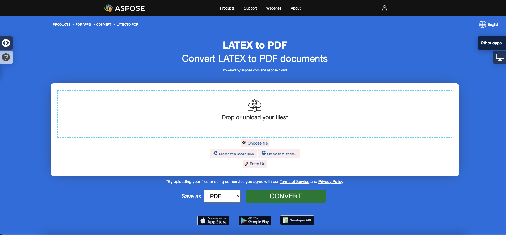

<script type="application/ld+json">
{
    "@context": "https://schema.org",
    "@type": "TechArticle",
    "headline": "Convert other file formats to PDF in .NET",
    "alternativeHeadline": "Convert Multiple File Formats to PDF in C#",
    "abstract": "Aspose.PDF for .NET memperkenalkan fitur serbaguna yang memungkinkan pengguna untuk dengan mudah mengonversi berbagai format file, termasuk EPUB, Markdown, PCL, XPS, PS, XML, dan LaTeX, menjadi dokumen PDF berkualitas tinggi. Fungsionalitas ini meningkatkan manajemen dokumen dengan memastikan kompatibilitas dan aksesibilitas di berbagai platform sambil mempertahankan integritas konten asli.",
    "author": {
        "@type": "Person",
        "name": "Anastasiia Holub",
        "givenName": "Anastasiia",
        "familyName": "Holub",
        "url": "https://www.linkedin.com/in/anastasiia-holub-750430225/"
    },
    "genre": "pdf document generation",
    "wordcount": "4627",
    "proficiencyLevel": "Beginner",
    "publisher": {
        "@type": "Organization",
        "name": "Aspose.PDF for .NET",
        "url": "https://products.aspose.com/pdf",
        "logo": "https://www.aspose.cloud/templates/aspose/img/products/pdf/aspose_pdf-for-net.svg",
        "alternateName": "Aspose",
        "sameAs": [
            "https://facebook.com/aspose.pdf/",
            "https://twitter.com/asposepdf",
            "https://www.youtube.com/channel/UCmV9sEg_QWYPi6BJJs7ELOg/featured",
            "https://www.linkedin.com/company/aspose",
            "https://stackoverflow.com/questions/tagged/aspose",
            "https://aspose.quora.com/",
            "https://aspose.github.io/"
        ],
        "contactPoint": [
            {
                "@type": "ContactPoint",
                "telephone": "+1 903 306 1676",
                "contactType": "sales",
                "areaServed": "US",
                "availableLanguage": "en"
            },
            {
                "@type": "ContactPoint",
                "telephone": "+44 141 628 8900",
                "contactType": "sales",
                "areaServed": "GB",
                "availableLanguage": "en"
            },
            {
                "@type": "ContactPoint",
                "telephone": "+61 2 8006 6987",
                "contactType": "sales",
                "areaServed": "AU",
                "availableLanguage": "en"
            }
        ]
    },
    "url": "/net/convert-other-files-to-pdf/",
    "mainEntityOfPage": {
        "@type": "WebPage",
        "@id": "/net/convert-other-files-to-pdf/"
    },
    "dateModified": "2024-11-25",
    "description": "Aspose.PDF dapat melakukan tidak hanya tugas sederhana dan mudah tetapi juga dapat menangani tujuan yang lebih kompleks. Periksa bagian berikut untuk pengguna dan pengembang tingkat lanjut."
}
</script>

## Ikhtisar

Artikel ini menjelaskan bagaimana **mengonversi berbagai jenis format file lain ke PDF menggunakan C#**. Ini mencakup topik-topik berikut.

Potongan kode berikut juga bekerja dengan pustaka [Aspose.PDF.Drawing](/pdf/net/drawing/).

_Format_: **EPUB**
- [C# EPUB ke PDF](#csharp-convert-epub-to-pdf)
- [C# Mengonversi EPUB ke PDF](#csharp-convert-epub-to-pdf)
- [C# Cara mengonversi file EPUB ke PDF](#csharp-convert-epub-to-pdf)

_Format_: **Markdown**
- [C# Markdown ke PDF](#csharp-convert-markdown-to-pdf)
- [C# Mengonversi Markdown ke PDF](#csharp-convert-markdown-to-pdf)
- [C# Cara mengonversi file Markdown ke PDF](#csharp-convert-markdown-to-pdf)

_Format_: **MD**
- [C# MD ke PDF](#csharp-convert-md-to-pdf)
- [C# Mengonversi MD ke PDF](#csharp-convert-md-to-pdf)
- [C# Cara mengonversi file MD ke PDF](#csharp-convert-md-to-pdf)

_Format_: **PCL**
- [C# PCL ke PDF](#csharp-convert-pcl-to-pdf)
- [C# Mengonversi PCL ke PDF](#csharp-convert-pcl-to-pdf)
- [C# Cara mengonversi file PCL ke PDF](#csharp-convert-pcl-to-pdf)

_Format_: **Teks**
- [C# Teks ke PDF](#csharp-convert-text-to-pdf)
- [C# Mengonversi Teks ke PDF](#csharp-convert-text-to-pdf)
- [C# Cara mengonversi file Teks ke PDF](#csharp-convert-text-to-pdf)

_Format_: **TXT**
- [C# TXT ke PDF](#csharp-convert-txt-to-pdf)
- [C# Mengonversi TXT ke PDF](#csharp-convert-txt-to-pdf)
- [C# Cara mengonversi file TXT ke PDF](#csharp-convert-txt-to-pdf)

_Format_: **Teks Biasa**
- [C# Teks Biasa ke PDF](#csharp-convert-plain-text-to-pdf)
- [C# Mengonversi Teks Biasa ke PDF](#csharp-convert-plain-text-to-pdf)
- [C# Cara mengonversi file Teks Biasa ke PDF](#csharp-convert-plain-text-to-pdf)

_Format_: **TXT Terformat**
- [C# Teks Terformat ke PDF](#csharp-convert-pre-formatted-txt-to-pdf)
- [C# Mengonversi Teks Terformat ke PDF](#csharp-convert-pre-formatted-txt-to-pdf)
- [C# Cara mengonversi file Teks Terformat ke PDF](#csharp-convert-pre-formatted-txt-to-pdf)

_Format_: **Teks Pra**
- [C# Teks Pra ke PDF](#csharp-convert-pre-text-to-pdf)
- [C# Mengonversi Teks Pra ke PDF](#csharp-convert-pre-text-to-pdf)
- [C# Cara mengonversi file Teks Pra ke PDF](#csharp-convert-pre-text-to-pdf)

_Format_: **XPS**
- [C# XPS ke PDF](#csharp-convert-xps-to-pdf)
- [C# Mengonversi XPS ke PDF](#csharp-convert-xps-to-pdf)
- [C# Cara mengonversi file XPS ke PDF](#csharp-convert-xps-to-pdf)

## Mengonversi EPUB ke PDF

**Aspose.PDF for .NET** memungkinkan Anda untuk mengonversi file EPUB ke format PDF dengan mudah.

<abbr title="electronic publication">EPUB</abbr> (singkatan dari electronic publication) adalah standar e-book gratis dan terbuka dari International Digital Publishing Forum (IDPF). File memiliki ekstensi .epub. EPUB dirancang untuk konten yang dapat mengalir, yang berarti bahwa pembaca EPUB dapat mengoptimalkan teks untuk perangkat tampilan tertentu.

EPUB juga mendukung konten dengan tata letak tetap. Format ini dimaksudkan sebagai satu format yang dapat digunakan oleh penerbit dan rumah konversi secara internal, serta untuk distribusi dan penjualan. Ini menggantikan standar Open eBook. Versi EPUB 3 juga didukung oleh Book Industry Study Group (BISG), sebuah asosiasi perdagangan buku terkemuka untuk praktik terbaik yang distandarisasi, penelitian, informasi, dan acara, untuk pengemasan konten.

{}
**Cobalah untuk mengonversi EPUB ke PDF secara online**

Aspose.PDF for .NET mempersembahkan aplikasi gratis online ["EPUB ke PDF"](https://products.aspose.app/pdf/conversion/epub-to-pdf), di mana Anda dapat mencoba menyelidiki fungsionalitas dan kualitasnya.

[](https://products.aspose.app/pdf/conversion/epub-to-pdf)
{}

<a name="csharp-convert-epub-to-pdf" id="csharp-convert-epub-to-pdf"><strong><em>Langkah-langkah:</em> Mengonversi EPUB ke PDF di C#</strong></a>

1. Buat instance dari kelas [EpubLoadOptions](https://reference.aspose.com/pdf/net/aspose.pdf/epubloadoptions).
2. Buat instance dari kelas [Document](https://reference.aspose.com/pdf/net/aspose.pdf/document) dengan menyebutkan nama file sumber dan opsi.
3. Simpan dokumen dengan nama file yang diinginkan.

Potongan kode berikut menunjukkan cara mengonversi file EPUB ke format PDF dengan C#.

```csharp
// For complete examples and data files, visit https://github.com/aspose-pdf/Aspose.PDF-for-.NET
private static void ConvertEPUBtoPDF()
{
    // The path to the documents directory
    var dataDir = RunExamples.GetDataDir_AsposePdf_DocumentConversion();
    // Convert options
    var options = new Aspose.Pdf.EpubLoadOptions();

    // Open PDF document
    using (var document = new Aspose.Pdf.Document(dataDir + "EPUBToPDF.epub", options))
    {
        // Save PDF document
        document.Save(dataDir + "ConvertEPUBtoPDF_out.pdf");
    }
}
```

Anda juga dapat mengatur ukuran halaman untuk konversi. Untuk mendefinisikan ukuran halaman baru, Anda menggunakan objek `SizeF` dan meneruskannya ke konstruktor [EpubLoadOptions](https://reference.aspose.com/pdf/net/aspose.pdf/epubloadoptions/constructors/main).

```csharp
// For complete examples and data files, visit https://github.com/aspose-pdf/Aspose.PDF-for-.NET
private static void ConvertEPUBtoPDFAdv()
{
    // The path to the documents directory
    var dataDir = RunExamples.GetDataDir_AsposePdf_DocumentConversion();
    // Convert options
    var options = new Aspose.Pdf.EpubLoadOptions(new SizeF(1190, 1684));

    // Open PDF document
    using (var document = new Aspose.Pdf.Document(dataDir + "EPUBToPDF.epub", options))
    {
        // Save PDF document
        document.Save(dataDir + "ConvertEPUBtoPDFAdv_out.pdf");
    }
}
```

## Mengonversi Markdown ke PDF

**Fitur ini didukung oleh versi 19.6 atau lebih besar.**

{}
**Cobalah untuk mengonversi Markdown ke PDF secara online**

Aspose.PDF for .NET mempersembahkan aplikasi gratis online ["Markdown ke PDF"](https://products.aspose.app/pdf/conversion/md-to-pdf), di mana Anda dapat mencoba menyelidiki fungsionalitas dan kualitasnya.

[](https://products.aspose.app/pdf/conversion/md-to-pdf)
{}

Aspose.PDF for .NET menyediakan fungsionalitas untuk membuat dokumen PDF berdasarkan file data [Markdown](https://daringfireball.net/projects/markdown/syntax) input. Untuk mengonversi Markdown ke PDF, Anda perlu menginisialisasi [Document](https://reference.aspose.com/pdf/net/aspose.pdf/document) menggunakan [MdLoadOptions](https://reference.aspose.com/pdf/net/aspose.pdf/mdloadoptions).

Potongan kode berikut menunjukkan cara menggunakan fungsionalitas ini dengan pustaka Aspose.PDF:

<a name="csharp-convert-markdown-to-pdf" id="csharp-convert-markdown-to-pdf"><strong><em>Langkah-langkah:</em> Mengonversi Markdown ke PDF di C#</strong></a> |
<a name="csharp-convert-md-to-pdf" id="csharp-convert-md-to-pdf"><strong><em>Langkah-langkah:</em> Mengonversi MD ke PDF di C#</strong></a>

1. Buat instance dari kelas [MdLoadOptions](https://reference.aspose.com/pdf/net/aspose.pdf/mdloadoptions/) .
2. Buat instance dari kelas [Document](https://reference.aspose.com/pdf/net/aspose.pdf/document) dengan menyebutkan nama file sumber dan opsi.
3. Simpan dokumen dengan nama file yang diinginkan.

```csharp
// For complete examples and data files, visit https://github.com/aspose-pdf/Aspose.PDF-for-.NET
private static void ConvertMarkdownToPDF()
{
    // The path to the documents directory
    var dataDir = RunExamples.GetDataDir_AsposePdf_DocumentConversion();
    // Convert options
    var options = new Aspose.Pdf.MdLoadOptions();

    // Open PDF document
    using (var document = new Aspose.Pdf.Document(dataDir + "sample.md", options))
    {
        // Save PDF document
        document.Save(dataDir + "ConvertMarkdownToPDF_out.pdf");
    }
}
```

## Mengonversi PCL ke PDF

<abbr title="Printer Command Language">PCL</abbr> (Printer Command Language) adalah bahasa printer Hewlett-Packard yang dikembangkan untuk mengakses fitur printer standar. PCL level 1 hingga 5e/5c adalah bahasa berbasis perintah yang menggunakan urutan kontrol yang diproses dan diinterpretasikan dalam urutan yang diterima. Pada tingkat konsumen, aliran data PCL dihasilkan oleh driver cetak. Output PCL juga dapat dengan mudah dihasilkan oleh aplikasi kustom.

{}
**Cobalah untuk mengonversi PCL ke PDF secara online**

Aspose.PDF untuk .NET mempersembahkan aplikasi gratis online ["PCL ke PDF"](https://products.aspose.app/pdf/conversion/pcl-to-pdf), di mana Anda dapat mencoba menyelidiki fungsionalitas dan kualitasnya.

[](https://products.aspose.app/pdf/conversion/pcl-to-pdf)
{}

**Saat ini hanya PCL5 dan versi yang lebih lama yang didukung**

<table>
    <thead>
        <tr>
            <th>
                Set Perintah
            </th>
            <th>
                Dukungan
            </th>
            <th>
                Pengecualian
            </th>
            <th>
                Deskripsi
            </th>
        </tr>
    </thead>
    <tbody>
        <tr>
            <td>
                Perintah kontrol pekerjaan
            </td>
            <td>
                +
            </td>
            <td>
                Mode pencetakan duplex
            </td>
            <td>
                Mengontrol proses cetak: jumlah salinan, bin output, pencetakan simplex/duplex, offset kiri dan atas
                dll.
            </td>
        </tr>
        <tr>
            <td>
                Perintah kontrol halaman
            </td>
            <td>
                +
            </td>
            <td>
                Perintah Lewati Perforasi
            </td>
            <td>
                Menentukan ukuran halaman, margin, orientasi halaman, jarak antar garis, jarak antar karakter dll.
            </td>
        </tr>
        <tr>
            <td>
                Perintah Penempatan Kursor
            </td>
            <td>
                +
            </td>
            <td>
                &nbsp;
            </td>
            <td>
                Menentukan posisi kursor dan, dengan demikian, asal teks, gambar raster atau vektor dan detail.
            </td>
        </tr>
        <tr>
            <td>
                Perintah pemilihan font
            </td>
            <td>
                +
            </td>
            <td>
                <ol>
                    <li>Perintah Data Cetak Transparan.</li>
                    <li>Font lunak yang disematkan. Dalam versi saat ini, alih-alih membuat font lunak, pustaka kami memilih
                        font yang sesuai dari "font" TrueType yang ada yang diinstal di mesin target. <br/>
                        Kelayakan ditentukan oleh rasio lebar/tinggi.<br/>
                        Fitur ini hanya berfungsi untuk font Bitmap dan TrueType dan tidak
                        menjamin bahwa teks yang dicetak dengan font lunak akan relevan dengan yang ada di file sumber.<br/>
                        Karena kode karakter dalam font lunak dapat tidak cocok dengan yang default.
                    </li>
                    <li>Set Simbol yang Didefinisikan Pengguna.</li>
                </ol>
            </td>
            <td>
                Memungkinkan memuat font lunak (tersemat) dari file PCL dan mengelolanya dalam memori.
            </td>
        </tr>
        <tr>
            <td>
                Perintah grafik raster
            </td>
            <td>
                +
            </td>
            <td>
                Hanya hitam &amp; putih
            </td>
            <td>
                Memungkinkan memuat gambar raster dari file PCL ke memori, menentukan parameter raster. <br
                    > seperti lebar, tinggi, jenis kompresi, resolusi dll.
            </td>
        </tr>
        <tr>
            <td>
                Perintah warna
            </td>
            <td>
                +
            </td>
            <td>
                &nbsp;
            </td>
            <td>
                Memungkinkan pewarnaan untuk semua objek yang dapat dicetak.
            </td>
        </tr>
        <tr>
            <td>
                Perintah Model Cetak
            </td>
            <td>
                +
            </td>
            <td>
                &nbsp;
            </td>
            <td>
                Memungkinkan pengisian teks, gambar raster dan area persegi panjang dengan pola raster yang telah ditentukan dan <br>
                pola yang ditentukan pengguna, menentukan mode transparansi untuk pola dan
                gambar raster sumber. <br> Pola yang telah ditentukan adalah pola garis, garis silang
                dan pola bayangan.
            </td>
        </tr>
        <tr>
            <td>
                Perintah pengisian area persegi panjang
            </td>
            <td>
                +
            </td>
            <td>
                &nbsp;
            </td>
            <td>
                Memungkinkan pembuatan dan pengisian area persegi panjang dengan pola.
            </td>
        </tr>
        <tr>
            <td>
                Perintah Grafik Vektor HP-GL/2
            </td>
            <td>
                +
            </td>
            <td>
                Perintah Vektor Tercetak (SV), Perintah Mode Transparansi (TR), Perintah Data Transparan (TD), RO
                (Putar Sistem Koordinat), Perintah Font yang Dapat Diskalakan atau Bitmap (SB), Perintah Kemiringan Karakter (SL) dan
                Ruang Ekstra (ES) tidak diimplementasikan dan perintah DV (Tentukan Jalur Teks Variabel) diimplementasikan dalam
                versi beta.
            </td>
            <td>
                Memungkinkan memuat gambar vektor HP-GL/2 dari file PCL ke dalam memori. Gambar vektor memiliki asal di sudut kiri bawah area yang dapat dicetak, dapat diskalakan, diterjemahkan, diputar, dan dipotong. <br>
                Gambar vektor dapat berisi teks, sebagai label, dan bentuk geometris seperti
                persegi panjang, lingkaran, elips, garis, busur, kurva bezier, dan bentuk kompleks yang terdiri dari yang sederhana. <br> Bentuk tertutup termasuk huruf label dapat diisi dengan
                pengisian padat atau pola vektor. <br> Pola dapat berupa
                garis, pola silang, bayangan, raster yang ditentukan pengguna, pola garis PCL atau pola silang dan pola yang ditentukan pengguna PCL. Pola PCL adalah raster. Label dapat diputar, diskalakan, dan diarahkan secara individu dalam
                empat arah: atas, bawah, kiri, dan kanan. Arah Kiri dan Kanan melibatkan pengaturan huruf satu demi satu. Arah Atas dan Bawah melibatkan pengaturan huruf satu di bawah yang lain.
            </td>
        </tr>
        <tr>
            <td>
                Makro
            </td>
            <td>
                ―
            </td>
            <td>
                &nbsp;
            </td>
            <td>
                Memungkinkan memuat urutan perintah PCL ke dalam memori dan menggunakan urutan ini berkali-kali, misalnya,
                untuk mencetak header halaman atau menetapkan satu format untuk satu set halaman.
            </td>
        </tr>
        <tr>
            <td>
                Teks Unicode
            </td>
            <td>
                ―
            </td>
            <td>
                &nbsp;
            </td>
            <td>
                Memungkinkan pencetakan karakter non-ASCII. Tidak diimplementasikan karena kurangnya file contoh dengan <br
                    > teks Unicode
            </td>
        </tr>
        <tr>
            <td>
                PCL6 (PCL-XL)
            </td>
            <td>
                &nbsp;
            </td>
            <td>
                Diimplementasikan hanya dalam versi Beta karena kurangnya file uji. Font yang disematkan juga tidak
                didukung.<br> Ekstensi JetReady tidak didukung karena tidak mungkin memiliki spesifikasi JetReady.
            </td>
            <td>
                Format file biner.
            </td>
        </tr>
    </tbody>
</table>

### Mengonversi file PCL ke format PDF

Untuk memungkinkan konversi dari PCL ke PDF, Aspose.PDF memiliki kelas [`PclLoadOptions`](https://reference.aspose.com/pdf/net/aspose.pdf/pclloadoptions) yang digunakan untuk menginisialisasi objek LoadOptions. Kemudian objek ini diteruskan sebagai argumen selama inisialisasi objek Document dan membantu mesin rendering PDF untuk menentukan format input dokumen sumber.

Potongan kode berikut menunjukkan proses mengonversi file PCL ke format PDF.

<a name="csharp-convert-pcl-to-pdf" id="csharp-convert-pcl-to-pdf"><strong><em>Langkah-langkah:</em> Mengonversi PCL ke PDF di C#</strong></a>

1. Buat instance dari kelas [PclLoadOptions](https://reference.aspose.com/pdf/net/aspose.pdf/pclloadoptions/) .
2. Buat instance dari kelas [Document](https://reference.aspose.com/pdf/net/aspose.pdf/document/) dengan menyebutkan nama file sumber dan opsi.
3. Simpan dokumen dengan nama file yang diinginkan.

```csharp
// For complete examples and data files, visit https://github.com/aspose-pdf/Aspose.PDF-for-.NET
private static void ConvertPCLtoPDF()
{
    // The path to the documents directory
    var dataDir = RunExamples.GetDataDir_AsposePdf_DocumentConversion();
    // Convert options
    var options = new Aspose.Pdf.PclLoadOptions();

    // Open PDF document
    using (var document = new Aspose.Pdf.Document(dataDir + "ConvertPCLtoPDF.pcl", options))
    {
        // Save PDF document
        document.Save(dataDir + "ConvertPCLtoPDF_out.pdf");
    }
}
```

Anda juga dapat memantau deteksi kesalahan selama proses konversi. Untuk melakukan ini, Anda perlu mengonfigurasi objek PclLoadOptions: setel atau hapus SupressErrors.

```csharp
// For complete examples and data files, visit https://github.com/aspose-pdf/Aspose.PDF-for-.NET
private static void ConvertPCLtoPDFAdvanced()
{
    // The path to the documents directory
    var dataDir = RunExamples.GetDataDir_AsposePdf_DocumentConversion();
    // Convert options
    var options = new Aspose.Pdf.PclLoadOptions { SupressErrors = true };

    // Open PDF document
    using (var document = new Aspose.Pdf.Document(dataDir + "ConvertPCLtoPDFAdvanced.pcl", options))
    {
        if (options.Exceptions != null)
        {
            foreach (var ex in options.Exceptions)
            {
                Console.WriteLine(ex.Message);
            }
        }
        // Save PDF document
        document.Save(dataDir + "ConvertPCLtoPDFAdvanced_out.pdf");
    }
}
```

### Masalah yang Dikenal

1. Asal dari string teks dan gambar dapat sedikit berbeda dari yang ada di file PCL sumber jika arah cetak tidak 0°. Hal yang sama berlaku untuk gambar vektor jika sistem koordinat dari plot vektor diputar (perintah RO diawali).
2. Asal label dalam gambar vektor dapat berbeda dari yang ada di file PCL sumber jika label dipengaruhi oleh urutan perintah: Asal Label (LO), Tentukan Jalur Teks Variabel (DV), Arah Absolut (DI) atau Arah Relatif (DR).
3. Teks dapat dibaca dengan tidak benar jika harus dirender dengan font lunak (tersemat) Bitmap atau TrueType, karena saat ini font ini hanya didukung sebagian (Lihat pengecualian dalam "tabel fitur yang didukung"). Dalam situasi ini, teks hanya dapat dibaca dengan benar jika kode karakter dalam font lunak sesuai dengan yang default. Gaya teks yang dibaca juga dapat berbeda dari yang ada di file PCL sumber karena tidak perlu mengatur gaya di header font lunak.
4. Jika file PCL yang diparsing mengandung font lunak Intellifont atau Universal, pengecualian akan dilemparkan, karena font Intellifont dan Universal sama sekali tidak didukung.
5. Jika file PCL yang diparsing mengandung perintah makro, hasil parsing akan sangat berbeda dari file sumber, karena perintah makro tidak didukung.

## Mengonversi Teks ke PDF

**Aspose.PDF for .NET** mendukung fitur mengonversi teks biasa dan file teks terformat ke format PDF.

Mengonversi teks ke PDF berarti menambahkan fragmen teks ke halaman PDF. Mengenai file teks, kita berurusan dengan 2 jenis teks: pra-formatting (misalnya, 25 baris dengan 80 karakter per baris) dan teks tidak terformat (teks biasa). Bergantung pada kebutuhan kita, kita dapat mengontrol penambahan ini sendiri atau mempercayakannya kepada algoritma pustaka.

{}
**Cobalah untuk mengonversi TEKS ke PDF secara online**

Aspose.PDF for .NET mempersembahkan aplikasi gratis online ["Teks ke PDF"](https://products.aspose.app/pdf/conversion/txt-to-pdf), di mana Anda dapat mencoba menyelidiki fungsionalitas dan kualitasnya.

[](https://products.aspose.app/pdf/conversion/txt-to-pdf)
{}

### Mengonversi file teks biasa ke PDF

Dalam kasus file teks biasa, kita dapat menggunakan teknik berikut:

<a name="csharp-convert-text-to-pdf" id="csharp-convert-text-to-pdf"><strong><em>Langkah-langkah:</em> Mengonversi Teks ke PDF di C#</strong></a> |
<a name="csharp-convert-txt-to-pdf" id="csharp-convert-txt-to-pdf"><strong><em>Langkah-langkah:</em> Mengonversi TXT ke PDF di C#</strong></a> |
<a name="csharp-convert-plain-text-to-pdf" id="csharp-convert-plain-text-to-pdf"><strong><em>Langkah-langkah:</em> Mengonversi Teks Biasa ke PDF di C#</strong></a>

1. Gunakan _TextReader_ untuk membaca seluruh teks.
2. Buat objek [Document](https://reference.aspose.com/pdf/net/aspose.pdf/document/) dan tambahkan halaman baru di koleksi Pages.
3. Buat objek baru dari [TextFragment](https://reference.aspose.com/pdf/net/aspose.pdf.text/textfragment/) dan teruskan objek _TextReader_ ke konstruktor.
4. Tambahkan objek _TextFragment_ sebagai paragraf dalam koleksi _Paragraphs_. Jika jumlah teks lebih besar dari halaman, algoritma pustaka secara otomatis menambahkan halaman tambahan.
5. Gunakan metode **Save** dari kelas [Document](https://reference.aspose.com/pdf/net/aspose.pdf/document/).

```csharp
// For complete examples and data files, visit https://github.com/aspose-pdf/Aspose.PDF-for-.NET
private static void ConvertPlainTextFileToPDF()
{
    // The path to the documents directory
    var dataDir = RunExamples.GetDataDir_AsposePdf_DocumentConversion();

    // Read the source text file
    using (var streamReader = new StreamReader(dataDir + "TextToPDFInput.txt"))
    {
        // // Create PDF document
        using (var document = new Aspose.Pdf.Document())
        {
            // Add page
            var page = document.Pages.Add();
            // Create an instance of TextFragment and pass the text from reader object to its constructor as argument
            var text = new Aspose.Pdf.Text.TextFragment(streamReader.ReadToEnd());
            // Add a new text paragraph in paragraphs collection and pass the TextFragment object
            page.Paragraphs.Add(text);
            // Save PDF document
            document.Save(dataDir + "TextToPDF_out.pdf");
        }
    }
}
```

### Mengonversi file teks terformat ke PDF

Mengonversi teks terformat mirip dengan teks biasa tetapi Anda perlu melakukan beberapa tindakan tambahan seperti mengatur margin, jenis font, dan ukuran. Jelas bahwa font harus monospace (misalnya Courier New).

Ikuti langkah-langkah ini untuk mengonversi teks terformat ke PDF dengan C#:

<a name="csharp-convert-pre-text-to-pdf" id="csharp-convert-pre-text-to-pdf"><strong><em>Langkah-langkah:</em> Mengonversi Teks Pra ke PDF di C#</strong></a> |
<a name="csharp-convert-pre-formatted-txt-to-pdf" id="csharp-convert-pre-formatted-txt-to-pdf"><strong><em>Langkah-langkah:</em> Mengonversi TXT Terformat ke PDF di C#</strong></a>

1. Baca seluruh teks sebagai array string.
2. Buat objek [Document](https://reference.aspose.com/pdf/net/aspose.pdf/document/) dan tambahkan halaman baru di koleksi [Pages](https://reference.aspose.com/pdf/net/aspose.pdf/document/pages/) .
3. Jalankan loop melalui array string dan tambahkan setiap string sebagai paragraf dalam koleksi [Paragraphs](https://reference.aspose.com/pdf/net/aspose.pdf/paragraphs/) .

Dalam hal ini, algoritma pustaka juga menambahkan halaman tambahan, tetapi kita dapat mengontrol proses ini sendiri. Contoh berikut menunjukkan cara mengonversi file teks terformat ke dokumen PDF dengan ukuran halaman A4.

```csharp
// For complete examples and data files, visit https://github.com/aspose-pdf/Aspose.PDF-for-.NET
private static void ConvertPreFormattedTextToPdf()
{
    // The path to the documents directory
    var dataDir = RunExamples.GetDataDir_AsposePdf_DocumentConversion();
    // Read the text file as array of string
    var lines = File.ReadAllLines(dataDir + "ConvertPreFormattedTextToPdf.txt");

    // Create PDF document
    using (var document = new Aspose.Pdf.Document())
    {
        // Add page
        var page = document.Pages.Add();
        // Set left and right margins for better presentation
        page.PageInfo.Margin.Left = 20;
        page.PageInfo.Margin.Right = 10;
        page.PageInfo.DefaultTextState.Font = Aspose.Pdf.Text.FontRepository.FindFont("Courier New");
        page.PageInfo.DefaultTextState.FontSize = 12;

        foreach (var line in lines)
        {
            // check if line contains "form feed" character
            // see https://en.wikipedia.org/wiki/Page_break
            if (line.StartsWith("\x0c"))
            {
                page = document.Pages.Add();
                page.PageInfo.Margin.Left = 20;
                page.PageInfo.Margin.Right = 10;
                page.PageInfo.DefaultTextState.Font = Aspose.Pdf.Text.FontRepository.FindFont("Courier New");
                page.PageInfo.DefaultTextState.FontSize = 12;
            }
            else
            {
                // Create an instance of TextFragment and pass the line to its constructor as argument
                var text = new Aspose.Pdf.Text.TextFragment(line);
                // Add a new text paragraph in paragraphs collection and pass the TextFragment object
                page.Paragraphs.Add(text);
            }
        }
        // Save PDF document
        document.Save(dataDir + "PreFormattedTextToPDF_out.pdf");
    }
}
```

## Mengonversi XPS ke PDF

**Aspose.PDF for .NET** mendukung fitur mengonversi <abbr title="XML Paper Specification">XPS</abbr> file ke format PDF. Periksa artikel ini untuk menyelesaikan tugas Anda.

Tipe file XPS terutama terkait dengan Spesifikasi Kertas XML oleh Microsoft Corporation. Spesifikasi Kertas XML (XPS), sebelumnya bernama Metro dan mencakup konsep pemasaran Jalur Cetak Generasi Berikutnya (NGPP), adalah inisiatif Microsoft untuk mengintegrasikan pembuatan dan tampilan dokumen ke dalam sistem operasi Windows-nya.

{}

Format file pada dasarnya adalah file XML terkompresi yang terutama digunakan untuk distribusi dan penyimpanan. Sangat sulit untuk diedit dan sebagian besar diimplementasikan oleh Microsoft.

{}

Untuk mengonversi XPS ke PDF dengan Aspose.PDF for .NET, kami telah memperkenalkan kelas bernama [XpsLoadOption](https://reference.aspose.com/pdf/net/aspose.pdf/xpsloadoptions) yang digunakan untuk menginisialisasi objek [LoadOptions](https://reference.aspose.com/pdf/net/aspose.pdf/loadoptions) . Kemudian, objek ini diteruskan sebagai argumen selama inisialisasi objek Document dan membantu mesin rendering PDF untuk menentukan format input dokumen sumber.

{}

Di XP dan Windows 7, Anda harus menemukan Printer XPS yang sudah terpasang jika Anda melihat di Panel Kontrol dan kemudian Printer. Untuk membuat file-file ini, Anda dapat menggunakan printer tersebut sebagai perangkat output. Di Windows 7, Anda seharusnya dapat cukup mengklik dua kali file untuk membukanya di penampil XPS. Anda juga dapat mengunduh penampil XPS dari situs web Microsoft.

{}

Potongan kode berikut menunjukkan proses mengonversi file XPS ke format PDF dengan C#.

<a name="csharp-convert-xps-to-pdf" id="csharp-convert-xps-to-pdf"><strong><em>Langkah-langkah:</em> Mengonversi XPS ke PDF di C#</strong></a>

1. Buat instance dari kelas [XpsLoadOptions](https://reference.aspose.com/pdf/net/aspose.pdf/xpsloadoptions/) .
2. Buat instance dari kelas [Document](https://reference.aspose.com/pdf/net/aspose.pdf/document/) dengan menyebutkan nama file sumber dan opsi.
3. Simpan dokumen ke format PDF dengan nama file yang diinginkan.

```csharp
// For complete examples and data files, visit https://github.com/aspose-pdf/Aspose.PDF-for-.NET
private static void ConvertXPSToPDF()
{
    // The path to the documents directory
    var dataDir = RunExamples.GetDataDir_AsposePdf_DocumentConversion();
    // Instantiate Options object
    var options = new Aspose.Pdf.XpsLoadOptions();

    // Open PDF document
    using (var document = new Aspose.Pdf.Document(dataDir + "XPSToPDF.xps", options))
    {
        // Save PDF document
        document.Save(dataDir + "ConvertXPSToPDF_out.pdf");
    }
}
```

{}
**Cobalah untuk mengonversi format XPS ke PDF secara online**

Aspose.PDF for .NET mempersembahkan aplikasi gratis online ["XPS ke PDF"](https://products.aspose.app/pdf/conversion/xps-to-pdf/), di mana Anda dapat mencoba menyelidiki fungsionalitas dan kualitasnya.

[](https://products.aspose.app/pdf/conversion/xps-to-pdf/)
{}

## Mengonversi PostScript ke PDF

**Aspose.PDF for .NET** mendukung fitur mengonversi file PostScript ke format PDF. Salah satu fitur dari Aspose.PDF adalah Anda dapat mengatur satu set folder font yang akan digunakan selama konversi.

Untuk mengonversi file PostScript ke format PDF, Aspose.PDF for .NET menawarkan kelas [PsLoadOptions](https://reference.aspose.com/pdf/net/aspose.pdf/psloadoptions) yang digunakan untuk menginisialisasi objek LoadOptions. Kemudian objek ini dapat diteruskan sebagai argumen ke konstruktor objek Document, yang akan membantu Mesin Rendering PDF untuk menentukan format dokumen sumber.

Potongan kode berikut dapat digunakan untuk mengonversi file PostScript ke format PDF dengan Aspose.PDF for .NET:

```csharp
// For complete examples and data files, visit https://github.com/aspose-pdf/Aspose.PDF-for-.NET
private static void ConvertPostScriptToPDF()
{
    // The path to the documents directory
    var dataDir = RunExamples.GetDataDir_AsposePdf_DocumentConversion();
    // Convert options
    var options = new PsLoadOptions();

    // Open PDF document
    using (var document = new Aspose.Pdf.Document(dataDir + "ConvertPostscriptInput.ps", options))
    {
        // Save PDF document
        document.Save(dataDir + "PSToPDF_out.pdf");
    }
}
```

Selain itu, Anda dapat mengatur satu set folder font yang akan digunakan selama konversi:

```csharp
// For complete examples and data files, visit https://github.com/aspose-pdf/Aspose.PDF-for-.NET
private static void ConvertPostscriptToPDFAdvanced()
{
    // The path to the documents directory
    var dataDir = RunExamples.GetDataDir_AsposePdf_DocumentConversion();
    // Convert options with custom font folders
    var options = new Aspose.Pdf.PsLoadOptions
    {
        FontsFolders = new[] { dataDir + @"\fonts1", dataDir + @"\fonts2" }
    };

    // Open PDF document
    using (var document = new Aspose.Pdf.Document(dataDir + "ConvertPostscriptInput.ps", options))
    {
        // Save PDF document
        document.Save(dataDir + "ConvertPostscriptToPDFAdvanced_out.pdf");
    }
}
```

## Mengonversi XML ke PDF

Format XML digunakan untuk menyimpan data terstruktur. Ada beberapa cara untuk mengonversi <abbr title="Extensible Markup Language">XML</abbr> ke PDF di Aspose.PDF:

1. Mengubah data XML apa pun menjadi HTML menggunakan XSLT dan mengonversi HTML ke PDF seperti yang dijelaskan di bawah ini.
2. Menghasilkan dokumen XML menggunakan Skema XSD Aspose.PDF.
3. Menggunakan dokumen XML berdasarkan standar XSL-FO.

{}
**Cobalah untuk mengonversi XML ke PDF secara online**

Aspose.PDF for .NET mempersembahkan aplikasi gratis online ["XML ke PDF"](https://products.aspose.app/pdf/conversion/xml-to-pdf), di mana Anda dapat mencoba menyelidiki fungsionalitas dan kualitasnya.

[](https://products.aspose.app/pdf/conversion/xml-to-pdf)
{}


## Mengonversi XSL-FO ke PDF

Konversi file XSL-FO ke PDF dapat diimplementasikan menggunakan teknik tradisional Aspose.PDF - menginstansiasi objek [Document](https://reference.aspose.com/page/net/aspose.page/document) dengan [XslFoLoadOptions](https://reference.aspose.com/pdf/net/aspose.pdf/xslfoloadoptions). Tetapi terkadang Anda dapat menemui struktur file yang tidak benar. Untuk kasus ini, konverter XSL-FO memungkinkan pengaturan strategi penanganan kesalahan. Anda dapat memilih `ThrowExceptionImmediately`, `TryIgnore` atau `InvokeCustomHandler`.

```csharp
// For complete examples and data files, visit https://github.com/aspose-pdf/Aspose.PDF-for-.NET
private static void Convert_XSLFO_to_PDF()
{
    // The path to the documents directory
    var dataDir = RunExamples.GetDataDir_AsposePdf_DocumentConversion();
    // Convert options
    var options = new Aspose.Pdf.XslFoLoadOptions(dataDir + "XSLFOToPdfInput.xslt");
    // Set error handling strategy
    options.ParsingErrorsHandlingType = Aspose.Pdf.XslFoLoadOptions.ParsingErrorsHandlingTypes.ThrowExceptionImmediately;

    // Open PDF document
    using (var document = new Aspose.Pdf.Document(dataDir + "XSLFOToPdfInput.xml", options))
    {
        // Save PDF document
        document.Save(dataDir + "XSLFOToPdf_out.pdf");
    }
}
```

## Mengonversi LaTeX/TeX ke PDF

Format file LaTeX adalah format file teks dengan markup dalam turunan LaTeX dari keluarga bahasa TeX dan LaTeX adalah format turunan dari sistem TeX. LaTeX (ˈleɪtɛk/lay-tek atau lah-tek) adalah sistem persiapan dokumen dan bahasa markup dokumen. Ini banyak digunakan untuk komunikasi dan publikasi dokumen ilmiah di banyak bidang, termasuk matematika, fisika, dan ilmu komputer. Ini juga memiliki peran penting dalam persiapan dan publikasi buku dan artikel yang mengandung materi multibahasa yang kompleks, seperti Sanskerta dan Arab, termasuk edisi kritis. LaTeX menggunakan program penyusunan TeX untuk memformat outputnya, dan ditulis sendiri dalam bahasa makro TeX.

{}
**Cobalah untuk mengonversi LaTeX/TeX ke PDF secara online**

Aspose.PDF for .NET mempersembahkan aplikasi gratis online ["LaTex ke PDF"](https://products.aspose.app/pdf/conversion/tex-to-pdf), di mana Anda dapat mencoba menyelidiki fungsionalitas dan kualitasnya.

[](https://products.aspose.app/pdf/conversion/tex-to-pdf)
{}

Aspose.PDF for .NET mendukung fitur untuk mengonversi file TeX ke format PDF dan untuk memenuhi kebutuhan ini, namespace Aspose.Pdf memiliki kelas bernama [LatexLoadOptions](https://reference.aspose.com/pdf/net/aspose.pdf/latexloadoptions) yang menyediakan kemampuan untuk memuat file LaTex dan merender output dalam format PDF menggunakan [kelas Document](https://reference.aspose.com/pdf/net/aspose.pdf/document).
Potongan kode berikut menunjukkan proses mengonversi file LaTex ke format PDF dengan C#.

```csharp
// For complete examples and data files, visit https://github.com/aspose-pdf/Aspose.PDF-for-.NET
private static void ConvertTeXtoPDF()
{
    // The path to the documents directory
    var dataDir = RunExamples.GetDataDir_AsposePdf_DocumentConversion();
    // Convert options
    var options = new Aspose.Pdf.TeXLoadOptions();
    // Open PDF document
    using (var document = new Aspose.Pdf.Document(dataDir + "samplefile.tex", options))
    {
        // Save PDF document
        document.Save(dataDir + "TeXToPDF_out.pdf");
    }
}
```

## Mengonversi OFD ke PDF

Format OFD mengacu pada "Dokumen Tata Letak Tetap Terbuka," yang ditetapkan sebagai standar nasional Tiongkok untuk penyimpanan file elektronik, digunakan sebagai alternatif untuk format PDF yang populer. Ini mendukung dokumen dengan tata letak tetap, memastikan tampilan yang konsisten di berbagai platform. File OFD digunakan untuk berbagai tujuan, termasuk dokumen digital dan aplikasi bisnis.

Aspose.PDF for .NET mendukung fitur untuk mengonversi file OFD ke format PDF dan untuk memenuhi kebutuhan ini, namespace Aspose.Pdf memiliki kelas bernama [OfdLoadOptions](https://reference.aspose.com/pdf/net/aspose.pdf/ofdloadoptions/) yang menyediakan kemampuan untuk memuat file OFD dan merender output dalam format PDF menggunakan [kelas Document](https://reference.aspose.com/pdf/net/aspose.pdf/document).

Potongan kode berikut menunjukkan proses mengonversi file OFD ke format PDF dengan C#. 

```csharp
// For complete examples and data files, visit https://github.com/aspose-pdf/Aspose.PDF-for-.NET
private static void ConvertOFDToPDF()
{
    // The path to the documents directory
    var dataDir = RunExamples.GetDataDir_AsposePdf_DocumentConversion();
    // Convert options
    var options = new Aspose.Pdf.OfdLoadOptions();

    // Open PDF document
    using (var document = new Aspose.Pdf.Document(dataDir + "ConvertOFDToPDF.ofd", options))
    {
        // Save PDF document
        document.Save(dataDir + "ConvertOFDToPDF_out.pdf");
    }
}
```