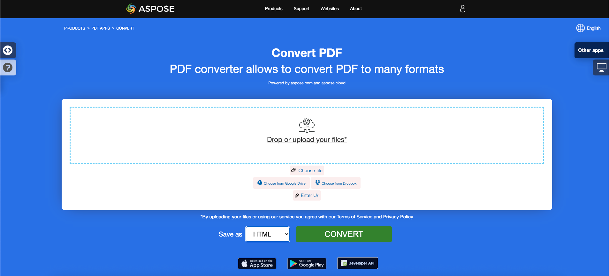

## Overview

Artikel ini menjelaskan cara **mengonversi PDF ke HTML menggunakan C#**. Ini mencakup topik-topik berikut.

_Format_: **HTML**
- [C# PDF ke HTML](#csharp-pdf-to-html)
- [C# Mengonversi PDF ke HTML](#csharp-pdf-to-html)
- [C# Cara mengonversi file PDF ke HTML](#csharp-pdf-to-html)

Potongan kode berikut juga berfungsi dengan perpustakaan [Aspose.PDF.Drawing](/pdf/net/drawing/).

## Mengonversi PDF ke HTML

**Aspose.PDF untuk .NET** menyediakan banyak fitur untuk mengonversi berbagai format file menjadi dokumen PDF dan mengonversi file PDF ke berbagai format keluaran.
**Aspose.PDF untuk .NET** menyediakan banyak fitur untuk mengonversi berbagai format file menjadi dokumen PDF dan mengonversi file PDF ke berbagai format keluaran.

**Aspose.PDF untuk .NET** mendukung fitur untuk mengonversi file PDF menjadi HTML. Tugas utama yang dapat Anda lakukan dengan perpustakaan Aspose.PDF adalah:

- mengonversi PDF ke HTML;
- membagi Output menjadi HTML Multi-halaman;
- menentukan Folder untuk Menyimpan File SVG;
- mengompresi Gambar SVG Selama Konversi;
- menentukan Folder Gambar;
- membuat File Berikutnya dengan Hanya Isi Tubuh;
- rendering Teks transparan;
- rendering lapisan dokumen PDF.

{}
**Coba konversi PDF ke HTML secara online**

Aspose.PDF untuk .NET mempersembahkan aplikasi gratis online ["PDF ke HTML"](https://products.aspose.app/pdf/conversion/pdf-to-html), di mana Anda dapat mencoba untuk menyelidiki fungsionalitas dan kualitas kerjanya.

[](https://products.aspose.app/pdf/conversion/pdf-to-html)
{}

Aspose.PDF untuk .NET menyediakan dua baris kode untuk mengubah file PDF sumber menjadi HTML.
Aspose.PDF untuk .NET menyediakan dua baris kode untuk mengubah file PDF sumber menjadi HTML.

<a name="csharp-pdf-to-html"><strong>Langkah: Mengonversi PDF ke HTML dalam C#</strong></a>

1. Buat sebuah instansi dari objek [Document](https://reference.aspose.com/pdf/net/aspose.pdf/document/) dengan dokumen PDF sumber.
2. Simpan ke format **SaveFormat.Html** dengan memanggil metode **Document.Save()**.

```csharp
// Untuk contoh lengkap dan file data, silakan kunjungi https://github.com/aspose-pdf/Aspose.PDF-for-.NET
// Jalur ke direktori dokumen.
string dataDir = RunExamples.GetDataDir_AsposePdf_DocumentConversion();

// Buka dokumen PDF sumber
Document pdfDocument = new Document(dataDir + "PDFToHTML.pdf");

// Simpan file ke dalam format dokumen MS
pdfDocument.Save(dataDir + "output_out.html", SaveFormat.Html);
```

### Memecah Output menjadi HTML Multi-halaman

Ketika mengonversi file PDF besar dengan beberapa halaman ke format HTML, output tampak sebagai satu halaman HTML.
Saat mengonversi file PDF besar dengan beberapa halaman ke format HTML, hasilnya muncul sebagai satu halaman HTML.

```csharp
// Untuk contoh lengkap dan file data, silakan kunjungi https://github.com/aspose-pdf/Aspose.PDF-for-.NET
// Jalur ke direktori dokumen.
string dataDir = RunExamples.GetDataDir_AsposePdf_DocumentConversion();

// Buka dokumen PDF sumber
Document pdfDocument = new Document(dataDir + "PDFToHTML.pdf");

// Instansiasi objek HtmlSaveOptions
HtmlSaveOptions htmlOptions = new HtmlSaveOptions();

// Tentukan untuk memecah keluaran menjadi beberapa halaman
htmlOptions.SplitIntoPages = true;

// Simpan dokumen
pdfDocument.Save(@"MultiPageHTML_out.html", htmlOptions);
```

### Tentukan Folder untuk Menyimpan File SVG

Saat konversi PDF ke HTML, ada kemungkinan untuk menentukan folder tempat gambar SVG harus disimpan.
Selama konversi PDF ke HTML, dimungkinkan untuk menentukan folder tempat gambar SVG harus disimpan.

```csharp
// Memuat file PDF
Document doc = new Document(dataDir + "PDFToHTML.pdf");

// Membuat objek opsi penyimpanan HTML
HtmlSaveOptions newOptions = new HtmlSaveOptions();

// Menentukan folder tempat gambar SVG disimpan selama konversi PDF ke HTML
newOptions.SpecialFolderForSvgImages = dataDir;

// Menyimpan file hasil
doc.Save(dataDir + "SaveSVGFiles_out.html", newOptions);
```

### Mengompres Gambar SVG Selama Konversi

Untuk mengompres gambar SVG selama konversi PDF ke HTML, silakan coba gunakan kode berikut:

```csharp
// Untuk contoh lengkap dan file data, silakan kunjungi https://github.com/aspose-pdf/Aspose.PDF-for-.NET
// Membuat HtmlSaveOption dengan fitur yang diuji
HtmlSaveOptions newOptions = new HtmlSaveOptions();

// Mengompres gambar SVG jika ada
newOptions.CompressSvgGraphicsIfAny = true;
```

### Menentukan Folder Gambar

Kita juga dapat menentukan folder tempat gambar akan disimpan selama konversi PDF ke HTML:
Kami juga dapat menentukan folder tempat gambar akan disimpan selama konversi PDF ke HTML:

```csharp
// Untuk contoh lengkap dan file data, silakan kunjungi https://github.com/aspose-pdf/Aspose.PDF-for-.NET
// Buat HtmlSaveOption dengan fitur yang telah diuji
HtmlSaveOptions newOptions = new HtmlSaveOptions();

// Tentukan folder terpisah untuk menyimpan gambar
newOptions.SpecialFolderForAllImages = dataDir;
```

### Membuat File Lanjutan Hanya dengan Isi Body

Baru-baru ini, kami diminta untuk memperkenalkan fitur di mana file PDF dikonversi menjadi HTML dan pengguna dapat mendapatkan hanya konten tag `<body>` untuk setiap halaman. Ini akan menghasilkan satu file dengan CSS, detail `<html>`, `<head>` dan semua halaman dalam file lain hanya dengan konten `<body>`.

Untuk memenuhi kebutuhan ini, properti baru, HtmlMarkupGenerationMode, diperkenalkan ke kelas HtmlSaveOptions.

Dengan potongan kode sederhana berikut ini, Anda dapat membagi HTML keluaran menjadi halaman.
Dengan potongan kode sederhana berikut, Anda dapat membagi HTML keluaran menjadi beberapa halaman.

```csharp
// Jalur ke direktori dokumen.
string dataDir = RunExamples.GetDataDir_AsposePdf_DocumentConversion();

Document doc = new Document(dataDir + "PDFToHTML.pdf");
           
HtmlSaveOptions options = new HtmlSaveOptions();
// Ini adalah pengaturan yang diuji
options.HtmlMarkupGenerationMode = HtmlSaveOptions.HtmlMarkupGenerationModes.WriteOnlyBodyContent;
options.SplitIntoPages = true;

doc.Save(dataDir + "CreateSubsequentFiles_out.html", options);
```

### Rendering Teks Transparan

Jika file PDF sumber/masukan mengandung teks transparan yang ditimbulkan oleh gambar latar depan, maka mungkin ada masalah rendering teks. Oleh karena itu, untuk mengatasi skenario seperti ini, properti SaveShadowedTextsAsTransparentTexts dan SaveTransparentTexts dapat digunakan.

```csharp
// Untuk contoh lengkap dan file data, silakan kunjungi https://github.com/aspose-pdf/Aspose.PDF-for-.NET
// Jalur ke direktori dokumen.
string dataDir = RunExamples.GetDataDir_AsposePdf_DocumentConversion();

Document doc = new Document(dataDir + "PDFToHTML.pdf");
HtmlSaveOptions htmlOptions = new HtmlSaveOptions();
htmlOptions.SaveShadowedTextsAsTransparentTexts = true;
htmlOptions.SaveTransparentTexts = true;
doc.Save(dataDir + "TransparentTextRendering_out.html", htmlOptions);
```
### Rendering lapisan dokumen PDF

Kita dapat merender lapisan dokumen PDF dalam elemen tipe lapisan terpisah selama konversi PDF ke HTML:

```csharp
// Untuk contoh lengkap dan file data, silakan kunjungi https://github.com/aspose-pdf/Aspose.PDF-for-.NET
// Jalur ke direktori dokumen.
string dataDir = RunExamples.GetDataDir_AsposePdf_DocumentConversion();

Document doc = new Document(dataDir + "PDFToHTML.pdf");
// Instansiasi objek HtmlSaveOptions
HtmlSaveOptions htmlOptions = new HtmlSaveOptions();

// Tentukan untuk merender lapisan dokumen PDF secara terpisah dalam HTML keluaran
htmlOptions.ConvertMarkedContentToLayers = true;

// Simpan dokumen
doc.Save(dataDir + "LayersRendering_out.html", htmlOptions);
```

## Lihat Juga

Artikel ini juga mencakup topik-topik berikut. Kode-kodenya sama seperti di atas.

_Format_: **HTML**
- [C# PDF ke HTML Code](#csharp-pdf-to-html)
- [C# PDF ke HTML API](#csharp-pdf-to-html)
- [C# PDF ke HTML Secara Programatis](#csharp-pdf-to-html)
- [C# PDF ke HTML Library](#csharp-pdf-to-html)
- [C# Simpan PDF sebagai HTML](#csharp-pdf-to-html)
- [C# Simpan PDF sebagai HTML](#csharp-pdf-to-html)
- [C# Hasilkan HTML dari PDF](#csharp-pdf-to-html)
- [C# Buat HTML dari PDF](#csharp-pdf-to-html)
- [C# Konverter PDF ke HTML](#csharp-pdf-to-html)
