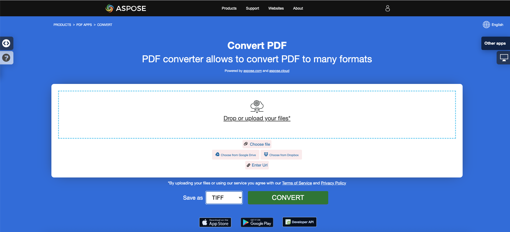

<script type="application/ld+json">
{
    "@context": "https://schema.org",
    "@type": "TechArticle",
    "headline": "Convert PDF to Different Image Formats in C#",
    "alternativeHeadline": "Convert PDF Files to Multiple Image Formats in C#",
    "abstract": "Fitur dalam Aspose.PDF for .NET memungkinkan pengguna untuk mengonversi file PDF menjadi beberapa format gambar seperti TIFF, BMP, EMF, JPEG, PNG, GIF, dan SVG. Fungsionalitas ini menyederhanakan penanganan dokumen dengan memungkinkan konversi hanya dengan beberapa baris kode C#, menjadikannya alat penting bagi pengembang yang ingin meningkatkan aplikasi mereka dengan kemampuan pemrosesan PDF yang serbaguna.",
    "author": {
        "@type": "Person",
        "name": "Anastasiia Holub",
        "givenName": "Anastasiia",
        "familyName": "Holub",
        "url": "https://www.linkedin.com/in/anastasiia-holub-750430225/"
    },
    "genre": "pdf document generation",
    "wordcount": "2012",
    "proficiencyLevel": "Beginner",
    "publisher": {
        "@type": "Organization",
        "name": "Aspose.PDF for .NET",
        "url": "https://products.aspose.com/pdf",
        "logo": "https://www.aspose.cloud/templates/aspose/img/products/pdf/aspose_pdf-for-net.svg",
        "alternateName": "Aspose",
        "sameAs": [
            "https://facebook.com/aspose.pdf/",
            "https://twitter.com/asposepdf",
            "https://www.youtube.com/channel/UCmV9sEg_QWYPi6BJJs7ELOg/featured",
            "https://www.linkedin.com/company/aspose",
            "https://stackoverflow.com/questions/tagged/aspose",
            "https://aspose.quora.com/",
            "https://aspose.github.io/"
        ],
        "contactPoint": [
            {
                "@type": "ContactPoint",
                "telephone": "+1 903 306 1676",
                "contactType": "sales",
                "areaServed": "US",
                "availableLanguage": "en"
            },
            {
                "@type": "ContactPoint",
                "telephone": "+44 141 628 8900",
                "contactType": "sales",
                "areaServed": "GB",
                "availableLanguage": "en"
            },
            {
                "@type": "ContactPoint",
                "telephone": "+61 2 8006 6987",
                "contactType": "sales",
                "areaServed": "AU",
                "availableLanguage": "en"
            }
        ]
    },
    "url": "/net/convert-pdf-to-images-format/",
    "mainEntityOfPage": {
        "@type": "WebPage",
        "@id": "/net/convert-pdf-to-images-format/"
    },
    "dateModified": "2024-11-25",
    "description": "Aspose.PDF dapat melakukan tidak hanya tugas yang sederhana dan mudah tetapi juga dapat menangani tujuan yang lebih kompleks. Periksa bagian berikut untuk pengguna dan pengembang tingkat lanjut."
}
</script>

## Ikhtisar

Artikel ini menjelaskan cara mengonversi PDF ke berbagai format gambar menggunakan C#. Ini mencakup topik berikut.

_Format Gambar_: **TIFF**
- [C# PDF ke TIFF](#csharp-pdf-to-tiff)
- [C# Mengonversi PDF ke TIFF](#csharp-pdf-to-tiff)
- [C# Mengonversi Halaman Tunggal atau Tertentu dari PDF ke TIFF](#csharp-pdf-to-tiff-pages)

_Format Gambar_: **BMP**
- [C# PDF ke BMP](#csharp-pdf-to-bmp)
- [C# Mengonversi PDF ke BMP](#csharp-pdf-to-bmp)
- [C# PDF ke Konverter BMP](#csharp-pdf-to-bmp)

_Format Gambar_: **EMF**
- [C# PDF ke EMF](#csharp-pdf-to-emf)
- [C# Mengonversi PDF ke EMF](#csharp-pdf-to-emf)
- [C# PDF ke Konverter EMF](#csharp-pdf-to-emf)

_Format Gambar_: **JPG**
- [C# PDF ke JPG](#csharp-pdf-to-jpg)
- [C# Mengonversi PDF ke JPG](#csharp-pdf-to-jpg)
- [C# PDF ke Konverter JPG](#csharp-pdf-to-jpg)

_Format Gambar_: **PNG**
- [C# PDF ke PNG](#csharp-pdf-to-png)
- [C# Mengonversi PDF ke PNG](#csharp-pdf-to-png)
- [C# PDF ke Konverter PNG](#csharp-pdf-to-png)

_Format Gambar_: **GIF**
- [C# PDF ke GIF](#csharp-pdf-to-gif)
- [C# Mengonversi PDF ke GIF](#csharp-pdf-to-gif)
- [C# PDF ke Konverter GIF](#csharp-pdf-to-gif)

_Format Gambar_: **SVG**
- [C# PDF ke SVG](#csharp-pdf-to-svg)
- [C# Mengonversi PDF ke SVG](#csharp-pdf-to-svg)
- [C# PDF ke Konverter SVG](#csharp-pdf-to-svg)

## C# Mengonversi PDF ke Gambar

Potongan kode berikut juga bekerja dengan pustaka [Aspose.PDF.Drawing](/pdf/id/net/drawing/).

**Aspose.PDF for .NET** menggunakan beberapa pendekatan untuk mengonversi PDF ke gambar. Secara umum, kami menggunakan dua pendekatan: konversi menggunakan pendekatan Device dan konversi menggunakan SaveOption. Bagian ini akan menunjukkan kepada Anda cara mengonversi dokumen PDF ke format gambar seperti BMP, JPEG, GIF, PNG, EMF, TIFF, dan SVG menggunakan salah satu dari pendekatan tersebut.

Ada beberapa kelas dalam pustaka yang memungkinkan Anda menggunakan perangkat virtual untuk mengubah gambar. DocumentDevice ditujukan untuk konversi seluruh dokumen, tetapi ImageDevice - untuk halaman tertentu.

## Mengonversi PDF menggunakan kelas DocumentDevice

**Aspose.PDF for .NET** memungkinkan untuk mengonversi Halaman PDF ke gambar TIFF.

Kelas TiffDevice (berbasis DocumentDevice) memungkinkan Anda mengonversi halaman PDF ke gambar TIFF. Kelas ini menyediakan metode bernama `Process` yang memungkinkan Anda mengonversi semua halaman dalam file PDF menjadi satu gambar TIFF.

{}
**Cobalah untuk mengonversi PDF ke TIFF secara online**

Aspose.PDF for .NET mempersembahkan aplikasi gratis online ["PDF ke TIFF"](https://products.aspose.app/pdf/conversion/pdf-to-tiff), di mana Anda dapat mencoba menyelidiki fungsionalitas dan kualitasnya.

[](https://products.aspose.app/pdf/conversion/pdf-to-tiff)
{}

### Mengonversi Halaman PDF ke Satu Gambar TIFF

Aspose.PDF for .NET menjelaskan cara mengonversi semua halaman dalam file PDF menjadi satu gambar TIFF:

<a name="csharp-pdf-to-tiff"><strong>Langkah: Mengonversi PDF ke TIFF di C#</strong></a>

1. Buat objek dari kelas **Document**.
2. Buat objek **TiffSettings** dan **TiffDevice**.
3. Panggil metode **TiffDevice.Process()** untuk mengonversi dokumen PDF ke TIFF.
4. Untuk mengatur properti file keluaran, gunakan kelas **TiffSettings**.

Potongan kode berikut menunjukkan cara mengonversi semua halaman PDF menjadi satu gambar TIFF.

```csharp
// For complete examples and data files, visit https://github.com/aspose-pdf/Aspose.PDF-for-.NET
private static void ConvertPDFtoTIFF()
{
    // The path to the documents directory
    var dataDir = RunExamples.GetDataDir_AsposePdf_WorkingDocuments();

    // Open PDF document
    using (var document = new Aspose.Pdf.Document(dataDir + "PDFtoTIFF.pdf"))
    {
        // Create Resolution object
        var resolution = new Aspose.Pdf.Devices.Resolution(300);

        // Create TiffSettings object
        var tiffSettings = new Aspose.Pdf.Devices.TiffSettings
        {
            Compression = Aspose.Pdf.Devices.CompressionType.None,
            Depth = Aspose.Pdf.Devices.ColorDepth.Default,
            Shape = Aspose.Pdf.Devices.ShapeType.Landscape,
            SkipBlankPages = false
        };

        // Create TIFF device
        var tiffDevice = new Aspose.Pdf.Devices.TiffDevice(resolution, tiffSettings);

        // Convert a particular page and save the image to stream
        tiffDevice.Process(document, dataDir + "PDFtoTIFF_out.tif");
    }
}
```

### Mengonversi Satu Halaman ke Gambar TIFF

Aspose.PDF for .NET memungkinkan untuk mengonversi halaman tertentu dalam file PDF menjadi gambar TIFF, gunakan versi overload dari metode Process(..) yang mengambil nomor halaman sebagai argumen untuk konversi. Potongan kode berikut menunjukkan cara mengonversi halaman pertama dari PDF ke format TIFF.

<a name="csharp-pdf-to-tiff-pages"><strong>Langkah: Mengonversi Halaman Tunggal atau Tertentu dari PDF ke TIFF di C#</strong></a>

1. Buat objek dari kelas **Document**.
2. Buat objek **TiffSettings** dan **TiffDevice**.
3. Panggil metode overload **TiffDevice.Process()** dengan parameter **fromPage** dan **toPage** untuk mengonversi halaman dokumen PDF ke TIFF.

```csharp
// For complete examples and data files, visit https://github.com/aspose-pdf/Aspose.PDF-for-.NET
private static void ConvertPDFtoTiffSinglePage()
{
    // The path to the documents directory
    var dataDir = RunExamples.GetDataDir_AsposePdf_WorkingDocuments();

    // Open PDF document
    using (var document = new Aspose.Pdf.Document(dataDir + "PDFtoTiffSinglePage.pdf"))
    {
        // Create Resolution object
        var resolution = new Aspose.Pdf.Devices.Resolution(300);

        // Create TiffSettings object
        var tiffSettings = new Aspose.Pdf.Devices.TiffSettings
        {
            Compression = Aspose.Pdf.Devices.CompressionType.None,
            Depth = Aspose.Pdf.Devices.ColorDepth.Default,
            Shape = Aspose.Pdf.Devices.ShapeType.Landscape,
        };

        // Create TIFF device
        var tiffDevice = new Aspose.Pdf.Devices.TiffDevice(resolution, tiffSettings);

        // Convert a particular page and save the image to stream
        tiffDevice.Process(document, 1, 1, dataDir + "PDFtoTiffSinglePage_out.tif");
    }
}
```

### Gunakan algoritma Bradley selama konversi

Aspose.PDF for .NET telah mendukung fitur untuk mengonversi PDF ke TIF menggunakan kompresi LZW dan kemudian dengan menggunakan AForge, Binarization dapat diterapkan. Namun salah satu pelanggan meminta bahwa untuk beberapa gambar, mereka perlu mendapatkan Threshold menggunakan Otsu, jadi mereka juga ingin menggunakan Bradley.

```csharp
// For complete examples and data files, visit https://github.com/aspose-pdf/Aspose.PDF-for-.NET
private static void ConvertPDFtoTiffBradleyBinarization()
{
    // The path to the documents directory
    var dataDir = RunExamples.GetDataDir_AsposePdf_WorkingDocuments();

    // Open PDF document
    using (var document = new Aspose.Pdf.Document(dataDir + "PDFtoTiffBradleyBinarization.pdf"))
    {
        string outputImageFile = dataDir + "PDFtoTiffBradleyBinarization_out.tif";
        string outputBinImageFile = dataDir + "PDFtoTiffBradleyBinarization-bin_out.tif";

        // Create Resolution object
        var resolution = new Aspose.Pdf.Devices.Resolution(300);

        // Create TiffSettings object
        var tiffSettings = new Aspose.Pdf.Devices.TiffSettings
        {
            Compression = Aspose.Pdf.Devices.CompressionType.LZW,
            Depth = Aspose.Pdf.Devices.ColorDepth.Format1bpp
        };

        // Create TIFF device
        var tiffDevice = new Aspose.Pdf.Devices.TiffDevice(resolution, tiffSettings);

        // Convert a particular page and save the image to stream
        tiffDevice.Process(document, outputImageFile);

        // Binarize the image using Bradley method
        using (var inStream = new FileStream(outputImageFile, FileMode.Open))
        {
            using (var outStream = new FileStream(outputBinImageFile, FileMode.Create))
            {
                tiffDevice.BinarizeBradley(inStream, outStream, 0.1);
            }
        }
    }
}
```

## Mengonversi PDF menggunakan kelas ImageDevice

`ImageDevice` adalah nenek moyang untuk `BmpDevice`, `JpegDevice`, `GifDevice`, `PngDevice` dan `EmfDevice`.

- Kelas [BmpDevice](https://reference.aspose.com/pdf/net/aspose.pdf.devices/bmpdevice) memungkinkan Anda mengonversi halaman PDF ke gambar <abbr title="Bitmap Image File">BMP</abbr>.
- Kelas [EmfDevice](https://reference.aspose.com/pdf/net/aspose.pdf.devices/emfdevice) memungkinkan Anda mengonversi halaman PDF ke gambar <abbr title="Enhanced Meta File">EMF</abbr>.
- Kelas [JpegDevice](https://reference.aspose.com/pdf/net/aspose.pdf.devices/jpegdevice) memungkinkan Anda mengonversi halaman PDF ke gambar JPEG.
- Kelas [PngDevice](https://reference.aspose.com/pdf/net/aspose.pdf.devices/pngdevice) memungkinkan Anda mengonversi halaman PDF ke gambar <abbr title="Portable Network Graphics">PNG</abbr>.
- Kelas [GifDevice](https://reference.aspose.com/pdf/net/aspose.pdf.devices/gifdevice) memungkinkan Anda mengonversi halaman PDF ke gambar <abbr title="Graphics Interchange Format">GIF</abbr>.

Mari kita lihat bagaimana cara mengonversi halaman PDF menjadi gambar.

Kelas `BmpDevice` menyediakan metode bernama [Process](https://reference.aspose.com/pdf/net/aspose.pdf.devices/bmpdevice/methods/process) yang memungkinkan Anda mengonversi halaman tertentu dari file PDF ke format gambar BMP. Kelas lainnya memiliki metode yang sama. Jadi, jika kita perlu mengonversi halaman PDF menjadi gambar, kita hanya perlu menginstansiasi kelas yang diperlukan.

<a name="csharp-pdf-to-bmp"></a>
<a name="csharp-pdf-to-emf"></a>
<a name="csharp-pdf-to-jpg"></a>
<a name="csharp-pdf-to-png"></a>
<a name="csharp-pdf-to-gif"></a>
    
Langkah-langkah dan potongan kode berikut dalam C# menunjukkan kemungkinan ini
 
 - [Mengonversi PDF ke BMP di C#](#csharp-pdf-to-image)
 - [Mengonversi PDF ke EMF di C#](#csharp-pdf-to-image)
 - [Mengonversi PDF ke JPG di C#](#csharp-pdf-to-image)
 - [Mengonversi PDF ke PNG di C#](#csharp-pdf-to-image)
 - [Mengonversi PDF ke GIF di C#](#csharp-pdf-to-image)

<a name="csharp-pdf-to-image"><strong>Langkah: PDF ke Gambar (BMP, EMF, JPG, PNG, GIF) di C#</strong></a>

1. Muat file PDF menggunakan kelas **Document**.
2. Buat instance dari subclass **ImageDevice** yaitu:
   * **BmpDevice** (untuk mengonversi PDF ke BMP).
   * **EmfDevice** (untuk mengonversi PDF ke Emf).
   * **JpegDevice** (untuk mengonversi PDF ke JPG).
   * **PngDevice** (untuk mengonversi PDF ke PNG).
   * **GifDevice** (untuk mengonversi PDF ke GIF).
3. Panggil metode **ImageDevice.Process()** untuk melakukan konversi PDF ke Gambar.

```csharp
// For complete examples and data files, visit https://github.com/aspose-pdf/Aspose.PDF-for-.NET
private static void ConvertPDFusingImageDevice()
{
    // The path to the documents directory
    var dataDir = RunExamples.GetDataDir_AsposePdf_WorkingDocuments();

    // Create Resolution object            
    var resolution = new Aspose.Pdf.Devices.Resolution(300);
    var bmpDevice = new Aspose.Pdf.Devices.BmpDevice(resolution);
    var jpegDevice = new Aspose.Pdf.Devices.JpegDevice(resolution);
    var gifDevice = new Aspose.Pdf.Devices.GifDevice(resolution);
    var pngDevice = new Aspose.Pdf.Devices.PngDevice(resolution);
    var emfDevice = new Aspose.Pdf.Devices.EmfDevice(resolution);

    // Open PDF document
    using (var document = new Aspose.Pdf.Document(dataDir + "ConvertAllPagesToBmp.pdf"))
    {
        ConvertPDFtoImage(bmpDevice, "bmp", document, dataDir);
        ConvertPDFtoImage(jpegDevice, "jpeg", document, dataDir);
        ConvertPDFtoImage(gifDevice, "gif", document, dataDir);
        ConvertPDFtoImage(pngDevice, "png", document, dataDir);
        ConvertPDFtoImage(emfDevice, "emf", document, dataDir);
    }
}

private static void ConvertPDFtoImage(ImageDevice imageDevice,
        string ext, Document document, var dataDir)
{
    for (int pageCount = 1; pageCount <= document.Pages.Count; pageCount++)
    {
        using (FileStream imageStream =
            new FileStream($"{dataDir}image{pageCount}_out.{ext}",
            FileMode.Create))
        {
            // Convert a particular page and save the image to stream
            imageDevice.Process(document.Pages[pageCount], imageStream);
        }
    }
}
```

{}
**Cobalah untuk mengonversi PDF ke PNG secara online**

Sebagai contoh bagaimana aplikasi gratis kami bekerja, silakan periksa fitur berikut.

Aspose.PDF for .NET mempersembahkan aplikasi gratis online ["PDF ke PNG"](https://products.aspose.app/pdf/conversion/pdf-to-png), di mana Anda dapat mencoba menyelidiki fungsionalitas dan kualitasnya.

[](https://products.aspose.app/pdf/conversion/pdf-to-png)
{}

## Mengonversi PDF menggunakan kelas SaveOptions

Bagian artikel ini menunjukkan cara mengonversi PDF ke <abbr title="Scalable Vector Graphics">SVG</abbr> menggunakan C# dan kelas SaveOptions.

{}
**Cobalah untuk mengonversi PDF ke SVG secara online**

Aspose.PDF for .NET mempersembahkan aplikasi gratis online ["PDF ke SVG"](https://products.aspose.app/pdf/conversion/pdf-to-svg), di mana Anda dapat mencoba menyelidiki fungsionalitas dan kualitasnya.

[](https://products.aspose.app/pdf/conversion/pdf-to-svg)
{}

**Scalable Vector Graphics (SVG)** adalah sekumpulan spesifikasi format file berbasis XML untuk grafik vektor dua dimensi, baik statis maupun dinamis (interaktif atau animasi). Spesifikasi SVG adalah standar terbuka yang telah dikembangkan oleh World Wide Web Consortium (W3C) sejak 1999.

Gambar SVG dan perilakunya didefinisikan dalam file teks XML. Ini berarti bahwa mereka dapat dicari, diindeks, diskrip, dan jika diperlukan, dikompresi. Sebagai file XML, gambar SVG dapat dibuat dan diedit dengan editor teks apa pun, tetapi seringkali lebih nyaman untuk membuatnya dengan program menggambar seperti Inkscape.

Aspose.PDF for .NET mendukung fitur untuk mengonversi gambar SVG ke format PDF dan juga menawarkan kemampuan untuk mengonversi file PDF ke format SVG. Untuk memenuhi kebutuhan ini, kelas [`SvgSaveOptions`](https://reference.aspose.com/pdf/net/aspose.pdf/svgsaveoptions/methods/index) telah diperkenalkan ke dalam namespace Aspose.PDF. Buat objek dari SvgSaveOptions dan berikan sebagai argumen kedua ke metode [`Document.Save(..)`](https://reference.aspose.com/pdf/net/aspose.pdf/document/methods/save/index).

Potongan kode berikut menunjukkan langkah-langkah untuk mengonversi file PDF ke format SVG dengan .NET.

<a name="csharp-pdf-to-svg"><strong>Langkah: Mengonversi PDF ke SVG di C#</strong></a>

1. Buat objek dari kelas **Document**.
2. Buat objek **SvgSaveOptions** dengan pengaturan yang diperlukan.
3. Panggil metode **Document.Save()** dan berikan objek **SvgSaveOptions** untuk mengonversi dokumen PDF ke SVG.

```csharp
// For complete examples and data files, visit https://github.com/aspose-pdf/Aspose.PDF-for-.NET
private static void ConvertPDFtoSVG()
{
    // The path to the documents directory
    var dataDir = RunExamples.GetDataDir_AsposePdf_WorkingDocuments();

    // Open PDF document
    using (var document = new Aspose.Pdf.Document(dataDir + "PDFtoSVG.pdf"))
    {
        // Instantiate an object of SvgSaveOptions
        var saveOptions = new Aspose.Pdf.SvgSaveOptions
        {
            // Do not compress SVG image to Zip archive
            CompressOutputToZipArchive = false,
            TreatTargetFileNameAsDirectory = true                
        };

        // Save SVG file
        document.Save(dataDir + "PDFToSVG_out.svg", saveOptions);
    }
}
```