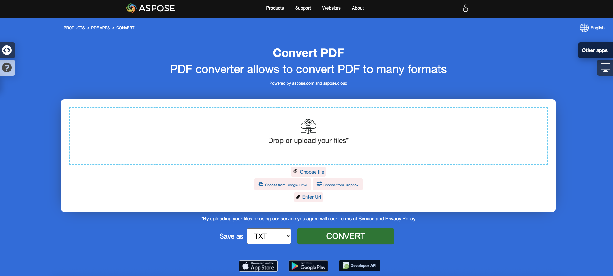

## Mengonversi PDF ke EPUB

{}
**Coba konversi PDF ke EPUB secara online**

Aspose.PDF untuk .NET menyajikan aplikasi gratis online ["PDF ke EPUB"](https://products.aspose.app/pdf/conversion/pdf-to-epub) di mana Anda dapat mencoba menginvestigasi fungsionalitas dan kualitas kerjanya.

[](https://products.aspose.app/pdf/conversion/pdf-to-epub)
{}

**<abbr title="Electronic Publication">EPUB</abbr>** adalah standar buku elektronik gratis dan terbuka dari International Digital Publishing Forum (IDPF).
**<abbr title="Electronic Publication">EPUB</abbr>** adalah standar e-book gratis dan terbuka dari International Digital Publishing Forum (IDPF).
EPUB dirancang untuk konten yang dapat mengalir, yang berarti bahwa pembaca EPUB dapat mengoptimalkan teks untuk perangkat tampilan tertentu. EPUB juga mendukung konten dengan tata letak tetap. Format ini dimaksudkan sebagai satu format yang dapat digunakan oleh penerbit dan rumah konversi secara internal, serta untuk distribusi dan penjualan. Ini menggantikan standar Open eBook.

Potongan kode berikut juga bekerja dengan pustaka [Aspose.PDF.Drawing](/pdf/net/drawing/).

Aspose.PDF untuk .NET juga mendukung fitur untuk mengonversi dokumen PDF menjadi format EPUB. Aspose.PDF untuk .NET memiliki kelas bernama EpubSaveOptions yang dapat digunakan sebagai argumen kedua untuk metode [`Document.Save(..)`](https://reference.aspose.com/pdf/net/aspose.pdf/document/methods/save/index), untuk menghasilkan file EPUB.
Silakan coba menggunakan potongan kode berikut untuk mencapai kebutuhan ini dengan C#.

```csharp
// Untuk contoh lengkap dan file data, silakan kunjungi https://github.com/aspose-pdf/Aspose.PDF-for-.NET
// Jalur ke direktori dokumen.
string dataDir = RunExamples.GetDataDir_AsposePdf_DocumentConversion();
// Muat dokumen PDF
Document pdfDocument = new Document(dataDir + "PDFToEPUB.pdf");
// Instansiasi opsi simpan Epub
EpubSaveOptions options = new EpubSaveOptions();
// Tentukan tata letak untuk konten
options.ContentRecognitionMode = EpubSaveOptions.RecognitionMode.Flow;
// Simpan dokumen ePUB
pdfDocument.Save(dataDir + "PDFToEPUB_out.epub", options);
```
## Konversi PDF ke LaTeX/TeX

**Aspose.PDF for .NET** mendukung konversi PDF ke LaTeX/TeX.
Format file LaTeX adalah format file teks dengan markup khusus dan digunakan dalam sistem persiapan dokumen berbasis TeX untuk pengetikan berkualitas tinggi.

{}
**Coba konversi PDF ke LaTeX/TeX secara online**

Aspose.PDF for .NET menyajikan aplikasi gratis online ["PDF to LaTeX"](https://products.aspose.app/pdf/conversion/pdf-to-tex), di mana Anda dapat mencoba untuk menyelidiki fungsionalitas dan kualitas kerjanya.

[](https://products.aspose.app/pdf/conversion/pdf-to-tex)
{}

Untuk mengonversi file PDF ke TeX, Aspose.PDF memiliki kelas [LaTeXSaveOptions](https://reference.aspose.com/pdf/net/aspose.pdf/latexsaveoptions) yang menyediakan properti OutDirectoryPath untuk menyimpan gambar sementara selama proses konversi.

Potongan kode berikut menunjukkan proses konversi file PDF menjadi format TEX dengan C#.

```csharp
// Untuk contoh lengkap dan file data, silakan kunjungi https://github.com/aspose-pdf/Aspose.PDF-for-.NET
// Jalur ke direktori dokumen.
string dataDir = RunExamples.GetDataDir_AsposePdf_DocumentConversion();

// Buat objek Dokumen
Aspose.Pdf.Document doc = new Aspose.Pdf.Document(dataDir + "PDFToTeX.pdf");

// Instansiasi opsi penyimpanan LaTex          
LaTeXSaveOptions saveOptions = new LaTeXSaveOptions();

// Tentukan direktori keluaran
string pathToOutputDirectory = dataDir;

// Atur jalur direktori keluaran untuk objek opsi simpan
saveOptions.OutDirectoryPath = pathToOutputDirectory;

// Simpan file PDF ke format LaTex           
doc.Save(dataDir + "PDFToTeX_out.tex", saveOptions);
```
## Mengonversi PDF ke Teks

**Aspose.PDF for .NET** mendukung konversi seluruh dokumen PDF dan halaman tunggal ke file Teks.

### Mengonversi seluruh dokumen PDF ke file Teks

Anda dapat mengonversi dokumen PDF ke file TXT menggunakan metode [Visit](https://reference.aspose.com/pdf/net/aspose.pdf.text/textabsorber/methods/visit/index) dari kelas [TextAbsorber](https://reference.aspose.com/pdf/net/aspose.pdf.text/textabsorber).

Potongan kode berikut menjelaskan cara mengekstrak teks dari semua halaman.

```csharp
public static void ConvertPDFDocToTXT()
{
    // Buka dokumen
    Document pdfDocument = new Document(_dataDir + "demo.pdf");
    TextAbsorber ta = new TextAbsorber();
    ta.Visit(pdfDocument);
    // Simpan teks yang diekstraksi di file teks
    File.WriteAllText(_dataDir + "input_Text_Extracted_out.txt",ta.Text);
}
```

{}
**Coba konversi PDF ke Teks secara online**

Aspose.PDF for .NET menyajikan aplikasi gratis online ["PDF to Text"](https://products.aspose.app/pdf/conversion/pdf-to-txt), di mana Anda dapat mencoba untuk menyelidiki fungsionalitas dan kualitas kerjanya.
Aspose.PDF for .NET memperkenalkan aplikasi gratis online ["PDF to Text"](https://products.aspose.app/pdf/conversion/pdf-to-txt), di mana Anda dapat mencoba untuk menginvestigasi fungsionalitas dan kualitas kerjanya.

[](https://products.aspose.app/pdf/conversion/pdf-to-txt)
{}

### Mengonversi halaman PDF ke file teks

Anda dapat mengonversi dokumen PDF ke file TXT dengan Aspose.PDF untuk .NET. Anda harus menggunakan metode `Visit` dari kelas `TextAbsorber` untuk menyelesaikan tugas ini.

Potongan kode berikut menjelaskan cara mengekstrak teks dari halaman tertentu.

```csharp
public static void ConvertPDFPagestoTXT()
{
    Document pdfDocument = new Document(System.IO.Path.Combine(_dataDir, "demo.pdf"));
    TextAbsorber ta = new TextAbsorber();
    var pages = new [] {1, 3, 4};
    foreach (var page in pages)
    {
        ta.Visit(pdfDocument.Pages[page]);
    }
   
    // Simpan teks yang diekstrak dalam file teks
    File.WriteAllText(System.IO.Path.Combine(_dataDir, "input_Text_Extracted_out.txt"), ta.Text);
}
```
## Konversi PDF ke XPS

**Aspose.PDF for .NET** memberikan kemungkinan untuk mengonversi file PDF ke format <abbr title="XML Paper Specification">XPS</abbr>. Mari kita coba menggunakan potongan kode yang disajikan untuk mengonversi file PDF ke format XPS dengan C#.

{}
**Coba konversi PDF ke XPS secara online**

Aspose.PDF for .NET mempersembahkan aplikasi online gratis ["PDF to XPS"](https://products.aspose.app/pdf/conversion/pdf-to-xps), di mana Anda dapat mencoba mengeksplorasi fungsionalitas dan kualitas kerjanya.

[](https://products.aspose.app/pdf/conversion/pdf-to-xps)
{}

Tipe file XPS terutama dikaitkan dengan Spesifikasi Kertas XML oleh Microsoft Corporation. Spesifikasi Kertas XML (XPS), yang sebelumnya dikenal dengan nama kode Metro dan mencakup konsep pemasaran Jalur Cetak Generasi Berikutnya (NGPP), adalah inisiatif Microsoft untuk mengintegrasikan pembuatan dan penayangan dokumen ke dalam sistem operasi Windows.

Untuk mengonversi file PDF ke XPS, Aspose.PDF memiliki kelas [XpsSaveOptions](https://reference.aspose.com/net/pdf/aspose.pdf/xpssaveoptions) yang digunakan sebagai argumen kedua untuk metode [Document.Save(..)](https://reference.aspose.com/pdf/net/aspose.pdf/document/methods/save/index) untuk menghasilkan file XPS.
Untuk mengonversi file PDF ke XPS, Aspose.PDF memiliki kelas [XpsSaveOptions](https://reference.aspose.com/net/pdf/aspose.pdf/xpssaveoptions) yang digunakan sebagai argumen kedua untuk metode [Document.Save(..)](https://reference.aspose.com/pdf/net/aspose.pdf/document/methods/save/index) untuk menghasilkan file XPS.

Potongan kode berikut menunjukkan proses konversi file PDF menjadi format XPS.

```csharp
// Untuk contoh lengkap dan file data, silakan kunjungi https://github.com/aspose-pdf/Aspose.PDF-for-.NET
// Jalur ke direktori dokumen.
string dataDir = RunExamples.GetDataDir_AsposePdf_DocumentConversion();

// Muat dokumen PDF
Document pdfDocument = new Document(dataDir + "input.pdf");

// Instansiasi opsi simpan XPS
Aspose.Pdf.XpsSaveOptions saveOptions = new Aspose.Pdf.XpsSaveOptions();
// Simpan dokumen XPS
pdfDocument.Save("PDFToXPS_out.xps", saveOptions)
```
