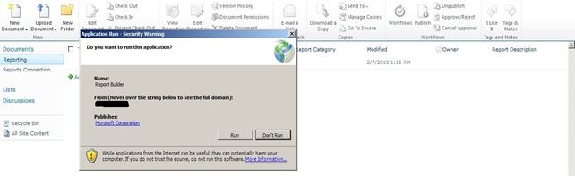

{}

Sekarang, karena SharePoint telah diinstal dan dikonfigurasi pada server RS serta RS telah disiapkan melalui Reporting Services Configuration Manager, kita dapat beralih ke konfigurasi dalam Central Admin. RS 2008 R2 memang sangat menyederhanakan proses ini. Dulu kami harus menjalankan proses tiga langkah untuk membuatnya berfungsi. Sekarang hanya ada satu langkah.

{}

{}

Kami ingin pergi ke situs Web Administrator Pusat dan kemudian ke Pengaturan Aplikasi Umum. Di bagian bawah kami akan melihat Reporting Services.

**Image1**:- dialog konfigurasi SharePoint

Pilih tautan "Reporting Services Integration". Layar berikut akan ditampilkan.

**Image2**:- Tentukan kredensial integrasi Reporting Services

{}

## URL Layanan Web:

**Kami akan menyediakan URL untuk Server Laporan yang kami temukan di Reporting Services Configuration Manager.**

## Mode Otentikasi:

**Kami juga akan memilih Mode Otentikasi. Tautan MSDN berikut menjelaskan secara rinci apa itu.**
Ikhtisar Keamanan untuk Reporting Services dalam Mode Terintegrasi SharePoint**

{}

**Singkatnya, jika situs Anda menggunakan Claims Authentication, Anda akan selalu menggunakan Trusted Authentication terlepas dari apa yang Anda pilih di sini. Jika Anda ingin meneruskan kredensial Windows, Anda harus memilih Windows Authentication. Untuk Trusted Authentication, kami akan meneruskan token SPUser dan tidak bergantung pada kredensial Windows. Anda juga sebaiknya menggunakan Trusted Authentication jika Anda telah mengonfigurasi situs Mode Klasik Anda untuk NTLM dan RS disetel untuk NTLM. Kerberos diperlukan untuk menggunakan Windows Authentication dan untuk meneruskannya ke sumber data Anda.**

{}

## Aktifkan fitur:

{}

**Ini memberi Anda opsi untuk mengaktifkan Reporting Services pada semua koleksi Situs, atau Anda dapat memilih mana yang ingin Anda aktifkan. Ini sebenarnya berarti situs mana yang akan dapat menggunakan Reporting Services. Setelah selesai, Anda akan melihat hasil berikut**

**Image3:**- Integrasi berhasil Reporting Services dengan lingkungan SharePoint
{}

{}

Kembali ke URL ReportServer, kita harus melihat sesuatu yang mirip dengan berikut ini

**Image4:**- Reporting Services berhasil terhubung dengan lingkungan SharePoint

**NOTE:** ***Jika situs SharePoint Anda dikonfigurasi untuk SSL, itu tidak akan muncul dalam daftar ini. Ini adalah masalah yang diketahui dan tidak berarti ada masalah. Laporan Anda seharusnya tetap berfungsi.***
{}

{}

Sekarang setelah kami berhasil mengintegrasikan kedua produk, kami siap menggunakan Reporting Services di SharePoint 2010. Seperti versi sebelumnya, kami memiliki sebuah fitur (diaktifkan saat kami mengonfigurasi Reporting Services Integration) dalam “Site Collection Feature”. Selain itu, instalasi menambahkan 3 tipe konten ke situs kami. Pada Image 7 kami dapat melihat 2 tipe konten tersebut ditambahkan ke pustaka dokumen untuk membuat laporan khusus menggunakan, seperti yang dapat kami lihat di Image5 di bawah.

**Image5:**- Report Builder

“Reporter Builder” adalah kontrol ActiveX jadi kami perlu mengunduhnya ke server, seperti yang dapat kami lihat pada Image 6 di bawah.

**Image6:**- Unduh dan instal Report Builder
{}

{}

Setelah proses pengunduhan selesai, muat kontrol “Report Builder”. Sekarang kami siap untuk merancang laporan pertama kami, seperti yang ditunjukkan pada Image7 di bawah.

**Image7:**- Report Builder – Wizard pembuatan Laporan baru
{}

{}

Setelah membuat laporan kami, kami dapat menyimpannya di document library yang dibuat untuk menempatkan laporan di SharePoint 2010 kami. Tipe konten lainnya harus digunakan untuk membuat shared connection sebagai data source dan menyimpannya di document library di SharePoint. Kami dapat membuat document library, menambahkan tipe konten ini, dan setelah itu kami akan memiliki connections kami yang tersedia untuk mengubah data source laporan.

**Image8:**- Integrasi Berhasil Aspose.PDF for Reporting Services dengan MS SharePoint
{}

