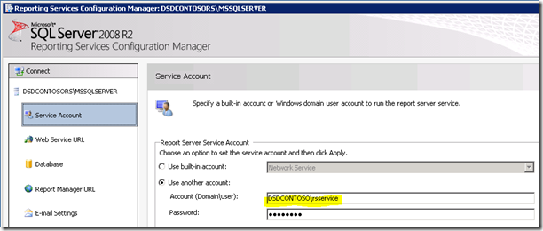
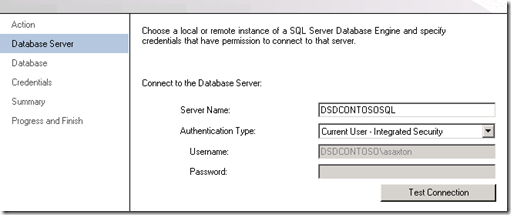

{}

Perhentian pertama kami di Server Layanan Pelaporan adalah Manajer Konfigurasi Layanan Pelaporan.

{}

## Akun Layanan:

**Pastikan untuk memahami akun layanan apa yang Anda gunakan untuk Layanan Pelaporan. Jika kami mengalami masalah, mungkin terkait dengan akun layanan yang Anda gunakan. Standarnya adalah Layanan Jaringan. Saat kami akan menerapkan versi baru, kami selalu menggunakan Akun Domain, karena di sanalah kemungkinan besar kami akan menemui masalah. Untuk server contoh ini, kami telah menggunakan Akun Domain yang disebut RSService.**

**Gambar1:- Menyiapkan akun layanan**

## URL Layanan Web:

{}

**Kita perlu mengonfigurasi URL Layanan Web. Ini adalah direktori virtual ReportServer (vdir) yang menghosting Layanan Pelaporan Layanan Web yang digunakan, dan dengan apa SharePoint akan berkomunikasi. Kecuali Anda ingin menyesuaikan properti vdir (yaitu SSL, port, header host, dll…), Anda cukup mengeklik Terapkan di sini dan siap melakukannya.**

**Gambar2:- Menyiapkan URL Layanan Web Setelah URL layanan Web disiapkan, Anda akan melihat hasil berikut**

**Gambar3:- Penyiapan URL layanan Web berhasil**
{}

## Basis Data:

**Kita perlu membuat Database Katalog Layanan Pelaporan. Ini dapat ditempatkan pada Mesin Database SQL 2008 atau SQL 2008 R2 apa pun. SQL11 juga akan berfungsi dengan baik, tapi itu masih dalam BETA. Tindakan ini akan membuat dua database, ReportServer dan ReportServerTempDB, secara default.**

{}
**Langkah penting lainnya dalam hal ini adalah memastikan Anda memilih SharePoint Integrated untuk tipe database. Setelah pilihan ini dibuat, pilihan ini tidak dapat diubah.**

**Gambar4:- Membuat database server laporan**

**Gambar5:- Menyiapkan server database dan jenis otentikasi**

**Gambar6:- Menyiapkan nama dan Mode database**
{}

**Untuk kredensial, ini adalah cara Server Laporan berkomunikasi dengan SQL Server. Akun apa pun yang Anda pilih, akan diberikan hak tertentu dalam database Katalog serta beberapa database sistem melalui RSExecRole. MSDB adalah salah satu database untuk penggunaan Berlangganan saat kami menggunakan Agen SQL.**

**Gambar7:- Menyiapkan kredensial database Server Laporan**

{}

**Setelah kredensial database ditentukan, kita seharusnya bisa mendapatkan hasil seperti yang ditentukan di bawah ini.**

**Gambar8:- Laporkan kemajuan pembuatan database Server**

**Gambar9:- Ringkasan penyelesaian database Server Laporan**
{}

## URL Pengelola Laporan:

**Kita dapat melewati URL Manajer Laporan karena tidak digunakan saat kita berada dalam mode SharePoint Terintegrasi. SharePoint adalah antarmuka kami. Manajer Laporan tidak berfungsi.**

## Kunci Enkripsi:

{}
**Cadangkan Kunci Enkripsi Anda dan pastikan Anda tahu di mana Anda menyimpannya. Jika Anda mengalami situasi di mana Anda perlu memigrasikan Database atau memulihkannya, Anda memerlukan ini.**

**Gambar10:- Laporkan cadangan kunci Enkripsi Server**
{}

{}
**Selamat! Kami telah berhasil mengonfigurasi Layanan Pelaporan menggunakan Manajer Konfigurasi. Jika Anda menelusuri URL di tab URL Layanan Web, URL tersebut akan menampilkan tampilan seperti berikut.**

**Gambar11:- Laporkan akses Server setelah instalasi**

**Alasan kesalahan: SharePoint diinstal di WFE kami dan kami selesai menyiapkan Layanan Pelaporan. Dalam contoh ini, Layanan Pelaporan dan SharePoint berada di mesin yang berbeda. Jika mereka berada di mesin yang sama, Anda tidak akan melihat kesalahan ini. Secara teknis kami perlu menginstal SharePoint di RS Box. Itu berarti IIS juga akan diaktifkan.**
{}

