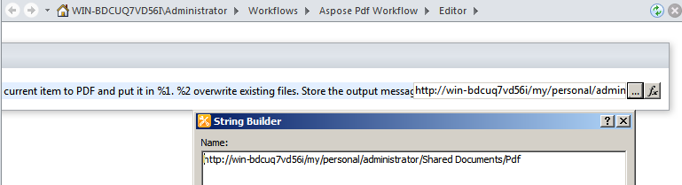
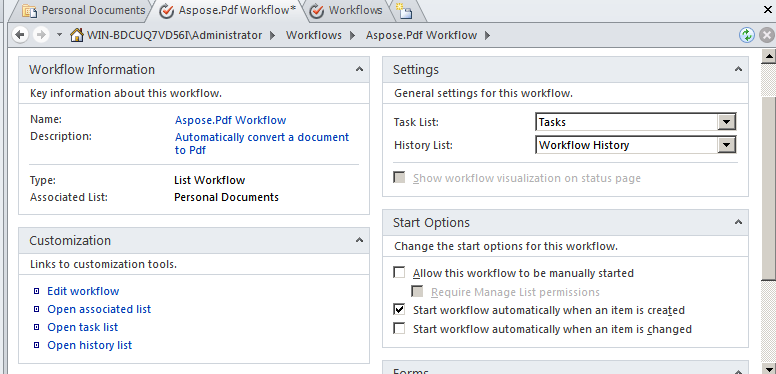

---
title: Mengonversi File ke PDF melalui Aktivitas Alur Kerja
linktitle: Mengonversi File ke PDF melalui Aktivitas Alur Kerja
type: docs
weight: 50
url: /id/sharepoint/converting-a-file-to-pdf-via-workflow-activity/
lastmod: "2020-12-16"
description: PDF SharePoint API dapat digunakan dalam alur kerja SharePoint yang mengonversi dokumen ke PDF.
---

{}

Dukungan untuk alur kerja adalah fungsionalitas utama Microsoft Office SharePoint Server. Alur kerja membantu mengotomatiskan pergerakan dokumen sesuai logika bisnis dan menyederhanakan biaya dan waktu pengorganisasian dokumen. Artikel ini menunjukkan cara menggunakan Aspose.PDF untuk SharePoint dalam alur kerja yang mengonversi dokumen ke PDF.

{}

## Menyiapkan Alur Kerja

Contoh ini membuat alur kerja yang mengonversi item baru apa pun di pustaka dokumen ke format PDF dan menyimpannya di pustaka dokumen lain. Contoh ini menggunakan pustaka **Dokumen Pribadi** sebagai pustaka sumber dan sub-folder **Pdf** di pustaka **Dokumen Bersama** sebagai pustaka tujuan.

Aspose.PDF untuk SharePoint mendukung konversi file HTML, teks dan gambar.

### Rancang Alur Kerja menggunakan SharePoint Designer

1. Buka **SharePoint Designer** dan sambungkan ke situs tempat alur kerja akan diterapkan.
1. Pilih **Alur Kerja** dari **objek situs** lalu buka **Daftar Alur Kerja**.
1. Pilih pustaka **Dokumen Pribadi** untuk membuat dan melampirkan alur kerja daftar baru ke pustaka dokumen.

   **Memilih Dokumen Pribadi dari menu**

1. Buat dan lampirkan alur kerja daftar ke pustaka **Dokumen Pribadi** dengan mengetikkan nama dan deskripsi alur kerja.
1. Click **OK** to complete this step.

   **Membuat alur kerja daftar**

Editor langkah alur kerja muncul. Ini digunakan untuk menentukan kondisi dan tindakan untuk alur kerja. Sekarang tambahkan tindakan untuk mengonversi dokumen baru ke PDF tanpa syarat apa pun, dari **Aspose Actions**.

1. Pilih tindakan **Konversi file ke PDF melalui Aspose.PDF** dari menu **Aksi**.

   **Memilih dan bertindak**

1. Konfigurasikan parameter tindakan:
   1. Setel parameter **folder ini** ke folder tujuan.
   1. Biarkan parameter tindakan lainnya sebagai nilai default atau atur menggunakan jendela properti tindakan. Nilai default untuk parameter **Timpa** adalah salah.

      **Editor Alur Kerja**

**Mengatur perpustakaan tujuan**

**Setting the properties**

1. Dari menu **Alur Kerja**, pilih **Pengaturan Alur Kerja**.
1. Pilih **mulai alur kerja secara otomatis ketika item baru dibuat** dan hapus opsi lain dari **Mulai Opsi**.

   **Mengatur opsi awal**

Desain alur kerja selesai.

1. Simpan dan terbitkan alur kerja untuk menerapkannya di situs SharePoint.

### Uji Alur Kerja

Untuk menguji alur kerja:

1. Buka situs SharePoint dan unggah dokumen baru ke pustaka dokumen **Dokumen Pribadi**.
   Aspose.PDF untuk SharePoint mendukung konversi dari file HTML, file teks, dan gambar (JPG, PNG, GIF, TIFF, dan BMP*) ke PDF. Alur kerja dikonfigurasi untuk dimulai secara otomatis ketika item baru dibuat, sehingga file diproses secara otomatis.
1. Segarkan peramban.
   Status alur kerja muncul di kolom alur kerja, dalam hal ini **Aspose.PDF Workflow**.

   **Menambahkan dokumen ke perpustakaan sumber**

1. Buka perpustakaan dokumen tujuan untuk melihat dokumen yang dikonversi. **Dokumen Bersama/Pdf** adalah jalur dalam contoh ini.

   **Perpustakaan tujuan**

